# Flowstate 

**Flowstate** is a fun demo on top of [Temporal] using [CEL] and [YAML] to define workflows through a custom [DSL]. Workflows are defined in a `Flowfile` which is compiled into [protobufs] and executed using Temporal's [durable execution] engine.

[CEL]: https://cel.dev/
[YAML]: https://yaml.org/
[DSL]: https://en.wikipedia.org/wiki/Domain-specific_language
[protobufs]: https://protobuf.dev/
[Temporal]: https://temporal.io/
[durable execution]: https://docs.temporal.io/temporal#durable-execution

## Overview

```mermaid
flowchart LR
  %% User actor
  User((User))

  %% User Local Environment
  subgraph LocalEnv [Local Environment]
    direction LR
    Flowfile["<code>Flowfile</code><br/>(<strong>DSL</strong>: YAML + CEL)"]
    CLI["Flowstate CLI<br><code>$ flow run</code>"]
    Compiler["Flowfile Compiler<br/>(YAML+CEL → Protobuf)"]
    ProtobufSpec["Protobuf Workflow<br/>Specification"]
    
    %% Local component relationships
    Flowfile --> CLI
    CLI --> Compiler
    Compiler --> ProtobufSpec
  end

  %% Server/API Environment
  subgraph ServerEnv [Flowstate API Server]
    direction LR
    APIServer["HTTP/gRPC API Server<br/>(WorkflowService)"]
    TemporalClient["Temporal Client"]
    
    %% API component relationships
    APIServer --> TemporalClient
  end

  %% Temporal Cloud Environment
  subgraph TemporalEnv [Temporal Cloud or OSS]
    direction LR
    TemporalServer["<strong>Temporal Server</strong><br/>(Durable Execution Engine)"]
  end
  
  %% Worker Environment (Separate Cloud/GCP)
  subgraph WorkerEnv [Flowstate Temporal Worker Environment]
    direction LR
    Worker["Flowstate Worker<br/><code>$ flow worker</code>"]
    
    subgraph TaskExecution [Task Execution]
      TaskLib["<strong>Go Task Library</strong><br/>(echo, http, etc.)<br/><i>Tasks implemented in Go</i>"]
      CELEngine["CEL Engine<br/><i>Only for expression evaluation<br/>in workflow input/outputs</i>"]
    end
    
    %% Worker component relationships
    Worker --> TaskLib
    Worker --> CELEngine
    TaskLib -.-> CELEngine
  end
  
  %% Cross-environment relationships
  User --> Flowfile
  User --> CLI
  CLI -- "Run Workflow<br/>(Send Protobuf)" --> APIServer
  TemporalClient -- "Start Workflow<br/>(ExecuteWorkflow)" --> TemporalServer
  TemporalServer -- "Schedule Tasks" --> Worker
  Worker -- "Complete Tasks" --> TemporalServer
  
  %% Result flow
  TemporalServer -- "Workflow Results" --> TemporalClient
  APIServer -- "Status/Results" --> CLI
  CLI -- "Show Results" --> User
  
  %% Styling
  classDef userStyle fill:#f9f,stroke:#333,stroke-width:2px;
  class User userStyle;
  
  classDef localStyle fill:#d4f4fa,stroke:#333,stroke-width:1px;
  class LocalEnv localStyle;
  
  classDef serverStyle fill:#d8fad4,stroke:#333,stroke-width:1px;
  class ServerEnv serverStyle;
  
  classDef temporalStyle fill:#faecd4,stroke:#333,stroke-width:1px;
  class TemporalEnv temporalStyle;
  
  classDef workerStyle fill:#fad4d8,stroke:#333,stroke-width:1px;
  class WorkerEnv workerStyle;
  
  classDef taskExecStyle fill:#f8e0e4,stroke:#333,stroke-width:1px;
  class TaskExecution taskExecStyle;
```



## Flowfile Structure

A `Flowfile` is a YAML file that defines a series of steps to be executed in order. Each step consists of a unique `id`, a `task` name, and a set of `inputs`. The `inputs` can be static values or dynamic expressions using CEL syntax.

### Example

```yaml
name: multi step hello world
steps:
  - id: hello
    task:
      name: echo
      inputs:
        message: hello world
  - id: output
    task:
      name: echo
      inputs:
        message: ${hello.result}
```

The above `Flowfile` defines two steps:
1. The first step has an `id` of `hello`, uses the built-in `echo` task, and takes a literal string value `"hello world"` for the `message` input.
2. The second step has an `id` of `output`, also uses the built-in `echo` task, and takes a dynamic input `message` that references the output of the first step using `${hello.result}`. The `${...}` syntax indicates that it is an expression.
3. The output of the first step is referenced by its `id` (`hello`) and the output name (`result`). Outputs and inputs are strongly typed, but depend on the task being used (see below).

## Task Outputs and Data Flow

Each step in a `Flowfile` has named inputs and produces named outputs, which can be referenced by later steps using CEL expressions using the step `id` and output name. The outputs of a step are determined by the task being used, and can be of various types (e.g., `string`, `int`, `map`, etc.). The outputs of a step can be used as inputs to later steps, allowing for complex data flows and transformations.

### Available Tasks

| Task Name | Inputs | Outputs |
|-----------|--------|---------|
| `echo`    | `message` (`string`) | `result` (`string`) |
| `printf`  | `format` (`string`), `args` (`list[string]`) | `result` (`string`) |
| `http`    | `method` (`string`), `url` (`string`), `headers` (`map[string]string]`), `body` (`string`) | `status_code` (`int`), `body` (`string`), `headers` (`map[string]string]`) |
| `cel`     | `expr` (`string`), `vars` (`map[string]any`), `libs` (`list[string]`, e.g. `math`, `strings`, `regex`) | `result` (dynamic) |

Tasks can be chained together as tasks. For example, the following `Flowfile` makes an HTTP `GET` request to `https://microsoft.com`, and then echoes the status code of the response:

```yaml
steps:
  - id: web
    task:
      name: http
      inputs:
        method: GET
        url: https://microsoft.com
  - id: output
    task:
      name: echo
      inputs:
        message: ${string(web.status_code)}
```

> [!TIP]
> Use `${...}` for expressions, like referencing previous step outputs referenced by their `id` and output name.
> The `cel` task evaluates the expression string provided in its `expr` input at runtime. Variables for the expression are provided under the `vars` input. Use the optional `libs` input to enable CEL extension libraries such as `math`, `strings`, `lists`, `sets`, `encoders`, `protos`, `bindings`, `comprehensions`, or `regex`.

## Getting Started

Start a local Temporal development server:

```console
$ temporal server start-dev
...
```

Start a Temporal worker for Flowstate:

```console
$ go run ./cmd/flow worker
...
```

Start the Flowstate API server:

```console
$ go run ./cmd/flow server
...
```

Run a `Flowfile` locally (without Temporal):

```console
$ go run ./cmd/flow run local ./examples/hello-world-multi-step/workflow.yaml
{"namedValues":{"result":{"literal":{"stringValue":"hello world"}}}}
```

Run a `Flowfile` using Temporal via the Flowstate API server:

```console
$ go run ./cmd/flow run ./examples/hello-world-multi-step/workflow.yaml
{"namedValues":{"result":{"literal":{"stringValue":"hello world"}}}}
```

## CLI

The Flowstate CLI (`flow`) provides commands to run workflows, start a worker, or start a server. The worker is responsible for executing workflow tasks as part of Temporal, while the server provides an API for managing and monitoring workflows that users of Flowstate would interact with. Users would submit their `Flowfile` workflows to the server, which would then schedule and manage their execution using Temporal.

```console
$ go run ./cmd/flow
Flowstate workflow engine

Usage:
  flow [command]

Available Commands:
  completion  Generate the autocompletion script for the specified shell
  help        Help about any command
  lsp         Start a Flowfile Language Server Protocol (LSP) server
  run         Run a workflow
  server      Start a server
  worker      Start a worker

Flags:
  -h, --help      help for flow
  -v, --verbose   enable verbose logging
      --version   version for flow

Use "flow [command] --help" for more information about a command.
```
