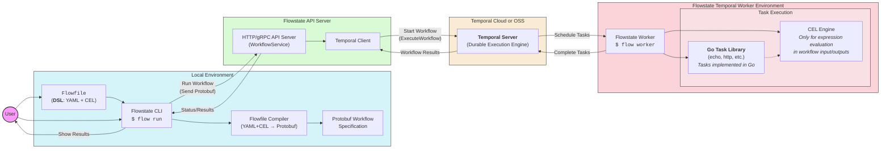

# Flowstate

**Flowstate** is a durable, policy-governed workload engine. You declare a workload in
[YAML] with [CEL] expressions; Flowstate compiles it into a typed [protobuf][protobufs]
specification and executes it on [Temporal]'s [durable execution] engine.

It is not a CI system. CI is one workload shape among many — the engine targets anything
that has to finish correctly despite crashes, network failures, and long waits: data
pipelines, provisioning and orchestration, operational runbooks, agentic pipelines with
approval gates, and scheduled maintenance work.

See [docs/ARCHITECTURE.md](docs/ARCHITECTURE.md) for the layer model, the invariants the
implementation holds to, and how Temporal's primitives map onto the DSL.

[CEL]: https://cel.dev/
[YAML]: https://yaml.org/
[DSL]: https://en.wikipedia.org/wiki/Domain-specific_language
[protobufs]: https://protobuf.dev/
[Temporal]: https://temporal.io/
[durable execution]: https://docs.temporal.io/temporal#durable-execution

## Overview


```mermaid
flowchart LR
  %% User actor
  User((User))

  %% User Local Environment
  subgraph LocalEnv [Local Environment]
    direction LR
    Flowfile["<code>Flowfile</code><br/>(<strong>DSL</strong>: YAML + CEL)"]
    CLI["Flowstate CLI<br><code>$ flow run</code>"]
    Compiler["Flowfile Compiler<br/>(YAML+CEL → Protobuf)"]
    ProtobufSpec["Protobuf Workflow<br/>Specification"]
    
    %% Local component relationships
    Flowfile --> CLI
    CLI --> Compiler
    Compiler --> ProtobufSpec
  end

  %% Server/API Environment
  subgraph ServerEnv [Flowstate API Server]
    direction LR
    APIServer["HTTP/gRPC API Server<br/>(WorkflowService)"]
    TemporalClient["Temporal Client"]
    
    %% API component relationships
    APIServer --> TemporalClient
  end

  %% Temporal Cloud Environment
  subgraph TemporalEnv [Temporal Cloud or OSS]
    direction LR
    TemporalServer["<strong>Temporal Server</strong><br/>(Durable Execution Engine)"]
  end
  
  %% Worker Environment (Separate Cloud/GCP)
  subgraph WorkerEnv [Flowstate Temporal Worker Environment]
    direction LR
    Worker["Flowstate Worker<br/><code>$ flow worker</code>"]
    
    subgraph TaskExecution [Task Execution]
      TaskLib["<strong>Go Task Library</strong><br/>(echo, http, etc.)<br/><i>Tasks implemented in Go</i>"]
      CELEngine["CEL Engine<br/><i>Only for expression evaluation<br/>in workflow input/outputs</i>"]
    end
    
    %% Worker component relationships
    Worker --> TaskLib
    Worker --> CELEngine
    TaskLib -.-> CELEngine
  end
  
  %% Cross-environment relationships
  User --> Flowfile
  User --> CLI
  CLI -- "Run Workflow<br/>(Send Protobuf)" --> APIServer
  TemporalClient -- "Start Workflow<br/>(ExecuteWorkflow)" --> TemporalServer
  TemporalServer -- "Schedule Tasks" --> Worker
  Worker -- "Complete Tasks" --> TemporalServer
  
  %% Result flow
  TemporalServer -- "Workflow Results" --> TemporalClient
  APIServer -- "Status/Results" --> CLI
  CLI -- "Show Results" --> User
  
  %% Styling
  classDef userStyle fill:#f9f,stroke:#333,stroke-width:2px;
  class User userStyle;
  
  classDef localStyle fill:#d4f4fa,stroke:#333,stroke-width:1px;
  class LocalEnv localStyle;
  
  classDef serverStyle fill:#d8fad4,stroke:#333,stroke-width:1px;
  class ServerEnv serverStyle;
  
  classDef temporalStyle fill:#faecd4,stroke:#333,stroke-width:1px;
  class TemporalEnv temporalStyle;
  
  classDef workerStyle fill:#fad4d8,stroke:#333,stroke-width:1px;
  class WorkerEnv workerStyle;
  
  classDef taskExecStyle fill:#f8e0e4,stroke:#333,stroke-width:1px;
  class TaskExecution taskExecStyle;
```

## Flowfile Structure

A `Flowfile` is a YAML file that defines a series of steps to be executed in order. Each step consists of a unique `id`, a `task` name, and a set of `inputs`. The `inputs` can be static values or dynamic expressions using CEL syntax.

### Example

```yaml
name: multi step hello world
steps:
  - id: hello
    task:
      name: echo
      inputs:
        message: hello world
  - id: output
    task:
      name: echo
      inputs:
        message: ${hello.result}
```

The above `Flowfile` defines two steps:
1. The first step has an `id` of `hello`, uses the built-in `echo` task, and takes a literal string value `"hello world"` for the `message` input.
2. The second step has an `id` of `output`, also uses the built-in `echo` task, and takes a dynamic input `message` that references the output of the first step using `${hello.result}`. The `${...}` syntax indicates that it is an expression.
3. The output of the first step is referenced by its `id` (`hello`) and the output name (`result`). Outputs and inputs are strongly typed, but depend on the task being used (see below).

## Controlling how a step runs

A step can declare when it runs and how it behaves when it fails. One policy does not
fit every step: reading a config file and provisioning a cluster differ by orders of
magnitude in how long they take and how safe they are to repeat.

```yaml
steps:
  - id: check
    task:
      name: echo
      inputs:
        message: ready

  - id: deploy
    if: ${check.result == 'ready'}   # only runs when this is true
    timeout: 30s                     # bounds one attempt
    retry:
      attempts: 3                    # total attempts, so 1 disables retrying
      interval: 1s                   # delay before the second attempt
      backoff: 2.0                   # multiplier applied after each attempt
      max_interval: 10s              # ceiling on the delay
    task:
      name: echo
      inputs:
        message: deploying

  - id: notify
    continue_on_error: true          # a failure here does not end the run
    task:
      name: echo
      inputs:
        message: notifying
```

Behavior worth knowing:

- A step whose `if` is false is **skipped and produces no outputs**, so a later step
  referencing it will not resolve. That is deliberate — the value genuinely does not exist,
  and inventing an empty one would hide the mistake of depending on a step that did not run.
- Only failures that could plausibly succeed on another attempt are retried. A step that
  failed because its inputs were invalid, or because a policy denied it, fails once no
  matter what `retry` says. Retrying an operation known to be unrepeatable is worse than
  failing.
- `continue_on_error` records the failure as `${step.error}` rather than discarding it, so a
  later step can branch on whether it worked.
- These behave identically under `flow run local` and durable execution. Local retries are
  in-process and therefore not durable — a crash loses them — but the observable outcome
  matches, which is what makes a local run worth trusting.

See [examples/conditional-and-retry](examples/conditional-and-retry).

## Workloads that are not a straight line

A step can repeat over a computed list, or split into branches that run at the same time.

```yaml
steps:
  - id: targets
    task:
      name: cel
      inputs:
        expr: "['alpha', 'beta']"

  # Repeat the body once per item. Inside it, the current item is bound to the
  # iterator's name; body steps can reference each other within an iteration.
  - id: process
    for_each:
      items: ${targets.result}
      iterator: name          # defaults to `item`
      max_parallel: 3         # omit or 1 to run one at a time
      steps:
        - id: label
          task:
            name: printf
            inputs:
              format: "processing %s"
              args: [${name}]

  # Independent work with no reason to be sequential.
  - id: checks
    parallel:
      - steps:
          - id: check_config
            task: { name: echo, inputs: { message: config ok } }
      - steps:
          - id: check_quota
            task: { name: echo, inputs: { message: quota ok } }

  - id: summary
    task:
      name: printf
      inputs:
        format: "%s / %s / processed %d"
        args: [${check_config.result}, ${check_quota.result}, ${size(process.results)}]
```

The scoping rules are worth knowing, because they are what keep results independent of
timing:

- **A loop reports its iterations through its own `results` output** — a list with one
  element per iteration, each a map of body step id to that step's outputs. Body outputs do
  not leak into the enclosing scope, because with more than one iteration they would
  overwrite each other and a later step would read whichever iteration happened to finish
  last. So `${process.results}` is available afterwards; `${label.result}` is not.
- **Parallel branch outputs do merge** once the block completes, so `${check_config.result}`
  works afterwards. Branches must not reference each other, since there is no ordering
  between them — `flow validate` reports it if they do.
- Iterations and branches each start from the outputs that existed before the block, so
  neither can observe the other's work. That is what makes concurrent and sequential
  execution produce the same result.
- `max_parallel` bounds concurrency under durable execution. Local runs execute
  sequentially so their output is deterministic and comparable, which is the whole point of
  running locally.

See [examples/fan-out-and-parallel](examples/fan-out-and-parallel).

## Task Outputs and Data Flow

### Parse JSON with CEL

You can keep HTTP simple (returning `status_code`, `headers`, `body`) and use the CEL task to parse JSON without a separate HTTP+JSON task. Enable the optional `json` library and use `json_parse(string)`:

```yaml
steps:
  - id: resp 
    task:
      name: http
      inputs:
        method: GET
        url: https://httpbin.org/json
  - id: pick
    task:
      name: cel
      inputs:
        libs: [json]
        expr: json_parse(resp.body)['slideshow']['title']
```

The CEL task’s `result` will be the selected field from the parsed JSON. This keeps activities minimal and payloads small while letting you shape data in CEL.

### Shape HTTP outputs to fit limits

To keep workflow payloads small, the `http` task supports an optional `outputs` input (a map literal or CEL map) which defines exactly what the step should return. When `outputs` is present, only those named values are returned instead of the default `status_code/body/headers`.

Example:

```yaml
steps:
  - id: web
    task:
      name: http
      inputs:
        method: GET
        url: https://httpbin.org/json
        # ${...} marks a CEL expression, as everywhere else in a Flowfile.
        # Quote it so YAML does not read the colons inside as mapping syntax.
        outputs: "${ {'status': status_code, 'title': json_parse(body)['slideshow']['title']} }"
```

Unlike other inputs, `outputs` is evaluated by the `http` task after the response arrives,
so its expression sees the response rather than earlier steps. `flow validate` knows this
and will not mistake `body` for a step reference.

Available variables in `outputs` evaluation:
- `status_code` (int64)
- `body` (string)
- `headers` (map[string]string)

Tip: prefer returning only the fields a later step actually needs. Carrying less keeps a
workload comfortably inside Temporal's default payload limits; genuinely large data is
better handled with a payload codec that offloads the blob and carries a reference
(the claim-check pattern) than by moving more bytes through history.

### Governed network access

A workflow chooses the URL the `http` task fetches, which means it asks the worker to make
a request on the author's behalf — including to addresses only the worker can reach, like
internal services and cloud instance metadata endpoints. Requests therefore go through an
egress policy that, by default:

- allows `http` and `https` to public addresses only, denying loopback, private,
  link-local, multicast, unique-local, and carrier-grade NAT ranges, plus the well-known
  cloud metadata endpoints;
- checks the address actually being connected to, after resolution, so a name that resolves
  to a public address once and an internal one later gains nothing;
- re-applies the policy to every redirect hop, so a public URL cannot bounce into an
  internal target;
- bounds the request with timeouts and caps the response body.

Operators can express additional rules as CEL — the same language workflows are written
in — matching on `url`, `scheme`, `host`, `port`, `method`, `path`, and the resolved `ip`.
Rules are compiled and type-checked when the policy is built, so a malformed rule is a
startup error rather than a surprise mid-run. Denials are reported distinctly from network
failures and are never retried, since a denied request would only be denied again.

To develop against a service on `localhost`, set `FLOWSTATE_ALLOW_LOOPBACK_EGRESS=true`.
It is an explicit opt-in because the same permission is what would let a workflow reach a
worker's own internal endpoints in production.

## Secrets

> [!NOTE]
> The reference *form* below is defined in the schema and refused correctly in
> expressions, but `${secret(...)}` does not compile yet — it currently passes
> validation and fails at run time. Tracked in
> [docs/HANDOFF.md](docs/HANDOFF.md); do not rely on it until this note is gone.

A secret never appears in a workflow. A *reference* to one does:

```yaml
steps:
  - id: notify
    task:
      name: http
      inputs:
        method: POST
        url: https://api.example.com/events
        headers:
          Authorization: ${secret('vault:prod/api#token')}
```

A reference is `scheme:name`. The scheme selects which backend resolves it, and the
name means whatever that backend means by it — an environment variable, a path under
a mounted directory, a vault path.

The reference is all that exists in the compiled workflow, in the request that
submits it, and in the durable history Temporal keeps. The value is resolved on the
worker, inside the step that uses it, and exists only for that call. Referencing a
secret in an expression is refused, because computing with it in workflow code would
put the result in history:

```
a secret reference cannot be read in an expression; pass it to a task input that
accepts one (vault:prod/api#token)
```

Which backend resolves a scheme is the deployment's choice, and the same workflow
runs unchanged against any of them. That is the point of referencing rather than
embedding: a laptop can resolve `db:password` from the OS keychain while production
resolves it from a vault, and the Flowfile does not know or care.

A deployment registers only the schemes it permits. An unregistered scheme is
refused rather than guessed at, and a deployment that registers nothing refuses every
reference — the right configuration for one that should not handle secrets at all.

## Plugins

The built-in tasks and secret backends will not cover everything, so the engine is
extensible by code it does not ship. A plugin is a separate executable named
`flowstate-plugin-<name>` that speaks Connect RPC over a Unix socket.

Separate, because a plugin runs inside a worker that holds credentials and can reach
internal networks: in the same process, a panic takes the worker down and a bug reads
whatever the worker can. The protocol is defined in the schema rather than as a Go
interface, so a plugin can be written in any language with Connect or gRPC support.

A plugin advertises *capabilities* rather than being of a kind, so one binary can
resolve secrets and provide tasks both — which is what the useful integrations
actually look like. A plugin-provided task ships its own protobuf descriptors, so
`flow validate`, editor completion, and `flow tasks` treat it exactly like a built-in
one.

A plugin extends what the engine can do, not what it is allowed to do: it resolves
only permitted schemes, receives the tenant a workload belongs to rather than
choosing one, and its network access remains governed by the worker.

See [docs/ARCHITECTURE.md](docs/ARCHITECTURE.md) for the design and the handshake.

## Configuration

Flowstate's own settings:

| Variable | Default | Purpose |
|---|---|---|
| `FLOWSTATE_ADDRESS` | `localhost:9233` | Address the API server listens on, and that `flow run` connects to |
| `TEMPORAL_TASK_QUEUE` | `flowstate-run-task-queue` | Task queue workers serve and workflows are routed to |
| `FLOWSTATE_ALLOW_LOOPBACK_EGRESS` | unset | Permit the `http` task to reach loopback addresses |
| `FLOWSTATE_VERBOSE_LOGGING` | `false` | Verbose logging |

### Connecting to Temporal

Connection settings follow Temporal's own environment configuration rather than a scheme
invented here, so the standard variables behave as they do across the Temporal ecosystem:
`TEMPORAL_ADDRESS`, `TEMPORAL_NAMESPACE`, `TEMPORAL_API_KEY`, and the `TEMPORAL_TLS_*`
family for TLS and mTLS.

Flowstate also reads the same TOML configuration file the `temporal` CLI uses
(`TEMPORAL_CONFIG_FILE`, defaulting to the conventional location), so a profile already
configured for the CLI works without being restated. Profiles are how one installation
addresses several environments:

```console
$ TEMPORAL_PROFILE=staging flow worker
```

`--address`, `--namespace`, and `--profile` on `flow worker` and `flow server` override
whatever that configuration resolves to.

With no configuration at all, Flowstate connects to a local development server — what
`temporal server start-dev` provides. Self-hosted is the default and needs no setup;
Temporal Cloud is reached by configuring an API key or mTLS, and nothing in the defaults
assumes a hosted service.


Each step in a `Flowfile` has named inputs and produces named outputs, which can be referenced by later steps using CEL expressions using the step `id` and output name. The outputs of a step are determined by the task being used, and can be of various types (e.g., `string`, `int`, `map`, etc.). The outputs of a step can be used as inputs to later steps, allowing for complex data flows and transformations.

### Available Tasks

| Task Name | Inputs | Outputs |
|-----------|--------|---------|
| `echo`    | `message` (`string`) | `result` (`string`) |
| `printf`  | `format` (`string`), `args` (`list[string]`) | `result` (`string`) |
| `http`    | `method` (`string`), `url` (`string`), `headers` (`map[string]string`), `body` (`string`), `outputs` (optional shaping expression) | `status_code` (`int`), `body` (`string`), `headers` (`map[string]string`) |
| `cel`     | `expr` (`string`), `vars` (`map[string]any`), `libs` (`list[string]`, e.g. `math`, `strings`, `regex`) | `result` (dynamic) |

Run `flow tasks` for this table generated from the engine's own task registry, along with
the CEL libraries available to the `cel` task. Because the listing is derived from the
registry, it cannot drift from what the engine will actually execute.

Tasks can be chained together as tasks. For example, the following `Flowfile` makes an HTTP `GET` request to `https://microsoft.com`, and then echoes the status code of the response:

```yaml
steps:
  - id: web
    task:
      name: http
      inputs:
        method: GET
        url: https://microsoft.com
  - id: output
    task:
      name: echo
      inputs:
        message: ${string(web.status_code)}
```

> [!TIP]
> Use `${...}` for expressions, like referencing previous step outputs referenced by their `id` and output name.
> The `cel` task evaluates the expression string provided in its `expr` input at runtime. Variables for the expression are provided under the `vars` input. Use the optional `libs` input to enable CEL extension libraries such as `math`, `strings`, `lists`, `sets`, `encoders`, `protos`, `bindings`, `comprehensions`, or `regex`.

## Getting Started

### Authoring

Check a workflow without running it. This matters for a workload engine: steps have side
effects, so executing a file to find a typo means causing part of it.

```console
$ flow validate examples/hello-world/workflow.yaml
examples/hello-world/workflow.yaml: ok
```

Problems are reported with the line, the step, and what to do about them:

```console
$ flow validate broken.yaml
broken.yaml:3: step "web": unknown task "htpp"; available tasks are cel, echo, http, printf
broken.yaml:8: step "out" input "message": references step "later", which runs later; steps can only reference steps defined before them
```

`flow run` and `flow run local` apply the same checks before executing anything, so a
mistake is reported rather than partially performed.

List what workflows can use:

```console
$ flow tasks
```

Flowstate also ships a language server (`flow lsp`) providing diagnostics, hover, and
completion for Flowfiles — see [docs/EDITORS.md](docs/EDITORS.md) for editor setup.

### Running

Start a local Temporal development server:

```console
$ temporal server start-dev
...
```

Start a Temporal worker for Flowstate:

```console
$ go run ./cmd/flow worker
...
```

Start the Flowstate API server:

```console
$ go run ./cmd/flow server
...
```

Run a `Flowfile` locally (without Temporal):

```console
$ go run ./cmd/flow run local ./examples/hello-world-multi-step/workflow.yaml
{"stepValues":{"a":{"namedValues":{"result":{"literal":{"stringValue":"hello world"}}}},"b":{"namedValues":{"result":{"literal":{"stringValue":"hello world"}}}}}}
```

Run a `Flowfile` using Temporal via the Flowstate API server:

```console
$ go run ./cmd/flow run ./examples/hello-world-multi-step/workflow.yaml
{"stepValues":{"a":{"namedValues":{"result":{"literal":{"stringValue":"hello world"}}}},"b":{"namedValues":{"result":{"literal":{"stringValue":"hello world"}}}}}}
```

## CLI

The Flowstate CLI (`flow`) provides commands to run workflows, start a worker, or start a server. The worker is responsible for executing workflow tasks as part of Temporal, while the server provides an API for managing and monitoring workflows that users of Flowstate would interact with. Users would submit their `Flowfile` workflows to the server, which would then schedule and manage their execution using Temporal.

```console
$ go run ./cmd/flow
Flowstate workflow engine

Usage:
  flow [command]

Available Commands:
  completion  Generate the autocompletion script for the specified shell
  help        Help about any command
  lsp         Start a Flowfile Language Server Protocol (LSP) server
  run         Run a workflow
  server      Start a server
  worker      Start a worker

Flags:
  -h, --help      help for flow
  -v, --verbose   enable verbose logging
      --version   version for flow

Use "flow [command] --help" for more information about a command.
```
