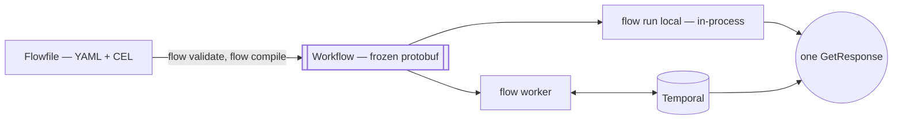

# Flowstate

**Flowstate** is a durable, policy-governed workload engine. You write a workload in
[YAML] with [CEL] expressions; it compiles to a typed [protobuf][protobufs] specification —
frozen at that boundary, the only thing either driver ever executes — and runs on
[Temporal]'s [durable execution] engine through one of two drivers that are required to
agree on everything observable: rehearse in-process while you write it, then hand the same
file to a worker and it survives crashes, redeploys, and waits that outlast the process
that started them.

It is not a CI system. CI is one workload shape among many — the engine targets anything
that has to finish correctly despite crashes, network failures, and long waits: data
pipelines, provisioning and orchestration, operational runbooks, agentic pipelines with
approval gates, and scheduled maintenance work.

[YAML]: https://yaml.org/
[CEL]: https://cel.dev/
[protobufs]: https://protobuf.dev/
[Temporal]: https://temporal.io/
[durable execution]: https://docs.temporal.io/temporal#durable-execution

## See it work

A deploy that waits for a human to approve it, however long that takes — nothing holds a
thread open for it, because the wait is state on Temporal rather than a worker:

```yaml
edition: v2026.2
name: approval-gate
description: >-
  Waits for a human to approve a deploy, then acts on what an attested sender
  actually sent — and refuses a deploy that would approve itself.

inputs:
  version:
    type: string
    required: true
    example: v1.4.2
    pattern: '^v?[0-9]+\.[0-9]+\.[0-9]+$'
  environment:
    type: string
    required: true
    example: production
    must: 'this in ["staging", "production"]'
  expected_approver:
    type: string
    required: true
    example: sre-lead@example.com

# Who may deliver `deploy-approved` at all, enforced server-side against the
# attested sender before Temporal ever sees the signal — not a payload check,
# not something this file's own logic can be argued past.
signals:
  deploy-approved:
    allow:
      - subject: "https://issuer.example.com#sre-lead@example.com"
      - claims:
          team: release-managers

steps:
  - id: request
    log:
      message: >-
        ${"%s requests deploying %s to %s".format(
            [run.identity.subject, inputs.version, inputs.environment])}

  - id: approval
    wait_for_signal:
      name: deploy-approved
      timeout: 24h

  # Fires only when the payload said yes *and* the sender was really attested
  # as the approver this run named — not a local run, not an unauthenticated
  # request, not the same identity that started this run.
  - id: deploy
    if: >-
      ${has(steps.approval.payload.approved) && steps.approval.payload.approved &&
        !steps.approval.sender.local && !run.local &&
        steps.approval.sender.identity.subject == inputs.expected_approver &&
        !(steps.approval.sender.identity.subject == run.identity.subject &&
          steps.approval.sender.identity.issuer == run.identity.issuer)}
    log:
      message: ${"deploying, approved by %s".format([steps.approval.sender.identity.subject])}

  - id: expired
    if: ${steps.approval.timed_out}
    log:
      message: nobody approved in time
```

`steps.approval.sender` is not something the approver typed in — it is who the server
authenticated the signal as, attached by `FlowstateServer.Signal` and impossible for a
caller to set. `run.identity` is the same kind of fact about the other side of the gate: who
the server authenticated the *original request* as, attached when the run was submitted
(`server.go`) and impossible for this file's own `inputs:` to override. A payload is
evidence; a sender and a run's starter are identity — see
[CLAUDE.md's boundary doctrine](CLAUDE.md) for why none of the three are ever merged.

**Read this before copying it into production.** `deploy` above gates on two attested
facts, both real: `steps.approval.sender.identity` cannot be forged by whoever sends the
signal, and `run.identity` cannot be forged by whoever started the run — so `sender !=
run`, compared on issuer *and* subject together, is a genuine self-approval refusal, not a
caller-supplied claim checked against another caller-supplied claim. Subject alone would
not do: a subject is only unique within its issuer, so two different identity providers
could each mint an approver with the same subject the run started as, and comparing
subject alone would refuse that genuinely different approver as if they were the starter.

`signals:` above closes the gap that check alone left open: it is enforced by
`FlowstateServer.Signal`, against the attested sender, before Temporal ever sees the
signal — so a caller who is authenticated and in the run's tenant, but not named in
`allow:`, gets `PermissionDenied` synchronously rather than reaching the workflow at
all. That is a different question from `deploy`'s own `if:`, and a coarser one: it says
who may answer this gate *at all*, independent of which run, where `deploy`'s check is
per-run separation of duties. What still does not bind is the file itself — whoever can
edit this Flowfile can weaken `deploy`'s `if:`, or delete the `signals:` block above it,
or widen `allow:` to match anyone. Binding that is deployment-side task-shape policy
([#187](https://github.com/picatz/flowstate/issues/187)), tracked as the one gap
[#206](https://github.com/picatz/flowstate/issues/206) leaves open: a workflow cannot
author a rule that binds against its own author. What is real today — durable waiting,
an unforgeable sender, a real self-approval refusal, and a real constraint on who may
answer the gate — is worth having and worth demonstrating; it is just not the whole of
an approval control on its own.

Run it in this process — no Temporal, no server — and answer the gate yourself:

```console
$ flow run local examples/approval-gate/workflow.yaml \
    --input-file examples/approval-gate/inputs.json \
    --signal deploy-approved='{"approved": true}'
INFO an unattested caller requests deploying v1.4.2 to production
WARN refusing to deploy v1.4.2: approved, but the sender was not attested at all (a local run has no authenticated caller)
COMPLETED workflow approval-gate
outputs
  approver_subject 
  decision refused_unattested
{"stepValues":{...}, "runOutputs":{"values":{"approver_subject":{"literal":{"stringValue":""}}, "decision":{"literal":{"stringValue":"refused_unattested"}}}}}
```

A local run has no authenticated caller — nothing signed in, no server in front of it — so
`steps.approval.sender.identity.subject` and `run.identity.subject` both read empty, and
`steps.approval.sender.local` and `run.local` both read `true`. The gate refuses even a
payload that said yes. That is the honest local answer, not a bug: a local run must never
look like an attested production one, and this gate is built to tell the difference rather
than paper over it.

A version outside the declared pattern is refused before that first step ever runs:

```console
$ flow run local examples/approval-gate/workflow.yaml \
    --input version=latest --input environment=production \
    --input expected_approver=sre-lead@example.com \
    --signal deploy-approved='{"approved": true}'
ERROR
input "version" must match pattern "^v?[0-9]+\\.[0-9]+\\.[0-9]+$"; got "latest"
arguments are given with --input name=value or --input-file inputs.json
exit status 1
```

The payoff — the fact a Flowfile could not express until #206 closed this gap — is
separation of duties itself, checked durably against two independent attestations rather
than against anything either caller typed in. Run through the durable driver with the run
started as one identity and the approval signed by that *same* identity (issuer and
subject both), `deploy` is refused; signed by a different one that still matches
`expected_approver`, it proceeds. The comparison is issuer *and* subject together, never
subject alone: a subject is only unique within its issuer, so an approver whose subject
happens to collide with the run's starter across a *different* issuer is a genuinely
different principal, and the gate must not mistake that collision for self-approval
([#215](https://github.com/picatz/flowstate/issues/215)). All three cases are exercised on
the real example file in CI (`engine.TestApprovalGateRefusesSelfApproval`):

```console
$ go test ./pkg/flowstate/v1/engine/ -run TestApprovalGateRefusesSelfApproval -v
=== RUN   TestApprovalGateRefusesSelfApproval
=== RUN   TestApprovalGateRefusesSelfApproval/the_run's_starter_approves_their_own_request:_refused
    WARN  refusing to deploy v1.4.2: approved, but the sender was the same identity that started this run
    decision=refused_self_approved approver_subject="" (self-approval correctly refused)
--- PASS: TestApprovalGateRefusesSelfApproval/the_run's_starter_approves_their_own_request:_refused (0.12s)
=== RUN   TestApprovalGateRefusesSelfApproval/same_subject,_different_issuer:_not_self-approval,_proceeds
    INFO  deploying v1.4.2 to production, approved by sre-lead@example.com
    decision=deployed approver_subject="sre-lead@example.com" (cross-issuer approver correctly allowed)
--- PASS: TestApprovalGateRefusesSelfApproval/same_subject,_different_issuer:_not_self-approval,_proceeds (0.02s)
=== RUN   TestApprovalGateRefusesSelfApproval/a_different_attested_approver:_proceeds
    INFO  deploying v1.4.2 to production, approved by sre-lead@example.com
    decision=deployed approver_subject="sre-lead@example.com" (deploy proceeded)
--- PASS: TestApprovalGateRefusesSelfApproval/a_different_attested_approver:_proceeds (0.02s)
PASS
```

Hand the same file to a server backed by Temporal, and approve it from another terminal —
a worker restart in between changes nothing, because nothing local was holding the wait. Run
through a real server with `--insecure-no-auth` (every caller authenticates as the fixed
subject `anonymous`, `issuer: flowstate:insecure-anonymous` — see the warning `flow server`
prints), both the run and the signal are attested by the *same* anonymous identity — same
subject *and* same issuer — so the self-approval check is true before the approver check
is even reached: this dev setup cannot produce a "deployed" transcript, because it cannot
produce two distinct attested identities, which is the honest reason and not a limitation
of the check.

Same file, same steps, same final document — down to the byte, because both drivers render
the run through one renderer. That agreement is enforced, not hoped for; see
[CLAUDE.md — Both execution drivers must agree](CLAUDE.md#both-execution-drivers-must-agree)
for how.

That contrast is the whole pitch: write once, rehearse locally, run durably. See
[docs/ARCHITECTURE.md](docs/ARCHITECTURE.md) for the layer model and the invariants the
implementation holds to, and [docs/VISION.md](docs/VISION.md) for where this is going.

## How it fits together


```mermaid
flowchart LR
  Flowfile["Flowfile — YAML + CEL"] -->|"flow validate, flow compile"| Spec[["Workflow — frozen protobuf"]]
  Spec --> Local["flow run local — in-process"]
  Spec --> Worker["flow worker"]
  Worker <--> Temporal[("Temporal")]
  Local --> Answer(("one GetResponse"))
  Temporal --> Answer

  classDef ir stroke-width:2px;
  class Spec ir;
```

An author writes a `Flowfile`. `flow validate`/`flow compile` turn it into a `Workflow`
protobuf — the durable artifact, and the only thing either driver executes; nothing about a
run's behavior is decided from the YAML again. `flow run local` interprets that spec
in-process; `flow worker` interprets the identical spec as Temporal activities and durable
timers. Both answer through the same document, which is what makes a local rehearsal worth
trusting.

## Diagnostics, not silence

Checking a file never runs it — steps have side effects, so executing a file to find a typo
means causing part of it. `flow validate` reports the position, what is wrong, and what to
do about it:

```console
$ flow validate broken.yaml
broken.yaml:5:5: step "web": unknown task "htpp"; available tasks are http, log
broken.yaml:9:16: step "out" input "message": references step "later", which runs later; steps can only reference steps defined before them
```

`flow run` and `flow run local` apply the same checks before executing anything, so a
mistake is reported rather than partially performed. `flow fix` migrates a file whose
spelling has been retired, and `flow compile` shows what a correct file *becomes* — see
[Reference](#reference) below for both.

## What it can do

| Capability | What | Where |
|---|---|---|
| **Control flow** | `if:`, `retry:` with backoff, `continue_on_error:`, `for_each`/`parallel:` fan-out, `call:` — another Flowfile run as an isolated step | [DSL.md](docs/DSL.md) · [conditional-and-retry](examples/conditional-and-retry) · [fan-out-and-parallel](examples/fan-out-and-parallel) · [call-a-workflow](examples/call-a-workflow) |
| **Waits & signals** | `sleep:`, `wait_until:` a computed moment, `wait_for_signal:` — durable timers and human approval gates, at no worker cost while parked | [approval-gate](examples/approval-gate) · [wait-until-a-moment](examples/wait-until-a-moment) |
| **Undo** | `undo:` — saga compensation, registered the moment a step succeeds, run in reverse when a later step fails or `flow cancel` asks | [saga-provisioning](examples/saga-provisioning) · [order-fulfillment](examples/order-fulfillment) |
| **Secrets** | `${secret('scheme:name')}` — a reference, resolved only inside the task activity that needs it and scrubbed from what a step reports, never in workflow history | [http-secret](examples/http-secret) · [worker-side secrets](docs/CLI.md#worker-side-secrets) |
| **Policy & egress** | Default-deny network egress: public addresses only, CEL rules on url/scheme/host/port/ip, redirects re-checked, responses capped | [egress-policy.yaml](examples/egress-policy.yaml), a worked and fully-annotated policy |
| **Plugins** | Out-of-process tasks and secret backends over Connect RPC: `vcs`, `git` (including its idempotent write task), `github`, and an SDK to write your own | [plugins/vcs](plugins/vcs) · [plugins/git](plugins/git) · [plugins/github](plugins/github) · [plugin/sdk](pkg/flowstate/v1/plugin/sdk) |
| **Examples** | Over thirty worked Flowfiles; four carry a README naming the one durability property they demonstrate, over a business transaction rather than infrastructure | [examples/README.md](examples/README.md) |
| **Editor, agent, terminal** | Diagnostics and completion in your editor (`flow lsp`), a control plane for an agent (`flow mcp`), a live view of a running workload (`flow watch`) | [EDITORS.md](docs/EDITORS.md) · [flow mcp](docs/CLI.md#flow-mcp-the-same-surface-for-an-agent) |

## Start here

- **Writing workflows by hand?** [Quickstart](#quickstart) below, then
  [docs/DSL.md](docs/DSL.md) for the language and [examples/](examples/README.md) for
  working files to pattern-match against.
- **An agent using Flowstate?** `flow mcp` serves the same surface over stdio — validate,
  compile, run locally, run durably, all without a Go compiler in the loop. See
  [flow mcp: the same surface, for an agent](docs/CLI.md#flow-mcp-the-same-surface-for-an-agent).
- **An agent developing Flowstate itself?** Read [AGENTS.md](AGENTS.md) first; it points at
  [CLAUDE.md](CLAUDE.md), which is canonical.

## Quickstart

Start a local Temporal development server:

```console
$ temporal server start-dev
...
```

Start a Flowstate worker against it. `--allow-unversioned-interpreter` is fine for a dev
server that outlives nothing; a production worker passes `--deployment-name` and
`--build-id` instead, so a deploy does not change the interpreter behind a run already in
flight — see [Deployment portability](docs/ARCHITECTURE.md#deployment-portability):

```console
$ go run ./cmd/flow worker --allow-unversioned-interpreter
...
```

Start the Flowstate API server:

```console
$ go run ./cmd/flow server
...
```

Run a `Flowfile` locally, with no server and no Temporal:

```console
$ go run ./cmd/flow run local ./examples/hello-world-multi-step/workflow.yaml
INFO hello world
INFO HELLO WORLD
COMPLETED workflow hello-world-multi-step
{"stepValues":{"greet":{"namedValues":{}},"shout":{"namedValues":{}}},"runOutputs":null}
```

Run the same file durably, through the server:

```console
$ go run ./cmd/flow run ./examples/hello-world-multi-step/workflow.yaml
started flowstate-workflow-c5826f9c-b805-4c78-8185-fa6632d4bcd3; ...
COMPLETED workflow flowstate-workflow-c5826f9c-b805-4c78-8185-fa6632d4bcd3 run ... after greet, shout
{"stepValues":{"greet":{"namedValues":{}},"shout":{"namedValues":{}}},"runOutputs":null}
```

`go install ./cmd/flow` puts `flow` on your `PATH` (at `$(go env GOPATH)/bin/flow`) once
you'd rather not type `go run` every time. Everything above also has a `--help`, and
[docs/reference/cli.md](docs/reference/cli.md) is every command and flag, generated from
the binary's own command tree.

## Reference

### Tasks

Each step names a task directly — the task's own name is the key, its inputs the value
beneath it. `log` has no outputs, deliberately: a log line is an effect on a reader, not a
value for a later step, so naming one would give a step two reasons to exist. To carry a
value, name it with `vars:` instead.

| Task Name | Inputs | Outputs |
|-----------|--------|---------|
| `log`     | `message`, `level`, `fields` | *(none)* |
| `http`    | `url`, `method`, `headers`, `body`, `query`, `form`, `json`, `parse_json`, `outputs`, `expect`, `retry_on_unknown_outcome`, `bearer`, `credential` | `status_code`, `headers`, `body`, `json` |

Names only — types, defaults and which are required belong to the schema, and repeating
them here is how the two disagree. `flow tasks` prints the full catalog, including every
CEL library an expression can reach; `flow tasks --output json` carries the same catalog as
one document, for a script or an agent. [docs/reference/tasks.md](docs/reference/tasks.md)
is the generated, complete version of both tables.

> [!TIP]
> Every expression in a workflow — a task input, a `vars:` value, `if:`, `items:`,
> `wait_until:` — is evaluated against one vocabulary, reaching the same CEL extension libraries: `bindings`, `comprehensions`, `encoders`, `json`, `lists`, `math`, `optional`, `protos`, `regex`, `sets`, `strings`. There is nothing to enable; `flow tasks` prints the
> same set, and `flow tasks --output json` carries it for a consumer that is not a person.

A plugin's tasks are not in this table, or in `flow validate`'s registry — see
[Plugins](docs/ARCHITECTURE.md#plugins) for why, and `flow plugins --plugin-dir <dir>` to
ask a worker what it would load.

### CLI

`flow` is the command line interface: write a `Flowfile`, check it, then either run it on
your own machine or hand it to a server that runs it durably through Temporal. Every
command below takes `--help` for its full flags, and
[docs/reference/cli.md](docs/reference/cli.md) is the same table generated from the
binary's own command tree, with which environment variable feeds each flag's default.

| Command | What it does |
| --- | --- |
| `flow validate <file...>` | Check Flowfiles without executing them. `--output json` or `jsonl` carries the diagnostics as data. |
| `flow compile <file>` | Print the workflow specification a Flowfile compiles to — the same `Workflow` message `flow run` submits — executing nothing and contacting no server. |
| `flow fix <path...>` | Rewrite Flowfiles from a retired spelling into the current one, preserving comments and formatting. `--check` reports and writes nothing. |
| `flow fmt <path...>` | Rewrite Flowfiles into the form `flowfile.Marshal` writes; unlike `flow fix`, from the parsed workflow rather than the source text. |
| `flow run <file>` | Submit a workflow to a server, which runs it durably, and follow it. Arguments come from `--input name=value` or `--input-file inputs.json`. |
| `flow run local <file>` | Run a workflow in this process, no server and no Temporal. Same `--input`/`--input-file`, and answers signal gates from `--signal name=json`. |
| `flow test [path...]` | Run a workflow's own `*.test.yaml` files: stubbed task responses, scripted signals, and a virtual clock, entirely through the local driver — no network, no Temporal, and a `sleep: 24h` resolves in well under a second. `--output json` or `jsonl` reports what ran as data. |
| `flow get <id>` | Report what a run is doing, and its outputs if it finished. |
| `flow watch <id>` | Follow a run until it finishes: a live view on a terminal, one line per change without one. |
| `flow list` | List your runs. `--filter` narrows with CEL, e.g. `--filter 'status == "FAILED"'`; `--all` keeps paging past a short page. |
| `flow signal <id> <name>` | Deliver a signal to a waiting run — how a human approval reaches a workload. |
| `flow cancel <id>` | Ask a run to stop cooperatively: it gets to run its `undo:` compensations and finish responding before it ends. |
| `flow terminate <id>` | Stop a run immediately. No further step runs and nothing on the way out runs either — the resource it held is leaked on purpose. |
| `flow schedule` | Create and manage schedules that run workflows on a cadence. A Flowfile's `triggers:` block declares the cadence; these verbs act on it. |
| `flow schedule create <file>` | Create a schedule from a Flowfile's `triggers:` block, checked here rather than at 3am. `--name` gives one file several cadences; `--paused` creates it without letting it fire. |
| `flow schedule list` | List your schedules, with whether each is live and when it next fires. |
| `flow schedule describe <name>` | Show one schedule's cadence, arguments, next firings, and recent runs. |
| `flow schedule delete <name>` | Delete a schedule. Runs it already started keep going. |
| `flow schedule pause <name>` | Stop a schedule firing without deleting it, recording a `--note` saying why. |
| `flow schedule resume <name>` | Let a paused schedule fire again. Missed firings are not made up. |
| `flow schedule trigger <name>` | Fire a schedule now, which is how a schedule is tested. Fires even a paused one. |
| `flow tasks` | List the tasks a workflow may use, and the CEL libraries every expression reaches. |
| `flow plugins` | List the plugins on a search path and the tasks each adds, by launching them and asking. |
| `flow worker` | Start a Temporal worker, which is what actually executes steps. |
| `flow server` | Start the Flowstate API server that accepts workflows. |
| `flow lsp` | Serve the Flowfile language server over stdin and stdout, for editor diagnostics. |
| `flow mcp` | Serve the control plane to an AI agent over stdin and stdout — see [flow mcp](docs/CLI.md#flow-mcp-the-same-surface-for-an-agent). |
| `flow keys` | Generate and inspect signing keys for workload identity. |
| `flow keys generate` | Generate a signing key, write it PKCS#8-PEM at file mode 0600, and print its public JWK. |
| `flow keys public` | Print the public JWK for an existing signing key, without touching the private half. |
| `flow jwt` | Sign and inspect JSON Web Tokens for admin debugging. |
| `flow jwt sign` | Sign a debugging JWT with a key from `flow keys generate`. Lifetime is capped at one hour. |
| `flow jwt inspect <token>` | Print a JWT's header and claims. Verifies the signature only when `--key` is given. |

`run`, `get`, `watch`, `list`, `signal`, `cancel` and `terminate` talk to a server and take
`--address` (or `FLOWSTATE_ADDRESS`); `run local` contacts nothing.

### Configuration

[docs/reference/envvars.md](docs/reference/envvars.md) is the generated, complete table —
every variable the code reads, held to the tree by a test that fails on a read this list
does not carry. The essentials:

| Variable | Default | Purpose |
|---|---|---|
| `FLOWSTATE_ADDRESS` | `localhost:9233` | Address the API server listens on, and `flow run` connects to |
| `FLOWSTATE_TOKEN_FILE` / `FLOWSTATE_TOKEN` | unset | Bearer token, or a file `flow` re-reads on every request — the shape federated identity actually arrives in |
| `FLOWSTATE_EGRESS_POLICY` | unset | Path to an egress policy file; see [egress-policy.yaml](examples/egress-policy.yaml) |
| `FLOWSTATE_SECRET_ENV_ALLOW` / `FLOWSTATE_SECRET_DIR` | unset | What `env:`/`file:` secret references this process may resolve |
| `FLOWSTATE_DEPLOYMENT_NAME` / `FLOWSTATE_BUILD_ID` | unset | A worker's versioned interpreter identity — see [Deployment portability](docs/ARCHITECTURE.md#deployment-portability) |
| `FLOWSTATE_PLUGIN_DIR` | unset | `$PATH`-style directories to discover plugins in |
| `TEMPORAL_ADDRESS`, `TEMPORAL_NAMESPACE`, `TEMPORAL_API_KEY`, `TEMPORAL_TLS_*` | — | Standard Temporal connection config, plus `TEMPORAL_PROFILE` to select a profile from the same TOML file the `temporal` CLI reads |

With no configuration at all, Flowstate connects to a local development server — self-hosted
is the default, and Temporal Cloud is opt-in configuration rather than a prerequisite. A
credential is never sent over plain HTTP to anywhere but this machine: `flow` refuses rather
than warns, unless an operator sets `FLOWSTATE_INSECURE_PLAINTEXT_TOKEN=true` to say that
something else — a sidecar, a service mesh — is terminating TLS in front of it.
