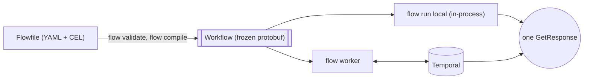

# Flowstate

**Flowstate** is a durable, policy-governed workload engine. You write a workload in
[YAML] with [CEL] expressions. It compiles to a typed [protobuf][protobufs]
specification, frozen at that boundary, and runs on [Temporal]'s [durable execution]
engine through one of two drivers that must agree on everything observable: rehearse
in-process while you write it, then hand the same file to a worker and it survives
crashes, redeploys, and waits that outlast the process that started them.

It is not a CI system. CI is one workload shape among many. The engine targets
anything that has to finish correctly despite crashes, network failures, and long
waits: data pipelines, provisioning and orchestration, operational runbooks, agentic
pipelines with approval gates, and scheduled maintenance work.

[YAML]: https://yaml.org/
[CEL]: https://cel.dev/
[protobufs]: https://protobuf.dev/
[Temporal]: https://temporal.io/
[durable execution]: https://docs.temporal.io/temporal#durable-execution

Hand-rolled Temporal gives you the durable execution but leaves policy, egress
control, secret handling, and the authoring surface to build yourself, workflow by
workflow, in Go. Airflow gives you an authoring surface and a scheduler, but its
retries and state live at the DAG level, not inside a durably-resumable step, so a
long wait or a worker crash mid-task is a different problem than the one it was
built to solve. Flowstate keeps Temporal's durability, replaces hand-written Go
workflow code with a typed, checkable specification, and puts signal
authorization in the file the workload's author already owns rather than in a
separate system they have to keep in sync. Egress and secret access are
governed the same way, in CEL, but by the operator: a worker's separate
`--egress-policy` and `--auth-policy` files, not the Flowfile. See
[docs/USE_CASES.md](docs/USE_CASES.md) for four worked examples of what that buys
in practice.

## See it work

A deploy that waits for a human to approve it, however long that takes. Nothing holds
a thread open for the wait, because the wait is state on Temporal rather than a
worker. This is a compact variant of [examples/approval-gate](examples/approval-gate),
which carries the fully annotated version:

```yaml
edition: v2026.3
name: approval-gate
description: Wait for a human to approve a deploy, then act on what they decided.
inputs:
  version:
    type: string
    required: true
    example: v1.4.2
    must: this.matches(r'^v?[0-9]+\.[0-9]+\.[0-9]+$')
  environment:
    type: string
    required: true
    example: production
    must: this in ["staging", "production"]
  expected_approver:
    type: string
    required: true
    example: sre-lead@example.com

# Who may deliver `deploy-approved`. The server checks the sender's attested
# identity against this before the workflow ever sees the signal: a team the
# author named, narrowed per run to one approver, who must not be the person
# who started the run.
signals:
  deploy-approved:
    allow:
      - subject: ${"https://issuer.example.com#" + inputs.expected_approver}
        claims:
          team: release-managers
    distinct_from_starter: true
steps:
  - id: request
    log:
      message: ${"requesting approval to deploy %s to %s".format([inputs.version, inputs.environment])}

  # The gate. It resolves to one of three outcomes, named once, on the step
  # that produced the data. Three and not two, because a payload carrying no
  # decision at all is neither an approval nor a rejection — which is why the
  # absent case stays visible: `payload.?approved` is an optional select,
  # `optMap` runs only when the field was actually sent, and `orValue` supplies
  # the case where nobody decided. (`.orValue(false)` on that read would be a
  # bug: it makes "missing" and "answered no" the same branch.) String literals
  # reached through conditionals and those optional idioms, deliberately: that
  # is the shape `flow validate` can read a domain out of, and it is what makes
  # the dispatch below checkable.
  - id: approval
    wait_for_signal:
      name: deploy-approved
      timeout: 24h
      outputs:
        # `optMap`'s first argument names the value it binds — here `isApproved`,
        # the payload's `approved` field once it is known to be present — and the
        # second is the expression evaluated with that name in scope.
        outcome: '${payload.?approved.optMap(isApproved, isApproved ? "deployed" : "rejected").orValue("undecided")}'
        sender: ${sender}

  # One dispatch, not three sibling `if:`s. The validator knows this value is
  # always one of "deployed", "rejected", "undecided" — the gate's own
  # expression above says so — so a typo'd case is refused by name and a case
  # nobody wrote is reported as unhandled. No `default:` on purpose: the three
  # cases exhaust the domain, and a `default:` beside them is dead code the
  # validator refuses.
  - id: decision
    switch:
      value: ${steps.approval.outcome}
      cases:
        - case: deployed
          steps:
            - id: deploy
              log:
                message: ${"deploying, approved by %s".format([steps.approval.sender.identity.subject])}
        - case: rejected
          steps:
            - id: rejected
              log:
                message: ${"%s declined the deploy".format([steps.approval.sender.identity.subject])}
        - case: undecided
          steps:
            - id: undecided
              log:
                message: nobody decided in time
```

Three things carry the weight here. First, authorization lives in `signals:`, not in
the steps: `FlowstateServer.Signal` refuses a signal from an unattested, wrongly
claimed, or mismatched sender before Temporal ever sees it, so the workflow's own
logic is left with the one question that belongs to it (did the approver say yes).
Second, `steps.approval.sender` is not something the approver typed into a payload.
It is who the server authenticated the signal as, and no caller can set it. A payload
is evidence; a sender is identity.

Third, the two halves of that gate are one claim the validator can check rather than
two that have to agree. The wait's `outcome:` states the three states once, and
`switch:` dispatches on that name, so `flow validate` reads the domain straight out
of the shaping expression and holds the branches to it:

```console
$ flow validate examples/approval-gate/workflow.yaml     # with `- case: rejcted`
case "rejcted" is not a value `steps.approval.outcome` can produce; the values are
"deployed", "rejected", "undecided"; did you mean "rejected"?
cases do not handle "rejected", which `steps.approval.outcome` can produce; a switch
with no `default:` claims to handle every value, so add the missing cases, or add a
`default:` — an empty `default: {steps: []}` is how deliberately handling nothing
else is written down
```

Written as three `if:`s, both of those are a run that quietly does nothing.

One honest caveat before you copy this into production: whoever can edit the
Flowfile can also widen or delete its `signals:` block. Binding that requires
deployment-side policy the file's author does not control, tracked in
[#187](https://github.com/picatz/flowstate/issues/187).

Rehearse it in this process, with no Temporal and no server. `flow test` runs the
example's own test file with stubbed signals and a virtual clock (the 24h timeout
lapses in well under a second), and it checks each scripted signal's `sender:`
through the same function the server calls:

```console
$ flow test examples/approval-gate/
PASS  examples/approval-gate/workflow.test.yaml: a sender satisfying signals: deploys
PASS  examples/approval-gate/workflow.test.yaml: an approved payload from a sender signals: refuses never reaches the gate
PASS  examples/approval-gate/workflow.test.yaml: an approved payload is still refused without an attested sender
PASS  examples/approval-gate/workflow.test.yaml: an explicit rejection is honored
PASS  examples/approval-gate/workflow.test.yaml: nobody answers, and the gate lapses at its own timeout
PASS  examples/approval-gate/workflow.test.yaml: a version that is not semver is refused before the first step runs
PASS  examples/approval-gate/workflow.test.yaml: an environment outside the known set is refused before the first step runs
PASS  examples/approval-gate/workflow.test.yaml: a signal carrying no decision is not a rejection
```

Bad arguments are refused before the first step runs, on the `must:` rules the
inputs declare:

```console
$ flow run local examples/approval-gate/workflow.yaml \
    --input version=latest --input environment=production \
    --input expected_approver=sre-lead@example.com
ERROR
input "version" must satisfy `this.matches(r'^v?[0-9]+\.[0-9]+\.[0-9]+$')`; got
latest
arguments are given with --input name=value or --input-file inputs.json
```

Hand the same file to a server backed by Temporal ([Quickstart](#quickstart) below),
and approve it from another terminal with `flow signal <id> deploy-approved --data
'{"approved": true}'`. One note if you try that against the Quickstart's dev setup:
`--insecure-no-auth` makes every caller the same anonymous principal, and this gate
pins a specific approver who must not be the starter, so it will refuse you (which
is the gate working). Rehearse it with `flow test` above, or run the server with
`--auth-policy` and two real identities ([docs/DEPLOYMENT.md](docs/DEPLOYMENT.md)).
A worker restart while it waits changes nothing, because
nothing local was holding the wait. Both drivers render a finished run through one
renderer, so a local rehearsal and a durable run answer with the same final document.

That contrast is the whole pitch: write once, rehearse locally, run durably. See
[docs/ARCHITECTURE.md](docs/ARCHITECTURE.md) for the layer model and the invariants
the implementation holds to, and [docs/VISION.md](docs/VISION.md) for where this is
going. Putting it somewhere real, especially somewhere multiple tenants share?
Read [docs/DEPLOYMENT.md](docs/DEPLOYMENT.md) first.

## How it fits together


```mermaid
flowchart LR
  Flowfile["Flowfile (YAML + CEL)"] -->|"flow validate, flow compile"| Spec[["Workflow (frozen protobuf)"]]
  Spec --> Local["flow run local (in-process)"]
  Spec --> Worker["flow worker"]
  Worker <--> Temporal[("Temporal")]
  Local --> Answer(("one GetResponse"))
  Temporal --> Answer

  classDef ir stroke-width:2px;
  class Spec ir;
```

An author writes a `Flowfile`. `flow validate` and `flow compile` turn it into a
`Workflow` protobuf: the durable artifact, and the only thing either driver executes.
Nothing about a run's behavior is decided from the YAML again. `flow run local`
interprets that spec in-process; `flow worker` interprets the identical spec as
Temporal activities and durable timers. Both answer through the same document, which
is what makes a local rehearsal worth trusting.

## Diagnostics, not silence

Checking a file never runs it. Steps have side effects, so executing a file to find a
typo means causing part of it. `flow validate` reports the position, what is wrong,
and what to do about it:

```console
$ flow validate broken.yaml
broken.yaml:5:5: step "web": unknown task "htpp"; did you mean "http"?
broken.yaml:9:16: step "out" input "message": references step "later", which runs later; steps can only reference steps defined before them
```

`flow run` and `flow run local` apply the same checks before executing anything, so a
mistake is reported rather than partially performed. `flow fix` migrates a file whose
spelling has been retired, and `flow compile` shows what a correct file *becomes*.
Both are in the [Reference](#reference) below.

## What it can do

| Capability | What | Where |
|---|---|---|
| **Control flow** | `if:`, `switch:` to dispatch on one value with a default that means something, `retry:` with backoff, `continue_on_error:`, `for_each`/`parallel:` fan-out, `value:` to name what an expression computes (read as `${steps.<id>.value}`), and `call:` to run another Flowfile as an isolated step | [DSL.md](docs/DSL.md) · [conditional-and-retry](examples/conditional-and-retry) · [webhook-routing](examples/webhook-routing) · [fan-out-and-parallel](examples/fan-out-and-parallel) · [call-a-workflow](examples/call-a-workflow) |
| **Structured concurrency** | `async: true` lets a step depart from written order; every reference to its output is a join, and the end of a scope joins whatever it started. Compensation still unwinds in reverse *written* order, so overlap does not change what undo means | [crossing-dependencies](examples/crossing-dependencies) |
| **Triggers** | How a run starts, declared in the file. `schedule:` writes a cadence and nothing else: what a scheduled run is started with comes from `flow schedule create --input`, bound and type-checked once at creation, because the cadence is the workload's answer and the arguments are the deployment's. `webhook:` is a call site, binding its arguments with `with:` the way `call:` does, so `flow validate` checks them against the workflow's `inputs:` statically in both directions, and `flow test` replays a stored delivery with no network | [scheduled-report](examples/scheduled-report) · [webhook-trigger](examples/webhook-trigger) |
| **Waits & signals** | `sleep:`, `wait_until:` a computed moment, and `wait_for_signal:` for durable timers and human approval gates, at no worker cost while parked | [approval-gate](examples/approval-gate) · [wait-until-a-moment](examples/wait-until-a-moment) |
| **Undo** | `undo:` saga compensation, registered the moment a step succeeds and run in reverse when a later step fails or `flow cancel` asks, including inside a `loop:` body and across a `call:` | [saga-provisioning](examples/saga-provisioning) · [order-fulfillment](examples/order-fulfillment) · [progressive-rollout](examples/progressive-rollout) |
| **Secrets** | `${secret('scheme:name')}` is a reference, resolved only inside the task activity that needs it and scrubbed from what a step reports; the value never enters workflow history | [http-secret](examples/http-secret) · [worker-side secrets](docs/CLI.md#worker-side-secrets) |
| **Policy & egress** | Default-deny network egress: public addresses only, CEL rules on url, scheme, host, port, method, path, ip, and the workload's identity (subject, issuer, namespace, claims), redirects re-checked, responses capped | [egress-policy.yaml](examples/egress-policy.yaml), a worked and fully annotated policy |
| **Plugins** | Out-of-process tasks and secret backends over Connect RPC: `vcs`, `git`, `github`, `sql` (sqlite and postgres), `codex` (a bounded agentic run as a durable step), and an SDK to write your own | [plugins/](plugins) · [plugin/sdk](pkg/flowstate/v1/plugin/sdk) |
| **Embedding** | Compile a Flowfile from bytes, register your own Go functions as tasks, and run locally or durably from your own Go program | [EMBEDDING.md](docs/EMBEDDING.md) · [examples/embedding](examples/embedding) |
| **Examples** | Fifty-five worked Flowfiles, indexed by what each one demonstrates | [examples/README.md](examples/README.md) |
| **Editor, agent, terminal** | Diagnostics and completion in your editor (`flow lsp`), a control plane for an agent (`flow mcp`), a live view of a running workload (`flow watch`) | [EDITORS.md](docs/EDITORS.md) · [flow mcp](docs/CLI.md#flow-mcp-the-same-surface-for-an-agent) · [MCP over HTTP, authorized (`flow mcp serve`)](docs/MCP_AUTHORIZATION.md) |

## Start here

- **Writing workflows by hand?** `flow init` scaffolds a workflow and its test;
  [Quickstart](#quickstart) below runs both without a server. Then
  [docs/DSL.md](docs/DSL.md) for the language and [examples/](examples/README.md) for
  working files to pattern-match against.
- **An agent using Flowstate?** `flow mcp` serves the same surface over stdio:
  validate, compile, run locally, run durably, all without a Go compiler in the loop.
  See [flow mcp: the same surface, for an agent](docs/CLI.md#flow-mcp-the-same-surface-for-an-agent).
- **Deciding whether Flowstate fits?** [docs/USE_CASES.md](docs/USE_CASES.md) walks
  four worked enterprise examples end to end.
- **Looking for a particular document?** [docs/README.md](docs/README.md) is the
  index: every page under `docs/`, one line on what it covers, which of them are
  generated, and which are internal process rather than product documentation.

## Quickstart

Nothing in this first part needs a server, a worker, or Temporal. Scaffold a workflow
and its test, run it, and run the test:

```console
$ go run ./cmd/flow init my-pipeline
+ created my-pipeline/workflow.yaml
+ created my-pipeline/workflow.test.yaml

NEXT
  flow run local my-pipeline/workflow.yaml
  flow test my-pipeline

  then, durably, in two commands:
  flow server dev
  flow run my-pipeline/workflow.yaml

$ go run ./cmd/flow run local my-pipeline/workflow.yaml
running locally
INFO hello, world
COMPLETED workflow my-pipeline

$ go run ./cmd/flow test my-pipeline
PASS  my-pipeline/workflow.test.yaml: the greeting uses the input it was given
my-pipeline/workflow.test.yaml  1/1 steps reached
```

That is the whole of the local loop, and it is worth rehearsing with: the two drivers
are one execution model, so conditions, retries, timeouts, loops and waits behave
here the way they behave in production.

### What a run answers with

On a terminal a run says what happened, in words, and stops there. Pipe it and stdout
carries a document instead — the same document either driver writes, in the vocabulary
the file is already written in. A step's outputs are `.steps.<id>`, and the values a
workflow declared under `outputs:` are `.runOutputs.<name>`:

```console
$ go run ./cmd/flow run local ./examples/computed-outputs/workflow.yaml --input release=2026.9.0 | jq
{
  "steps": {
    "report": {},
    "roll_out": {
      "results": [
        { "place": {} },
        { "place": {} },
        { "place": {} }
      ]
    }
  },
  "runOutputs": {
    "hosts_placed": 3,
    "release": "2026.9.0",
    "summary": "placed 2026.9.0 on 3 host(s)"
  }
}

$ go run ./cmd/flow run local ./examples/computed-outputs/workflow.yaml -o json | jq -r '.status, .runOutputs.summary'
STATUS_COMPLETED
placed 2026.8.1 on 3 host(s)
```

A value is a value: `.runOutputs.hosts_placed` is `3`, not a tagged union you have to
unwrap. That document is a contract — field names and shape are treated as a public
interface, and every field is present even when empty, so an expression that resolves
against one run resolves against the next. `--raw` writes the schema's own protojson
(`stepValues`, `namedValues`, CEL's own encoding of a value) for a consumer generated
against `flowstate.v1` rather than written by hand.

### Durably, on Temporal

What the local loop cannot give you is durability. A local run is a process, with no
run id, nothing watching it, and no survival past the command being interrupted. For
that you need a Temporal server, a Flowstate worker, and the Flowstate API server.
One command assembles all three, on loopback, ephemeral:

```console
$ go run ./cmd/flow server dev
```

It downloads the [Temporal CLI](https://docs.temporal.io/cli) on first use, caches it,
and stops everything it started when you press Ctrl-C. Pass `--db ./flowstate.db` to
keep the runs. It prints the postures it takes on your behalf, which are the same ones
the three commands below take, because it is those three commands in one process:

```console
$ temporal server start-dev
$ go run ./cmd/flow worker --allow-unversioned-interpreter
$ go run ./cmd/flow server --insecure-no-auth
```

Both flags are for a dev setup that outlives nothing. A production worker passes
`--deployment-name` and `--build-id` instead, so a deploy does not change the
interpreter behind a run already in flight (see
[Deployment portability](docs/ARCHITECTURE.md#deployment-portability)), and a
production server passes `--auth-policy` with a trust policy instead of allowing
anonymous callers.

Then run a workflow durably, through the server:

```console
$ go run ./cmd/flow run ./examples/computed-outputs/workflow.yaml --input release=2026.9.0
running on localhost:9233 as an anonymous caller
started workflow computed-outputs; come back to it with `flow watch flowstate-workflow-4a57133c-32b7-408f-8ff9-77bc0e7e3e05`
COMPLETED workflow computed-outputs run 01a025b3-d4f1-7450-9333-bfca9a969d6b after report, roll_out
outputs
  hosts_placed 3
  release 2026.9.0
  summary placed 2026.9.0 on 3 host(s)
```

While the run is going, a live view stands where the `COMPLETED` line is: where the
run has got to, what is being retried, which gate it is parked on. It is drawn on
stderr and erased when the run ends, leaving that one sentence — the same sentence
`flow run local` writes about the same file, because the two drivers are one execution
model and a person moving between them should have nothing to relearn.

Each identifier is said once, and once is not zero. The workflow id — what
`flow watch`, `flow get` and `flow cancel` are pointed at — is in the command it is
for and nowhere else. The run id names *this attempt* of the workload, which is what
`flow get --run-id` asks about, so it is on the line that stays; a workload that
continues as new names each attempt as it hands over. Pipe this run and stdout
carries the document instead, exactly as above.

The same file run with `flow run local` prints the same steps and, piped, the same
final document; the difference is that this one survives its worker being restarted.
That is why the document is worth having one of rather than two: `.runOutputs.summary`
is the same expression against a rehearsal and against production.

`go install ./cmd/flow` puts `flow` on your `PATH` (at `$(go env GOPATH)/bin/flow`)
once you'd rather not type `go run` every time. Everything above also has a `--help`,
and [docs/reference/cli.md](docs/reference/cli.md) is every command and flag,
generated from the binary's own command tree.

## Reference

### Tasks

Each step names a task directly: the task's own name is the key, its inputs the value
beneath it. `log` has no outputs, deliberately. A log line is an effect on a reader,
not a value for a later step; to carry a value, name it with `vars:` instead.

| Task Name | Inputs | Outputs |
|-----------|--------|---------|
| `log`     | `message`, `level`, `fields` | *(none)* |
| `http`    | `url`, `method`, `headers`, `body`, `query`, `form`, `json`, `parse_json`, `outputs`, `expect`, `retry_on_unknown_outcome`, `bearer`, `credential` | `status_code`, `headers`, `body`, `json` |

Names only: types, defaults and which are required belong to the schema, and
repeating them here is how the two disagree. `flow tasks` lists every task on one
line each; `flow tasks <name>` describes one in full, with every input, what bounds
it, and a step to copy; `flow tasks --output json` carries the whole catalog as one
document, for a script or an agent. [docs/reference/tasks.md](docs/reference/tasks.md)
is the generated, complete version of both tables.

> [!TIP]
> Every expression in a workflow (a task input, a `vars:` value, `if:`, `items:`,
> `wait_until:`) is evaluated against one vocabulary, reaching the same
> CEL extension libraries: `bindings`, `comprehensions`, `encoders`, `json`, `lists`,
> `math`, `optional`, `protos`, `regex`, `sets`, `strings`. There is nothing to
> enable, and `flow tasks --expressions` prints the same set, with the functions
> each library adds.

A plugin's tasks are not in this table, or in `flow validate`'s registry. See
[Plugins](docs/ARCHITECTURE.md#plugins) for why, and `flow plugins --plugin-dir <dir>`
to ask a worker what it would load.

### CLI

`flow` is the command line interface: write a `Flowfile`, check it, then either run
it on your own machine or hand it to a server that runs it durably through Temporal.
Every command below takes `--help` for its full flags, and
[docs/reference/cli.md](docs/reference/cli.md) is the same table generated from the
binary's own command tree, with which environment variable feeds each flag's default.

| Command | What it does |
| --- | --- |
| `flow init [dir]` | Scaffold a starter Flowfile and the test file that goes with it, named after the directory unless `--name` says otherwise. Never overwrites: a file already there stops it. |
| `flow validate <file...>` | Check Flowfiles without executing them. `--output json` or `jsonl` carries the diagnostics as data. |
| `flow compile <file>` | Print the workflow specification a Flowfile compiles to, the same `Workflow` message `flow run` submits, executing nothing and contacting no server. |
| `flow fix <path...>` | Rewrite Flowfiles from a retired spelling into the current one, preserving comments and formatting. `--check` reports and writes nothing. |
| `flow fmt <path...>` | Rewrite Flowfiles into the form `flowfile.Format` writes; unlike `flow fix`, from the parsed workflow rather than the source text, with the source's comments carried across. |
| `flow run <file>` | Submit a workflow to a server, which runs it durably, and follow it. Arguments come from `--input name=value` or `--input-file inputs.json`. |
| `flow run local <file>` | Run a workflow in this process, no server and no Temporal. Same `--input`/`--input-file`, and answers signal gates from `--signal name=json`. |
| `flow test [path...]` | Run a workflow's own `*.test.yaml` files: stubbed task responses, scripted signals, and a virtual clock, entirely through the local driver, so a `sleep: 24h` resolves in well under a second. `--output json` or `jsonl` reports what ran as data. |
| `flow breaking <path...>` | Report workflows whose declared inputs or outputs broke their contract against a git ref. `--against origin/main` compiles both sides and compares the compiled protos, so a shrunk interface fails while formatting churn does not. |
| `flow lint <path...>` | Suggest the canonical spelling where a Flowfile is legal but not idiomatic: a conditional nested inside a conditional, one expression stated three or more times, sibling `if:` steps dispatching on one value where a `switch:` belongs. Each finding names the rule in [docs/STYLE.md](docs/STYLE.md) that decided it. Advice rather than refusal — it exits 0 on every finding, and `--strict` is the opt-in that makes one a failure. |
| `flow audit <path...>` | Count the expressions a Flowfile states more than once, hand-negated pairs marked, every occurrence placed at a line. Written for whoever decides what the language grows rather than for the file's author: it is the evidence `value:` (#411) landed on, not a linter, and it exits 0 on every finding. |
| `flow get <id>` | Report what a run is doing, and its outputs if it finished. |
| `flow timeline <id>` | Report what a run *did*: which step ran, which attempt, what it waited for, what failed and with what sentence — read back from the run's own durable history. The question left when a run has already finished and there is no present to report. Reads no payload: a step is named by the label the interpreter wrote, never by decoding its inputs. |
| `flow watch <id>` | Follow a run until it finishes: a live view on a terminal, one line per change without one. |
| `flow list` | List your runs. `--filter` narrows with CEL, e.g. `--filter 'status == "FAILED"'`; `--all` keeps paging past a short page. |
| `flow signal <id> <name>` | Deliver a signal to a waiting run, which is how a human approval reaches a workload. |
| `flow cancel <id>` | Ask a run to stop cooperatively: it gets to run its `undo:` compensations and finish responding before it ends. |
| `flow terminate <id>` | Stop a run immediately. No further step runs and nothing on the way out runs either; the resource it held is leaked on purpose. |
| `flow schedule` | Create and manage schedules that run workflows on a cadence. A Flowfile's `triggers:` block declares the cadence; these verbs act on it. |
| `flow schedule create <file>` | Create a schedule from a Flowfile's `triggers:` block, checked here rather than at 3am. `--name` gives one file several cadences; `--paused` creates it without letting it fire. |
| `flow schedule list` | List your schedules, with whether each is live and when it next fires. |
| `flow schedule describe <name>` | Show one schedule's cadence, arguments, next firings, and recent runs. |
| `flow schedule delete <name>` | Delete a schedule. Runs it already started keep going. |
| `flow schedule pause <name>` | Stop a schedule firing without deleting it, recording a `--note` saying why. |
| `flow schedule resume <name>` | Let a paused schedule fire again. Missed firings are not made up. |
| `flow schedule trigger <name>` | Fire a schedule now, which is how a schedule is tested. Fires even a paused one. |
| `flow tasks` | List the tasks a workflow may use. `flow tasks <name>` describes one; `flow tasks --expressions` is what every expression can say. |
| `flow task` | Work with one task on its own, rather than through a workflow that contains it. |
| `flow task run <name>` | Run one task with no workflow around it, through the same engine `flow run local` uses, so the egress policy, secrets and retries all apply. Same `--input`/`--input-file` as `flow run`, with the task's own input schema playing the role of a workflow's `inputs:`. |
| `flow plugins` | List the plugins on a search path and the tasks each adds, by launching them and asking. |
| `flow worker` | Start a Temporal worker, which is what actually executes steps. |
| `flow server` | Start the Flowstate API server that accepts workflows. |
| `flow server dev` | Start the whole stack in one command on loopback: Temporal, the server, and a worker. Ephemeral unless `--db`, and every insecure posture it takes is stated at start-up. |
| `flow lsp` | Serve the Flowfile language server over stdin and stdout, for editor diagnostics. |
| `flow dap` | Serve the Debug Adapter Protocol over stdin and stdout, so an editor's step and continue buttons drive a real local run. Breakpoints are step ids rather than source lines. See [EDITORS.md](docs/EDITORS.md#stepping-a-run-flow-dap). |
| `flow debug` | Work with the step debugger's recordings. Every debugging front records the commands it accepted; this is where one is played back. |
| `flow debug replay <script> <workflow>` | Replay a recorded debugging session against a workflow: the same local run `flow run local --debug` performs, with its commands read from a file instead of the terminal. The script is checked against the workflow first, so a `break` on a step that no longer exists is a diagnostic rather than a run nobody watched. |
| `flow mcp` | Serve the control plane to an AI agent over stdin and stdout. See [flow mcp](docs/CLI.md#flow-mcp-the-same-surface-for-an-agent). |
| `flow mcp serve` | Serve a reduced control plane over HTTP as an OAuth 2.1 protected resource, requiring an audience-bound bearer token from a configured identity provider. See [MCP over HTTP, authorized](docs/MCP_AUTHORIZATION.md). |
| `flow keys` | Generate and inspect signing keys for workload identity. |
| `flow keys generate` | Generate a signing key, write it PKCS#8-PEM at file mode 0600, and print its public JWK. |
| `flow keys public` | Print the public JWK for an existing signing key, without touching the private half. |
| `flow jwt` | Sign and inspect JSON Web Tokens for admin debugging. |
| `flow jwt sign` | Sign a debugging JWT with a key from `flow keys generate`. Lifetime is capped at one hour. |
| `flow jwt inspect <token>` | Print a JWT's header and claims. Verifies the signature only when `--key` is given. |
| `flow version` | Print the build version, commit, build date, Go version, and platform. Works offline. |

`run`, `get`, `watch`, `list`, `signal`, `cancel` and `terminate` talk to a server
and take `--address` (or `FLOWSTATE_ADDRESS`); `run local` contacts nothing.

Which of those two a run is on is configured, never guessed: `flow run` means the
server and never falls back to executing here when none answers, because a network
failure must not turn a deploy into a laptop run. Every run says so before it starts,
on stderr, as `running locally` or `running on <address> as <the identity this
command will present>`, so the address a shell happens to be carrying is never
something to discover afterwards.

### Configuration

[docs/reference/envvars.md](docs/reference/envvars.md) is the generated, complete
table: every variable the code reads, held to the tree by a test that fails on a read
this list does not carry. The essentials:

| Variable | Default | Purpose |
|---|---|---|
| `FLOWSTATE_ADDRESS` | `localhost:9233` | Address the API server listens on, and `flow run` connects to |
| `FLOWSTATE_TOKEN_FILE` / `FLOWSTATE_TOKEN` | unset | Bearer token, or a file `flow` re-reads on every request (the shape federated identity actually arrives in) |
| `FLOWSTATE_EGRESS_POLICY` | unset | Path to an egress policy file; see [egress-policy.yaml](examples/egress-policy.yaml) |
| `FLOWSTATE_SECRET_ENV_ALLOW` / `FLOWSTATE_SECRET_DIR` | unset | What `env:`/`file:` secret references this process may resolve |
| `FLOWSTATE_DEPLOYMENT_NAME` / `FLOWSTATE_BUILD_ID` | unset | A worker's versioned interpreter identity; see [Deployment portability](docs/ARCHITECTURE.md#deployment-portability) |
| `FLOWSTATE_PLUGIN_DIR` | unset | `$PATH`-style directories to discover plugins in |
| `TEMPORAL_ADDRESS`, `TEMPORAL_NAMESPACE`, `TEMPORAL_API_KEY`, `TEMPORAL_TLS_*` | unset | Standard Temporal connection config, plus `TEMPORAL_PROFILE` to select a profile from the same TOML file the `temporal` CLI reads |

With no configuration at all, Flowstate connects to a local development server:
self-hosted is the default, and Temporal Cloud is opt-in configuration rather than a
prerequisite. A credential is never sent over plain HTTP to anywhere but this
machine. `flow` refuses rather than warns, unless an operator sets
`FLOWSTATE_INSECURE_PLAINTEXT_TOKEN=true` to say that something else (a sidecar, a
service mesh) is terminating TLS in front of it.

## License

[MIT](LICENSE).
