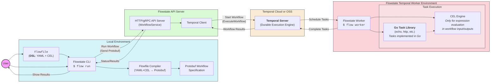

# Flowstate

**Flowstate** is a durable, policy-governed workload engine. You declare a workload in
[YAML] with [CEL] expressions; Flowstate compiles it into a typed [protobuf][protobufs]
specification and executes it on [Temporal]'s [durable execution] engine.

It is not a CI system. CI is one workload shape among many — the engine targets anything
that has to finish correctly despite crashes, network failures, and long waits: data
pipelines, provisioning and orchestration, operational runbooks, agentic pipelines with
approval gates, and scheduled maintenance work.

See [docs/ARCHITECTURE.md](docs/ARCHITECTURE.md) for the layer model, the invariants the
implementation holds to, and how Temporal's primitives map onto the DSL.

[CEL]: https://cel.dev/
[YAML]: https://yaml.org/
[DSL]: https://en.wikipedia.org/wiki/Domain-specific_language
[protobufs]: https://protobuf.dev/
[Temporal]: https://temporal.io/
[durable execution]: https://docs.temporal.io/temporal#durable-execution

## Overview


```mermaid
flowchart LR
  %% User actor
  User((User))

  %% User Local Environment
  subgraph LocalEnv [Local Environment]
    direction LR
    Flowfile["<code>Flowfile</code><br/>(<strong>DSL</strong>: YAML + CEL)"]
    CLI["Flowstate CLI<br><code>$ flow run</code>"]
    Compiler["Flowfile Compiler<br/>(YAML+CEL → Protobuf)"]
    ProtobufSpec["Protobuf Workflow<br/>Specification"]
    
    %% Local component relationships
    Flowfile --> CLI
    CLI --> Compiler
    Compiler --> ProtobufSpec
  end

  %% Server/API Environment
  subgraph ServerEnv [Flowstate API Server]
    direction LR
    APIServer["HTTP/gRPC API Server<br/>(WorkflowService)"]
    TemporalClient["Temporal Client"]
    
    %% API component relationships
    APIServer --> TemporalClient
  end

  %% Temporal Cloud Environment
  subgraph TemporalEnv [Temporal Cloud or OSS]
    direction LR
    TemporalServer["<strong>Temporal Server</strong><br/>(Durable Execution Engine)"]
  end
  
  %% Worker Environment (Separate Cloud/GCP)
  subgraph WorkerEnv [Flowstate Temporal Worker Environment]
    direction LR
    Worker["Flowstate Worker<br/><code>$ flow worker</code>"]
    
    subgraph TaskExecution [Task Execution]
      TaskLib["<strong>Go Task Library</strong><br/>(echo, http, etc.)<br/><i>Tasks implemented in Go</i>"]
      CELEngine["CEL Engine<br/><i>Only for expression evaluation<br/>in workflow input/outputs</i>"]
    end
    
    %% Worker component relationships
    Worker --> TaskLib
    Worker --> CELEngine
    TaskLib -.-> CELEngine
  end
  
  %% Cross-environment relationships
  User --> Flowfile
  User --> CLI
  CLI -- "Run Workflow<br/>(Send Protobuf)" --> APIServer
  TemporalClient -- "Start Workflow<br/>(ExecuteWorkflow)" --> TemporalServer
  TemporalServer -- "Schedule Tasks" --> Worker
  Worker -- "Complete Tasks" --> TemporalServer
  
  %% Result flow
  TemporalServer -- "Workflow Results" --> TemporalClient
  APIServer -- "Status/Results" --> CLI
  CLI -- "Show Results" --> User
  
  %% Styling
  classDef userStyle fill:#f9f,stroke:#333,stroke-width:2px;
  class User userStyle;
  
  classDef localStyle fill:#d4f4fa,stroke:#333,stroke-width:1px;
  class LocalEnv localStyle;
  
  classDef serverStyle fill:#d8fad4,stroke:#333,stroke-width:1px;
  class ServerEnv serverStyle;
  
  classDef temporalStyle fill:#faecd4,stroke:#333,stroke-width:1px;
  class TemporalEnv temporalStyle;
  
  classDef workerStyle fill:#fad4d8,stroke:#333,stroke-width:1px;
  class WorkerEnv workerStyle;
  
  classDef taskExecStyle fill:#f8e0e4,stroke:#333,stroke-width:1px;
  class TaskExecution taskExecStyle;
```

## Flowfile Structure

A `Flowfile` is a YAML file that defines a series of steps to be executed in order. A step has a unique `id` and then names the work it does directly: the task's own name is the key, and that task's inputs are the value beneath it. Inputs can be static values or dynamic expressions using CEL syntax.

### Example

```yaml
name: multi-step-hello-world
steps:
  - id: hello
    echo:
      message: hello world
  - id: output
    echo:
      message: ${steps.hello.result}
```

The above `Flowfile` defines two steps:
1. The first step has an `id` of `hello`, uses the built-in `echo` task, and takes a literal string value `"hello world"` for the `message` input.
2. The second step has an `id` of `output`, also uses the built-in `echo` task, and takes a dynamic input `message` that references the output of the first step using `${steps.hello.result}`. The `${...}` syntax indicates that it is an expression.
3. The output of the first step is reached through `steps`: the step's `id` (`hello`) selects the step, and the output name (`result`) selects the value. Outputs and inputs are strongly typed, but depend on the task being used (see below).

### Referring to a step's outputs

A step is named through a root — `${steps.<id>.<output>}` — while a name bound *where the
expression is written* stays bare: a loop's iterator, `now` inside `wait_until:`, and the
response variables a task evaluates its own inputs against (`status_code`, `body` and
`json` in the `http` task).

Two namespaces rather than one, because a single flat one cannot tell a bare `${name}`
inside a loop from a reference to a step called `name`. The language used to forbid the
overlap instead: an iterator could not take a step's id, no step could be called `now`,
and every CEL reserved word was refused as a step id, since a bare reference to one does
not parse. Rooting makes the collision unrepresentable, so those refusals went with
it — an iterator may share a step's id, a step may be called `now`, and of the
twenty-one reserved words only `true`, `false`, `null` and `in` are still refused,
because CEL's lexer rejects those before a field selection is reached at all.

A file written the older, bare way is rewritten by `flow fix`, and until it is run
`flow validate` names the step and says which command to run rather than reporting an
unknown name.

### Saying why a step is there

A step can carry `description:` — prose the mechanics under it cannot supply, written
directly under `id:`:

```yaml
steps:
  - id: roster
    description: >-
      The roster service is the source of truth for who is on call. A stale answer
      here pages the wrong person, so this deliberately does not retry into a cache.
    http:
      url: https://example.com/roster

  - id: settle
    description: Give the read replica time to catch up with the write we just read past.
    sleep: 2s
```

It is a property of the *step* rather than of the task it runs, which is why a `sleep`
or a `for_each` can carry one — often the steps most in need of explaining, since what a
wait is waiting for appears nowhere else in the file. It also has to live there: the keys
under `http:` are that task's inputs, so a `description` written among them would be
asking for an input by that name.

See [examples/edition-and-descriptions](examples/edition-and-descriptions).

## Controlling how a step runs

A step can declare when it runs and how it behaves when it fails. One policy does not
fit every step: reading a config file and provisioning a cluster differ by orders of
magnitude in how long they take and how safe they are to repeat.

```yaml
steps:
  - id: check
    echo:
      message: ready

  - id: deploy
    if: ${steps.check.result == 'ready'}   # only runs when this is true
    timeout: 30s                     # bounds one attempt
    retry:
      attempts: 3                    # total attempts, so 1 disables retrying
      interval: 1s                   # delay before the second attempt
      backoff: 2.0                   # multiplier applied after each attempt
      max_interval: 10s              # ceiling on the delay
    echo:
      message: deploying

  - id: notify
    continue_on_error: true          # a failure here does not end the run
    echo:
      message: notifying
```

Behavior worth knowing:

- A step whose `if` is false is **skipped and produces no outputs**, so a later step
  referencing it will not resolve. That is deliberate — the value genuinely does not exist,
  and inventing an empty one would hide the mistake of depending on a step that did not run.
- Only failures that could plausibly succeed on another attempt are retried. A step that
  failed because its inputs were invalid, or because a policy denied it, fails once no
  matter what `retry` says. Retrying an operation known to be unrepeatable is worse than
  failing.
- `continue_on_error` records the failure as `${steps.<id>.error}` rather than discarding it,
  so a later step can branch on whether it worked.
- These behave identically under `flow run local` and durable execution. Local retries are
  in-process and therefore not durable — a crash loses them — but the observable outcome
  matches, which is what makes a local run worth trusting.

See [examples/conditional-and-retry](examples/conditional-and-retry).

## Workloads that are not a straight line

A step can repeat over a computed list, or split into branches that run at the same time.

```yaml
steps:
  - id: targets
    cel:
      expr: "['alpha', 'beta']"

  # Repeat the body once per item. Inside it, the current item is bound to the
  # iterator's name; body steps can reference each other within an iteration.
  - id: process
    for_each:
      items: ${steps.targets.result}
      iterator: name          # defaults to `item`; bare, so it may share a step's id
      max_parallel: 3         # omit or 1 to run one at a time
      steps:
        - id: label
          printf:
            format: "processing %s"
            args:
              - ${name}          # the iterator, bare: a binding, not a step

  # Independent work with no reason to be sequential.
  - id: checks
    parallel:
      - steps:
          - id: check_config
            echo: { message: config ok }
      - steps:
          - id: check_quota
            echo: { message: quota ok }

  - id: summary
    printf:
      format: "%s / %s / processed %d"
      args:
        - ${steps.check_config.result}
        - ${steps.check_quota.result}
        - ${size(steps.process.results)}
```

The scoping rules are worth knowing, because they are what keep results independent of
timing:

- **A loop reports its iterations through its own `results` output** — a list with one
  element per iteration, each a map of body step id to that step's outputs. Body outputs do
  not leak into the enclosing scope, because with more than one iteration they would
  overwrite each other and a later step would read whichever iteration happened to finish
  last. So `${steps.process.results}` is available afterwards; `${steps.label.result}` is
  not.
- **The iterator is a local binding, not a step**, which is why it is written bare and why
  it may be named after a step in the same file. `${name}` inside the body is the current
  item; `${steps.name.result}` would be a step called `name`, if there were one.
- **Parallel branch outputs do merge** once the block completes, so
  `${steps.check_config.result}` works afterwards. Branches must not reference each
  other, since there is no ordering between them — `flow validate` reports it if they do.
- Iterations and branches each start from the outputs that existed before the block, so
  neither can observe the other's work. That is what makes concurrent and sequential
  execution produce the same result.
- `max_parallel` bounds concurrency under durable execution. Local runs execute
  sequentially so their output is deterministic and comparable, which is the whole point of
  running locally.

See [examples/fan-out-and-parallel](examples/fan-out-and-parallel).

## Task Outputs and Data Flow

### Parse JSON with CEL

You can keep HTTP simple (returning `status_code`, `headers`, `body`) and use the CEL task to parse JSON without a separate HTTP+JSON task. Enable the optional `json` library and use `json_parse(string)`:

```yaml
name: json-via-cel
steps:
  - id: resp
    http:
      method: GET
      url: https://httpbin.org/json
  - id: pick
    cel:
      expr: json_parse(steps.resp.body)['slideshow']['title']
```

The CEL task’s `result` will be the selected field from the parsed JSON. This keeps activities minimal and payloads small while letting you shape data in CEL.

`expr` is the expression the task exists to evaluate, so it is written bare rather than
wrapped in `${...}` — but it resolves against the same names everything else does, and a
step is `steps.<id>.<output>` here too. The task evaluates it itself, which is why
`flow validate` does not reference-check it: what it may name also depends on `vars`,
which the validator cannot see.

It is the one reference `flow fix` will not rewrite for you, but it will tell you about
it. Rooting is a rewrite of `${...}` values, and `expr` is not one of them — it is the
expression itself rather than a value containing one — so a `cel` step written before the
root is left exactly as it was. It keeps working, because the runtime still answers the
older bare spelling, and stops the day that compatibility is dropped. So `flow fix`
reports it instead, with the rooted form to paste:

```
workflow.yaml:10:13: `expr` is evaluated by the task against its own scope, so this was
left alone — but it names something spelled like a step. If it means the step, write it
`json_parse(steps.web.body)['slideshow']['title']`
```

It stays quiet about a name the step binds as a variable, under `vars:` or beside it,
since that name is the variable and rooting it would break the step.

### Shape HTTP outputs to fit limits

To keep workflow payloads small, the `http` task supports an optional `outputs` input (a map literal or CEL map) which defines exactly what the step should return. When `outputs` is present, only those named values are returned instead of the default `status_code/body/headers`.

Example:

```yaml
steps:
  - id: web
    http:
      method: GET
      url: https://httpbin.org/json
      # ${...} marks a CEL expression, as everywhere else in a Flowfile.
      # Quote it so YAML does not read the colons inside as mapping syntax.
      outputs: "${ {'status': status_code, 'title': json_parse(body)['slideshow']['title']} }"
```

Unlike other inputs, `outputs` is evaluated by the `http` task after the response arrives,
so its expression sees the response. `flow validate` knows this and will not mistake
`body` for a step reference.

Those names are bare for the same reason a loop's iterator is: the task binds them where
the expression is written, rather than their being another step's outputs. `steps.` is
still reachable alongside them — the response variables are added to the scope, not
substituted for it — so a shaping expression may combine the response with an earlier
step's output. `flow fix` therefore leaves a deferred input alone rather than rooting what
it cannot tell apart, and says so when a name in one is spelled like a step in the file.

Available variables in `outputs` evaluation:
- `status_code` (int64)
- `body` (string)
- `headers` (map[string]string)

Tip: prefer returning only the fields a later step actually needs. Carrying less keeps a
workload comfortably inside Temporal's default payload limits; genuinely large data is
better handled with a payload codec that offloads the blob and carries a reference
(the claim-check pattern) than by moving more bytes through history.

### Governed network access

A workflow chooses the URL the `http` task fetches, which means it asks the worker to make
a request on the author's behalf — including to addresses only the worker can reach, like
internal services and cloud instance metadata endpoints. Requests therefore go through an
egress policy that, by default:

- allows `http` and `https` to public addresses only, denying loopback, private,
  link-local, multicast, unique-local, and carrier-grade NAT ranges, plus the well-known
  cloud metadata endpoints;
- checks the address actually being connected to, after resolution, so a name that resolves
  to a public address once and an internal one later gains nothing;
- re-applies the policy to every redirect hop, so a public URL cannot bounce into an
  internal target;
- bounds the request with timeouts and caps the response body.

Operators can express additional rules as CEL — the same language workflows are written
in — matching on `url`, `scheme`, `host`, `port`, `method`, `path`, and the resolved `ip`.
Rules are compiled and type-checked when the policy is built, so a malformed rule is a
startup error rather than a surprise mid-run. Denials are reported distinctly from network
failures and are never retried, since a denied request would only be denied again.

To develop against a service on `localhost`, set `FLOWSTATE_ALLOW_LOOPBACK_EGRESS=true`.
It is an explicit opt-in because the same permission is what would let a workflow reach a
worker's own internal endpoints in production.

## Secrets

> [!NOTE]
> `${secret(...)}` compiles to a reference and a malformed one is a validation error,
> but no task consumes a reference yet, and the placement shown below — inside a
> `headers` map — is currently refused. Treat this section as the intended design
> rather than as working behavior until this note is gone.

A secret never appears in a workflow. A *reference* to one does:

```yaml
steps:
  - id: notify
    http:
      method: POST
      url: https://api.example.com/events
      headers:
        Authorization: ${secret('vault:prod/api#token')}
```

A reference is `scheme:name`. The scheme selects which backend resolves it, and the
name means whatever that backend means by it — an environment variable, a path under
a mounted directory, a vault path.

The reference is all that exists in the compiled workflow, in the request that
submits it, and in the durable history Temporal keeps. The value is resolved on the
worker, inside the step that uses it, and exists only for that call. Referencing a
secret in an expression is refused, because computing with it in workflow code would
put the result in history:

```
a secret reference cannot be read in an expression; pass it to a task input that
accepts one (vault:prod/api#token)
```

Which backend resolves a scheme is the deployment's choice, and the same workflow
runs unchanged against any of them. That is the point of referencing rather than
embedding: a laptop can resolve `db:password` from the OS keychain while production
resolves it from a vault, and the Flowfile does not know or care.

A deployment registers only the schemes it permits. An unregistered scheme is
refused rather than guessed at, and a deployment that registers nothing refuses every
reference — the right configuration for one that should not handle secrets at all.

## Plugins

The built-in tasks and secret backends will not cover everything, so the engine is
extensible by code it does not ship. A plugin is a separate executable named
`flowstate-plugin-<name>` that speaks Connect RPC over a Unix socket.

Separate, because a plugin runs inside a worker that holds credentials and can reach
internal networks: in the same process, a panic takes the worker down and a bug reads
whatever the worker can. The protocol is defined in the schema rather than as a Go
interface, so a plugin can be written in any language with Connect or gRPC support.

A plugin advertises *capabilities* rather than being of a kind, so one binary can
resolve secrets and provide tasks both — which is what the useful integrations
actually look like. A plugin-provided task ships its own protobuf descriptors, which
is what will let `flow validate`, editor completion, and `flow tasks` treat it
exactly like a built-in one.

**None of that is reachable yet.** The protocol, the host, the SDK and a worked
example are all here and tested, and nothing wires the host into `flow worker` — so
the task registry every one of those surfaces reads is built from the built-ins
alone, and a Flowfile naming a plugin task is told `unknown task`. There is no `flow
plugins` command either. This section describes a design that is finished and a path
that is not yet connected; it is called out rather than quietly implied, because a
capability nobody can reach is not done.

A plugin extends what the engine can do, not what it is allowed to do: it resolves
only permitted schemes, receives the tenant a workload belongs to rather than
choosing one, and its network access remains governed by the worker.

See [docs/ARCHITECTURE.md](docs/ARCHITECTURE.md) for the design and the handshake.

## Configuration

Flowstate's own settings:

| Variable | Default | Purpose |
|---|---|---|
| `FLOWSTATE_ADDRESS` | `localhost:9233` | Address the API server listens on, and that `flow run` connects to |
| `TEMPORAL_TASK_QUEUE` | `flowstate-run-task-queue` | Task queue workers serve and workflows are routed to |
| `FLOWSTATE_ALLOW_LOOPBACK_EGRESS` | unset | Permit the `http` task to reach loopback addresses |
| `FLOWSTATE_TOKEN_FILE` | unset | File holding the bearer token `flow` authenticates with, re-read per request |
| `FLOWSTATE_TOKEN` | unset | Bearer token, used when no token file is set |
| `FLOWSTATE_DEPLOYMENT_NAME` | unset | Worker Deployment this worker belongs to (see below) |
| `FLOWSTATE_BUILD_ID` | unset | Version identifier for this worker's binary, unique per build |
| `FLOWSTATE_VERBOSE_LOGGING` | `false` | Verbose logging |

### Authenticating

`flow` presents a bearer token when one is configured, and is anonymous when one is
not — which is what a development server started with `--insecure-no-auth` expects.

```console
$ flow run workflow.yaml --token-file /var/run/secrets/tokens/flowstate
$ FLOWSTATE_TOKEN="$(gcloud auth print-identity-token)" flow list
```

The file form is the one to reach for, because it is the shape federated identity
actually arrives in: Kubernetes projects a service account token to a path and rotates
the file underneath you. It is re-read on every request for that reason, so a token that
rotates mid-command keeps working.

There is deliberately no flag that takes the token itself. A credential in `argv` is a
credential in `ps` and in shell history.

**A credential is not sent over plain HTTP to anywhere but this machine.** A bearer token
is a bearer token — whoever holds it is you — so `flow` refuses rather than warns, and
tells you to use an `https://` address. If something else is providing the encryption (a
sidecar terminating TLS, say), `FLOWSTATE_INSECURE_PLAINTEXT_TOKEN=true` overrides it.

### How much a workload may carry

A run carries its specification and its step outputs together, across every
continue-as-new, and Temporal will not store a payload past its blob limit. So there are
two limits, and both report rather than truncate:

- A **specification** is refused past 1 MiB, by `flow validate` and again at submit. Note
  that this is not the size of the file: expressions compile to syntax trees, and a
  Flowfile of ordinary expressions has been measured expanding more than fivefold.
- A **run** fails, with a reason, if what it must carry forward would not fit.

The second one exists because the alternative is silence. Temporal's refusal fails the
workflow task rather than the run, and a failed workflow task is retried — so a workload
that outgrows the limit reports RUNNING, climbs an attempt count nobody is watching, and
never finishes. A run that cannot continue is failed here instead, which is the difference
between something you can find and something you cannot.

If you hit either, the fix is nearly always the same: a step producing something large
should write it somewhere and pass a reference, because every output a later step can
still reach is carried across every suspension.

### Deploying without disturbing running workloads

A worker runs an *interpreter*. There is one workflow type, and every workload anybody has
written is a value it executes — so shipping a change to the engine changes the behaviour of
every run in flight at once, including one that is a month old and half finished. Temporal
replays a run's history through whatever code the worker is running now, which is what makes
that a correctness question rather than a stylistic one.

Setting both halves of a version turns that off:

```console
$ flow worker --deployment-name flowstate --build-id "$(git rev-parse --short HEAD)"
```

A run is then **pinned** to the interpreter it started on and takes the **current** version
at its next Continue-As-New. Deploying stops reaching work already underway; long workloads
still migrate forward on their own, so an old version drains rather than being held open by
whatever is still running on it. Point traffic at a new build the usual way — with `temporal
worker deployment set-current-version`, or the equivalent in your rollout tooling.

Unversioned is the default and is fine for development, where "whatever is deployed runs
whatever is in flight" is what you want. The worker says which of the two it is at startup.

### Connecting to Temporal

Connection settings follow Temporal's own environment configuration rather than a scheme
invented here, so the standard variables behave as they do across the Temporal ecosystem:
`TEMPORAL_ADDRESS`, `TEMPORAL_NAMESPACE`, `TEMPORAL_API_KEY`, and the `TEMPORAL_TLS_*`
family for TLS and mTLS.

Flowstate also reads the same TOML configuration file the `temporal` CLI uses
(`TEMPORAL_CONFIG_FILE`, defaulting to the conventional location), so a profile already
configured for the CLI works without being restated. Profiles are how one installation
addresses several environments:

```console
$ TEMPORAL_PROFILE=staging flow worker
```

`--address`, `--namespace`, and `--profile` on `flow worker` and `flow server` override
whatever that configuration resolves to.

With no configuration at all, Flowstate connects to a local development server — what
`temporal server start-dev` provides. Self-hosted is the default and needs no setup;
Temporal Cloud is reached by configuring an API key or mTLS, and nothing in the defaults
assumes a hosted service.


Each step in a `Flowfile` has named inputs and produces named outputs, which later steps reference in CEL expressions as `${steps.<id>.<output>}` — the step `id` selects the step and the output name selects the value. The outputs of a step are determined by the task being used, and can be of various types (e.g., `string`, `int`, `map`, etc.). The outputs of a step can be used as inputs to later steps, allowing for complex data flows and transformations.

### Available Tasks

| Task Name | Inputs | Outputs |
|-----------|--------|---------|
| `echo`    | `message` | `result` |
| `printf`  | `format`, `args` | `result` |
| `http`    | `url`, `method`, `headers`, `body`, `query`, `form`, `json`, `parse_json`, `outputs`, `expect`, `retry_on_unknown_outcome` | `status_code`, `headers`, `body`, `json` |
| `cel`     | `expr`, `vars` | `result` |

Names only, deliberately: types and constraints belong to the schema, and repeating them
here is how the two disagree. `flow tasks` prints the same catalog with every type, which
required input is which, and the CEL libraries the `cel` task accepts — derived from the
registry, so it cannot drift from what the engine will execute.

This table is checked against that registry by a test, because it *had* drifted: it was
missing six of `http`'s inputs and one of its outputs, while the sentence beneath it
claimed a listing derived from the registry cannot drift. A hand-written table is a second
source of truth by construction, so the only thing that keeps one honest is something that
fails when it is wrong.

`flow tasks --output json` emits the same catalog as one document, for a script or an
agent that has to address a value rather than recognise one:

```console
$ flow tasks --output json | jq '.tasks[] | select(.name == "http") | .inputs[] | select(.required)'
{
  "name": "url",
  "type": "string",
  "required": true,
  "deferred": false
}
```

Tasks can be chained together as tasks. For example, the following `Flowfile` makes an HTTP `GET` request to `https://microsoft.com`, and then echoes the status code of the response:

```yaml
steps:
  - id: web
    http:
      method: GET
      url: https://microsoft.com
  - id: output
    echo:
      message: ${string(steps.web.status_code)}
```

> [!TIP]
> Use `${...}` for expressions, like referencing a previous step's output as `${steps.<id>.<output>}`.
> The `cel` task evaluates the expression string provided in its `expr` input at runtime. Variables for the expression are provided under the `vars` input, and referenced as `vars.<name>`. Every expression in a workflow — this one, `if:`, `items:`, `wait_until:`, and every task input — reaches the same CEL extension libraries: `bindings`, `comprehensions`, `encoders`, `json`, `lists`, `math`, `optional`, `protos`, `regex`, `sets`, `strings`. There is nothing to enable; `flow tasks` prints the same set.

### Waiting

A step can wait instead of doing work. Waiting is a step kind rather than a task,
because a wait is the engine's business: nothing runs, no worker slot is held, and a
workload parked for a month costs the same as one parked for a second.

```yaml
name: waiting
steps:
  # A duration.
  - id: settle
    sleep: 2s

  # A moment. `now` is bound here and nowhere else — it is the replay-safe clock,
  # so the same expression yields the same instant on every replay of the run.
  - id: hold
    wait_until: ${now + days(1)}

  # A signal from outside, with a deadline.
  - id: approval
    wait_for_signal:
      name: approval
      timeout: 72h

  - id: act
    if: ${!steps.approval.timed_out && has(steps.approval.payload.approver)}
    echo:
      message: ${'approved by ' + steps.approval.payload.approver}
```

`wait_for_signal:` is how a human reaches a workload:

```console
$ flow signal <id> approval --data '{"approver": "someone@example.com"}'
```

The step's outputs say what happened. `timed_out` is always present, so a workload
branches on the deadline passing rather than failing on it, and `payload` carries
whatever the sender sent — which may be nothing, since `--data` is optional. That is why
the step above tests `has(...)` as well as `timed_out`: a signal sent with no payload
leaves `payload` an empty map, and reaching into it for a key nobody sent fails the step.
Guarding both is the difference between a workload that handles a bare approval and one
that only handles the approval you had in mind.

A signal that arrives before the step is reached is not lost — a declared channel is
drained before the run suspends, so approving in advance works.

Note the `message:` above is one expression rather than text with a `${...}` in it. The
DSL has no string interpolation, and writing `approved by ${...}` is refused rather than
silently shipped as literal text. That is not a hypothetical: the first draft of this
section had exactly that mistake, and `flow validate` caught it.

See [examples/approval-gate](examples/approval-gate) and
[examples/wait-until-a-moment](examples/wait-until-a-moment).

## Getting Started

### Authoring

Check a workflow without running it. This matters for a workload engine: steps have side
effects, so executing a file to find a typo means causing part of it.

```console
$ flow validate examples/hello-world/workflow.yaml
examples/hello-world/workflow.yaml: ok
```

Problems are reported with the position, the step, and what to do about them:

```console
$ flow validate broken.yaml
broken.yaml:4:5: step "web": unknown task "htpp"; available tasks are cel, echo, http, printf
broken.yaml:8:16: step "out" input "message": references step "later", which runs later; steps can only reference steps defined before them
```

`flow run` and `flow run local` apply the same checks before executing anything, so a
mistake is reported rather than partially performed.

When a spelling in the language is replaced, it is replaced rather than deprecated, and
the migration is a command:

```console
$ flow fix workflow.yaml
workflow.yaml:10: step references rooted under `steps`
workflow.yaml:4: `task:` naming "echo" rewritten to `echo:`
```

That is both of the retired spellings in one pass: a step that named its task through
`task:`/`name:`, and a reference that named a step bare. A bare reference is what
`flow validate` reports as `` `greet` is a step, and a step is named `steps.greet` now``,
which names the command rather than leaving an author to guess what an unknown name means.

It rewrites only the lines it must and copies the rest through byte for byte, so
comments and formatting survive and a file with nothing to change comes back identical —
which is what makes pointing it at a whole directory safe. A shape it cannot rewrite
without guessing, such as a task written in flow style or standing behind a YAML alias,
is reported with its position and left alone rather than mangled. `flow fix --check`
writes nothing and exits non-zero if there is work, which is the form CI runs.

A file may also name the grammar it is written in with a top-level `edition:`. It is
optional and most files leave it out, since absent means the current one. What writing it
buys is a *refusal*: a build that does not have that grammar says so instead of reading
the file as something else, which is what makes retiring a spelling safe to do at all.

List what workflows can use:

```console
$ flow tasks
```

Flowstate also ships a language server (`flow lsp`) providing diagnostics, hover, and
completion for Flowfiles — see [docs/EDITORS.md](docs/EDITORS.md) for editor setup.

### Running

Start a local Temporal development server:

```console
$ temporal server start-dev
...
```

Start a Temporal worker for Flowstate:

```console
$ go run ./cmd/flow worker
...
```

Start the Flowstate API server:

```console
$ go run ./cmd/flow server
...
```

Run a `Flowfile` locally (without Temporal):

```console
$ go run ./cmd/flow run local ./examples/hello-world-multi-step/workflow.yaml
{"stepValues":{"a":{"namedValues":{"result":{"literal":{"stringValue":"hello world"}}}},"b":{"namedValues":{"result":{"literal":{"stringValue":"hello world"}}}}}}
```

Run a `Flowfile` using Temporal via the Flowstate API server:

```console
$ go run ./cmd/flow run ./examples/hello-world-multi-step/workflow.yaml
{"stepValues":{"a":{"namedValues":{"result":{"literal":{"stringValue":"hello world"}}}},"b":{"namedValues":{"result":{"literal":{"stringValue":"hello world"}}}}}}
```

## CLI

`flow` is the command line interface. You write a workflow as a Flowfile, check
it, and then either run it on your own machine or hand it to a server that
executes it durably through Temporal.

Run `flow <command> --help` for the full flags of any of these.

| Command | What it does |
| --- | --- |
| `flow validate <file...>` | Check Flowfiles without executing them. Reports the line and column of each problem. |
| `flow fix <path...>` | Rewrite Flowfiles from a retired spelling into the current one, preserving comments and formatting. `--check` reports and writes nothing, exiting non-zero if there is work. |
| `flow run <file>` | Submit a workflow to a server, which runs it durably. |
| `flow run local <file>` | Run a workflow in this process, with no server and no Temporal. Answers signal gates from `--signal name=json`. |
| `flow get <id>` | Report what a run is doing, and its outputs if it finished. Status on stderr, outputs on stdout, so `flow get id \| jq` sees only the data. |
| `flow list` | List your runs. |
| `flow signal <id> <name>` | Deliver a signal to a run that is waiting, which is how a human approval reaches a workload. |
| `flow cancel <id>` | Ask a run to stop, letting it clean up. |
| `flow terminate <id>` | Stop a run immediately, running none of its cleanup. |
| `flow tasks` | List the tasks a workflow may use, and the expression libraries available to them. |
| `flow worker` | Start a Temporal worker, which is what actually executes steps. |
| `flow server` | Start the Flowstate API server that accepts workflows. |
| `flow lsp` | Serve the Flowfile language server over stdin and stdout, for editor diagnostics. |

`run`, `get`, `list`, `signal`, `cancel` and `terminate` talk to a server, and
take `--address` (or `FLOWSTATE_ADDRESS`) to say which one. `run local` does not:
it contacts nothing.

### Stopping a run

`cancel` and `terminate` are different asks, and the difference decides whether
the workload's cleanup happens.

**`flow cancel`** is cooperative. The run is asked to stop and gets to finish
responding, so a workload that has to release a lock, roll back a partial
deployment, or tell somebody it gave up still does. The cost is that a run wedged
on something that never returns may not stop at all.

**`flow terminate`** is not. The execution stops where it is, no further step
runs, and nothing the workload would have done on the way out is done. Its
`--reason` is recorded on the run, and it is the only account of the decision
anyone will find, because a terminated run does not get to explain itself.

Prefer cancel. Reach for terminate when a run must stop now, or when cancelling
did not stop it — and understand that terminating something holding a resource is
a decision to leak that resource on purpose.

### Listing runs

`flow list` returns one page and stops. A page can come back short, or even
empty, while runs of yours remain: the tenant a run belongs to is recorded as a
Temporal memo, which cannot be queried, so the server reads a bounded number of
executions per request and keeps the ones that are yours. In a busy namespace a
scan can spend its whole budget among other tenants' runs.

So an empty page is not the end of the listing — only an empty page token is.
`flow list` says on stderr when more remain, and `flow list --all` keeps asking
until they do not.
