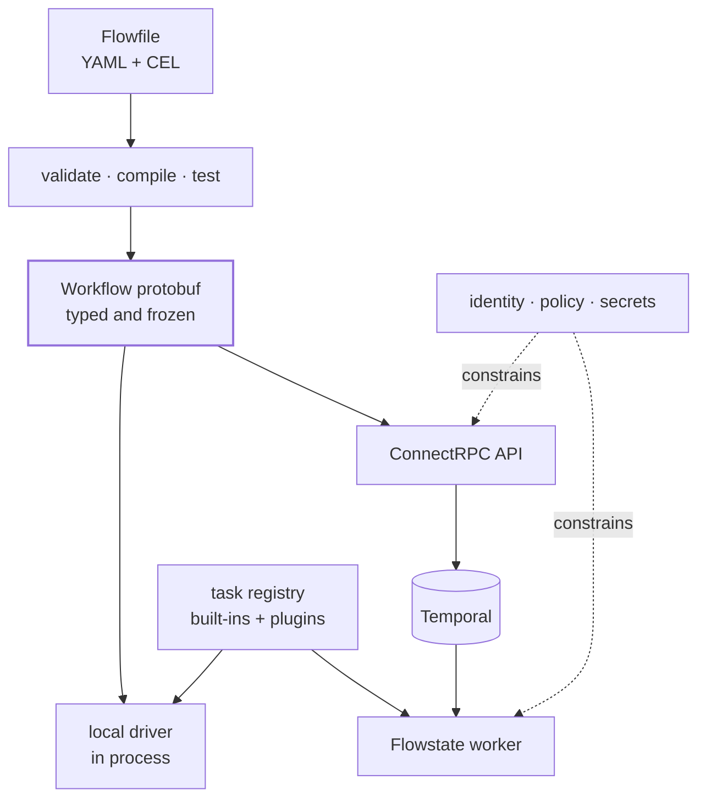

# Flowstate

**Declare reliable workloads in YAML + CEL, rehearse them locally, then run the
same typed specification durably on Temporal.**

Flowstate turns a readable `Flowfile` into a validated Protobuf specification.
Use it for one local task, a parallel data pipeline, an operational runbook, or a
long-running process with retries, timers, signals, compensation, policy, and
an audit trail.

- **Fast authoring loop.** Validate, inspect, test, and run in one process before
  starting infrastructure.
- **One execution model.** Local and Temporal drivers share step execution and
  return the same result shape; Temporal adds persistence, recovery, and durable
  timers.
- **Governed extension.** Typed plugins, workload identity, secret references,
  and CEL policy extend capability without moving trust decisions into each
  workflow.

[YAML]: https://yaml.org/
[CEL]: https://cel.dev/
[Protobuf]: https://protobuf.dev/
[Temporal]: https://temporal.io/

## A Flowfile

This complete workflow accepts typed inputs, uses CEL to shape data, processes a
bounded worklist concurrently, and publishes typed outputs:

```yaml
edition: v2026.3
name: rollout
inputs:
  targets:
    type: list
    default:
      - api
      - worker
      - scheduler
steps:
  - id: plan
    value: ${inputs.targets.map(target, target.lowerAscii())}
  - id: deploy
    for_each:
      items: ${steps.plan.value}
      as: target
      max_parallel: 3
      steps:
        - id: announce
          log:
            message: ${"deploying %s".format([target])}
outputs:
  targets:
    value: ${steps.plan.value}
  deployed:
    value: ${size(steps.deploy.results)}
```

Save it as `workflow.yaml`, then:

```console
$ flow validate workflow.yaml
$ flow compile workflow.yaml | jq -r '.steps[].id'
$ flow run local workflow.yaml -o json | jq .runOutputs
{
  "deployed": 3,
  "targets": ["api", "worker", "scheduler"]
}
```

`inputs.targets` is the run's typed argument. `plan` and `deploy` are stable step
identities; `${steps.plan.value}` is both a data dependency and a join. The
workflow's declared `outputs` are its public result. These names are distinct
from authenticated [workload and caller identity](docs/ARCHITECTURE.md#identity-in-both-directions),
which the server and policy engine attach and verify rather than trusting the
Flowfile to assert.

The complete Flowfiles in this README and the core language docs are compiled in
tests. The [computed outputs](examples/computed-outputs) and
[fan-out and parallelism](examples/fan-out-and-parallel) examples develop this
pattern with runnable tests and commentary.

<details>
<summary><strong>Start smaller: one local task</strong></summary>

```yaml
edition: v2026.3
name: hello-world
steps:
  - id: hello
    log:
      message: hello world
```

Run it with `flow run local workflow.yaml`. No server, worker, or Temporal is
involved. A task can also run without a Flowfile through `flow task run`; see the
[generated task catalog](docs/reference/tasks.md).

</details>

<details>
<summary><strong>Go further: a durable, policy-governed approval</strong></summary>

The [approval-gate example](examples/approval-gate) combines a durable
`wait_for_signal` with an allow rule over the sender's attested identity. The
server authorizes the signal before Temporal receives it; the worker can restart
while the run is parked, and no thread or process must remain open for the wait.

Rehearse its decisions, timeout, and refusal paths locally with virtual time:

```console
$ flow test examples/approval-gate/
```

Production authorization also requires deployment-side trust and task policy.
Read [Deployment](docs/DEPLOYMENT.md) before sharing a server or Temporal
namespace.

</details>

## From file to durable run


```mermaid
flowchart TB
  File["Flowfile<br/>YAML + CEL"] --> Check["validate · compile · test"]
  Check --> Spec["Workflow protobuf<br/>typed and frozen"]
  Spec --> Local["local driver<br/>in process"]
  Spec --> API["ConnectRPC API"]
  API --> Temporal[("Temporal")]
  Temporal --> Worker["Flowstate worker"]
  Registry["task registry<br/>built-ins + plugins"] --> Local
  Registry --> Worker
  Policy["identity · policy · secrets"] -. constrains .-> API
  Policy -. constrains .-> Worker

  classDef contract stroke-width:2px;
  class Spec contract;
```

The Flowfile is authoring syntax; the compiled `flowstate.v1.Workflow` is the
execution contract. Both drivers interpret that contract through the same step
executor. Local execution is intentionally ephemeral. A Temporal run adds durable
history, retry and timer recovery, signals, Continue-As-New, and interpreter
version pinning. See [Architecture](docs/ARCHITECTURE.md) for the invariants and
the precise parity boundary.

## Quickstart

Install the current CLI with Go:

```console
$ go install github.com/picatz/flowstate/cmd/flow@latest
```

This installs `flow` in `$(go env GOPATH)/bin`. From a repository checkout, each
command below may instead be written as `go run ./cmd/flow ...`.

### 1. Scaffold and inspect

```console
$ flow init my-workflow
$ flow validate my-workflow/workflow.yaml
$ flow compile my-workflow/workflow.yaml | jq .name
"my-workflow"
$ flow test my-workflow
PASS  my-workflow/workflow.test.yaml: the greeting uses the input it was given
```

`flow init` creates a workflow and its `*.test.yaml`. Validation and compilation
execute nothing. Tests stub tasks and signals and use a virtual clock, so they
also need no server or network.

### 2. Run locally

```console
$ flow run local my-workflow/workflow.yaml
running locally
INFO hello, world
COMPLETED workflow my-workflow
```

Pass typed arguments with `--input name=value` or `--input-file inputs.json`.
When stdout is piped, a local run emits the same stable result document as a
durable run.

### 3. Run durably

Start the development stack in one terminal:

```console
$ flow server dev
```

It starts an ephemeral Temporal development server, Flowstate API server, and
worker on loopback. In another terminal:

```console
$ flow run my-workflow/workflow.yaml
```

`flow run` always means the server; it never falls back to local execution. Use
`flow watch`, `flow get`, and `flow timeline` to follow or inspect a run, and
`flow signal`, `flow cancel`, or `flow terminate` to act on it. For persistent,
authenticated, multi-tenant, or Temporal Cloud setups, use the
[deployment guide](docs/DEPLOYMENT.md).

## What you can build today

| Area | Current capabilities | Go deeper |
| --- | --- | --- |
| **Author** | Strict YAML grammar; typed inputs and outputs; cost-bounded CEL; source diagnostics; formatting, linting, migration, tests, LSP, and debugger | [Language](docs/DSL.md) · [Style](docs/STYLE.md) · [Editors](docs/EDITORS.md) |
| **Compose** | Data dependencies by step ID; `if`, checked `switch`, bounded `for_each`, `parallel`, `async`, state-carrying `loop`, and isolated `call` with optional digest pinning | [Control-flow examples](examples/README.md) · [Language reference](docs/DSL.md) |
| **Execute** | Local rehearsal; Temporal activities, retries, timeouts, durable timers and signals, schedules, webhooks, Continue-As-New, cancellation, and saga compensation | [Execution model](docs/ARCHITECTURE.md#execution-model) · [Use cases](docs/USE_CASES.md) |
| **Extend** | Typed out-of-process tasks and secret providers over ConnectRPC; Git, GitHub, SQL, VCS, and bounded Codex plugins; curated Go embedding API | [Plugins](docs/PLUGINS.md) · [Embedding](docs/EMBEDDING.md) |
| **Govern** | Authenticated caller/workload/signal identity; CEL authorization, task and default-deny egress policy; worker-side secret resolution; tenant routing; audit records | [Deployment](docs/DEPLOYMENT.md) · [Architecture](docs/ARCHITECTURE.md#deployment-portability) |
| **Operate** | ConnectRPC lifecycle and schedule APIs; terminal and JSON output; run listing, watch, timeline, cancellation; OpenTelemetry traces, metrics, and logs | [CLI reference](docs/reference/cli.md) · [Observability example](examples/observability) |

Flowstate currently ships the capabilities above. Remote plugin distribution and
hosted plugins, consuming MCP services as capabilities, chat integrations, generic
LLM tasks, and additional Temporal surfaces are future directions—not current
product claims. They are tracked in [Vision](docs/VISION.md).

## Integrate it

- **ConnectRPC and Protobuf:** the control plane is defined in
  [`proto/flowstate/v1/service.proto`](proto/flowstate/v1/service.proto), usable
  over HTTP/1.1 or HTTP/2 by generated clients and gRPC-compatible tooling.
- **Plugins:** workers discover explicit local executables that advertise typed
  task descriptors. Validation, completion, execution, and generated docs read
  the same catalog. Plugins are trusted worker-side code, not a sandbox boundary.
- **Go embedding:** [`pkg/flowstate/embed`](pkg/flowstate/embed) compiles
  Flowfiles, registers application tasks, and runs locally or on a Temporal
  worker owned by the embedding program.
- **Agents and MCP:** `flow mcp` exposes authoring and control-plane tools over
  stdio; `flow mcp serve` exposes an authorized HTTP subset. The tool roster is
  generated from the service descriptor. See [MCP reference](docs/reference/mcp.md)
  and [HTTP authorization](docs/MCP_AUTHORIZATION.md).

## Choose your next document

| Goal | Start here |
| --- | --- |
| Write a Flowfile | [Language decisions and reference](docs/DSL.md) · [validated examples](examples/README.md) |
| Find a task, CEL function, command, or setting | [Tasks](docs/reference/tasks.md) · [CEL](docs/reference/cel.md) · [CLI](docs/reference/cli.md) · [environment](docs/reference/envvars.md) |
| Understand execution and security boundaries | [Architecture](docs/ARCHITECTURE.md) · [Deployment](docs/DEPLOYMENT.md) |
| Build a plugin or embed the engine | [Plugins](docs/PLUGINS.md) · [Embedding](docs/EMBEDDING.md) |
| Use an editor or agent | [Editors](docs/EDITORS.md) · [MCP](docs/CLI.md#flow-mcp-the-same-surface-for-an-agent) |
| Browse everything | [Documentation index](docs/README.md) |

## Development

The repository checks complete documentation Flowfiles against the compiler,
tests the examples, verifies the docs index, and regenerates CLI, task, CEL,
diagnostic, environment, and MCP references from their owning code and schemas.

```console
$ go run ./tools/gate   # checks reachable from the current diff
$ make check            # full CI-parity suite
```

Read [CLAUDE.md](CLAUDE.md) and the [architecture invariants](docs/ARCHITECTURE.md#invariants)
before changing the engine.

## License

[MIT](LICENSE)
