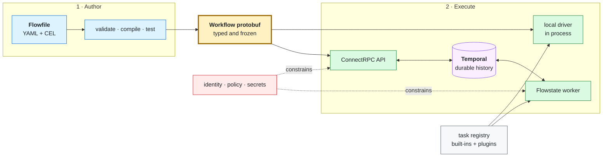

# Flowstate

[](https://scorecard.dev/viewer/?uri=github.com/picatz/flowstate)
[](LICENSE)

**Write a workflow once, rehearse and test it on your machine, then run the same
workflow durably on [Temporal], governed by identity, policy, and secrets.**

Flowstate is a typed, durable, debuggable workflow language and engine, for work
that has to finish correctly despite crashes, network failures, and waits of
hours or days. Business processes with people in the loop; long-lived entities
that many callers address; agents that act under policy; provisioning that must
be undone when a later step fails; data pipelines; incident runbooks; releases
that roll out in stages. You describe the workload in
a `Flowfile`, [YAML] for structure and [CEL] expressions for data and
conditions. Flowstate validates it, compiles it into a typed [Protobuf]
specification, and runs that specification either in-process for rehearsal or
on Temporal, where every step is recorded and a run survives any process
stopping.

Authors get a fast local loop: validation with line and column, tests on a
virtual clock, a step debugger, and editor and agent integration. Operators get
authenticated callers and approvers, policy over what workflows may reach and
read, worker-side secret resolution, tenant isolation, and an audit trail.

Flowstate works alongside CI, services, and your existing Temporal usage rather
than replacing them. [Why Flowstate, and when not](docs/COMPARISON.md) compares
it with the alternatives, including the workloads it does not fit.

> [!WARNING]
> Flowstate is early software. The capabilities described here are shipped and
> tested, but the interfaces are not yet stable: expect breaking changes, and
> see [SUPPORT.md](SUPPORT.md).

[YAML]: https://yaml.org/
[CEL]: https://cel.dev/
[Protobuf]: https://protobuf.dev/
[Temporal]: https://temporal.io/

## A Flowfile

A customer asks for a refund. This workflow totals the lines of the request and
checks the total against a limit that belongs to the workflow rather than to
whoever starts it, then tells the customer what happened. A payout, and a person
in finance who must approve the large ones, are the next step; see
[`examples/refund-request`](examples/refund-request/).

```yaml
edition: v2026.4
name: refund-triage
inputs:
  order_id:
    type: string
    required: true
  lines:
    type: list(int)
    default:
      - 1500
      - 4200
vars:
  auto_limit_cents: 5000
steps:
  - id: total
    value: ${inputs.lines.sum()}
  - id: needs_review
    value: ${steps.total.value > vars.auto_limit_cents}
  - id: tell
    log:
      message: ${"refund of " + string(steps.total.value) + " cents on " + string(inputs.order_id) + " (needs review " + string(steps.needs_review.value) + ")"}
outputs:
  needs_review:
    value: ${steps.needs_review.value}
  total_cents:
    value: ${steps.total.value}
```

```console
$ flow validate workflow.yaml
workflow.yaml: ok
$ flow run local workflow.yaml --input order_id=o-1 -o json | jq -c .runOutputs
{"needs_review":true,"total_cents":5700}
```

`inputs.lines` is the run's typed argument, a list of integers with a default.
`total` and `needs_review` are step ids; reading `${steps.total.value}` is how
`needs_review` gets the total, and also what orders it after `total`. The
`outputs` are the run's result. Every complete Flowfile in this README and the
core guides is compiled and linted by the test suite.

<details>
<summary><strong>Start smaller: one step</strong></summary>

```yaml
edition: v2026.4
name: hello-world
steps:
  - id: hello
    log:
      message: hello world
```

Run it with `flow run local workflow.yaml`. No server, worker, or Temporal is
involved. A single task can also run without a Flowfile through
`flow task run`; the [task reference](docs/reference/tasks.md) lists what each
task takes.

</details>

<details>
<summary><strong>Go further: an authenticated approval</strong></summary>

The [approval-gate example](examples/approval-gate) waits for a durable signal
and accepts it only from an approver with the right verified identity, who is
not the person who asked. The server checks the sender before Temporal receives
the signal, and no process stays open while the run waits.

Rehearse its approvals, timeout, and refusals locally, on a virtual clock:

```console
$ flow test examples/approval-gate/
```

Then follow its [authenticated approval walkthrough](examples/approval-gate/README.md#run-an-authenticated-approval)
to run it durably with separate requester and approver credentials.

</details>

## From file to durable run


```mermaid
flowchart LR
  subgraph author["1 · Author"]
    File["<b>Flowfile</b><br/>YAML + CEL"]
    Check["validate · compile · test"]
  end

  Spec["<b>Workflow protobuf</b><br/>typed and frozen"]

  subgraph execute["2 · Execute"]
    Local["local driver<br/>in process"]
    API["ConnectRPC API"]
    Temporal[("<b>Temporal</b><br/>durable history")]
    Worker["Flowstate worker"]
  end

  Registry["task registry<br/>built-ins + plugins"]
  Policy["identity · policy · secrets"]

  File --> Check --> Spec
  Spec --> Local
  Spec --> API
  API <--> Temporal
  Temporal <--> Worker
  Registry --> Local
  Registry --> Worker
  Policy -.-> |constrains| API
  Policy -.-> |constrains| Worker

  classDef authoring fill:#DDF4FF,stroke:#0969DA,color:#1F2328
  classDef contract fill:#FFF1C2,stroke:#9A6700,stroke-width:3px,color:#1F2328
  classDef runtime fill:#DAFBE1,stroke:#1A7F37,color:#1F2328
  classDef durable fill:#FBEFFF,stroke:#8250DF,color:#1F2328
  classDef govern fill:#FFEBE9,stroke:#CF222E,color:#1F2328
  classDef neutral fill:#F6F8FA,stroke:#57606A,color:#1F2328
  class File,Check authoring
  class Spec contract
  class Local,API,Worker runtime
  class Temporal durable
  class Policy govern
  class Registry neutral
```

The Flowfile is how you write a workflow; the compiled `flowstate.v1.Workflow`
is what runs. The local driver and the Temporal driver execute that one
specification through the same step executor, and a shared conformance suite
holds them to the same results. Temporal adds durable history, recovery, timers,
signals, and Continue-As-New. The API server starts and observes runs through
Temporal, and workers execute them. [How Flowstate works](docs/CONCEPTS.md)
explains each piece.

## Quickstart

Install the CLI (Go 1.27 or newer):

```console
$ go install github.com/picatz/flowstate/cmd/flow@latest
```

Scaffold a workflow with its test, check it, and run it locally:

```console
$ flow init my-workflow
$ flow validate my-workflow/workflow.yaml
my-workflow/workflow.yaml: ok
$ flow test my-workflow
PASS  my-workflow/workflow.test.yaml: the greeting uses the input it was given
$ flow run local my-workflow/workflow.yaml
running locally
INFO hello, world
COMPLETED workflow my-workflow
```

Run it durably. `flow server dev` starts a Temporal development server, the
Flowstate API server, and a worker from one command on loopback; the first launch
downloads the Temporal CLI. In another terminal:

```console
$ flow server dev
```

```console
$ flow run my-workflow/workflow.yaml
```

`flow run` always means the server and never falls back to running locally.
Follow and act on runs with `flow watch`, `flow get`, `flow timeline`,
`flow signal`, `flow cancel`, and `flow list`.

[Get started](docs/GETTING_STARTED.md) takes this further in twenty minutes: a
refund-approval workflow, its tests, the debugger, and a durable run that
survives a restart while it waits for an approval.

## What you can build today

| Area | Shipped | Go deeper |
| --- | --- | --- |
| **Author** | Typed inputs and outputs; cost-bounded CEL; positioned diagnostics; `flow fmt`, `flow fix`, `flow lint`; tests on a virtual clock; a step debugger; LSP and MCP servers | [Language](docs/LANGUAGE.md) · [Testing](docs/TESTING.md) · [Editors](docs/EDITORS.md) |
| **Compose** | Data flow by step reference; `if`, checked `switch`, bounded `for_each`, `parallel`, `async`, state-carrying `loop`, and isolated `call` with optional digest pinning | [Language](docs/LANGUAGE.md#control-flow) · [Examples](examples/README.md) |
| **Execute** | Local rehearsal; durable runs on Temporal with retries, timeouts, durable timers and signals, schedules, webhooks, Continue-As-New, cancellation, and saga compensation | [Concepts](docs/CONCEPTS.md) · [Use cases](docs/USE_CASES.md) |
| **Govern** | Authenticated callers and signal senders; per-workflow approval policy; egress that refuses internal addresses by default; CEL policy over egress, tasks, and secrets, with secrets denied until allowed; short-lived federated credentials; tenant routing; audit records | [Secrets](docs/SECRETS.md) · [Deployment](docs/DEPLOYMENT.md) · [Threat model](THREAT_MODEL.md) |
| **Extend** | Out-of-process plugins over a typed protocol, with first-party Anthropic, Docker, Git, GitHub, JOSE, OCI, OIDC, OpenAI, SCIM, Slack, SQL, SSH, VCS, Webhook, and Codex plugins; a Go embedding package | [Plugins](docs/PLUGINS.md) · [Embedding](docs/EMBEDDING.md) |
| **Operate** | A ConnectRPC API; terminal and JSON output; run listing, watching, timelines, and cancellation; OpenTelemetry traces, metrics, and logs | [API](docs/API.md) · [CLI reference](docs/reference/cli.md) · [Observability example](examples/observability) |

Fetching plugins from a registry, hosted plugins, consuming MCP servers as
capabilities, chat-based approvals, and a general LLM task are directions, not
shipped features. [Vision](docs/VISION.md) records them.

## Integrate it

- **API.** Every server operation is an RPC on `flowstate.v1.WorkflowService`,
  defined in [`proto/flowstate/v1/service.proto`](proto/flowstate/v1/service.proto).
  Call it as JSON over HTTP with curl, with the generated Go client, or with a
  client you generate for another language. See [the API guide](docs/API.md).
- **Plugins.** A worker launches plugin executables you name and learns their
  typed tasks from them; validation, completion, and generated docs read the
  same schema. A plugin is trusted code, not a sandbox.
- **Go embedding.** [`pkg/flowstate/embed`](pkg/flowstate/embed) compiles
  Flowfiles, registers Go functions as tasks, and runs workflows in-process or
  on a Temporal worker your program owns.
- **Agents.** `flow mcp` gives an MCP client the language guide, the task
  catalog, validation, tests, a scripted debugger, local rehearsal, and the
  control plane. See [Using Flowstate from an agent](docs/MCP.md) and the
  generated [MCP tool reference](docs/reference/mcp.md).

## Find your way

| You want to | Start with |
| --- | --- |
| Try it | [Get started](docs/GETTING_STARTED.md) |
| Understand the model | [How Flowstate works](docs/CONCEPTS.md) |
| Write workflows | [The Flowfile language](docs/LANGUAGE.md) · [Examples](examples/README.md) · [Task reference](docs/reference/tasks.md) · [CEL reference](docs/reference/cel.md) |
| Test and debug them | [Testing](docs/TESTING.md) · [Debugging](docs/DEBUGGING.md) · [Editors](docs/EDITORS.md) |
| Run Flowstate for a team | [Deployment](docs/DEPLOYMENT.md) · [Secrets](docs/SECRETS.md) · [CLI reference](docs/reference/cli.md) |
| Build on it | [API](docs/API.md) · [Embedding](docs/EMBEDDING.md) · [Plugins](docs/PLUGINS.md) · [MCP](docs/MCP.md) |
| See every document | [Documentation index](docs/README.md) |

## Development

Contributors start with [CONTRIBUTING.md](CONTRIBUTING.md); coding agents start
with [AGENTS.md](AGENTS.md). Both apply the same gate:

```console
$ go run ./tools/gate   # checks reachable from the current diff
$ make check            # full CI-parity suite
```

Read the [architecture invariants](docs/ARCHITECTURE.md#invariants) before
changing the engine.

## License

[MIT](LICENSE)
