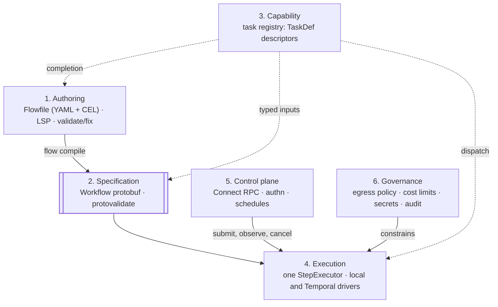
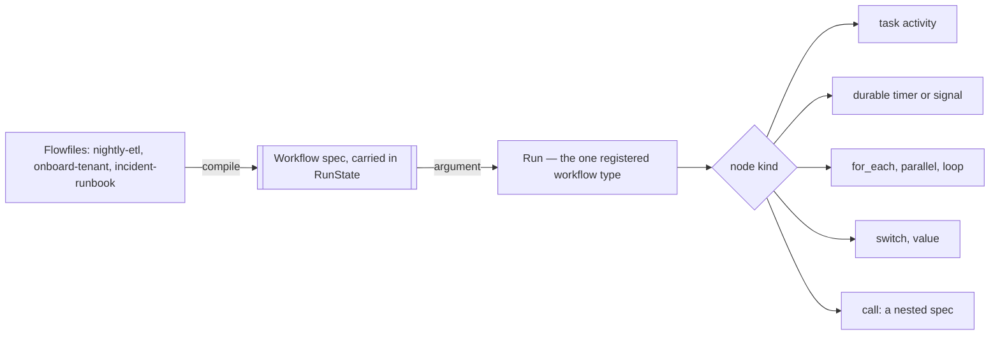
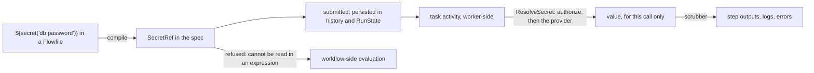

# Flowstate Architecture

## What Flowstate is

Flowstate is a **durable, policy-governed workload engine**. You declare a workload in
YAML with CEL expressions; Flowstate compiles it into a typed Protobuf specification and
executes it on [Temporal]'s durable execution substrate.

The emphasis matters: Flowstate is not a CI/CD system. CI is one workload shape among
many, and a fairly simple one. The engine is built for any workload that has to *finish
correctly* despite process crashes, network failures, and long waits:

- data pipelines and ETL
- infrastructure provisioning and orchestration
- incident-response and operational runbooks
- agentic and LLM pipelines with retries and human approval gates
- business processes spanning hours, days, or months
- scheduled and event-driven maintenance work
- API orchestration and webhook fan-out

If it could replace a hand-written Temporal worker, an Argo/Step Functions state machine,
a pile of cron jobs, or a fragile bash-and-retry script, it is in scope.

[Temporal]: https://temporal.io/

## Why this substrate

Every foundational choice is a bet that a well-designed layer beneath us is better than
one we invent.

**Temporal** provides durability, retries, timers, signals, child workflows, schedules,
cancellation, and visibility — the genuinely hard parts of reliable execution. Flowstate's
job is to expose that power *declaratively*, so that using it does not require writing and
operating a Go worker by hand. Anything Temporal already does well, we surface rather than
reimplement.

**CEL** ([Common Expression Language]) provides a safe, non-Turing-complete, statically
typed, cost-boundable expression language. It is the right tool for both halves of the
problem: *data flow* (shaping step inputs and outputs) and *policy* (step conditions,
network egress rules, authorization). Using one expression language for both is the
central cohesion win — an operator who learns CEL for a workflow condition already knows
how to write an egress rule.

**Protobuf** provides a typed, versioned, wire-stable specification. The YAML DSL is
deliberately sugar over a real API: the compiled spec is the durable artifact Temporal
persists, and it can be produced by hand, by another tool, or by a future UI without
going through YAML at all.

That split is also where the language's own versioning stops. A Flowfile may name the
grammar it is written in with a top-level `edition:`, which is read when the file
compiles and has no field in the schema — an edition is a property of a *file*, not of a
workload. So the DSL can retire a spelling outright, with `flow fix` rewriting files
across the boundary, and nothing already running is affected: what a run carries is the
compiled spec, which the change never touched. Surface syntax is cheap to change exactly
because it is not the contract.

**Connect RPC** provides an HTTP/1.1 and HTTP/2 API that is browser-compatible and
gRPC-compatible without gRPC's operational weight, which keeps the self-hosted story
light.

[Common Expression Language]: https://cel.dev/

## Layers

Flowstate is six layers, each with one responsibility and a narrow contract to the next.

| Layer | Responsibility | Key artifacts |
| --- | --- | --- |
| **1. Authoring** | Humans express intent | `Flowfile` (YAML+CEL), LSP, `flow validate` / `fix` / `tasks` |
| **2. Specification** | Typed, validated, versioned workload definition | `Workflow` protobuf, protovalidate constraints |
| **3. Capability** | What a workload *can do* | Task registry: `TaskDef` with typed Protobuf input/output descriptors; built-ins and plugins |
| **4. Execution** | Run a step, then run a workload | One `StepExecutor`; two drivers (local in-process, Temporal durable) |
| **5. Control plane** | Submit, observe, schedule, and govern runs | Connect RPC service, authn (OIDC/WIF), authorization, schedules and triggers |
| **6. Governance** | Constrain what runs may do | Egress policy, CEL cost limits, secrets, audit trail |



The two solid arrows down the middle are the whole pipeline: an author's file becomes
a specification, and the specification is what runs. Layers 5 and 6 join at execution
rather than before it — a control plane starts and observes runs, and governance
constrains what a running step may do; neither rewrites what the author wrote. The
dashed arrows all leave the same box, which is the property below.

The important structural property is that **layer 3 is the single source of truth for
capability**. Execution dispatch, spec validation, LSP completion, and the documented task
table all derive from the same `TaskDef` descriptors. When they are derived from one place
they cannot drift; when they are maintained separately they always do — the hand-written
task table in the README drifting from the code is exactly the failure this prevents.

## Invariants

These are the rules that keep the system coherent as it grows. A change that violates one
of these is a bug, even if it passes tests.

1. **Proto-first.** Types that describe the system — workloads, steps, values, execution
   state, evaluation scope, identity — are defined in the schema, not as hand-written Go
   structs. A Go type that mirrors a schema concept is a second definition of it, and two
   definitions drift: the hand-written DSL structs that once sat between YAML and the
   `Workflow` message had to be updated in lockstep with every schema change, and silently
   lost source positions along the way. Defining a type once also means it is versioned,
   wire-stable, and usable from another language for free. Behavior attaches to generated
   types as methods in hand-written files; the *shape* comes from the schema.

2. **One evaluator.** All CEL flows through a single construction path with one cost policy,
   one cancellation contract, and one fail-closed rule. Scattering `cel.NewEnv()` across call
   sites produces environments that silently diverge in capability and cost limits.

   This is about *how* expressions are compiled and bounded, not about every policy surface
   sharing one set of variables. CEL is used for several distinct decisions — data flow
   between steps, network egress, credential assumption, secret access — and each declares
   the attributes its own decision is about. Forcing one attribute set across all of them
   would mean declaring a resolved IP address in a policy about assuming a role. What must
   not vary is the machinery: environments are cached and cost-limited, evaluation is
   cancelable, rules are compiled and type-checked when configuration is loaded rather than
   when a request arrives, and a rule that errors denies.

   Note that CEL reserves identifiers that make plausible variable names, `namespace` among
   them (the full list is in `flowfile/validate.go`). Attributes are therefore better grouped
   under an object than declared flat, which also keeps compile-time field checking so a
   typo fails at startup instead of evaluating to nothing.

   The DSL's own namespace is now the worked example of that argument. Step outputs used to
   be declared flat — `${<id>.<output>}` — which made a step id an identifier, so a step
   could not be called `namespace`, `loop`, `if` or any of the eighteen others. Grouping
   them under `steps` turns each id into a field selection, and cel-go refuses a reserved
   word in identifier position only: seventeen of the twenty-one became legal ids the day
   the root landed. The four that did not (`true`, `false`, `null`, `in`) are lexer tokens,
   which is the one thing grouping cannot rescue — worth knowing before assuming an object
   makes every name safe.

3. **One executor.** The local driver and the Temporal driver call the same
   `StepExecutor`. Any behavior that differs between `flow run local` and a Temporal run —
   expression resolution timing, retries, timeouts, error shape — is a defect, because it
   makes local development lie about production.

4. **Workflow-side code is pure and frozen.** Anything nondeterministic, version-sensitive,
   or I/O-bound happens inside an activity, never in workflow code. Temporal replays
   workflow code against recorded history; impurity there corrupts in-flight runs.

   Expression evaluation is the exception, and it is worth stating plainly because the
   obvious inference from this invariant is wrong. Step conditions, a loop's `items:`, a
   step's own `vars:`, and every task input that does not need prior outputs are all
   evaluated *inline, in workflow code* — the executor holds a `workflow.Context`. cel-go
   is version-sensitive in exactly the way this invariant is about: a profile pins which
   functions exist and not how they are implemented. That exposure is accepted rather
   than avoided, because routing each of those through an activity would be a round trip
   per condition, and it is mitigated by pinning the interpreter per run (below).

   Only the workflow's own `vars:` is an activity, and not for this reason. Its reason is
   Continue-As-New, which is the one seam replay does not cover: the next segment starts
   from `RunState` rather than from history, so an inline `vars:` would be re-evaluated at
   the top of every segment against whatever cel-go that worker carries — a value that
   changes halfway through a run, which nothing detects. See `engine.WorkflowVars`.

5. **The registry is the single source of truth.** The engine never special-cases a task by
   name. Behavioral differences between tasks are declared as data on `TaskDef`.

6. **Fail closed.** For authentication, egress policy, and spec validation, both the default
   configuration and the error path must deny. Anything that "allows on error" will
   eventually allow everything.

7. **Secrets never enter workflow history.** A secret reference stays a reference through
   compilation, submission, and workflow-side resolution; only the activity that needs the
   value resolves it, worker-side, at execution time. Temporal history is durable and
   widely readable — a credential written there is a credential leaked.

8. **Self-hosted first.** Every feature must work against `temporal server start-dev` with
   no cloud dependency and no external identity provider. Temporal Cloud, Nexus endpoints,
   and federated identity are opt-in configuration, never prerequisites.

9. **A run that cannot continue must fail, not hang.** Temporal refuses to store a payload
   past its blob limit, and a Continue-As-New over that limit fails the *workflow task* —
   which is retried indefinitely. The run reports RUNNING, climbs an attempt count nobody
   watches, and takes a worker on every try; it never completes and it never fails. So the
   engine weighs `RunState` itself before suspending and fails the run with a reason
   (`v1.CheckRunStateSize`), and the server refuses an oversized specification at submit
   where an author is still there to be told (`v1.CheckSpecSize`). Anything that can make a
   workload un-storable needs an answer at the point it becomes true, because the
   substrate's own answer is silence.

10. **`RunState` is a wire contract between interpreter versions.** One version writes it at
   Continue-As-New and a *different* version reads it back — see below. So it obeys the
   rules a published message obeys: add fields, never renumber, never repurpose, and read a
   field the writer did not set as absent rather than as a default that means something.
   A change to `RunState` that would be fine in a single-version deployment can strand a
   workload that spans a deploy.

### One interpreter, not a workflow type per workload

Temporal's own answer to "one handler, many workloads" is dynamic workflow registration:
`RegisterDynamicWorkflow` installs a single fallback handler per worker, selected by the
workflow type name the caller started and handed raw encoded payloads. Flowstate answers
the same need from the other end — one *static* type that takes the workload as a typed
argument — and the `RegisterDynamicWorkflow` method on the registry fake in
`engine/versioning_test.go:382` is empty because that is the decision, not because nothing
was decided.

`engine.RegisterWorkflows` installs exactly one workflow function, `Run`, with
`VersioningBehavior` pinned (`pkg/flowstate/v1/engine/versioning.go:191-199`). `Run` takes
a `*v1.RunState` (`engine/workflow.go:313`), so the compiled specification travels as
data, and the interpreter dispatches on node kind (`engine/execute.go:692-720`). Which
workload runs is a value; how any workload runs is the function.



The difference from keying on the type name is mechanical rather than stylistic, in three
places:

- **Determinism is enforced once.** Replay safety is a property of the interpreter, held in
  one reviewed package (invariant 4) rather than restated by every author. A Flowfile has
  no spelling for a clock read or a random number, so a workload cannot spend a guarantee
  that hand-written code behind a dynamic handler can.
- **The pin has something to pin.** Versioning behaviour is registered per workflow type.
  One type is one pinned registration covering every run in the fleet; a type per spec
  would be that registration repeated once per Flowfile anyone has ever written, and a
  worker cannot register a type for a file it has never seen.
- **The replay corpus has a stable name.** The gate replays recorded histories through
  `engine.RegisterWorkflows` itself (`engine/replay_test.go:102`), which works only because
  the type name in every recorded history is the name a production worker registers.

The cost is Temporal-side and worth stating plainly: every run's WorkflowType is `Run`, so
anything grouping by workflow type — the Web UI's type filter, `temporal workflow list
--query 'WorkflowType=...'`, per-type metrics — sees one name for the whole fleet. Run
metadata carries the grouping instead. A workload's own declared name is written to every
run's memo unconditionally at submit (`server/server.go:789`, `server/server.go:804`), which
is what populates `v1.RunSummary.Name` (`proto/flowstate/v1/service.proto:735`,
`server/list.go:395`) and what `flow list --filter` compares against on any deployment; a
deployment that has registered search attributes additionally projects it as
`FlowstateWorkflowName` (`server/server.go:889`), index-only, for tools querying the
visibility store directly. The grouping exists — it is simply not Temporal's built-in type
field.

### Versioning: pinned within a run, upgraded between runs

Invariant 4 says workflow-side code is frozen; this is what "frozen" means when the workflow
code is an *interpreter*. Flowstate has exactly one workflow type, so every workload in the
fleet is running the same function — a change to loop compaction or to how a wait consumes a
carried signal is a change to every run in flight at once. Temporal replays a run's history
through the code the worker is running now, which makes interpreter behavior a determinism
input in the same way a clock read is.

So `engine.Register` registers `Run` as **pinned**: a run finishes on the interpreter it
started on, and deploying does not touch anything in flight. And the Continue-As-New in
`engine/workflow.go` is issued with **auto-upgrade**, because pinning alone would hold a
long workload on its original version forever and leave an operator no way to drain one.

Continue-As-New is the only safe seam: the next run replays nothing, starting from `RunState`
instead of from history. That is the whole reason invariant 10 exists — the seam is only sound
if the two versions either side of it agree about the message crossing it.

Both halves arrive together or not at all: a worker given one of `--deployment-name` and
`--build-id` refuses to start naming the missing half, and a worker given neither refuses
unless `--allow-unversioned-interpreter` accepts the exposure by name — which is what keeps
invariant 8, since typing the flag is the whole cost of a dev-server session. The gate
exists because a shipped capability depends on the guarantee rather than merely benefiting
from it: expression evaluation runs in workflow code, where cel-go's behavior is pinned by
the binary and by nothing else. See [DSL.md](DSL.md).

## Leaning into Temporal

Temporal's primitives are the vocabulary of durable execution. The roadmap is largely a
program of surfacing each one declaratively — the DSL should make the substrate's power
reachable without a Go compiler.

Rows marked **(done)** are implemented; the rest are the shape the surface should take.

| Temporal primitive | Flowstate surface |
| --- | --- |
| Activity | a step naming the task directly — `http:` with the request under it **(done)** |
| Activity retry policy | per-step `retry:` **(done)** |
| Activity timeouts | per-step `timeout:` **(done)** |
| Error classification | retryable vs permanent, decided by the failure not a preference **(done)** |
| Durable timer | `sleep:` and `wait_until:` steps — one `Node.wait` kind in the schema rather than a task, since a wait schedules no activity **(done)** |
| Signal | `wait_for_signal:` step, `flow signal` — human-in-the-loop approval gates **(done)** |
| Query | a run's live position, served through `Get` and rendered by `flow get`/`flow watch` **(done)**; richer state as it earns a place |
| Update | synchronous request/response against a running workload |
| Child workflow | `call:` — a callee's whole compiled specification runs nested inside the caller's own execution, isolated from the caller's scope and reachable only through its declared `inputs:`/`outputs:`, resolved at compile time so filesystem access never reaches a worker **(done)**; still in the caller's own history rather than a separate one, which a *literal* Temporal child workflow would give — a call is transparent to Continue-As-New in the meantime (see DSL.md), so a callee's own steps count against the same step budget the caller's do |
| Continue-As-New | transparent history and payload management **(done)**; a suspension-opaque block — a `for_each` with `max_parallel:`, or one inside a `parallel:` branch, a loop body or a `switch:` arm — has no seam inside it, so its items × body product is bounded by `MaxAtomicBlockActivities` before dispatch, keeping one atomic stretch under the history-event cap Temporal would otherwise force-terminate (skipping compensation) at |
| Worker Deployment Versioning | `flow worker --deployment-name --build-id`; a run is pinned to the interpreter it started on and takes the current version at Continue-As-New **(done)** |
| Dynamic workflow registration | not used, deliberately: one *static* interpreter type, `Run`, registered pinned by `engine.RegisterWorkflows`, with the workload arriving as a `RunState` argument rather than as a workflow type name **(done)** — which is what gives one pinned version for the whole fleet, one stable type for the replay corpus to register against, and one place determinism is enforced. The cost is that every run's WorkflowType is `Run`, so Temporal-side per-type tooling sees one name, and the workload's declared name rides in the run's memo instead. See [One interpreter, not a workflow type per workload](#one-interpreter-not-a-workflow-type-per-workload) |
| Schedules | `triggers: { schedule: ... }` declares a cadence — cron expressions or an interval, with a time zone, jitter and an overlap policy — and `flow schedule create\|list\|describe\|delete\|pause\|resume\|trigger` acts on it **(done)**; the declaration starts nothing, because a file that begins running on merge is a surprise, and arguments are bound and type-checked once at creation rather than at each firing. Calendar specs, start/end bounds, a catchup window and pause-on-failure are declared beside the cadence (`flowfile/triggers.go`'s schedule keys), and backfill is a creation-time request bounded in intervals and span (`flow schedule create --backfill`, `ScheduleBackfill`) **(done)** |
| Workflow-id exclusion | `concurrency: { key:, on_conflict: }` **(done)** — at most one run of a workflow per key, decided at submit: the key resolves from the run's bound inputs, is digested with the tenant and the workflow name, and becomes the run's own workflow id, so the permit *is* the run and expires with it. `reject`/`join`/`terminate_other` map to `WorkflowIDConflictPolicy` `FAIL`/`FAIL`-and-catch/`TERMINATE_EXISTING`; `join` is a caught refusal rather than `USE_EXISTING` so that a join is a fact the server established. What is **not** surfaced is *buffering*: `buffer_one`/`buffer_all`/`cancel_other` exist only in Temporal's schedule machinery (the Schedules row's `overlap:`), which a manual `Run` never touches, so a workflow id cannot queue and the validator refuses those three words by name rather than accepting one it would not honour. For the same reason `concurrency:` cannot be combined with a webhook or a schedule trigger, whose runs are already addressed by an id of their own |
| Memo | a run's tenant, recorded when `Run` starts it and authorized against on every later request **(done)**; a memo rather than a search attribute because it needs no cluster-side registration, so a dev server works unconfigured — the cost being that Temporal cannot filter on it, so `List` reads pages and filters them itself under its own scan and request bounds |
| Search attributes | `flow list --filter` exists and is CEL, evaluated by the server once per execution it reads, beside the tenant check that was already there **(done)** — the vocabulary is a run's own fields and the diagnostics are the compiler's. What is *not* done is projecting labels into visibility so the store can answer part of it. That is a cost change, deliberately not a meaning change: when it lands, the translatable half of a filter becomes a visibility query and the rest stays a residual predicate, so the same filter returns the same runs whether or not a deployment registered anything. An operator turning pushdown on should not have to re-read a single saved query |
| Cancellation scopes | per-step `undo:` (saga compensation), run in reverse deterministic registration order when a step fails or cancellation stops the run **(done)**. Concurrent children use their structural position as the ordering key: `for_each` item index or `parallel` branch index, followed by registration order within that child. Drivers merge only after the child boundary, never by completion time, including retries and Continue-As-New. `flow terminate` compensates nothing and cannot: it executes no workflow code |
| Conditional execution | per-step `if:`, evaluated in workflow code so the branch is in history **(done)** |
| Bounded concurrency | `for_each` with `max_parallel:`, fanning out over a computed list **(done)** |
| Concurrent branches | `parallel:` branch groups, joined before dependents run **(done)** |
| Best-effort steps | per-step `continue_on_error:`, recording the failure as `${steps.<id>.error}` **(done)** |
| Activity heartbeats | every task activity heartbeats on a ten-second ticker carrying the phase the task has reached **(done)**; periodic rather than per-phase, because a heartbeat *timeout* has to exceed the longest legitimate gap between beats and a per-phase beat would make that the whole request. The phase is a `v1.Phase`, a closed vocabulary with no constructor — heartbeat details are written into history, so invariant 7 applies and the type refuses the leak rather than a reviewer catching it. This is also how a cancellation reaches a running activity at all, which is what makes the cancellation wait in the row above short |
| Task queues | per-*tenant* routing **(done)**: `flow server --task-queue-prefix` submits a run to `<prefix>_<namespace>`, derived from the authenticated tenant and never from the request, and `flow worker --tenant` polls exactly that queue and refuses a run belonging to anyone else — which is what makes a per-tenant worker fleet addressable rather than merely startable, and what turns a routing mistake into a failure instead of a cross-tenant execution. Unset, every run goes to the one shared queue exactly as before. The composition is unforgeable for the reason an assertion subject's `_default` is: the separator is the one character the namespace grammar forbids, so the boundary is a fact rather than a convention. Per-*step* routing — a step naming a specialized or plugin fleet — is the same mechanism one level down, and is not built |
| Priorities and rate limits | a run is scheduled under a fairness key taken from its authenticated tenant **(done)**; per-step controls still to come. Setting the key is verified and correctly wired. Task Queue Priority and Fairness are GA in Temporal Server 1.31+, but Fairness still has to be enabled by the deployment and is approximate within each Task Queue partition. See [DEPLOYMENT.md's "Noisy neighbor"](DEPLOYMENT.md#noisy-neighbor) |
| **Nexus** | cross-namespace and cross-team calls — both consuming and *exposing* operations |

### Nexus

[Temporal Nexus] connects workloads across namespace, team, and deployment boundaries with
durable, typed operations. It is available in self-hosted Temporal and in Temporal Cloud,
which makes it a natural fit for Flowstate's portability goals. It matters in two
directions, and the second is the interesting one:

**Consuming.** A `nexus:` step calls another team's Nexus operation without sharing a
namespace, task queue, or deployment. Today, composing across organizational boundaries
means one team's worker reaching into another's infrastructure, or an HTTP call that
abandons durability at the boundary. A Nexus step keeps durable semantics across the
boundary.

**Exposing.** A Flowfile workflow can be *published* as a Nexus operation, so other teams
— or entirely separate Flowstate deployments — invoke it as a durable service. This makes
Flowstate a way to author Nexus services declaratively, in YAML, which is a capability
that does not otherwise exist. A platform team can offer "provision a tenant" as a durable
operation defined in a reviewable file rather than a bespoke worker codebase.

Nexus support must remain entirely optional and must never become a prerequisite for local
development.

[Temporal Nexus]: https://docs.temporal.io/nexus

## Deployment portability

One binary; the difference between environments is configuration only. Self-hosted is the
default and the primary target.

| | Temporal connection | Identity | Egress | Secrets |
| --- | --- | --- | --- | --- |
| **Local development** | `temporal server start-dev` on loopback | anonymous, explicit opt-in flag | loopback allowed via explicit opt-in | environment |
| **Self-hosted production** | mTLS to your own cluster | OIDC or workload identity federation | default-deny plus CEL rules | environment or KMS |
| **Temporal Cloud** (optional) | API key or mTLS, namespace and endpoint config | OIDC or WIF | default-deny plus CEL rules | KMS |

The local-development row is what `flow server dev` assembles: a `temporal server start-dev`
child process, the control plane, and a worker, in one process on loopback, stating each of
those postures at start-up as the flags it takes on the operator's behalf. It refuses to
start when the row stops describing it (an off-loopback listen address, ambient
authentication configuration, or a `TEMPORAL_ADDRESS` naming somebody else's cluster), because
the postures are defensible only together. See `cmd/flow/serverdev.go`.

The connection layer is responsible for making these interchangeable, so that moving from
a laptop to a self-hosted cluster to Cloud never requires touching a Flowfile. It follows
Temporal's own environment configuration rather than a scheme invented here: the standard
`TEMPORAL_*` variables, and the same TOML profile file the `temporal` CLI reads. A profile
already configured for the CLI therefore works without being restated, and selecting an
environment is `TEMPORAL_PROFILE=staging`. Adopting the ecosystem's convention is worth
more than a bespoke one, because it composes with the tools operators already run.

### Identity, in both directions

Trust runs two ways, and a workload engine needs both. Flowstate sits between the systems
that ask for work and the systems the work is done against, so it is a relying party in one
direction and an identity in the other:

- **Inbound.** A caller presents a token and Flowstate decides whether it may start a
  workload. The caller may be a person via single sign-on, or another workload: a CI job's
  OIDC token, a Kubernetes projected service-account token, a cloud instance identity.
  Configuration is a trust policy naming the issuers to accept and the claims each must
  present, so who may start a workload is reviewable configuration rather than code.

- **Outbound.** A step needs to act against something else — assume an AWS role, call a
  partner API, reach a service in another namespace — and presents Flowstate's own
  short-lived, audience-scoped identity assertion to get a credential for that specific
  purpose. Publishing the public half of those keys is what lets other systems verify
  Flowstate without anyone sharing a secret.

The point of doing both is that no long-lived shared credential has to exist anywhere in
the chain. A CI job proves what it is to Flowstate, Flowstate proves what it is to AWS, and
each hop is a short-lived assertion scoped to one audience rather than a static key someone
has to rotate. Which workloads may assume which downstream identity is governed by CEL — the
same language as workflow expressions and egress rules, so operators learn one policy
language rather than three.

Credentials obtained this way are resolved worker-side at execution time and never enter
workflow history, per the secrets invariant above.

The outbound half is built and reachable from a Flowfile. An `http:` step names a
deployment-configured target with `credential: partner-api`; the broker lives on the
worker, alongside the secrets store and the authenticated workload identity, so the
same account of who is acting governs both a static secret and a minted credential
(`TaskRuntime` in `pkg/flowstate/v1/taskruntime.go`). It authorizes the exact workload
and step, mints the assertion, exchanges it, and applies the result to the outbound
request inside the activity — the material moves broker-to-request and is never
returned to workflow code. `examples/http-federated/` is the worked example, with the
CEL policy that decides which workload may assume which target. AWS session targets are
deliberately refused by the generic HTTP task: they need SigV4 request signing, which
belongs in an AWS-aware task rather than in a header.

### Secrets

A secret appears in a compiled workload only as a reference — a scheme and a name, never a
value. The scheme selects the provider that resolves it, and that is the whole extension
point: a backend is one interface with one method, plus the scheme it answers for. Nothing
else in the engine knows or cares which backend a deployment uses.

That matters because the right backend differs by environment, and a workload should not
have to change when it moves. A laptop reasonably resolves secrets from the OS keychain or a
password manager; a cluster resolves them from a mounted file or a secrets manager; a
regulated deployment resolves them from a vault with audit logging. Those are the same
reference resolved by different providers, so `${secret('db:password')}` is portable in a
way an embedded credential never is.

A deployment registers only the schemes it permits. An unregistered scheme is refused rather
than guessed at, and a deployment that registers no providers refuses every reference —
which is the correct configuration for one that should not handle secrets at all.

The value's lifetime is deliberately narrow: it exists inside the activity that uses it, for
that call. It is not returned as a step output, not logged, and not carried in an error. The
engine cannot enforce that by construction alone, so the value type marshals to a redacted
placeholder rather than its value, refuses to *de*serialize — a secret comes from a
resolver, never from data — redacts itself when formatted, and errors are scrubbed before
leaving the activity. Marshaling succeeds redacted rather than failing because a failure
invites a caller to fall back to something less careful.
A revealed value cannot be wiped from memory — Go strings are immutable — so the guarantee is
about where a value travels, not how long it lives.

Where a reference stops being one is the whole of invariant 7:



Every edge is a rule with code behind it: `SecretRef` is a `Value` kind
(`proto/flowstate/v1/value.proto:25`, `:155`), so a reference is what compilation produces;
workflow-side evaluation refuses to resolve one (`pkg/flowstate/v1/eval.go:525-534`) and
`vars:` may not hold one at all (`v1.CheckVarsHoldNoSecretRef`, `varsecret.go:34`);
`v1.ResolveSecret` authorizes before the store is consulted, on every resolution
(`taskruntime.go:90-103`); and the http task reveals through a closure registered with a
scrubber rather than through a field something can print
(`eval_task_http_run.go:171-181`).

### Plugins

The built-in task set and secret providers will never cover what people need. A
plugin is a separate process that extends the engine, speaking the services in
`proto/flowstate/plugin/v1/plugin.proto` over Connect RPC.

**Separate processes, because that is where isolation exists.** A plugin is someone
else's code running inside a worker that holds credentials and can reach internal
networks. In-process, a panic takes the worker down, a dependency conflicts with the
engine's own, and a bug can read anything the worker can. Out of process, those are
the operating system's problem. The cost is a serialization boundary; that cost buys
the isolation, which is the same trade HashiCorp's plugin model makes and the same
reason it makes it.

**The protocol is a schema, not a Go interface.** A plugin can be written in any
language with Connect or gRPC support, and the engine neither loads nor links
anything to talk to one. Connect specifically because the rest of the system speaks
it — one RPC stack to understand — and because it works over plain HTTP, so a
plugin is debuggable with `curl` against its socket.

**Capabilities, not plugin types.** A plugin advertises what it can do rather than
being of a kind, and one binary may resolve secrets, provide tasks, and serve
something added later. The useful integrations are rarely single-purpose: a plugin
for a cloud provider naturally offers both its secrets manager and tasks that call
its API, and splitting those would mean two processes, two handshakes, and two
copies of the same credentials. Capabilities are additive — an engine ignores ones
it does not know, and a plugin ignores requests for ones it did not advertise — so
old plugins keep working against new engines.

Discovery follows the convention that has worked elsewhere: an executable named
`flowstate-plugin-<name>`, found on a configured path. Nothing is loaded to discover
what a plugin does; the engine asks it.

**The service is the wire contract; the engine's contract is `secrets.Provider`.**
Out of process, a secrets backend speaks the generated `SecretService` — that is
what makes a plugin writable in any language. In process, the contract every
backend satisfies is the hand-written two-method `secrets.Provider` (`Scheme`,
`Resolve`), and a plugin-backed provider is a one-direction adapter
(`plugin/secrets.go`) from the service onto it. The engine dispatches to a plugin
exactly as it does to the built-in environment and file providers, because that is
the whole of what a secrets backend is.

The hand-written interface is not proto-first drift; it is the documented exception
to it. `Resolve` returns a `Secret` — a type defined by the boundary it refuses to
cross, which marshals only as a redacted placeholder — while the generated service
must return a message that *carries the value*, since carrying it over a local
socket is how a plugin hands a secret to the engine at all. A contract whose return
type must never serialize cannot be the generated one, so the adapter runs in
exactly one direction: wire value in, sealed `Secret` out, never back.

A plugin task is indistinguishable from a built-in one to the rest of the system,
because a plugin ships protobuf descriptors for its inputs and outputs. Validation,
dispatch, input resolution, and generated documentation read the same shape either
way, which is the registry invariant applied across a process boundary.

`flow worker --plugin-dir` is what makes that true: it discovers, launches, and
registers a host's tasks into the registry every lookup in the engine reads. Which
registry is the whole of the seam, and it was the whole of the gap — `Host.Register`
takes one, and a host registered into a registry made for the occasion launches
plugins that pass their health checks and answer `unknown task`.

One asymmetry is left, deliberately, and it is now closable rather than fixed. A
process that has not launched the plugins does not know their tasks, so `flow
validate` in a terminal and a plain `flow lsp` in an editor answer `unknown task`
for one while a worker runs it correctly. Closing it means executing plugin
binaries to check a file, which is not something an editor may decide to do on a
keystroke, and not something a repository somebody cloned may decide at all — so
the only thing that turns it on is a person passing `flow lsp --plugin-dir` on the
command line their editor starts the server with. Then the same host, the same
discovery and the same `Host.Register` run at startup, and the registry the host
registered into is handed to the language server rather than reached for
(`lsp.FlowfileServer.Tasks`), which is what keeps *which* registry a property of
how the process was launched. Without the flag the answer is unchanged, because a
server that recognised a task its author's worker may not have would move the
error from an editor to production.

What a vetted first-party plugin cannot do is treat a manifest declaration as
authority. It resolves secrets only for schemes the deployment permitted and
receives the tenant a workload belongs to rather than choosing one. Network policy
must be enforced on the plugin's real connection path, and the mechanism is a
launch-time grant rather than an intention: the worker hands every plugin the
deployment's egress policy in its environment (`plugin.Config.EgressPolicy`), and
the SDK's `EgressPolicy`/`HTTPClient` build the governed client from it — checked
in the dialer, re-checked on redirects, refusing rather than defaulting when the
grant is absent — so a plugin built on that constructor is governed with no
plugin-specific wiring. A worker with no `--egress-policy` grants the default
policy its own built-in HTTP task runs under, marked as the default in the
document, so "absent" means only that no worker launched this process and each
plugin can take its own posture toward a policy nobody wrote. The SQL and git
plugins read the same grant and apply it on their own connection paths — a
resolved PostgreSQL socket target, a go-git transport — because those are not
HTTP; a plugin whose protocol needs a different response or time bound takes
`sdk.HTTPClientWithBounds`, which changes what is bounded and never what may be
reached, and marks credentials exactly as `sdk.HTTPClient` does. A credential no
header shows — a password inside a DSN — is the plugin's own to declare, which is
what `sdk.WithCredentials` and the SQL plugin's dial path do. What the grant buys is that the governed path is the convenient
one; arbitrary third-party plugin code that opens its own sockets still requires
deployment/substrate confinement. The grant is therefore universal and
enforcement is voluntary: the five first-party destination clients — `git`,
`github`, `slack`, `sql`, `vcs` — consume it, and `sql` additionally refuses to
reach a database under the default, because a database destination is not
something a deployment can be said to have authorized by not writing a file.
The first-party Codex plugin instead launches an operator-selected subprocess;
the Codex CLI's own control-plane traffic always bypasses the Flowstate grant,
which is not passed to the child. Its separate sandbox policy governs network
access only for commands the agent starts. A deployment that must stop any
plugin or child process leaving the governed path confines it rather than
relying on the policy file.
A plugin is an extension of the engine's capability, not an exemption from its
rules.

**A plugin *task* consuming a host secret is the reverse direction, and the host
resolves it, not the plugin.** `SecretService` above is a plugin answering for a
scheme it owns; a plugin task with an ordinary `${secret('vault:...')}` input needs
the opposite seam, and the wrong shape for it is a new RPC letting a plugin ask the
host to resolve an arbitrary reference — that makes every plugin a confused deputy
and puts policy in N places instead of one. So a `TaskManifest` names its
`secret_inputs`, and the worker resolves a reference into one of them *before*
calling the plugin's `Execute` — the same activity-side moment, the same providers,
the same tenancy scoping a built-in task's own secret input goes through. The
plugin process receives a value over the socket, never a reference and never
provider access, and every resolved value is registered with the activity's
scrubber so an echo cannot reach a step output or a task error. An input a
`TaskManifest` did not name is refused rather than resolved, fail-closed in both
directions. The host also retains at most 256 values delivered to each plugin
process while their calls are in flight and for five minutes after return, and
applies the same encoded-form scrubbing to relayed stderr, reserved post-handshake
stdout, health text, and manifest text before logging them; a `scrubbed=true`
attribute marks a redacted record. Raw retained values are additionally bounded
to 8 MiB before encoded forms are built. If either bound is reached entirely by
in-flight values, the host suppresses plugin-controlled log text for that
process rather than evicting a value that can still leak. A manifest may
additionally put an input in
`required_secret_inputs`; it must also be in `secret_inputs`, and the compiler, the
control plane admitting a specification, and the host then refuse a literal before
it can enter durable history or cross the plugin socket. That controls where
credential material comes from, not what destination it authorizes. That hand-off
is sound only because "the plugin" is a process on the same machine, reached over
a socket only the worker can open — a future remote plugin endpoint must not
resolve-then-send the same way without a per-endpoint release policy deciding
first whether that endpoint may receive the value at all.

**Scrubbing is a containment tier for accidents, and it is worth being exact about
which failures it does and does not cover, because the two look similar until
something is actually adversarial.** The scrubber matches known plaintext — the
resolved value and a handful of encodings it might pick up in transit — against
text on its way out of the activity. That catches the honest case: a plugin whose
backend reflects a token back in an error, or a task that echoes an input it was
never trying to hide, the same accident the http task's own response scrubbing
exists for. It does nothing against a plugin that transforms the value on purpose
— base64, hex, a hash, splitting it across two output fields and letting a later
step recombine them — because a transform defeats substring matching by
construction, not by an oversight the matcher could be tuned to close. That is the
same critique this repo's own research levels at GitHub Actions' log masking:
`::add-mask::` is exactly this kind of literal-value redaction, and it is
well-documented as defeated by re-encoding the masked value before printing it.
Flowstate's scrubber is not exempt from that critique, and pretending otherwise by
"hardening" it — chasing more encodings, more transforms — would spend effort
on a tier it was never meant to occupy while leaving the actual gap open.

The containment for a plugin that is actively adversarial is not the scrubber at
all. It is that a plugin is trusted code the moment it is launched, running with
the worker's own process authority — the isolation a separate process buys is
against a crash or a resource leak, not against code that is doing exactly what
its author wrote on purpose — so the control that matters is deciding which
binaries get launched in the first place. Today that is `flow worker
--plugin-dir` naming an explicit local path an operator controls; the direction
being tracked (issue #146) is making that gate — an operator vetting or signing
what runs before a binary is trusted with a socket at all — a first-class,
declared part of the deployment rather than "whatever is on the search path."
`secret_inputs` and the scrubber narrow *what a vetted plugin can reach and leak
by accident*; they are not, and are not trying to be, what stands between a
worker and a plugin binary nobody should have trusted running as though it were
trustworthy.

A plugin task also receives the caller's identity and namespace — the wire always
carried the fields, and `sdk.CallerFromContext` is what reads them without widening
every task's function signature to carry a value most tasks never need. Filling
those fields is the run's authenticated identity crossing into
`plugin.NewContextWithIdentity`, installed at every entry point that can execute a
task on either driver: `engine/runtime.go`'s `taskActivities.context` for the
authorized activities, and `engine/activities.go`'s `Task` and `TaskInScope`
directly, reading the same `RunState.Identity` `#187`'s task-shape policy threads
into them — the same value, and often the same call, that secret resolution
reaches through `ContextWithTaskRuntime` on the authorized arms. `TaskWithPrev` is
the one deliberate exception: its signature is frozen for histories recorded
before scopes existed, so it installs an explicit all-empty caller rather than
reading an identity it has no way to be handed. `cmd/flow/secrets.go`'s `withLocalTaskRuntime` is the identical
seam for the local driver. An identity that was never established — a local
rehearsal with no `--as-subject`, or a run predating this field — crosses as an
explicit, present, all-empty caller rather than as a missing context value or a
fabricated one; `engine/runtime.go`'s `orEmptyIdentity` and
`v1.ProtoWorkloadIdentity` are the two places that guarantee it.

### Tenancy

Multiple teams sharing a deployment need their workloads, secrets, and egress kept apart. A
namespace is that boundary, and one decision determines whether it is real:

**A workload's namespace comes from the authenticated caller, never from the workload
itself.** A Flowfile may not declare which tenant it belongs to, because a file that names
its own tenant can name someone else's. The namespace is established when the run is
submitted, recorded in the run's identity, and carried through every step — which is what
makes "team A cannot read team B's secrets" a property of the system rather than a
convention.

Namespaces scope the things a tenant should not share: which secret schemes and names
resolve, which egress rules apply, which runs are visible, which downstream identities a
workload may assume, and *when their work is scheduled*.

That last one is the least obvious and the first to bite. One task queue serves every
tenant, so without a fairness key the queue is first-come-first-served and a tenant is one
large workload away from everybody else's work sitting behind theirs — not deliberately,
which is what makes it likely, since a five-thousand-iteration loop is an ordinary thing to
write. A run therefore carries a Temporal fairness key taken from its authenticated tenant,
which dispatches each tenant a share in proportion to weight rather than to volume — setting
the key is verified and correctly wired; whether it is *enforced* is a property of your
Temporal server version and configuration. Task Queue Priority and Fairness are GA in
Temporal Server 1.31+, but Fairness remains deployment-enabled and approximate within each
Task Queue partition (see [DEPLOYMENT.md's "Noisy neighbor"](DEPLOYMENT.md#noisy-neighbor)).
Activities inherit it from the run, so it covers every task the run goes on to schedule,
and Temporal carries it across Continue-As-New — which matters, because the workloads that
suspend are exactly the ones that crowd a queue.

The same reference can resolve differently in two namespaces, which is what lets one
workload definition serve several teams.

Temporal has its own namespaces, providing isolation of history and visibility. Mapping a
Flowstate namespace onto a Temporal namespace is worth supporting for deployments that want
that isolation, and worth keeping optional: a single-team deployment should not have to
operate several Temporal namespaces to use the engine, and a self-hosted first-run should
need none at all.

Which namespace a run *lives* in and which fleet *executes* it are two separate
decisions, and only the second is about process isolation. A task queue derived from
the tenant is what makes a per-tenant worker fleet addressable, and the worker's own
`--tenant` is what makes a mistake in that addressing a refusal rather than a
cross-tenant execution — see the task queue row above and [DEPLOYMENT.md](DEPLOYMENT.md).
Both are optional, and both compose with the namespace mapping rather than replacing it:
a deployment that maps several Flowstate namespaces onto one Temporal namespace still
keeps them apart by the tenant recorded on each run.

See [DEPLOYMENT.md](DEPLOYMENT.md) for what isolation each deployment shape actually
provides — checkable claims, not aspirations — and for the one fact about shared Temporal
namespaces that belongs at the top of that decision.

## Execution model

A run proceeds through the layers in one direction:

```
Flowfile (YAML+CEL)
  │  compile: parse, resolve ${...} to CEL ASTs, validate against the registry
  ▼
Workflow (Protobuf spec)  ── validated by protovalidate; size-bounded (CheckSpecSize)
  │  submit
  ▼
Control plane (Connect RPC)  ── authenticate, authorize, record ownership
  │  start
  ▼
Temporal  ── durable orchestration: history, timers, retries, Continue-As-New
  │  schedule step
  ▼
Worker → StepExecutor → TaskDef.Fn  ── resolve inputs, enforce policy, execute
```

The local driver short-circuits from the spec directly to the `StepExecutor`, skipping the
control plane and Temporal. That is the entire difference between `flow run local` and a
durable run, and invariant 3 exists to keep it that way.

Waiting is the case where holding that line costs something and is worth it. A step that
waits for a signal has to be signalable locally, or local runs stop being able to
rehearse the workflows that most need rehearsing — so a local run accepts real signals
rather than prompting on a terminal. Prompting would have been easier and would have made
the two drivers disagree about the one thing local execution exists to predict.

What the two drivers share is the payload and everything downstream of it: a JSON object
whose keys become the entries of the waiting step's `payload` output, so
`${steps.approval.payload.approved}` means the same thing either way. Under `payload`
rather than beside `timed_out`, because a sender must not be able to name anything the
engine reports — see [DSL.md](DSL.md). What differs is only how it arrives, and it differs because of what a
local run *is*. A durable run is addressable, so `flow signal <workflow-id> <name>` reaches
it whenever the person gets round to it. A local run is a process with nobody to signal it
after it starts, so its answers are given up front with `flow run local --signal
name=json` and buffered until the gate is reached. Those are the same capability under
the constraint each driver actually has, which is the distinction invariant 3 is about —
not that the two are reached by identical commands.

A wait deadline may be computed rather than written down: inside `wait_until:`, `now` is
the moment the wait is evaluated, and `seconds`/`minutes`/`hours`/`days`/`weeks` build
durations, so `${now + days(3)}` says what it reads as. `now` is bound there and nowhere
else, and that placement is invariant 4 rather than an omission — its value is the
driver's own clock (`workflow.Now` under Temporal, which replays to the same instant), so
a deadline computed from it survives replay. A task input is the other case, and the
reason is the split rather than the activity: most inputs resolve in workflow code where
the same clock is available, but a task declaring `needs_prev_outputs` — `http`, and
plugins asking for a scope — resolves its inputs inside an activity, where each retry
would read a different value and two steps in a run would disagree about what time it is.
Binding `now` there would give one spelling two behaviours, decided by a property of the
task an author has no reason to know. Making the name resolvable only where a replay-safe
clock exists in every case keeps that version from being expressible at all.

That placement is also what decides the shape of `run.*`, which is otherwise a root
additions are free in. A run reads its own address there — `run.workflow_id` and
`run.run_id`, the pair that lets a workload tell an external system where to send a
callback — and it reads no start time, because a start time is this clock under a name
nobody would recognise as one: putting it on the run root would make a clock readable from
every expression in the language, through a field that does not look like a clock. An
attempt count is refused for the neighbouring reason — it is the substrate's scheduling
rather than the workload's own logic, and it changes underneath a run. See
`v1.RunAddress`, which records both absences where the next person to "complete" the
message will find them.

`now` is written bare because it is bound where the expression is, which is what a step
reference is not: a step is `${steps.<id>.<output>}`. Two namespaces, so the clock and a
step called `now` cannot shadow each other and a step *may* be called `now` — it could
not be, while both resolved from one flat namespace and the binding silently won inside
`wait_until:`. What is still refused is a loop iterator named `now`, and for the reason
that rule always had: an iterator is bare too, so it and the clock genuinely do share a
namespace, and a body saying `${now}` would mean the item everywhere except inside a
wait. A collision is only unrepresentable between the two halves, not within one.

One wrinkle lives in the schema rather than in either driver: `Node.Outputs.named_values`
is required, so an empty map is not something a message can say. A signal that carries
nothing therefore travels with its payload *absent*, and the server substitutes empty
outputs on arrival. That is what keeps `${steps.approval.timed_out}` resolving on a gate
somebody answered with nothing to add.

Suspension interacts with waiting in one direction only, and the direction is not the
obvious one. The step budget is checked *between* nodes, after a node has returned, so a
wait cannot be suspended through — a timer needs nothing to survive Continue-As-New,
because it is workflow state and replays. What does not survive is a signal that arrived
*before* its wait step was reached: any unrelated Continue-As-New in between discards it,
and Temporal warns rather than failing. So declared signal channels are drained before
suspending and their payloads carried in `RunState`. The useful side effect is that
approving in advance works, which people will do whether or not it was designed for.

### Schedules, and what an author may see of them

`parallel:` and `async:` are the two places execution is allowed to depart from written
order, and the promise attached to both is that the departure is not observable: the same
file, the same inputs and the same doubles produce the same transcript, the same outputs,
the same failure and the same compensation order, whatever order the work actually
happened in. The durable driver earns that promise against Temporal's coroutine
scheduler. The local driver used to earn it by never departing at all — branches ran in
declaration order and an async step's work ran where it was written — which makes a local
run reproducible and makes it the *worst* possible witness for the promise, because
written order is the one schedule least likely to expose a dependency on order.

So the local driver's two scheduling decisions are a value rather than a constant. A
`Scheduler` on the context answers them — in what order do these branches advance, and
does this launched step's work happen now or at its join — and `WrittenOrder`, the answer
every run outside a simulation gets, is precisely what the driver did before.
`NewSeededScheduler` answers from a PRNG instead, so an interleaving has a name that is
one number long. `pkg/flowstate/v1/dst` is what does something with that: run one workflow
once per seed and assert every observable matches the written-order baseline's, over the
same shared corpus both drivers already run (`pkg/flowstate/v1/internal/conformance`). A divergence
prints its seed and the command that replays it.

Two things this deliberately is not. It is not a Go scheduler: the engine's own decision
points are the space that matters, data races stay the race detector's job, and the
`flowtest` package's ordering claims stay the `-cpu=1` tier's. And it is not a claim
about the durable driver, whose orderings are Temporal's and whose obligation is replay
determinism against its own history — what keeps the two honest is that the cases being
explored are the cases both of them run.

### Data flow between steps

Each step produces named, typed outputs, recorded under its step ID. Later steps reference
them with `${steps.<step_id>.<output_name>}`, which the compiler turns into a CEL AST
carried in the spec. The root is one name in the evaluation scope rather than a prefix the
resolver parses: CEL resolves a qualified name by trying successively shorter prefixes, so
answering `steps` with the whole map and letting CEL apply `.<id>.<output>` itself means
nothing here needs an opinion about how deep a reference goes.

The resolver answers step ids first and the root only when no step claims the name, which
is invariant 10 rather than a preference: a worker evaluates the AST stored in `RunState`,
not the source, so a run that started before the root existed — possibly on a spec with a
step literally called `steps` — keeps resolving exactly as it did. That precedence exists
for those runs and for nothing else, because the compiler refuses the id: a step called
`steps` would shadow the whole root for every expression after it, so `flow validate`
rejects it wherever an id can be written — top level, loop body, parallel branch, and a
loop's `as:`. The old runs keep their meaning; no new file can acquire it.

Because Temporal persists everything a workflow passes to an activity, the engine
statically analyzes which references each remaining step actually needs and carries only
those forward — both when scheduling a step and when performing Continue-As-New.

Payload discipline matters, but the framing is about defaults rather than hard ceilings.
Temporal's default per-payload and history limits mean an unbounded blob flowing through
history will fail a run, and carrying only what is needed keeps ordinary workloads well
inside them. Payload *encryption* is a solved problem in this tree: `pkg/flowstate/v1/payloadcodec`
is the seam, wrapping `converter.PayloadCodec` in `converter.NewCodecDataConverter` and
setting it on both drivers' `client.Options.DataConverter` from one configuration,
forcing the failure converter's `EncodeCommonAttributes` on whenever a codec is
configured so error strings can't leak plaintext the codec was meant to hide, and
validating worst-case ciphertext expansion against Temporal's blob limit at startup.
History confidentiality, where a codec is configured, is therefore the codec's — not
merely the cluster's database and filesystem encryption — and Flowstate still keeps
secrets *out* of history regardless (invariant 7).

Payload *offload* — the claim-check pattern, carrying a reference through history to a
blob stored externally — is the part not yet solved *in this tree*: the seam a codec
occupies is general enough to carry one, but no offloading codec ships today, only the
null codec (`cmd/flow/codec.go` documents this as the deliberate current boundary; #113
is the design record). Until an offloading codec lands, the honest answer to a payload
too large for history is the refusal `CheckRunStateSize` already gives. When one lands,
this is the seam it occupies, not a new one.

The codec is the right place to
absorb large payloads; per-task byte caps exist to bound worker memory, not to express
what the system can handle.

### Interaction shape, not protocol

When adding a way to reach the outside world, the question that decides the design is
not which protocol it speaks. It is what shape the interaction has, because that is
what determines whether it can live inside an activity at all.

| Shape | Fits one activity? | Model |
|---|---|---|
| Unary request/response | Yes | One activity |
| Server-streaming, finite | Yes, if bounded | One activity collecting to a bound |
| Server-streaming, long-lived | No | A listener producing signals into a waiting workflow |
| Client-streaming | Mostly | An activity sending a bounded collection |
| Bidirectional | No | A listener plus signals, or a session outside the workflow |

Protocols span several rows each. gRPC has all five. HTTP has three, once SSE and
chunked responses are counted. So "HTTP now, gRPC later, websockets never" is not a
plan — it groups by the wrong axis, and websockets stop looking special once you see
they are just the bidirectional row.

Two consequences worth holding onto:

**Do not encode a shape as an assumption.** For gRPC, the method descriptor already
reports `IsStreamingClient` and `IsStreamingServer`, so an author should never have to
declare what we could look up, and the set of *supported* shapes can grow without a
schema change — growing support changes what is refused. Refuse the unsupported shapes
with a diagnostic naming the alternative, rather than leaving them unrepresentable.

**A streaming response is not a unary response with more elements.** It is a different
row with a different execution model, so it gets its own output rather than widening
the unary one to repeated. `Task.HTTP.Outputs.json` is a single value for exactly this
reason: adding a field later is free, widening one is breaking, and a repeated field
would make every author write `[0]` forever for a shape their request does not have.

This framing has already paid for itself twice. Both bugs were an unbounded assumption
that a response arrives complete and readable in one shot. A `POST` that reached the
server and then timed out was retried, though it may have taken effect; and a `POST`
that returned `200 OK` and then failed mid-body was *also* retried, though the status
had already said it succeeded. The second is worse, and neither looks like a streaming
concern until you notice that a break after the headers is how streaming normally
fails.

Bound a stream by messages, bytes, **and** duration. All three: a slow trickle of small
messages defeats a message count and a byte cap both.

## Design tensions worth knowing

Honest notes on where the design strains, so future work does not rediscover them:

- **Expression evaluation placement.** Evaluating CEL in workflow code makes payloads
  smaller and step scheduling cheaper, but it puts an evolving evaluator inside the replay
  path, where a semantic change breaks in-flight runs (invariant 4). This is a live
  tension rather than a settled one: conditions, loop `items:`, step `vars:` and most task
  inputs *are* evaluated in workflow code today, and the exposure is held down by pinning
  the interpreter per run rather than by moving the evaluation. Moving it would be a round
  trip per condition. If that trade is ever revisited, the thing to measure is what
  pinning does not cover, which is the Continue-As-New seam.

- **Static reference analysis is conservative by necessity.** Compaction reads CEL ASTs to
  decide what to carry forward, which cannot see dynamically constructed expressions. When
  analysis cannot prove what a step needs, it must carry more rather than less; dropping a
  needed output is a correctness failure, while carrying an extra one is only a cost.

- **The spec travels with the run.** Carrying the full workload specification in every
  payload and every Continue-As-New is simple and self-contained, but it charges the spec
  against Temporal's limits repeatedly. Content-addressing the spec and passing a digest
  trades that for a storage dependency in the control plane.

- **Expressiveness versus safety.** CEL is deliberately not Turing-complete, so the DSL
  cannot express arbitrary computation, and it should not try. Genuinely complex logic
  belongs in a task — written in Go, tested, and registered — not in an ever-growing pile
  of expression built-ins.
