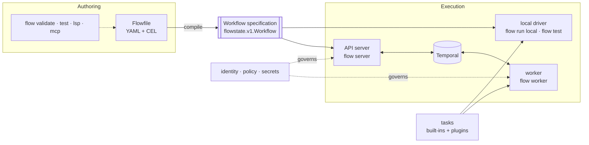

# How Flowstate works

Flowstate runs workloads that have to finish correctly even when processes
crash, networks fail, and steps wait for hours or days: releases that need an
approval, provisioning that must be undone if a later step fails, operational
runbooks, data pipelines, and integrations that coordinate several systems. You
describe the workload in a Flowfile. Flowstate checks it, compiles it into a
typed specification, and runs that specification either on your machine or
durably on [Temporal](https://temporal.io/), under policy about who may start
it, who may answer it, what it may reach, and which secrets it may use.

This page explains the building blocks and how they connect. It assumes you have
seen a Flowfile; [Get started](GETTING_STARTED.md) is the quickest way to see one.

## The pieces

- **A Flowfile** is the workflow as you write it: YAML for structure, and
  expressions in [CEL](https://cel.dev/) for data and conditions.
- **The workflow specification** is what a Flowfile compiles to: a
  `flowstate.v1.Workflow` protobuf message. It is what runs, what the server
  stores, and what a run carries through its whole life. YAML is one way to
  produce it.
- **Two drivers** execute a specification through the same step executor. The
  local driver runs it in one process, for rehearsal and tests. The durable
  driver runs it on Temporal, where every step is recorded and the run survives
  any process stopping.
- **The API server** (`flow server`) authenticates callers, checks what they
  submit, and starts, signals, lists, and stops runs through Temporal.
- **Workers** (`flow worker`) poll Temporal and execute runs. Tasks run here,
  and so do secret resolution and outbound policy.
- **Tasks** are where work happens: the built-in `log`, `http` and `exec` (denied until an operator policy enables it), and tasks
  that plugins add.
- **Policy** decides who may start a run, who may answer its waits, which
  network destinations a task may reach, and which secrets it may resolve.

One `flow` binary contains all of these. The same file moves from your laptop
to a shared deployment without being rewritten.

## Workflows, runs, and steps

A **workflow** is the definition. A **run** is one execution of it, identified
by a workflow id and a run id. `flow run` prints the workflow id; every other
command addresses a run by it.

A workflow is a list of **steps**. Each step has an `id` and does one thing,
named by its key:

| The step... | Keys |
| --- | --- |
| does work through a task | `log:`, `http:`, `<plugin>.<task>:` |
| computes a value | `value:` |
| chooses or repeats | `switch:`, `for_each:`, `parallel:`, `loop:` |
| runs another workflow | `call:` |
| waits | `sleep:`, `wait_until:`, `wait_for_signal:`, `wait_for_signals:` |

Any step can also carry `if:` to run conditionally, `vars:` for named values,
and `continue_on_error:` to tolerate failure. A task step can also carry
`retry:` and `timeout:` to bound its work, and `undo:` to compensate if the run
fails later.

A workflow declares typed `inputs:` (its arguments) and `outputs:` (its
result). `vars:` holds named constants. Everything a step produces is recorded
under its id.

## Values, expressions, and data flow

A step reads what it needs through expressions. `${inputs.version}` reads an
argument; `${steps.plan.value}` reads the output of the step called `plan`.
A reference to an earlier step is also a dependency: steps run in the order
written, and a step can only read steps that come before it.

Expressions are CEL: typed, side-effect free, and bounded in cost. An
expression cannot read the network, the filesystem, or the clock (except
through `now`, which exists only inside waits and is replayed consistently).
That is what makes a workflow safe to replay: its decisions are functions of
its inputs and of what its tasks returned, both recorded in history. Anything
with an effect is a task, and a task runs as a Temporal activity.

A value flows between steps as a typed protobuf `Value`: a string, number,
boolean, list, map, timestamp, or duration. A secret is different: it appears in
the specification only as a reference, `${secret('env:API_TOKEN')}`, and is
resolved on the worker, inside the task that uses it. The value never enters a
run's history.

[The Flowfile language](LANGUAGE.md) covers every construct.

## Waiting and signals

A run can wait for time (`sleep:`, `wait_until:`) or for an event
(`wait_for_signal:`). On the durable driver, a wait is state in Temporal, not a
thread or process: workers can be restarted or replaced while a run waits for a
week.

A **signal** is a named message with a JSON payload, sent to a run with
`flow signal` or the `Signal` RPC. A waiting step receives it as
`${steps.<id>.payload}`, along with who sent it. A signal that arrives before its
step is reached is held for it. A workflow's `signals:` block says who may send
each signal, and the server checks the sender's authenticated identity before
Temporal sees it. That is how an approval gate knows its answer came from
someone allowed to give it.

A wait with a `timeout:` does not fail when the timeout lapses. It reports
`timed_out: true`, and the workflow decides what that means.

## Failure

Each task attempt either succeeds or fails with a classified error. Retryable
failures are retried under the step's `retry:` policy (tasks have defaults).
`timeout:` bounds each attempt and `total_timeout:` bounds all of them together. A request whose effect is unknown, such as a `POST` that
timed out, is not retried unless the step says the endpoint is idempotent.

A failed step fails the run, unless the step has `continue_on_error: true`, in
which case its error becomes a value later steps can read. When a run fails or
is cancelled, the `undo:` actions of the steps that had succeeded run in reverse
order: saga compensation. `flow cancel` lets that cleanup happen;
`flow terminate` stops the run at once and runs none of it.

## How runs start

- **By hand:** `flow run`, or the `Run` RPC. A workflow's `triggers.manual:` can
  require a reason, restrict who may start it, or refuse manual starts.
- **On a schedule:** a workflow declares a cadence under `triggers:`, and
  `flow schedule create` turns it into a Temporal Schedule. Declaring it starts
  nothing.
- **From a webhook:** `flow server --webhook` receives signed deliveries, maps
  their payload to the workflow's inputs, and starts a run, deduplicated by an
  idempotency key. A webhook can also answer a waiting run instead of starting
  one.

`concurrency:` can hold a workflow to one run at a time per key, such as one
drain per cluster. Inside a run, `trigger.*` says how it started.

## Local and durable

The local and durable drivers execute the same specification through the same
step executor, and a shared conformance suite runs every case through both.
What differs is what surrounds them:

| | `flow test` | `flow run local` | `flow run` (durable) |
| --- | --- | --- | --- |
| Tasks | Stubbed | Real | Real, on a worker |
| Clock | Virtual | Real | Real, recorded |
| Signals | Scripted in the case | Given up front with `--signal` | Sent any time with `flow signal` |
| Survives a crash | — | No | Yes |
| Caller authentication | No | No; `--as-subject` rehearses an identity | Yes |
| Needs | Nothing | Nothing | A server, a worker, and Temporal |

A local run proves expressions, branching, retries, timeouts, compensation, and
what real tasks do under local policy. It does not prove persisted history,
recovery, server-side authentication and authorization, or version upgrades in
the middle of a run. [Architecture](ARCHITECTURE.md#execution-model) states the
boundary exactly.

## Identity, policy, and secrets

Every durable run records who started it: an identity the server verified from
the caller's token, including the caller's **tenant** (namespace). A Flowfile
cannot claim a tenant; it comes only from authentication.

Policy is enforced where the action happens. Once a rule is configured, an error
while evaluating it denies. What a check does when **nothing** is configured
differs, and the last column says, because several allow by default.

| Question | Answered by | Configured in | With nothing configured |
| --- | --- | --- | --- |
| May this caller use the API at all, and for which actions? | The server, on every RPC | The deployment's trust policy: which token issuers are trusted, and an optional per-issuer `actions:` list such as `workload.run` or `workload.read` | A server refuses to start without a trust policy, unless told `--insecure-no-auth`. An issuer with no `actions:` list may use every RPC action; `workload.reveal_sensitive` and the codec server's `payload.decode` and `payload.encode` are granted only when listed. |
| May this caller start this workflow? | The server, at `Run` | The workflow's `triggers.manual:` | Any authenticated caller in the workflow's tenant. |
| May this caller send this signal? | The server, at `Signal` | The workflow's `signals:` block | Any authenticated caller in the run's tenant. |
| May this caller debug a durable run? | The server, at the debug RPCs and at `Signal` on the reserved debug channel | The workflow's `debug:` block, beside the `workload.debug` and `workload.debug_inspect` actions | Nobody. |
| May this task reach this host? | The worker, as the connection is made | The deployment's egress policy, with CEL rules | Internal and loopback addresses are refused; public ones are allowed. |
| May this identity dispatch this task? | The worker, before each attempt | The deployment's task policy, in CEL | Every task is allowed. |
| May this step read this secret? | The worker, before the provider is asked | The trust policy's `secrets:` rules, in CEL | Nothing may be read. |
| May this step mint a federated credential? | The worker, before the exchange | The trust policy's `federation:` rules, in CEL | Any configured target. Write an `allow:` rule for each. |

Some policy lives in the workflow, because the author knows who should approve a
release. The rest lives in the deployment, because an operator decides what a
workload may reach, whoever wrote it. [Secrets and credentials](SECRETS.md)
covers the secret side, including short-lived credentials minted per request;
[Deployment](DEPLOYMENT.md) covers configuration and tenant isolation.

## Extending and integrating

| To... | Use |
| --- | --- |
| Add a task or a secret provider, in any language | A [plugin](PLUGINS.md): a separate executable the worker launches, speaking a typed protocol. First-party plugins cover Docker, Git, GitHub, JOSE, OCI, OIDC, SCIM, Slack, SQL, SSH, VCS, and Codex. |
| Run workflows inside your own Go program | [Embedding](EMBEDDING.md) with `pkg/flowstate/embed`, including Go functions as tasks. |
| Start and manage runs from another system | The [control-plane API](API.md), from any language. |
| Let an AI agent author and operate workflows | [`flow mcp`](MCP.md). |
| Get diagnostics and completion while editing | [`flow lsp`](EDITORS.md). |

## If you know GitHub Actions

The YAML will look familiar, and several ideas carry over directly. The
difference is what a run is: a GitHub Actions job is a process that holds a
runner for as long as it works, while a Flowstate run is durable state that can
wait for days without holding anything.

| GitHub Actions | Flowstate |
| --- | --- |
| `on:` | `triggers:` (`schedule`, `webhook`, `manual`), plus `flow run` |
| `jobs.<id>.steps` | `steps:` |
| `uses: some/action` with `with:` | A task key, `http:` or `slack.post:`, with its inputs beneath it |
| `run:` a shell script | No built-in shell step. Use a task or plugin (`ssh.run`, `docker.run`) or write one. |
| `${{ expression }}` | `${expression}`, in CEL |
| `needs:` | A reference: reading `${steps.build.value}` orders the step after `build` |
| `if:` | `if:` |
| `strategy.matrix` | `for_each:` over a list the workflow computes |
| `continue-on-error`, `timeout-minutes` | `continue_on_error:`, and `total_timeout:` for the whole step (`timeout:` bounds one attempt) |
| `secrets.TOKEN` | `${secret('env:TOKEN')}`, resolved on the worker under policy |
| An environment's required reviewers | `wait_for_signal:` with a `signals:` policy naming who may approve |
| Reusable workflows | `call:` |
| Job `outputs` | `outputs:` |
| Artifacts and caches | None; pass values between steps, or store data in the systems your tasks call |

GitHub Actions is still where builds and tests belong. Flowstate fits around
them: a job can start a run with `flow run --detach` using the job's own OIDC
token (`--credential-source github-actions`), and the run can wait for an
approval, roll a release out in stages, and undo it if a stage fails, long after
the job has finished.

## If you know Temporal

Flowstate is built on Temporal and adds a declarative layer and a governance
layer on top.

**What Temporal supplies:** durable execution, history and replay, activity
retries and timeouts, durable timers, signals, queries, Continue-As-New,
schedules, cancellation, visibility, and Worker Deployment Versioning.

**What Flowstate adds:** a language whose programs cannot break determinism (no
clock reads, randomness, or I/O outside activities, by construction); typed
task contracts; validation, formatting, testing on a virtual clock, and a step
debugger; authenticated callers and signal senders; CEL policy for egress, task
use, and secrets; worker-side secret resolution; and tenancy.

**Where the two meet:**

- Every run is the same Temporal workflow type, `Run`: an interpreter that
  receives the compiled specification as its argument. Temporal's per-type
  views see one type for the whole fleet; a run's own name is in its memo, and
  can be projected into the `FlowstateWorkflowName` search attribute.
- Each task invocation is an activity. Waits are Temporal timers and signals.
  Run status and open gates are served through queries.
- Runs go to the `flowstate-run-task-queue` task queue, or to a queue per tenant
  with `--task-queue-prefix`.
- Continue-As-New happens automatically as history grows, carrying only the
  state later steps need.
- Workers are versioned with Worker Deployment Versioning: a run finishes on
  the interpreter build it started on and moves to the current one at
  Continue-As-New.
- `call:` runs the called workflow inside the caller's own history rather than
  as a child workflow.
- Temporal Updates and Nexus are not used yet.

Anyone with direct access to a Temporal namespace can read every run's history
in it, whatever Flowstate's own API allows. [Deployment](DEPLOYMENT.md#read-this-before-you-share-a-temporal-namespace)
explains when tenants need separate namespaces.
[Architecture](ARCHITECTURE.md#leaning-into-temporal) maps each Temporal
primitive to its Flowstate surface.

## Where Flowstate is going

Flowstate is early software: the capabilities on this page are shipped, but the
interfaces are not yet stable. [Vision](VISION.md) records directions the
project intends to take, such as fetchable plugins, consuming MCP servers as
capabilities, and chat-based approvals. Those are intentions, not commitments,
and nothing there is available until it appears in the pages above.

## Next steps

- [Get started](GETTING_STARTED.md): write, test, and run a workflow.
- [The Flowfile language](LANGUAGE.md): every construct in detail.
- [Examples](../examples/README.md): tested workflows for each feature.
- [Architecture](ARCHITECTURE.md): the invariants and design decisions behind
  all of the above.
