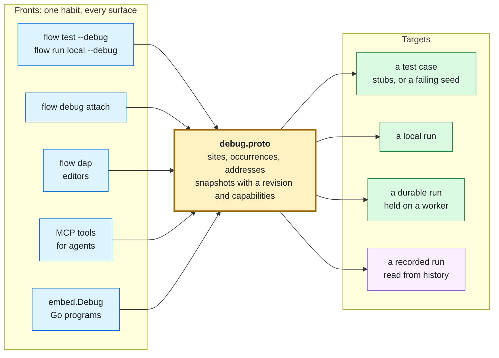
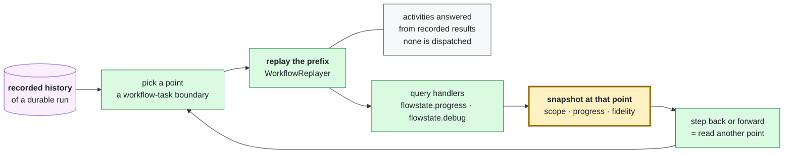

# Debugging a workflow

A failing test tells you *that* something is wrong. This tells you *why*.

`flow test` answers with a verdict — `expected step "discount" to have run` — and
that is the right answer for a suite. It is the wrong answer for the next five
minutes, when what you need is the value the condition actually saw. The
debugger holds the run at a step boundary so you can ask.

One debugger, several ways in. Every front speaks the same model — the typed
contract in `proto/flowstate/v1/debug.proto` — so a habit learned at one carries
to the others:

| You are | Reach for | What it drives |
| --- | --- | --- |
| a person, debugging a test case | `flow test --debug --run '<case>' <file>` | [a screen](#the-default-is-a-full-screen-debugger) at a terminal, a prompt elsewhere, over a stubbed run |
| a person, opening a failing simulation | `flow test --seed <N> --debug --run '<case>' <file>` | the seeded run itself, faults and order included |
| a person, debugging a real local run | `flow run local --debug <workflow>` | the same screen, over a real run |
| a person, debugging a durable run | `flow debug attach <workflow-id>` | the same commands, over a run on a worker |
| an editor | [`flow dap`](EDITORS.md#stepping-a-run-flow-dap), launch or attach | a local run, or a durable one |
| an agent | the `flowstate_debug` tool, or the `flowstate_debug_session_*` tools | a scripted session, or one retained across calls |
| a Go program | [`embed.Debug`](EMBEDDING.md#debugging-an-embedded-run) | a local run, in process |



## The default is a full-screen debugger

At a terminal, `flow debug attach`, `flow run local --debug` (with or without
`--reverse`) and `flow test --debug` open a full-screen debugger: the flow, the
source, the steps, the scope and a console, driven by keys and the mouse. It is
the same session as the prompt described under [The prompt](#the-prompt) and the
same commands: a key, a click and a line typed at the console are one call with
one answer and one refusal, and the screen draws only what the run answers, so a
value the run withholds is withheld there too. The keys are listed under
[the full-screen debugger](#the-full-screen-debugger), and `?` on the screen
shows them.

It opens when stdin and stdout are both terminals of at least 60 columns by 12
rows, `TERM` is not `dumb` and `CI` is not set. `--tui=false` opts out and keeps
the line editor on a terminal:

```console
$ flow run local --debug workflow.yaml             # the screen, at a terminal
$ flow run local --debug workflow.yaml --tui=false # the line editor
```

**Machine output is untouched.** Everywhere the screen cannot or should not be
drawn, the debugger is exactly the front it was before the screen existed, byte
for byte on stdout and stderr, and it says nothing about the screen: a
`--script`, a piped stdin or stdout (`flow test --debug < script.txt`, `flow run
local --debug | jq`), a machine `-o json` or `-o jsonl`, a CI environment, and
`TERM=dumb`. That is what lets a recorded session replay, an agent drive it and a
pipeline read its answer. `--tui` spelled out is the one request that is
answered: where it cannot be honoured it is declined with one sentence on
stderr (`flow: --tui is not used: stdin is not a terminal; using the line
editor`) and the command carries on without it, so a script that gains the flag
keeps its output. A `CI` environment declines the default, not a request someone
typed.

Over a run in this process the screen owns the terminal for as long as the run is
held, so what the run says in that time (its `log:` steps and narration) is kept
and printed on stderr when the screen closes, and the run's answer follows on
stdout as it always does. How you leave decides what happens to the run, as at
the prompt: `q` or `detach` lets it finish unattended, `ctrl+d` leaves and does
the same, and `ctrl+c` ends it as `quit` does. A run that cannot step back has no
key for `back` or `reverse-continue`; `--reverse` gives it one that works. `--record`
writes the commands the screen sent, up to a line breakpoint (which has no line a
script could replay) or, outside `--reverse`, a step back.

In the live view of `flow watch`, `d` hands the terminal to `flow debug attach
<workflow-id> --run-id <run-id>` for the run being watched, with the server flags
the watch was given, and returns to the watch when the debugger ends; the footer
shows the key.

The screen shows source lines for a durable attach given `--program`; over a
local run it names steps by address. The line editor below is what you get with
`--tui=false` and wherever the screen is not used.

To try it, step through a loop yourself, or replay a recorded session over the
same file:

```console
$ flow run local --debug examples/loop-accumulate/workflow.yaml
$ flow debug replay examples/loop-accumulate/debug.script examples/loop-accumulate/workflow.yaml
```

Add `--record session.script` to `flow run local --debug` or `flow test --debug` and the
commands the session accepted are written to that file when it ends (end of run, `quit` or an
error): a mistyped command or a refused `break` is not in it, the file
is made readable by you alone, and `flow debug replay` reaches the same stops from it. `flow debug attach --record` does the same for an attached durable run (without the `detach` that leaves it); a durable session's lines replay only where the verbs exist on a local run.
A `flow test --debug` or `flow debug attach` session that steps back is recorded up to its first `back`, with a comment saying so: those replay forward only, so what followed would reach other stops. `flow run local --reverse` keeps the `back` and replays with `flow debug replay --reverse`.

[examples/debugging](../examples/debugging) walks one small workflow — a loop, a
parallel block and a call — through every front, local and durable.

`flow test --debug` steps through exactly one case in one test file; `--run`
selects it when the file holds more than one.

A violation `flow test --seeds N` finds names its seed (`flow test --seed 7 --
<file>`). Add `--debug` to that command and the session holds the seed's own run:
the faults the seed injects fire where it drew them, in the order it chose, so
the stop at the step a fault fails is the failure the search found, not a
rehearsal of it. A `delay:` fault holds its call on the virtual clock, so stepping
over a slow call costs no wall time and the next stop shows the later virtual
time. The written-order baseline an exploration runs first goes
unheld, and `--seeds` with `--debug` is refused, since many runs are not one to
step through. The seeded run is local and is not a recorded history, so there is
nothing to step back through yet.

Local and durable sessions answer the same questions, but a durable run can be
held at fewer places, for a bounded time, by a caller its workflow names. The
architecture's [driver parity boundary](ARCHITECTURE.md#execution-model) names
what a local run proves and what still needs a durable one;
[Debugging a durable run](#debugging-a-durable-run) says what differs.

## One model: sites, occurrences, addresses

A **site** is a place in the compiled program: the workflow that declares a step
and the chain of step ids from that workflow's top level down to it. A step id is
unique within a visibility domain rather than within a file — two sibling loops
may each have a body step called `page` — so the chain, not the last id, is what
names one site.

An **occurrence** is one arrival at a site. The same site reached in the third
iteration of a loop, in the second branch of a `parallel:`, or through a second
`call:` is a different occurrence. Its **address** is the text form, and it is
what the debugger prints and what you type:

| Address | Means |
| --- | --- |
| `pages[2]/page` | the step `page` in iteration 2 of the loop `pages` |
| `checks#1/check_quota` | the step in branch 1 of the parallel `checks` |
| `route?0/chosen` | the step in case 0 of the switch `route` |
| `fan_out(child)/greet` | the step `greet` in the workflow `child` that the call `fan_out` ran |

Indexes count from zero. A breakpoint or `until` target is the same grammar with
every qualifier optional, matched against the *end* of an address: `page` arms
every `page`, a caller's and a callee's alike; `pages/page` arms the `page` in
`pages`; `pages[2]/page` arms that one iteration's. A target never guesses
between two sites — anything longer than a bare id narrows it.

Each stop is a **snapshot**: the run's state (running, pause requested, held,
completed, failed, expired, detached), why it is held (entry, step, breakpoint,
pause, failure, until, or autopsy for a finished test case), the occurrence, its frames innermost first — the step, then each
iteration, branch, arm or call around it — and the session's breakpoints with
their hit counts. A snapshot carries a **revision** that increases on every
change and is never reused, so a question asked about one stop is refused, not
answered, once the run has moved on. A snapshot also carries the backend's
**capabilities**; a front advertises only what they say and refuses the rest by
name.

Every front names a stop by its address, so a stop inside a loop, branch or call
says which iteration, branch or arrival it is: the console prompt prints `break
at orders[1]/charge (task "log")`. The prompt's `backtrace` and the structured
fronts — `flow debug attach` and `do`, the MCP session tools, and Go — list the
same frames, numbered the same way, and `flow dap` shows them as its call
stack:

```text
held at orders[1]/charge (task "log") — breakpoint orders/charge, revision 6
  #1 batch.charge (task "log")
  #2 batch.orders [iteration 1]
```

## The commands

The vocabulary is the one a debugger has had since `dbx`, which is the point —
nothing here is worth learning twice. `help` lists it.

<!-- commands:start -->

| Command | Where | What it does |
| --- | --- | --- |
| `step`, `s` | prompt, driver | run this step and stop at the next (also: an empty line) |
| `next`, `n` | prompt, driver | run this step, including anything inside it, and stop at the next step at this level or above |
| `finish`, `fin`, `out` | prompt, driver | run until the loop, parallel, switch, or call around this step is left |
| `continue`, `c` | prompt, driver | run until the next breakpoint, or to the end |
| `until <step-id> [if <expr>]`, `u` | prompt, driver | run until the step with that id, optionally only where the condition holds |
| `back` | prompt, driver | return to the previous stop (a session that can step back) |
| `reverse-continue`, `rc` | prompt, driver | return to the nearest earlier breakpoint stop, or the first |
| `goto <point>` | driver | go to a point of the timeline, counted from 0, in one move (a session that can travel) |
| `pause` | driver | hold at the next step boundary |
| `break <step-id> [hit <count>] [if <expr>]`, `b` | prompt, driver | stop at that step, always, when the expression holds, or from the given arrival count |
| `log <step-id> <message>` | prompt, driver | record the message at every arrival without stopping; {expr} holes are CEL |
| `catch none\|uncaught\|all` | prompt, driver | stop where a step fails: never, when its failure propagates, or always |
| `delete <step-id>`, `d` | prompt, driver | remove that breakpoint |
| `clear` | driver | remove every breakpoint, whoever set it |
| `breakpoints` | prompt, driver | list them |
| `inspect <expr>`, `p` | every front | evaluate a CEL expression against this run's scope |
| `expand <expr> [from <n>]` | prompt, driver | list a map's or list's children |
| `scope` | every front | list what this run can name right now |
| `complete <partial-command>` | every front | list what could be written at the end of that text |
| `status` | prompt, driver | where the run is, and why |
| `info`, `step-info` | prompt | describe the step the run is stopped at |
| `backtrace`, `bt` | prompt, driver | list this step and each iteration, branch, arm and call around it |
| `detach` | prompt, driver | clear every breakpoint and let the run finish unattended |
| `quit`, `q` | prompt, autopsy | end the run here |
| `help`, `h`, `?` | every front | list these |
<!-- commands:end -->

The table is generated from the command table every front reads, so a verb is
answered on exactly the fronts it lists and the help of the prompt and of the
structured fronts is rendered from it. The structured fronts — `flow debug
attach` and `do`, the MCP session tools, and `embed`'s `Driver` — read the same
lines as the prompt, less the prompt's own `complete`, `info` and `quit`, plus
the commands marked `driver`. A verb typed on a front that does not answer it is
refused by name, with what to type instead, and is never "unknown command".

The forms a verb takes:

- `until <step>` runs to that step without stopping in between; a run that
  completes without reaching it says so, local or durable. A `<step>` is a bare
  id or an address like `pages[2]/page`.
- `expand <expr>` lists a map's or list's children, one level, a page at a time.
  A page that was cut off ends with `… and N more` and the way to ask for the
  rest: `expand <expr> from <n>` starts the page at child `n`, at the prompt and
  over MCP alike.
- `until <step> if <expr>` runs to that step, stopping only where the expression
  holds. The structured fronts do not take it: a typed resume names a step and
  nothing more, so the condition is refused rather than dropped, and
  `break <step> if <expr>` with `continue` says the same thing there.
- `break <step> if <expr>` stops there only when the expression holds, and
  `break <step> hit <count>` from the given arrival on; `hit == 3`, `hit > 3`,
  `hit % 5` and the rest filter by count.
- `pause` holds a running run at its next boundary; a run that completes before
  reaching one says so. `back` and `reverse-continue` (`rc`) return to the
  previous stop and to the nearest earlier breakpoint stop, for a target that can
  step back; any other says so and does not move. `flow test --debug` at a
  terminal steps back too (a stubbed case, as under `flow dap`); `flow run
  local --debug` steps back only with `--reverse` (below), and a script's
  session stays forward-only. A failed case is held once more after its verdict,
  and `back` from there returns to its last stop.
- `goto <point>` goes to a point on the snapshot's `timeline` (the stops the
  session showed, counted from 0, with `current` the one it is at) in one move,
  for a target that can: a stubbed or `--reverse` run replays once to the stop,
  however far back it is, and a recorded history reads the point in either
  direction. A replay that does not reproduce the stop answers `diverged`, moves
  nothing, and the point is not `reachable` afterwards; any other target says it
  cannot go to a point. Forward travel on a live run is still `until`.
- An empty line at the prompt is `step`.

A condition is the step's own `if:`, evaluated where the breakpoint is: the
same function, the same scope, and the same refusal of anything that is not a
boolean. So inside a `for_each` the loop's binding is in scope —
`break charge if item.amount > 500` stops at the one iteration you care about
instead of all ten thousand — and a condition cannot mean something different
here than it would written on the step.

It is compiled when you type it, not at each arrival: a malformed expression is
refused there and then, with nothing set, and so is one that cannot type-check
or is not a boolean. A breakpoint accepted broken looks armed and never fires,
which is a failure with no symptom.

A condition that reads a name nothing can bind where the breakpoint fires is
refused too. A condition reads what the step's `if:` reads: `steps`, `inputs`,
`vars`, `run` and `trigger`, and the bare names the loops and steps around it
bind (a `for_each`'s `as:`, a `loop:`'s state, an enclosing step's `vars:`). It
can read those before the run reaches them, so a condition on a loop's binding,
typed at the first step before the loop has run, is armed. A name bound nowhere,
or bound only inside a loop the step is not in, is refused on every front, local
and durable, and a misspelling gets a near name suggested. Against
`examples/debugging`, whose `orders` loop binds `amount`:

```text
debug> break receipt if amount > 500
break receipt: `amount` is bound only inside the loops and steps that declare it, and this breakpoint fires outside them; a condition reads what the step's `if:` reads: `steps`, `vars`, `inputs`, `run`, `trigger`
debug> break charge if amont > 500
break charge: `amont` is not bound where this breakpoint fires; a condition reads what the step's `if:` reads: `steps`, `vars`, `inputs`, `run`, `trigger`, and here `amount`; did you mean `amount`?
```

A program too large to list every step of (past 65,536 sites) cannot say where
a step past the cut fires. Its condition is armed unchecked, and the breakpoint
says so.

A condition that cannot be *evaluated* at some arrival does not hold the run
there, and says so once. That case is ordinary rather than exceptional: a step
id is unique within a visibility domain rather than within a file, so two
sibling loops may each have a body step called `page`, and a condition written
about one of them cannot be answered in the other. Not holding the run is what
keeps `break page if total == 3` from parking you in the loop you were not
debugging — and the notice is what keeps a condition that can never be answered
from looking like one whose answer was always no.

A hit count counts the arrivals whose condition held, so
`break charge hit 2 if amount > 500` stops at the second large order, not the
second order. A bare number means from that arrival on; `==`, `>`, `>=`, `<`,
`<=` and `%` (every Nth) say otherwise.

A logpoint never stops the run. Its message is recorded as an observation at
each arrival, with each `{expr}` replaced by that expression's rendered value,
through the session's redaction:

```text
debug> log orders/charge charging {amount} of {size(inputs.amounts)}
logpoint at orders/charge
debug> continue
log orders[0]/charge: charging 120 of 3
log orders[1]/charge: charging 900 of 3
```

A step whose `if:` is false is never a boundary, so a breakpoint on it does
not stop. The session says why instead, on every front and on both drivers, by
quoting the condition that decided:

```text
discount skipped: `if: steps.price.value > 5000` was false
```

The quote comes from the evaluation that made the decision, and nothing is
evaluated again to produce it; `inspect` at the next stop is how you find which
operand made it false. An `if:` that raises an error instead of answering fails
its step, and the step list and observations show that step as failed rather
than as one the run never reached.

A step that finished says what it produced, in the same words on both drivers
(up to each one's bound on an observation, which cuts a very long output at a
different length) and whether or not the run was ever held at it:

```text
price -> value: 4000
charge completed
```

The values are the step's recorded outputs, not a second evaluation. What a
hold at that step would withhold of `inspect` is withheld here: a workflow's
`sensitive:` inputs, what a callee declares sensitive, and what a call handed
back, by value and by text, before the account is bounded.

`catch uncaught` stops at a step whose failure its own step does not tolerate
with `continue_on_error:`, after the failure is recorded and before it
propagates; `catch all` stops at tolerated failures too. A container that
tolerates the failure further out is not consulted, so such a stop may precede a
run that goes on.

Over MCP this is the difference between reachable and not. A script is bounded
at a hundred commands, so `break charge if item.id == "x"` then `continue` is
two commands where stepping to the five-thousandth iteration is impossible.

`complete` is the tab key made into a command, and it exists because a terminal
has a key for this and nothing else does. Without it the completion below is
reachable only by a person with a keyboard, while a scripted session — the
`flowstate_debug` tool's whole shape — could not ask at all. It answers like
`inspect`: a question about where the run is standing, which does not move it.

```text
debug> complete inspect steps.
build   a step that has run
test    a step that has run
```

## The prompt

With `--tui=false`, and wherever the [full-screen debugger](#the-default-is-a-full-screen-debugger)
is not used, `debug>` at a terminal is a real prompt rather than a reader: **tab completes**,
the editing keys work (ctrl-a, ctrl-e, ctrl-w, ctrl-u, ctrl-k, the arrows), and
up and down walk the commands you have already typed in this session.

Tab completes over the *paused run's own scope*, which is the point:

```text
debug> inspect <TAB>
steps.        step outputs
vars.         workflow variables
inputs.       run inputs
…             the profile's functions
debug> inspect steps.<TAB>
build   a step that has run
price   a step that has run
debug> inspect steps.price.<TAB>
value   an output this step produced
```

An editor can only offer what a task *declares*. A paused run knows which steps
have actually produced outputs and what those outputs are actually called — so
`steps.price.<TAB>` after a shaping expression offers the names the run
produced, not the ones the task's schema names. The rules for where each name
may be written are the language server's own, shared, so `steps.<id>.<output>`
means one thing in both places.

Tab also completes the commands, and the step ids `break`, `until` and `delete`
take — `break` over every step the workflow declares, including the ones inside
a `for_each` body, because a breakpoint is for somewhere the run has not been.

**A completion is a name and never a value.** No preview, no type, no length:
a debugger's printing is behind the same redaction as everything else here (see
*Sensitive values* below), and a popup that showed you what a name held would be
a second door around it. Where a case's redaction would withhold a *name*, the
offer is dropped rather than shown redacted.

**ctrl-C ends the run**, exactly as `quit` does — a run abandoned at a
breakpoint did not pass. **ctrl-D** leaves the debugger and lets the run finish
unattended, which the session says out loud when it happens.

None of this applies when stdin is not a terminal. `flow test --debug <
script.txt` and the `flowstate_debug` tool read the same commands the same way
they always did; the line editor is attached only where somebody is actually
typing.

**A value is one line when it fits and a tree when it does not.** `inspect`
answers a scalar or a small record as the compact JSON it always has, and a
value wider than a line (100 characters) as a tree: a map one sorted key per
line, a list one indexed item per line, strings quoted and escaped so a control
character in data cannot reach the terminal as itself. Three levels are opened
and 48 entries of a container written; what is left out is said in place
(`… 12 more keys`, `… 4000 more items`, `{… 7 keys}`), and how much is
counted depends on the shape of the value and never on what a cut string held.
The tree is laid out after the redaction, from the same redacted value, so a
withheld leaf is the marker it always was. The layout does not depend on a
terminal: a script piped to the prompt gets the same tree. The JSON answers (`-o json`, MCP, DAP) are unchanged.

At a terminal the value is also coloured by what each part is: keys and `…` elisions
recede, numbers and `true`/`false`/`null` take the accent, and the `[redacted]`
marker takes the warning style so it is easy to find (a string that spells the marker is indistinguishable from one the redactor wrote, in colour or without). Strings keep the base
style, and the colour never changes a byte: with `NO_COLOR` or a pipe the text is
identical. The MCP transcript labels these fragments with the tone `value`.

## What `inspect` answers

`inspect` is the reason to stop at all. It is the *engine's own* evaluator over
the run's own activation, so it can name exactly what the file could name at
that point — `steps.<id>.<output>`, `inputs`, `vars`, a loop's binding, `now`
inside a wait — and it is cost-bounded ([`DefaultCostLimit`]) like every
expression in the file. It cannot resolve a secret: `secret(...)` is compiled
into a reference when a workflow is built and is never a function anything
calls, so there is nothing there to call.

## The autopsy

A case that fails is held open once more *after* the verdict, with the failures
printed and the finished run still questionable. This is where most debugging
actually happens: you do not know which step to break on until you know which
expectation broke.

```text
autopsy: the case failed 1 expectation(s); the run is over, but its scope is still here
  expect.ran: expected step "discount" to have run, but it produced no recorded outputs
(`inspect` questions the finished run; `quit` or `continue` leaves — the verdict is already in)
debug> inspect steps.price.value
4000
debug> inspect steps.price.value > 5000
false
```

At the autopsy the bindings a failing `expect.check:` was judged under are in
scope too — the file's `vars`, and a `run` root carrying `failed` and `error` —
so a claim that failed can be taken apart with the same names it was written
with. `scope` lists them, and `complete` answers here as well:

```text
debug> complete inspect run.
error    bound for this autopsy
failed   bound for this autopsy
```

which matters more here than anywhere else, since these are the only bindings
a check was ever judged under and the only place they can still be read.

**The verdict is already in, and nothing here can change it.** The autopsy runs
after the expectations are judged, so a debugged run cannot be argued into
passing. `quit` is the one exception in the other direction: abandoning a run is
a verdict, and a case whose run was abandoned did not pass. A command with
nothing left to act on — `break`, `backtrace`, `info` — says so rather than
reading as a typo.

## Driving it as an agent

MCP has no console, so the session takes a **script** instead — which works
because the session reads its commands as a stream, the same property that makes
a session replayable.

```json
{
  "workflow": "edition: v2026.4\nname: checkout\n...",
  "tests": "tests:\n  - name: a big cart gets the discount\n    ...",
  "commands": ["step", "step", "inspect steps.price.value", "inspect steps.price.value > 5000", "continue"]
}
```

The answer carries three things: the `session` transcript (each fragment with
the `tone` a terminal would have coloured it — `break`, `warning`, `danger`, `value`), the
`script` the session accepted, and the `report` — the ordinary `flow test`
verdict, because a debugged run is the run.

```text
[break  ] break at price (value)
[info   ]   price -> value: 4000
[info   ]   discount skipped: `if: steps.price.value > 5000` was false
[break  ] break at charge (task "log")
[info   ]   charge completed
[break  ] autopsy: the case failed 1 expectation(s); the run is over, but its scope is still here
[danger ]   expect.ran: expected step "discount" to have run, but it produced no recorded outputs
[info   ] 4000
[info   ] false
```

Five commands, and the bug is in hand: the cart total is 40, the price step
multiplies by 100, and the threshold is 5000.

Two properties worth knowing before you write a script.

**A script that runs out is not a hang.** The session resumes and the run
finishes, saying so (`no more commands — continuing to the end of the run`).
That is what makes a scripted session safe on a surface with no console — and it
means a script of pure `inspect` commands is a legitimate thing to send.

**`script` is the input to the next call.** Re-send it with more commands
appended and you get the same session, further along. There is no session handle
to keep alive, and nothing to leak if you never call again.

The tool debugs a *test case* — stubs, no egress, no secret resolved, a virtual
clock — which is why it needs no operator opt-in. Debugging a real, unstubbed
local run is `flow run local --debug`, at a terminal, under that command's own
egress policy.

### Stepping back through a real local run

`flow run local --debug --reverse` makes `back` and `reverse-continue` work at
the terminal prompt of a real run. Going back runs the workflow again from its
start and replays your commands up to the earlier stop, so **every task runs
again**; the replay says nothing until it replaces the run before it, and a stop
it reaches must show what the first time showed or the step is refused.

Because that re-executes effects, `--reverse` is refused for a workflow with a
task that may act outside the process, or a `wait:` step that would be waited
for again. Only `log` is known not to act outside; a plugin, `http` and `exec`
are not, nor is a task not named here. `--reverse=unsafe` (with the equals sign; `--reverse unsafe` is a positional argument) takes
the risk and prints a warning. It also needs `--debug`, and is refused with
`--signal`, which is delivered once.

Without a terminal it reads the commands from stdin, so a script can step back,
and `--record` keeps the `back` in it. `flow debug replay script workflow
--reverse` plays such a script to the same stops; without `--reverse` a replay
refuses a script that steps back, naming the command.

### A session that outlives the call

A script is right when you know the questions in advance. When the next command
depends on the last answer, `flow mcp` over stdio keeps a session open across
calls instead:

| Tool | What it does |
| --- | --- |
| `flowstate_debug_session_start` | start a session over one test case — the same stubbed run `flowstate_debug` uses — held at its first step |
| `flowstate_debug_session_attach` | attach to a durable run on the configured server; `session_id` rejoins one; `history` with `run_id` walks the run's record instead ([below](#a-recorded-run-over-mcp)) |
| `flowstate_debug_session_command` | run one command line and answer with the typed result: the receipt, the next stop's snapshot, or an inspection |
| `flowstate_debug_session_observe` | read the snapshot and the transcript since the last observe; `after_revision` and `wait_seconds` wait for the next stop |
| `flowstate_debug_session_end` | end it: a durable run is detached and continues (`keep` leaves its session attached), a test case finishes and its report is returned |

A stubbed session steps back as `flow dap` with `"reverse": true` does: `back`
and `reverse-continue` (`rc`) run the case again beside the held one and replay
the commands it was given, verifying each stop, and the replay's output is not
said twice. A live durable session answers them with a sentence naming `flow debug attach --history --run-id …`,
which is where a durable run's way back is; a recorded session walks them in both directions
([below](#a-recorded-run-over-mcp)).

```json
{"name": "flowstate_debug_session_command",
 "arguments": {"session_id": "5bd7…", "command": "break receipt if size(steps.flagged.value) > 0",
               "expected_revision": 2, "request_id": "agent-7"}}
```

A session is leased: every call renews it, one idle for ten minutes is ended,
and none lives longer than an hour — a sweeper ends it whether or not anyone
calls again. One `flow mcp` process holds at most eight, and at most one of
them over a test case: while it is open, a second `start`, `flowstate_test`
and `flowstate_debug` are refused, naming it, because its case holds the
process's task registry until it ends. Attaching with the `session_id` of a
session this process already holds answers that session rather than a second
one, but only on the same run: a different `workflow_id`, or a different pinned
`run_id`, is refused. A session that is still ending is waited for, up to ten
seconds, by a rejoin of it and by a new `start`, `flowstate_test` or
`flowstate_debug` while it is a test case, and after that the call is refused
as still ending. A case that fails before it can hold — a stub or an expectation naming no
step — says why in the snapshot's message, as well as in the report `end`
returns.
`expected_revision` refuses a command meant for a stop the run has already left,
rather than applying it to the next one. A movement or an inspection carries it
to the run, which judges it in the same step as the command; a pause or a
breakpoint change, which no stop binds, is checked just before it is sent. A command carrying a `request_id` is
answered from memory when retried, so a lost response never moves a run twice,
a start carrying one never starts a second run, and an attach carrying one
answers with the session it attached, whose id the lost response carried,
rather than attaching again beside it. The key names one call: reused for
another workflow, it is refused.

#### A recorded run over MCP

`flowstate_debug_session_attach` with `"history": true` and a `run_id` opens a session over the
run's record, not over the run: nothing is held on the server, nothing runs, and a closed run walks
as freely as one still going. The answer is the same typed snapshot as any session's, with the
`history` capability set and a `timeline` whose points are all `RECONSTRUCTED`; `next`, `back` and
`goto <point>` (a point of that timeline, counted from 0) move among them in either direction through
`flowstate_debug_session_command`, `inspect` and `expand` read the point shown, and
`flowstate_debug_session_end` closes it. `until`, `break`, `pause` and the other commands that
need a run executing are refused by name, with the record's reason, and move nothing.

```json
{"name": "flowstate_debug_session_attach",
 "arguments": {"workflow_id": "order-1234", "run_id": "5d3f…", "history": true}}
```

`history` without a `run_id` is refused before anything is read, because a point belongs to one
execution; `session_id` is refused with it, since a record holds no session to rejoin. The session
is leased and counted among the eight like any other, and a `request_id` answers a retry with the
session the first call opened.

`start` takes the workflow and tests as text, like `flowstate_debug`, so a
`call:` to a relative path has no directory to resolve against and the case
fails to compile; attach to a durable run of it instead, or use
`flow test --debug`. The session
tools are absent from `flow mcp serve`: a session held open for minutes would
hold the lock every other HTTP caller's stubbed run waits on.

## Replay, and what a session records

Every accepted command is recorded, and `Session.Script()` hands the list back.
Two consequences:

- A session is reproducible. The script that found a bug is the script that
  demonstrates it, and it goes in the issue.
- Mistyped commands are not recorded. `setp` is answered (`unknown command
  "setp"`) and left out, so a replayed script re-runs the questions rather than
  the typing.

## Sensitive values

A debugger *is* a reveal: the session narrates each step's values as it goes, and
`inspect` reaches whatever is in scope. So the same rule the renderers follow
applies here rather than a second, weaker one.

- `flow run local --debug` **refuses** a workflow whose declarations would make
  the final render withhold its transcript, naming `--reveal-sensitive`. Say the
  reveal out loud, or do not attach a debugger — there is no third answer where
  the debugger quietly shows what the renderer would have hidden.
- `flow dap` makes the same refusal before starting the local run. An editor can
  state the deliberate reveal as `"revealSensitive": true` in its launch
  configuration, or whoever starts the adapter can pass `--reveal-sensitive`.
- `embed.Debug` makes it too, before anything runs: a workflow that declares
  sensitive values, or whose declarations cannot be read, is refused unless the
  embedding program sets `DebugOptions.RevealSensitive`.
- Under `flow test --debug` and `flowstate_debug`, the case's own redaction
  posture applies to **everything the session prints** — each step's account as
  it arrives, every `inspect` answer, and the autopsy's failures — so a
  declared-`sensitive:` input or a case secret renders `[redacted]` there
  exactly as it does in the transcript beside it. Evaluation still sees the
  real value, and a claim comparing against one still holds; only the printing
  withholds. This is a transcript control, not a boundary against the person
  at the prompt. Whoever runs `flow test --debug` or `flowstate_debug` supplied
  the case's fixtures, so `inspect inputs.token == "guess"` answers truthfully
  and a breakpoint condition can name a sensitive value. Redaction keeps the
  value out of the transcript; it does not stop the session's owner from asking
  about it. The one exception is the autopsy's own bindings: `flow test` binds
  the file's `vars` and `run.error` there already redacted, so
  `inspect vars.token == "the real value"` answers false at the autopsy even
  where the same check was true, while `inputs` and `steps` still compare
  against real values. The autopsy prints a note saying which is which.
- An input a **called** workflow declares `sensitive:` is withheld too, on both
  drivers, although the case's posture never saw that declaration. It is
  withheld at a hold inside that callee, and in whatever it calls with the
  value. It is also withheld from each step's account and from a failure that
  quotes it. That covers the failing step, every call the failure passes
  through, the failed run's final message, and the call's own account of the
  outputs the callee hands back.
- A value that crosses back into the caller's scope stays withheld there. That
  covers a returned output and a tolerated call's recorded error, whether they
  are read at a later hold, in a later step's account, or inside another callee
  the caller passes them to under a plain name. It also covers an output the
  callee declares `sensitive:`, whatever it was computed from, and a
  compensation's failure in the run's final message that quotes the inputs it
  was registered with. On the durable driver, a run declaring `debug:` withholds
  these values from the failure it records, a failed compensation's text
  included, since that failure is printed by a reader that knows only the
  root's declarations. They are withheld at the source, so revealing sensitive
  values when reading that run does not bring them back. On the durable
  driver, what a call handed back is kept in the run's memory and never
  written to its history. So after Continue-As-New, a run whose calls handed
  back anything withheld withholds everything a session is shown, rather than
  less than it did before the seam.
- The case's own transcript and report withhold these values everywhere, with
  or without a debugger, a `--seeds` divergence report included. They are
  rendered after the run, from everything its steps withheld.
- A durable inspection renders a run's declared-`sensitive:` inputs as
  `[redacted]`, and the same holds: a predicate over one answers truthfully.
  That is why evaluating anything against a durable run needs its own action,
  `workload.debug_inspect`, rather than riding on permission to hold the run.

## Reading a durable run

For a run executing on a worker somewhere else, two verbs answer two
questions.

`flow get <id>` answers what a run **is** doing: its status and timing, where
it has reached, the steps Temporal is retrying right now and why the last
attempt failed, the gates it is parked on, and — for a run shaped as an entity,
which never finishes and therefore never has outputs — a bounded snapshot of
the state it is carrying.

`flow timeline <id>` answers what it **did**, which is the question left when a
run has already finished and there is no present to report:

```text
TIME      WHAT     STEP                        DETAIL
10:14:02  step     `request`
10:14:02  done     `request`
10:14:02  waiting  `approval` · wait timeout
10:16:31  signal   deploy-approved
10:16:31  step     `deploy`
10:16:32  done     `deploy`
10:16:32  ended
```

It starts nothing, signals nothing and changes nothing, which is what makes it
the one verb about a live workload that an agent can be pointed at unattended —
`flowstate_get_timeline` over MCP is the same answer.

A step that retried appears once per attempt as a `failed` row, which is what
makes a stuck run legible: the same step failing five times the same way is a
different fact from five steps failing once.

```text
TIME      WHAT     STEP        DETAIL
10:14:02  step     `charge`    attempt 1
10:14:04  failed   `charge`    attempt 1: connection refused
10:14:09  failed   `charge`    attempt 2: connection refused
10:14:24  done     `charge`    attempt 3
```

An attempt that has failed and is *waiting out its retry backoff* is the one
thing this does not show. History holds nothing about it yet — the fact lives in
the worker's pending state until the next attempt starts — so `flow get` is the
verb that answers it, which is the same split as everywhere else: `get` for now,
`timeline` for what happened. The row appears here as soon as the next attempt
begins.

Every failed attempt gets a row with its attempt number, including attempts
Temporal records only as detail on the next attempt's start, so filtering the
timeline for failures finds all of them. Failure text is decoded through the
deployment's own payload converter, so a deployment that encrypts payloads still
sees the real message rather than `Encoded failure`.

A failure's message is bounded, and says so when it was cut. A task fails with
whatever string it likes, and a run started by an outside party is not ours to
assume anything about; the answer as a whole stops against a byte budget too,
because a per-message cap times an entry ceiling is still several megabytes.

`truncated` says the account is not the whole of a segment — never something to
infer from a short answer. Continue it with `--run-id` and `--after-event-id`,
which the command prints for you:

```text
this is not the whole of this run's account — continue with --run-id 0198f1e2-… --after-event-id 4821
```

Both flags, and a cursor without a run id is refused rather than guessed at.
Event ids restart at 1 in every segment, so a cursor counts within one and means
nothing until that one is named — and an unnamed run resolves to *whichever is
latest*, which is a different segment the moment the workload continues as new
between two calls. Applied there, the old cursor would skip the new segment's
beginning or mix two segments into one account, with nothing in the answer
saying so.

Raising `--max-entries` is not the way past a truncation either: the ceiling is
a ceiling, and one segment can legitimately hold several times the largest
answer the server returns. Each read walks the run's history from the start,
which is what lets a resumed page still name its steps: a label is written onto
a step's *scheduling* and nowhere else, so a reader that began in the middle
would have rows it could not name.

A run that continued as new has an account per segment, and the chain is
walkable in both directions — `nextRunId`, `previousRunId`, and `firstRunId`
for where the workload began. Both directions matter because omitting a run id
reads the *latest* segment, whose successor is by definition empty: forward
links alone would leave a caller holding only a workflow id unable to reach any
earlier segment at all.

What it never reads is an activity's payload. That is the resolved task, and
decoding it to label a row would put an author's inputs on the read path where
the caller is whoever asked. A step is named by its label or not at all. The one
payload-shaped thing reported is a failure's outermost *message*, exactly as
`flow get` already reports the last failure of a retrying step — never the
chain, because Temporal's failure converter writes every level of an unwrapped
error into what it persists.

Underneath both, the run's own history names its steps. Every command the
interpreter writes carries a one-line summary, so a run is legible in the two
tools an operator already has — Temporal Web, and `temporal workflow show`:

| Summary | The command it labels |
| --- | --- |
| `` `build` `` | the activity that step's task runs in |
| `` `pages` > `page` `` | the same, for a step inside a `loop:`, `parallel:` or `call:` |
| `` `build` · undo `` | the compensation that undoes it |
| `` `nap` · sleep `` | the durable timer a `sleep:` parks on |
| `` `gate` · wait timeout `` | the timer bounding a `wait_for_signal:` |
| `run vars` | the run's own top-level `vars:`, evaluated once |
| `` `fan_out` · call vars `` | a callee's `vars:`, named by the step that called it |
| `plugin admission` | the check that the worker has the plugins the run pins |

The position and not only the id, because an id is unique within a *visibility
domain* rather than within a file: two sibling `loop:` blocks may each declare a
body step called `page`, legally, since body outputs do not escape. A very deep
position is elided from the outside in and says so with a leading `…`, keeping
the step that actually ran.

This matters because one interpreter runs every workflow, so the *activity* is
always typed `Task` or `TaskInScope` — without the summary, a hundred-step run
renders as a hundred identical rows and the only thing telling them apart is
inside each activity's input payload, which is the last place a reader should
be looking. Those payloads hold resolved task inputs; a label is a separate,
deliberately tiny field carrying step ids and nothing else.

One command is labelled by id alone: a compensation. It is dispatched from the
run-level undo stack, whose entries record a step id and no position, so two
sibling loops each undoing a body step of the same name still read alike.

On a deployment running a payload codec these are encrypted with everything
else and read back through its codec server, exactly as the workflow-level
summary beside them is.

## Debugging a durable run

A durable run can be held at a step boundary, stepped, given breakpoints, and
questioned with CEL — by a caller its workflow names, for a bounded time. A hold
gives you time: to look at the systems the run touches before its next step
acts, to read what it has computed so far, or to stop it advancing while you
decide what to do.

### Who may: `debug:` and two actions

The workflow has to allow it. `debug:` has the grammar of one `signals:` entry,
and **without it, nobody may debug the run**, including the person who started
it:

```yaml
debug:
  allow: ${sender.identity.claims.team == "sre"}
```

The server then asks for one of two authorization actions, and a token that
carries an action list must name the one the call needs:

| Action | Covers |
| --- | --- |
| `workload.debug` | `DebugAttach`, `DebugGet`, `DebugHistory`, `DebugResume`, `DebugSetBreakpoints`, and a raw `Signal` on the reserved `flowstate_debug` channel |
| `workload.debug_inspect` | `DebugInspect`, any breakpoint set carrying a condition or a log message, and reading those expressions back |

Inspection is its own action because it is a disclosure: an expression can test
any value in the held scope, whatever its rendering hides. A breakpoint
condition is the same disclosure one bit at a time — whether the run stopped
answers `inputs.token == "guess"` — so setting one needs the inspect action too,
and so does reading one back: a caller without it sees such a breakpoint with
no definition, and a client that would resend the set refuses rather than drop
it.
Only the session's holder may resume, set breakpoints on, or inspect it; a
second caller's attach is refused rather than queued. Every decision, allowed
or denied, is audited with the session, the request id and the operation, and
an inspection or a conditional set is recorded by the digest of its
expressions, never their text.

The reserved channel is closed to other doors: `SignalWithStart` refuses a
`flowstate_` name outright, and a raw `Signal` onto `flowstate_debug` needs
`workload.debug` beside `workload.signal`, plus `workload.debug_inspect` when it
carries a condition or a log message.

### Attach, read, drive

```console
$ flow debug attach <workflow-id>
attached to <workflow-id> — session 5ae9… (pending: delivered; the run applies commands at its next step boundary, and has not reached one yet. …)
held at orders (for_each) — pause, revision 2
  #1 debugging.orders (for_each)
  session 5ae9…, lease until 2026-09-28T00:54:12Z
debug> break receipt if size(steps.flagged.value) > 0
breakpoint at receipt if size(steps.flagged.value) > 0
debug> continue
held at receipt (call "receipt") — breakpoint receipt, revision 4
  #1 debugging.receipt (call "receipt")
debug> step
held at receipt(receipt)/compose (value) — step, revision 6
  #1 receipt.compose (value)
  #2 debugging.receipt (call "receipt")
debug> inspect inputs.count
3
debug> detach
applied
```

(The lease line after each stop is left out here.)

`flow debug attach` reads commands from the terminal or `--script`, and prints
each answer as text. With text output at a terminal it is the same prompt as above: tab completes
the commands, the step ids and the names in the held run's scope, asking the run
for them, so a caller without the durable `workload.debug_inspect` action is
offered commands and step ids and no names, and a run that does not answer in
two seconds leaves the key with nothing to offer. A pipe or `--script` reads
plain lines; with `-o jsonl` each answer is a line of the schema's JSON,
and with `-o json` they are one array, written when the session ends; with
either, the prompt goes to stderr. At a terminal a line that fails prints why
and the prompt returns. A script's later lines assume its earlier ones did
what they said, so with `--script` such a line fails the attach and releases
the run: one that errors, one the run refuses, such as a stale movement, or a
`break` or `log` the run takes but will not arm, such as a condition that does
not compile. A set still pending has no verdict yet, so it does not fail the
script. `flow debug do` fails on the same lines. It renews the
session's lease while it runs. `detach`, `quit`, or the end of input releases
the run; `disconnect` leaves the session attached, and prints how to rejoin it
with `--session` before the lease lapses. `--program <file>` names the Flowfile
the run was started from so frames can show lines; it is used only when it
compiles to the program the run executes, the plugin and task pins the
deployment wrote on admission aside, and otherwise the attach says the file
does not match and lines are not shown. A program compiled from a file records
the digest of the file's bytes, so a file whose lines moved, even without
changing a step, names a different program and its lines are not used. A run
submitted without a file, through the API, records no digest and shows no
lines. Where a deployment runs its own copy of a workflow in place of the one
submitted, the run executes that copy, so `--program` must name the deployed
file.

#### The full-screen debugger

`flow debug attach <workflow-id>` drives the same session from one screen
instead of the line editor, by [default at a terminal](#the-default-is-a-full-screen-debugger):
the run, its steps and its scope, a console, and the keys below. Every command goes through the same driver,
so a key, a click and a line typed at the console are one call with one answer
and one refusal. The screen draws only what the run answers, so a value the run
withholds is withheld here too. It follows the run by waiting on the run's own
revisions rather than a timer, so a stop that happens while you look at it
appears without a key.

It needs a terminal at least 60 columns by 12 rows on stdin and stdout, no
`--script`, no machine `-o` format, `TERM` not `dumb` and `CI` unset. Where it
cannot be drawn the attach runs exactly as it did before the screen existed;
`--tui=false` asks for that on a terminal, and `--tui` spelled out where it cannot
be drawn is declined with one sentence on stderr (`flow: --tui is not used: stdin
is not a terminal; using the line editor`), so a script that gains the flag keeps
its output.

| Key | Does |
| --- | --- |
| `s` or `space`, `n`, `f`, `c` | `step`, `next`, `finish`, `continue` |
| `b`, `r`, `p` | `back`, `reverse-continue`, `pause`, where the run answers them (a recorded run answers the first two both ways and has no `p`, `u` or `B`) |
| `tab`, `shift+tab` | focus the next or previous pane: flow, source, steps, scope, console |
| `:` or `/` | type a command; every verb in the table above works there, with tab completion |
| `i` | open the console on `inspect <the selected scope row>` |
| `w` | watch the selected scope row (see below) |
| `up` `down` `j` `k`, `pgup` `pgdown`, `home` `end` | move in the focused pane; in the source, the selected line |
| `enter`, `right` `l`, `left` `h` | open, open, or close the selected scope row (`left` on a leaf goes to its parent); a row whose children are not held yet, and a `… N more` row, run `expand` for them; in the flow, `enter` runs until the step and `right` and `left` unfold and fold a group |
| `u`, `B` | `until` the selected flow step; set a breakpoint on it, or clear the one there (in the source, `B` is the breakpoint on the selected line) |
| `?` | the help overlay: these keys, then the verbs that have no key |
| `q` | `detach` and let the run go on unattended (on a [recorded run](#walking-a-recorded-run), leave it: nothing is held) |
| `ctrl+c` | leave at once and release the run, as `quit` does |
| `ctrl+d` | leave and release the run |

The help overlay and the hint bar are generated from the command table's
driver front, so a verb the front does not answer has no key and no help line,
and a verb added to the table must be given a key or named as console-only
before the tests pass. A refusal (a movement the run will not take, a `back`
on a run that cannot step back) is shown in the line above the hint bar until
the next key, and changes nothing. Only one command runs at a time.

With the mouse, a click on a scope row selects it and opens or closes it (a
`… N more` row loads the next page), a click on a pane's heading or a tab
focuses it, and the wheel scrolls the pane under the pointer. A click on a
source line selects it, and a click on its number arms a breakpoint on that line
or clears the one there. A click on anything the screen did not draw is ignored.

**Values, the completion menu and watches.** An `inspect` typed at the console
is also a row in the scope pane, under `result`, and a value with children
(a map, a list) opens into a tree whose rows are coloured as the line editor
colours the same value. Opening such a row, or a `… N more` row under it, is the
console's own `expand`: the screen sends `expand steps.list`, then `expand
steps.list from 100`, and so on through the driver, so the transcript, `--record`
and the page size are the ones a typed `expand` has, and a page is added to the
stop it was asked at or to nothing. An inspection is of its stop: the next stop
replaces it. A typed `expand <expr> [from N]` pages the same row.

`tab` in the console asks the same completer the line editor uses. One offer is
put on the line; several are applied as far as they agree and listed in a menu
above the line. `tab` and `down` move down the menu, `shift+tab` and `up` move
up, `enter` puts the selected offer on the line (it does not run it), `esc`
closes the menu, and a click on an offer takes it. Typing, or moving focus,
closes it. At most 64 offers are held, and the heading says when more were
offered than shown. Offers are names, never values, and a name with a control
character or too long for a command is dropped.

`watch <expr>` (or `w` on the selected scope row) keeps an expression under
`watches` in the scope pane. It is read again, through the same inspection a
typed `inspect` uses, every time the screen reads the run: at each stop, and
after each `back`, `reverse-continue` and `goto`. `unwatch <n|expr>` removes the
nth watch (counted from 1, as they are listed) or the one spelled so. The
watches belong to the screen and are neither sent to the run nor recorded.
There are at most 16, and the seventeenth is refused in one line, as is an
expression longer than a command (`flowdebug.MaxCommandBytes`) or one with a
control character. A watch that cannot be evaluated says why in the console
once, when it starts failing, and its row shows the reason at every stop after;
when it evaluates again the row has its value and the console says nothing.
While the run is not held a watch shows `(not held)` and nothing is asked. A
value the run withholds is withheld in a watch, as everywhere on the screen.

**The flow.** When the attach was given the program (`--program`), the left
column draws its structure as a ladder, one row per step in the order the file
is written, with a loop, a `for_each:`, a `parallel:` group, a `switch:` and a
`call:` boxed around the steps inside it (the box is `+`, `|` and `-` where the
terminal cannot draw lines). The mark on each row is what the run's own
observations say that step did: done, tolerated, failed, skipped, waiting, or
not yet reached, and the step the run is held before carries the arrow and the
word `held`, with the groups around it marked `running`. A mark never stands
alone: a pending and a waiting step share a mark in ASCII, and the word is what
tells them apart. When the run has dropped observations, a step that may have
run before the ones kept is drawn `?`, not pending, and the heading says
`earlier steps not shown`. Without the program the pane says `no program; pass
--program` and draws nothing else, rather than guess a structure from what the
run happened to report.

The picture follows the held step and stays out of your way: the structure is
built once per program, each stop only changes the marks, and the view
re-centres on the held step until you scroll it, after which it stays where you
put it until you ask the run to move. `up` and `down` select a step, `left` and
`right` fold and unfold a group (a folded group shows how many steps it hides,
and keeps its own mark only, so open it to see what failed inside), `enter` or `u` is `until` that
step, and `B` is `break` on it, or `delete` if it already has one; a double
click is `until` and a right click is `B`. These send the console's own lines,
which the console shows, so a step the run's redactor withholds, or whose name
cannot be typed on a line, is refused with a sentence and sent nowhere. The
pane draws a program only when it is the one the run reports (the digests
match), so a stale file gives the no-program line instead of steps the run does
not have. It draws at most 2048 steps and calls at most eight deep; past that it says
`N more not drawn`.

**The source.** Beside the flow, the pane shows the Flowfile the run was
started from (`--program`), with a line-number gutter. The lines of the step the
run is held before are marked: the first with the run mark, the rest of its range
with a rail, and a line that carries an armed breakpoint with a bullet. When the
held step is in a file it `call:`s, the pane shows that file and its name is in
the heading, and it goes back when the run does. A line comes from the source map
the compiler made of the file, and the pane draws it only when both hold: the map
is of the program the run executes (the digests match, as for the flow), and the
file's bytes are the ones the map was made from (a file saved since, even only to
move a line, is not). Otherwise the pane shows the held step's address and one
sentence saying why it does not show lines, never a line that could mark the
wrong step, and a click or `B` on the source says the same and sends nothing.

Like the flow, the view centres on the held lines and the selection follows them
until you scroll (the wheel, or `up` and `down` with the source focused), after
which it stays where you put it until you ask the run to move. A click on a
line's text selects it; a click on its number, or `B` on the selected line, arms a
breakpoint on that line (the same breakpoint `flow dap`'s `setBreakpoints`
sets, named `line:<file>.<id>:<n>` in `breakpoints`) or, where one is armed there,
deletes it with `delete`. A line no step is written on, and a front that does
not answer `break`, are refused with a toast. The console echoes `break
<file>:<n>`; that spelling is not a command you can type, so it is not recorded
by `--record`. The pane holds at most 32 files of 1 MiB and 20,000 lines each,
cuts a line at 1,000 characters and clips it to the pane with an ellipsis, expands
tabs to four columns, and writes any control character in the text as an escape
(`\x1b`) instead of sending it to the terminal. Comment lines are muted and `${…}`
expressions are accented; nothing else is highlighted.

The panes fold as the terminal narrows:

| Columns | Layout |
| --- | --- |
| 120 and up | flow, source, steps, and scope with the selected row's detail under it, side by side |
| 100 to 119 | flow, source, then the steps over the scope |
| 80 to 99 | the flow over the steps, beside the source over the scope |
| 60 to 79 | one pane at a time under tabs (`tab` or a click switches) |
| under 60, or under 12 rows | the screen is not drawn |

Two more verbs work without holding anything open:

```console
$ flow debug get <workflow-id>                          # the snapshot; changes nothing
$ flow debug do <workflow-id> --session 5ae9… next      # one command in a session left attached
$ flow debug do <workflow-id> --session 5ae9… inspect steps.orders.results.size() -o json
```

Each `flow debug do` is a fresh client, and a breakpoint set is replaced
whole, so before a line changes the set it adopts every breakpoint the run
reports from the definition reported with it: `break` and `delete` add to or
take from what an earlier call or an editor set, `delete log <step>` removes a
logpoint, and `clear` removes the lot.

The same five RPCs are on the [API](API.md) and are MCP tools of their own
(`flowstate_debug_attach` and its neighbours); `flow dap`'s attach and the
`flowstate_debug_session_attach` tool drive them for you.

### Holding a durable run

**Where it holds.** A durable run holds at a step boundary where it has one
position: a step at the run's own top level, or at the top level of a workflow
a `call:` reached, and inside a `loop:` body, a `switch:` arm, and a `for_each:`
that runs one iteration at a time. There a stop is named as on the local driver,
by the iteration, arm and call it is in (`orders[1]/charge`,
`route?0/chosen`, `each[0]/nested(child)/inner`). Inside a `parallel:` branch or
a `for_each:` with `max_parallel:` above one the run is in several places at
once and a hold names one, so those bodies run as a unit. `step` enters a body
or a callee; `next` runs a loop or a call whole; `finish` from inside a body
leaves the loop; `until orders[2]/charge` names one iteration. A breakpoint on a
step inside a `parallel:` branch or a concurrent `for_each:` is reported not
armed, saying to break at the enclosing step instead, and an `until` whose step
is inside one, or that names no step at all, is refused and the run stays held,
rather than released to the end. Past `MaxDebugStaticSites` (65,536 step sites)
the run cannot list every site, so it asks the program as written instead: a
breakpoint or `until` on a step the program declares where a run holds is armed
or applied, even when that step lies beyond the cut, and one on a step it
declares only where a run is in several places, or never declares, is refused as
it would be below the cap. The local driver also stops inside those bodies,
one branch at a time.

A run continues as new only between steps and between iterations, never inside
a body, so a hold never spans the seam: a session stepping through a loop that
continues as new is held once per iteration, in one segment or several.

**What a hold does not stop.** A hold parks workflow code before a step starts.
Work already dispatched — an activity, an HTTP call, a timer, a called
workflow's own step — keeps going, and so does time: a `wait_for_signal:`
timeout and the run's execution timeout are measured on the clock, not in steps.
An attach asked while a step runs, or while the run sleeps or waits, takes effect
at the next boundary; until then its receipt is pending.

**The hold is a lease.** Each attach or renewal buys `--lease` (default 2
minutes, at most 10), and the whole session ends at most 10 minutes after it
was first granted, however often it is renewed. A lease nobody renews lapses,
the session ends as `expired`, and the run resumes on its own, so an abandoned
debugger cannot park a production run. `flow debug attach`, `flow dap` and the
MCP sessions renew while they are connected.

**It lives in the run.** The session — its id, holder, lease, breakpoints, hit
counts, revision and recent receipts — is decided by workflow code from recorded
signals, so a server restart, a second server, or a worker killed mid-session
changes nothing: the next worker replays the history and the run is still held
where it was. It crosses Continue-As-New with the run, and each occurrence says
which segment it ran in. `--run-id` pins the chain by its first run id; unset,
a session follows the current one.

**What each driver does.** Both drivers sit behind one contract, and a
snapshot's capabilities say what the one behind it does. The table below is
generated from the conformance corpus that holds each driver to what it
advertises: every capability is exercised against a local session and a durable
run, and a driver that advertises one must apply the command while one that does
not must refuse it by name. Regenerate it with `go test
./pkg/flowstate/v1/internal/conformance -run
TestTheDebuggingDocCapabilityTableIsTheCorpus -update`; the same test fails when
it drifts.

<!-- capabilities:start -->

| Capability | What proves it | Local | Durable |
| --- | --- | --- | --- |
| `step_in` | `step` at a call enters the callee's first step | yes | yes |
| `step_over` | `next` at a call runs the callee whole and stops after it | yes | yes |
| `step_out` | `finish` inside a callee runs it to its end and stops after the call | yes | yes |
| `pause` | `pause` is accepted by a session attached to the run | yes | yes |
| `run_until` | `until third` runs to that step and stops there | yes | yes |
| `conditional_breakpoints` | a breakpoint whose condition is false is passed, and the next breakpoint stops the run | yes | yes |
| `hit_conditions` | a breakpoint with `== 2` stops at the step's second arrival only | yes | yes |
| `logpoints` | a breakpoint with `log` records its message and does not stop the run | yes | no: says "logpoints are not supported" |
| `failure_breakpoints` | failure mode `all` holds the run at a step whose failure `continue_on_error:` tolerates | yes | no: says "failure stops are not supported" |
| `source_breakpoints` | a breakpoint on a source line stops at the step written there | yes | no: says "resolves no source lines" |
| `inspect` | `inspect 1 + 1` evaluates against the held scope | yes | yes |
| `value_expansion` | `expand [1, 2, 3]` lists the list's three children | yes | yes |
| `observations` | a step that ran is reported between stops as finished | yes | yes |
| `terminate` | `detach` releases the run and never ends it | no: says "the run continues" | no: says "the run continues" |
| `reverse` | no resume action moves a run backwards | no: says "no resume action" | no: says "no resume action" |
| `history` | no resume action reads a recorded point of the run | no: says "no resume action" | no: says "no resume action" |

<!-- capabilities:end -->

What the table cannot carry:

- Local is a controlled session, the one every front but the console prompt
  opens; the console reads `step`, `next`, `finish` and `until` as text, and a
  local session offers source-line breakpoints only when a source map is known.
- A durable condition, and every durable inspection, needs
  `workload.debug_inspect`.
- A refusal has two shapes. A failure stop is answered `unsupported` in the
  receipt, and the breakpoint set is unchanged; a logpoint or a source line
  arrives in a set that is applied, and is reported not armed in its own state.
- A durable run resolves no source line itself. A client resolves a line to its
  step, only through a source map that matches the run's program, and names the
  step; `flow dap`'s attach has none.
- `history` is offered by neither driver: it is the capability of a walk over a
  recorded run ([Walking a recorded run](#walking-a-recorded-run)), a third
  target that executes nothing, and `flowdebug`'s tests hold that target to it.
- `terminate` is offered by neither driver, and `reverse` by no backend. Nothing
  in the contract ends a run, so the case exercises `detach`, which releases it;
  the surface that started a local run ends it with `quit`.

| | Local | Durable |
| --- | --- | --- |
| Where it stops | every step boundary, including parallel branches | every step boundary where the run has one position: top-level steps, called workflows, `loop:` bodies, `switch:` arms and sequential `for_each:` bodies |
| A breakpoint or `until` inside a `parallel:` branch or a concurrent `for_each:` | yes | the breakpoint is not armed and the `until` is refused |
| Task notes (`NoteTask`) | yes | no |
| Lease, holder, audit | none: it is your process | yes |
| Ending the run | `quit` | never: `detach` and `quit` release it |

### Retry-safe commands and receipts

Every command carries a request id, and the run answers each with a receipt:

| Status | Means |
| --- | --- |
| `applied` | the run acted on it; the receipt names the first revision that shows it |
| `pending` | delivered, not yet applied — the run has not reached a boundary. Poll `DebugGet`, or retry with the same request id |
| `duplicate` | that request id was already applied; nothing moved twice |
| `stale` | the command named a revision the session has left |
| `conflict` | another caller holds the session, or the session id is not the one the run holds |
| `refused` | not valid now, such as stepping a run that is not held |
| `unsupported` | this backend does not do it — a failure stop, durably. A logpoint is not refused this way: the set carrying it is applied and the logpoint is reported not armed |
| `incompatible` | the run's interpreter predates the protocol the command needs; nothing was sent it would misread |
| `ended` | the session or the run is over |

Delivery is not application, which is why `pending` exists: a command travels
as a signal and takes effect when the run next reaches a boundary. A resume can
name the revision it was decided against, so a `next` meant for one stop is
refused as stale rather than applied to the stop after it. The run keeps its
most recent receipts — up to 64, each message cut to 1 KiB — in its own state,
so a retry after a lost response is answered from the run rather than applied
again, even across a worker restart.

### The signal it travels on

Every command is a typed ask on the reserved `flowstate_debug` channel, so it is
ordered in history with everything else the run hears, and `flow timeline`
shows each one and each lease:

```text
10:53:09Z  waiting  debug lease c9a7… held by https://flowstate.local/dev#sre@example.com expires …
10:53:09Z  signal   flowstate_debug
```

The earlier untyped hold still works for a run whose workflow declares `debug:`:
`flow signal <workflow-id> flowstate_debug --data '{"verb": "pause", "lease": "5m"}'`
holds at the next boundary and `{"verb": "resume"}` releases it, with the same
lease and holder rules, and with `workload.debug` required as above. While a
typed session is attached, its commands own the hold and an untyped resume is
ignored.

A local run needs none of this: `flow run local --debug` holds at every step
with no lease and no policy.

## Debugging an embedded run

`embed.Debug` runs a workflow under the same local session, in the calling
process, and hands back a value whose methods are the contract's: `Snapshot`,
`WaitSnapshot`, `Resume`, `ReplaceBreakpoints`, `Inspect`, and `Driver()` for
the command lines above. A custom task can report its own progress to whoever is
watching with `v1.NoteTask`. [Embedding](EMBEDDING.md#debugging-an-embedded-run)
has the example.

## Adding a capability

A feature is added once, in this order: a proto field, then a capability bit,
then `Target` behavior on each driver (or an explicit unsupported), then a
capability case, then one line in the DAP projection. Each step has one home
and something that fails when it is skipped:

1. The message or field in `proto/flowstate/v1/debug.proto`, which is the one
   shape every front and both drivers share.
2. A bit in `DebugCapabilities`, set only by the two constructors: the local
   session's and `DurableDebugCapabilities`. A guard test refuses a third, so a
   front reads capabilities from the snapshot it was given.
3. The behavior behind `flowdebug.Target` on the local session and on the
   durable run, or a refusal that names the capability.
4. A case in `conformance.CapabilityCases`, one per capability. A field added to
   `DebugCapabilities` with no case fails the completeness test, and the table
   above is regenerated from the cases.
5. One line in the DAP projection, `capabilitiesBody` in `flowdap`, where a
   capability becomes a DAP one.

## Reading a run's past: what is proven, and what is not

A durable run's
debugging state lives in the interpreter's memory, and the interpreter rebuilds
that memory by replaying the run's history: a worker restart already brings back
a hold, its session, its revision and its observations that way. The open
question was whether the same replay, stopped earlier, gives back the run *as it
was*, and what it cannot. `engine.Reconstruct` is the engine's read of it and
`pkg/flowstate/v1/engine/historical_test.go` is the evidence. `DebugHistory`,
`flow debug history`, the MCP tool and [walking a recorded run](#walking-a-recorded-run)
read it.

**The seam.** A history prefix is replayed through a `worker.WorkflowReplayer`
with an SDK interceptor that notes the query handlers the interpreter installs
(`flowstate.progress`, `flowstate.debug`, `flowstate.debug.inspect`); after the
prefix has replayed, the handlers are called as the SDK calls them for a live
query. The engine gained no code path and no command, and the replay checks the
commands it would issue against the recording at every step, so answering
changed none. The replayer registers workflows and nothing else: an activity a
history schedules is answered from its recorded result, and there is no way to
dispatch one.

**Supported points.** The unit is a workflow-task boundary: the history through a
`WorkflowTaskStarted` event, or a closed run's last event. The answer there is
the state after every earlier task and before that one. An event that is an input to the
next task (a result, a signal, a task scheduled) replays and adds nothing: its
state is the next boundary's. An event inside the commands a task wrote is
refused as a divergence, and a prefix too short to hold a task is refused as such. Event ids order one run's history and
say nothing about causality across `parallel:` branches, async work or runs.

**Reading a point over RPC.** `DebugHistory` (`workload.debug`, and the run's own
`debug:` policy) takes a workflow id, a run id and an event id, and answers with
the reconstructed snapshot and progress, the point's `fidelity`, and every
boundary the run can be read at. Zero names the last. It reads the history only
up to the bound, runs four reconstructions at once and refuses the next as
unavailable, ends at thirty seconds or when the caller goes, and refuses a
point that is not a boundary, a run id that is not the execution named, and a
history the running build cannot replay. A point before the run installed its
debug session has progress and no snapshot. Each read is audited twice, with
the exact run id: as `history` with the point asked for (0 is the last one) and as `history/resolved` with the point read.

`inspections` (at most sixteen) evaluate expressions at the point in the same
replay, over the scope the run held there, against the session it held; a point
where it held none answers each with that refusal. Asking any also needs
`workload.debug_inspect`, as a live inspection does, because an expression can
test a sensitive value the printed answer withholds, and both audit records then
carry a digest of the expressions, and the decision is recorded under `workload.debug_inspect` whether it allows or denies. The `inspected` answers come back in order,
labelled `hypothetical` for an expression and `reconstructed` for the scope's
roots. A live inspection is the session holder's alone, and the past of a run that is
still going keeps that: where the run held a session, only the person it was held
for may inspect there. The refusal is decided before any expression is evaluated and is audited as a denial. A closed run has no holder
to protect, so anyone its `debug:` policy and the inspect action admit may
inspect its points.

| Question at a past point | Answer | How it is known |
| --- | --- | --- |
| Which step the run was at, how many it had completed, which waits were pending and their deadlines | Reconstructed. The deadline is the recorded timer's: replay's clock is the history's. | Every recorded run, every boundary: `TestEveryRecordedRunReconstructsAtEveryBoundary`, `TestAReconstructedWaitCarriesItsRecordedDeadline` |
| A debug session's state, address, revision, lease and observations, for a run that declares `debug:` | Reconstructed, equal to what the live session read at that revision | `TestAHistoricalHoldIsWhatTheLiveSessionSaw`, on a dev server |
| An inspection at a reconstructed hold | Reconstructed for the values; an expression's result is hypothetical, evaluated now over then's scope | the same test |
| A finished task step's outputs | Recorded: decoded from the activity's result in the history, under the recorded codec, so the caller needs both the history and the codec's key | inherited: a task's result is what its history holds |
| A finished step the workflow computes itself (a value, a switch's chosen arm) | Reconstructed: re-evaluated over recorded inputs on replay, and in history only as far as a later payload carries it | by construction: `runValue` writes the in-memory scope only |
| Sensitive values | Withheld as the live session withholds them, because the same handler answers over the scope the replay rebuilds | by shared code: [Sensitive values](#sensitive-values); no reconstruction test yet uses a declared-sensitive input |
| A run that failed | Its last event replays: the state at the step that failed | `TestEveryWayARunEndsIsReconstructedAsItWas` |
| A run that was terminated or timed out | Its last event replays as the run was when it was ended. No cleanup runs for an ending from outside, so a wait it was parked on is still shown pending | the same test |
| A cancelled run | Its last event replays with the cleanup the cancellation ran: no waits pending. With more than one concurrent bounded wait the replay itself can diverge (#2244), so only the single-timer shape is claimed | `TestACancelledRunReconstructsAsHoldingNoWaits` |
| A run that continued as new | One answer per run in the chain. What an earlier run did is that run's history's to say | `TestAContinuedRunReconstructsWithinItsOwnHistory` |
| Observations dropped from the bounded record | Unavailable, and counted as dropped, never re-invented | inherited: `observations_dropped` on the snapshot |
| State inside a task: a response's unreturned headers, a plugin's internals | Unavailable. Nothing outside the recorded result was ever in history | by construction |
| A history recording a `GetVersion` marker the replaying interpreter does not know | Refused, by name. A newer change made without a gate is not detected this way: it surfaces as nondeterminism or as a different answer, which is why binding the interpreter version is on the list below | `TestAHistoryFromANewerInterpreterIsRefused` |
| A cut inside a task | Refused, as nondeterministic | `TestACutInsideAWorkflowTaskIsRefused` |
| More than a history can hold, or more inspections than a replay answers | Refused before any event is read | `TestAReconstructionOverTheBoundIsRefusedBeforeItReplays`, `TestAnInspectionBatchOverTheBoundIsRefused` |

Two findings a caller must act on. The replayer runs a workflow under an identity
of its own unless it is told the run's: the SDK's `OriginalExecution` option
carries the caller's, so a reconstructed snapshot names the run that was asked
about, and the test compares it to the live one with nothing rewritten. And the
handlers are asked from inside the replay, never after it returns: the SDK
dismantles a replayed workflow's coroutines on a goroutine of its own as the
replay ends, the engine's cleanup edits what the handlers read (a wait leaves
its registry as its coroutine exits), and a read taken then is a race and can
miss a pending wait. `Reconstruct` asks from a coroutine of the replay's own,
which runs on the pass where nothing else moves.

**Cost.** A look replays its whole prefix, so the cost is linear in how far into
the history the target is, and a walk backward over N boundaries pays N
prefixes. `TestReconstructingALongRunBackwardCostsTheSumOfItsPrefixes` walks a
hundred-step run's boundaries from the last to the first and logs the cost;
`go test -bench BenchmarkReconstructionToTarget ./pkg/flowstate/v1/engine`
prices the recorded corpus. On the authoring machine a 100-step run (over six
hundred events) cost about 6 ms a boundary on average, 650 ms for the whole
walk, and the corpus's small runs about a millisecond or less. Those are single-machine figures, not a promise;
they say a checkpoint cache is not needed for runs of this size, and the
history ceiling of 51,200 events is the bound on any one look.

## Walking a recorded run



`flowdebug.Historical` is a target over a recorded durable run, and it is the
third way to move through one: a local session moves a run that is executing and
a remote one moves a run a server holds, and a `Historical` moves nothing. A step
forward or back is a `DebugHistory` read of another point, so no activity, timer
or effect happens because someone stepped, and a run that finished or failed is
walked as freely as one still going.

An editor reaches it with an `attach` carrying `"history": true` and a `runId`.
It opens at the last point, which is where a post-mortem starts, and offers
`stepBack` and `reverseContinue` because the target reports the `history`
capability. The unit is the workflow-task boundary: step in, step over and step
out move to the next one, continue moves to the last, and `reverseContinue`
goes to the first, since a recorded run holds no breakpoints. A point where the
run held a debug session shows that session's snapshot; any other shows the
run's progress as a one-frame stop. Every point is a held stop, including the
last of a run that ended, because a terminal state would end the editor's
session; the recorded outcome is in the stop's message. The first and last
points refuse a move past them, and an answer for a point that was not asked for
is a server fault, not a position.

At a terminal it is `flow debug attach <workflow-id> --history --run-id <run-id>`, with the line
editor, with `--script`, or, by default at a terminal, in
[the full-screen debugger](#the-full-screen-debugger). It is the same front that a live attach
is, over a `Historical` target: `next`, `back`, `goto <point>` and a click on the timeline strip
move among the points both ways, the top bar reads `reconstructed`, and nothing runs or is held.
`--run-id` is required, because a point is a point of one execution, and `--session`, `--lease`
and `--wait` are refused with one sentence, because a record has no session to rejoin, renew or
wait on. `--program` shows source lines as it does for a live run, only where the program's digest
is the one the point reports. Leaving, by `q`, `detach` or `ctrl+c`, releases nothing.

The verbs a record refuses (`until`, `break`, `log`, `catch`, `delete`, `clear` and `pause`) have no
key in the screen, no hint and no help line, and the mouse gestures that stand for them (a double
click or right click on a step, a click on a line's number) say that the front does not answer them.
Typed at the console they are refused by name with the record's own reason, for example `a recorded
run cannot run until a boundary`. `flowdebug.VerbsFor` derives which verbs those are from the
target's capabilities, and a test holds the list to the ones the target refuses. On a live durable
run `b` and `goto` keep answering, with the sentence `a live durable run cannot step back:
`flow debug attach --history --run-id …` walks its record`.

**How each value is known.** At a recorded point every row that shows a value carries a badge, the
`fidelity` of `DebugHistoryInspected`, drawn as words so it reads without colour:

| Badge | Fidelity | Rows |
| --- | --- | --- |
| `[rec]` | reconstructed or recorded | a name listed from the scope, and its children: what the replay held there |
| `[hyp]` | hypothetical | an expression typed at the console (`inspect`, `expand`) or watched, and its children: computed now over the reconstructed scope, never held by the run |
| `[n/a]` | unavailable | a value that could not be produced at the point, drawn muted |

A group's row lists names and holds no value, so it has no badge; the detail pane says in words what
the selected row's badge means. A live stop has no fidelity and no badge, and the line editor's scope
pane draws the same `[rec]` and `[n/a]` marks before a value. A point where the run held no debug
session (before its first workflow task installed one) has no scope: the scope pane says `no scope at
this point` and why instead of drawing nothing, and a watch there is `[n/a]`.

Values are read at the point shown: `evaluate` (a watch, a hover, a REPL line)
and the variables view ask `DebugHistory` for that point, so a watch follows the
walk back and forward, and an answer carries the revision of the point it is for
and is refused as stale once the session has moved. Recorded answers never
change, so the walk keeps the last 128 and asks a point the same question once.
An expression is hypothetical: it is evaluated now over the scope the replay
rebuilt, and never happened in the run. Declared-sensitive values are withheld as
a live session withholds them. A point where the run held no debug session has no
scope, and says so.

It does not offer breakpoints, pause, run-until or terminate: each says
so rather than being ignored. `history` is a capability of its own and not
`reverse`, because `reverse` is a rerun that reproduces earlier stops and says
nothing about what the run recorded.

**What remains**, in the order it is built: the run chain bound to the compiled artifact and interpreter version, and
stepping back through a failing seed's run, which needs a durable run to walk
(a failing seed already opens forward in the debugger with `flow test --seed N
--debug`).

## What it does not do yet

- Go backwards through history, except by walking a recorded durable run
  ([Walking a recorded run](#walking-a-recorded-run)), which only reads. A local run launched through `flow dap` with
  `"reverse": true` steps back by running the program again and replaying the
  commands it was given, checking each stop against what was shown ([Editors](EDITORS.md)
  says what that costs); a retained stubbed MCP session does too; no other front does, and no backend reports `reverse`
  in the table above, since a rerun is not history; a walk reports `history`. A replay that does not show
  what the first visit showed is answered `diverged`, and the session stays at
  the stop it was at. [What is proven
  about reading a run's past](#reading-a-runs-past-what-is-proven-and-what-is-not)
  says what a reconstruction can and cannot recover.
- Stop a durable run where a step fails, or record a logpoint durably. A
  failure stop is refused as unsupported: the durable driver has no place to
  hold after a failure is recorded. A logpoint is taken with the breakpoint set
  but reported not armed, since its expressions would be a second, unaudited
  inspection channel; a scripted `flow debug attach` fails on it.
- Hold inside a step. Every driver holds between steps only: never inside a
  task, an HTTP call or a called activity, and never partway through a `sleep:`
  or a `wait_for_signal:`. A durable run holds at fewer boundaries still — see
  [Holding a durable run](#holding-a-durable-run).
- Change a value. The debugger reads a run; it cannot edit it.
- Share a session. A local session has one driver: one terminal, one DAP client,
  or one MCP session. A durable session has one holder.

[`DefaultCostLimit`]: https://pkg.go.dev/github.com/picatz/flowstate/pkg/flowstate/v1#DefaultCostLimit
