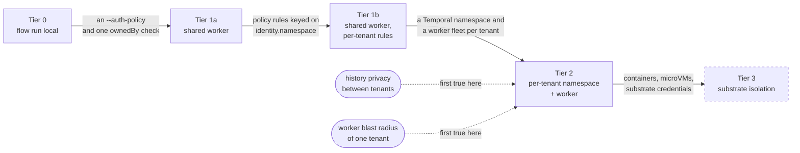

# Deployment

This is a reference for putting Flowstate somewhere real: what isolation you
actually get, what each topology looks like as commands and unit files, and
where the sharp edges are. It says what is true today, traced to the code that
makes it true — not what would be nice.

Read [Deployment portability](ARCHITECTURE.md#deployment-portability) first for
the shape of the connection layer; this document is what to do with it.

## Read this before you share a Temporal namespace

> [!WARNING]
> If two tenants' runs execute in the same Temporal namespace, anyone with
> Temporal UI or `tctl`/`temporal` CLI access to that namespace can read **every
> tenant's** workflow history: the full compiled specification, every step's
> inputs and outputs, the identity claims a run carries, and its memo.

That access is Temporal's, not Flowstate's — Temporal's own visibility and
namespace permissions are what would have to gate it, and most self-hosted
clusters don't gate per-workflow.

Flowstate's own tenancy checks are real: the API refuses every cross-tenant
verb (`Get`, `List`, `Cancel`, `Terminate`, `Signal`, `Describe` — one
`ownedBy` check, all six, reported as `NotFound` rather than
`PermissionDenied` so a probe learns nothing about what exists), and a run's
namespace comes from the authenticated caller, never from the workload itself
(`docs/ARCHITECTURE.md#tenancy`). None of that reaches someone who talks to
Temporal directly instead of through the Flowstate API. **The Flowstate API's
tenancy governs the Flowstate API, and nothing downstream of it.**

This is the argument for [Tier 2](#the-four-tier-isolation-model) below: if
two tenants must not be able to read each other's history, they need separate
Temporal namespaces, not just separate rows filtered by the Flowstate server.
Everything else in this document is detail underneath that one sentence.

## The worker is the tenancy boundary

Every tenant whose runs a worker processes shares that worker's process. A
plugin binary the worker launches, or `exec:` when that lands, runs *inside*
that boundary — with the same process authority the worker itself has,
including the ability to read anything the worker's own memory holds. This
follows from how plugins are isolated at all: separate processes protect
against a crash or a runtime bug, not against code doing deliberately what its
author wrote (`docs/ARCHITECTURE.md#plugins`). A launched plugin is trusted
code, full stop; the controls after that point — `secret_inputs`, the output
scrubber — narrow what a *vetted* plugin can leak by accident, and are not
containment against one that is actively hostile.

Concretely: a plugin, or anything that achieves code execution inside a
worker process, reaches every secret material that worker holds for every
tenant it serves — not just the tenant whose run happened to launch it.

**What the host isolates, stated plainly (#1010):** a plugin runs as the same
user as the worker, with the worker's full filesystem, network and kernel
reach. The host guarantees which bytes run when pinned, that the plugin
cannot read the worker's memory or its environment-borne credentials, cannot
impersonate the host on its socket, and cannot outlive it. It does not
constrain what the plugin does with the worker's own privileges — resource
limits, filesystem visibility and syscall filtering are the deployment's job,
exactly as they are for the worker itself. The host isolates **by process,
not by privilege**, and no schema vocabulary claims otherwise; see [the
four-tier isolation model](#the-four-tier-isolation-model) for where that
kind of control actually lives.

### Pinning which bytes a plugin name may run

A plugin name is a mutable reference: whoever can write the file at that
path chooses what this worker executes under it, forever and silently. A
digest pin turns one name into an immutable reference, checked before the
process exists — a compromised plugin's own announcement of itself cannot
take part in the decision to admit it. It is opt-in per name: an unpinned
name launches exactly as it always has, so pinning is adopted one plugin at a
time rather than as a flag day for a whole fleet (`pkg/flowstate/v1/plugin/config.go`).

Compute the digest to pin the same way the host measures one at launch —
`sha256sum` over the installed binary, prefixed `sha256:` — which is also
what the worker's own log line for a launched plugin already reports
(`distribution` in the "loaded plugin" line):

```console
$ echo "sha256:$(sha256sum /usr/local/lib/flowstate/plugins/flowstate-plugin-github | cut -d' ' -f1)"
sha256:1f3d...c2
```

One-off pins go straight on the command line, repeatable:

```console
$ flow worker --plugin-dir /usr/local/lib/flowstate/plugins \
    --plugin-pin github=sha256:1f3d...c2
```

A deployment pinning more than a couple of plugins keeps them in a file
instead — the artifact an operator diffs in code review — and points every
verb that launches plugins at it, the same way `--task-policy` and
`--egress-policy` point at theirs:

```yaml
# /etc/flowstate/plugin-pins.yaml
pins:
  github: sha256:1f3d...c2
  slack: sha256:9ab0...44
```

```console
$ flow worker --plugin-dir /usr/local/lib/flowstate/plugins \
    --plugin-pins /etc/flowstate/plugin-pins.yaml
```

Unknown keys and a name pinned twice — in the file, on the command line, or
split across both — are startup errors rather than a pin silently dropped:
the same "fail closed on configuration" rule `--task-policy` follows. A pin
naming a plugin `--plugin` does not admit, or any pin given with no
`--plugin-dir` for it to apply to, is refused for the identical reason: a
pin nothing can ever check is not protecting anything, however confidently
an operator believes it is. `$FLOWSTATE_PLUGIN_PINS` is the pins-file
default, mirroring `$FLOWSTATE_PLUGIN_DIR`, and every worker-facing verb that
launches plugins — `worker`, `server`, `mcp`, `run local`, `lsp`, `plugins` —
takes both flags, because all of them build a host through the one place in
the CLI that does (`cmd/flow/plugins.go`'s `pluginFlags.host`).

A pin says only that these exact bytes are the ones entitled to answer to
this name. It says nothing about who built them or whether anyone vouches
for them — that is the open half of #146, and it is not what this answers.

**The good news, which nobody had written down before this document:**
`pluginEnv` builds a plugin's environment from nothing, not by inheriting the
worker's own (`pkg/flowstate/v1/plugin/launch.go`, `pluginEnv`). The worker's
environment is where its own credentials live — a Temporal API key, a cloud
role, whatever the deployment set as `FLOWSTATE_SECRET_*` — and a plugin
process does not see any of it unless an operator names it explicitly in
`Config.Env`. So the blast radius above is real, but it is *not* "a plugin can
read `$FLOWSTATE_SECRET_DB_PASSWORD` off the worker's environment just by
existing" — it has to be handed a secret through the sanctioned path
(`TaskManifest.secret_inputs`, resolved worker-side and passed over the
socket) or reach it some other way. Know this before either over-trusting a
plugin ("it's sandboxed, right?") or over-building a containment layer that
duplicates a property the worker already has.

### SQL plugin deployment and migration

`sql.query` and `sql.exec` now require the entire `dsn` input to be a host
secret reference. Literal DSNs are rejected during validation and again before
plugin dispatch. Move each existing DSN into the deployment's configured secret
backend and write `${secret('provider:name')}` in the Flowfile; `flow fix` cannot
do this safely because creating or authorizing deployment secret state is not a
source rewrite.

Credential source is not destination authorization. A worker loading the SQL
plugin must also receive `--egress-policy` with `postgres` in `egress.schemes`
and exact allow rules/networks/ports for the database. The host forwards that
same operator-owned policy snapshot to the first-party SQL plugin, so a file
replacement during startup cannot make HTTP and SQL enforce different bytes;
missing policy denies all PostgreSQL connections, and malformed policy prevents
plugin startup. The SQL plugin checks host and port rules before DNS, resolves
and authorizes every address for every DSN host, pins that set, rechecks the
actual TCP target immediately before each connection, requires verified TLS,
and rejects Unix sockets and filesystem-reading connection options.

Released SQL plugins no longer execute SQLite DSNs. Embedded SQLite grants the
plugin worker-filesystem authority (including URI modes, symlinks, `ATTACH`, and
`VACUUM INTO`) that a network egress policy cannot bound. Migrate those workflows
to PostgreSQL rather than treating the plugin process as filesystem confinement.
Finally, allow `sql.query` and `sql.exec` separately in task policy: read access
does not imply the write capability.

## The four-tier isolation model

Each tier is a set of claims a security reviewer can check independently.
Nothing here is aspirational — every ✅ is traced to code, and every ❌ is
something to stop assuming once you've read it.

Each tier adds exactly one boundary to the one before it, and the two claims
people most often assume they already have arrive last:



Tier 3 is dashed because it is documented and not built: it is what a substrate
provides, not something Flowstate implements. The same claims as a grid, which is
the form to hand a reviewer:

| Claim | Tier 0 | Tier 1a | Tier 1b | Tier 2 | Tier 3 |
| --- | --- | --- | --- | --- | --- |
| Identity is verified rather than asserted | ❌ | ✅ | ✅ | ✅ | ✅ |
| Every cross-tenant API verb refused | n/a | ✅ | ✅ | ✅ | ✅ |
| Secrets, tasks and egress scoped per tenant | rehearsal only | ❌ | ✅ | ✅ | ✅ |
| Workflow history private between tenants | n/a | ❌ | ❌ | ✅ | ✅ |
| Worker blast radius is one tenant | ❌ | ❌ | ❌ | ✅ | ✅ |
| Enforcement below the process (network, kernel) | ❌ | ❌ | ❌ | ❌ | substrate's |

A cell is a summary of the tier's section below, which is where the tracing to
code lives; read the section before relying on a tick.

One definition the grid depends on, because a reviewer will otherwise find the
counter-example immediately: **Tier 1a means `flow server --auth-policy`.**
`--insecure-no-auth` is not a weaker Tier 1a, it is Tier 0's identity model with
a network listener in front of it — every caller is admitted anonymously
(`auth.InsecureAnonymousVerifier`), so every run belongs to the same empty
namespace and there is no tenancy for the `ownedBy` check to enforce. The code
draws the same line: `authVerifier` refuses to start a server given neither a
policy nor that flag, and treats the flag as a thing an operator says out loud
rather than a fallback for a policy that failed to load
(`cmd/flow/main.go`). The Local development recipe below is labelled a Tier 0/1a
*boundary* for this reason.

Naming both is refused at start-up rather than resolved by priority. A server
given `--insecure-no-auth` alongside `--auth-policy` — or alongside an inherited
`FLOWSTATE_AUTH_POLICY`, which is the same sentence typed somewhere else — would
otherwise authenticate nobody while its configuration still read as Tier 1a,
with a trust policy beside it that nothing opens. Pass one or the other.

### Tier 0 — `flow run local`

No server, no Temporal, no worker process boundary. A single command runs a
Flowfile to completion in the calling process.

- ✅ Isolation is the OS user running the command — normal filesystem and
  process permissions, nothing Flowstate-specific.
- ❌ Identity is *asserted*, not verified: `--as-namespace`, `--as-deployment`,
  and `--as-claim` on `flow run local` let you rehearse policy as any tenant
  you like, with no credential check, because that is the point of local
  rehearsal (`runLocalCmd` flags in `cmd/flow/main.go`). Every surface that
  reads an identity reads that one — the secret rules, a credential the run
  assumes, plugin tasks, `run.identity`, and the `--task-policy` and
  `--egress-policy` rules — so what you rehearse is what the worker would
  decide. What an assertion cannot do is travel: `run.local` reads true, and a
  credential minted for a local run carries a `_local` subject component no
  server-attested run can produce, so a cloud trust policy written for
  production will not match a rehearsal's.
> [!WARNING]
> Never run Tier 0 as a shared service. There is no authentication surface to
> turn on — it doesn't have one to withhold, and every `--as-*` flag above is
> an assertion anyone reaching it can make.

### Tier 1a — shared worker, zero configuration

One Temporal namespace, one worker fleet, one Flowstate server, `flow server`
started with an OIDC/workload-identity `--auth-policy`. This is what running
`flow worker` and `flow server` with no per-tenant flags gets you.

The policy is part of the definition, not a recommendation inside it: every
claim below rests on a caller whose identity was *attested*, and `flow server
--insecure-no-auth` — which the server accepts only because an operator asked
for it in as many words — admits everyone anonymously into one empty namespace,
which is Tier 0's model reachable over a socket rather than a weaker Tier 1a.
Read the ticks below as claims about a server started with a policy.

- ✅ The Flowstate API refuses every cross-tenant verb: one `ownedBy` check
  covering `Get`/`List`/`Cancel`/`Terminate`/`Signal`/`Describe`, reported as
  `NotFound` — see [above](#read-this-before-you-share-a-temporal-namespace).
- ✅ No schema field lets a caller name a namespace, a fairness weight, or a
  sender — a run's tenancy comes only from the authenticated caller, never
  from anything a Flowfile or a request body can set.
- ✅ Secrets bind per-identity and fail closed: a deployment that registers no
  secret rules refuses every reference (`SecretAccessPolicy`, "absent means
  nothing" — `pkg/flowstate/v1/auth/secretpolicy.go`).
- ✅ Metadata endpoints (cloud instance-metadata IPs) are denied even inside an
  otherwise-allowed network — netpolicy's default posture, not a rule someone
  has to remember to add.
- ✅ Nothing to sandbox yet: the built-in task set is `log` and `http`. There
  is no `exec:`, no filesystem task — the audit that produced this document
  explicitly declines to recommend sandboxing those two, because there is
  nothing there to escape.
- ❌ **Cannot claim history privacy.** See the top of this document — this is
  the tier where it bites hardest, because there is exactly one Temporal
  namespace and it holds everyone's history.
- ❌ **Cannot claim plugin or process containment.** A launched plugin runs
  with the worker's authority; see [above](#the-worker-is-the-tenancy-boundary).
- ⚠️ **Per-tenant egress is a Tier 1b property, not a limitation of the tier.**
  One worker still runs one netpolicy configuration, but that configuration's
  CEL rules can now key on the calling tenant — see Tier 1b below. A single
  rule set that ignores identity governs every tenant's `http:` steps alike;
  writing an identity-scoped rule is what makes egress per-tenant on one worker.

### Tier 1b — shared worker, per-tenant policy rules

Same topology as 1a, plus rules that key on the calling tenant. Real today,
cheap to turn on, and undocumented until now.

- ✅ Secret rules see the workload as an object, including its namespace:
  `secret.scheme == "env" && workload.namespace == "acme"` is a rule you can
  write today (`SecretAccessPolicy.Allow` doc comment,
  `pkg/flowstate/v1/auth/secretpolicy.go`). It's wired through the same
  `--auth-policy` file passed to `flow worker` — the flag's own help text
  says plainly that its secrets rules "authorize worker-side resolution."
- ✅ Two tenants sharing one worker can therefore have secrets that resolve
  differently, or not at all, purely as a function of `workload.namespace` in
  one YAML file.
- ✅ **Task policy keyed on `identity.namespace` is now real.** The design
  record this document is written from (issue #236) described it as "once
  #228 lands" — #228 landed during the writing of this document. It is a
  *separate* mechanism from the secret rules above: `--task-policy` (or
  `$FLOWSTATE_TASK_POLICY`) on `flow worker` and `flow run local` — never on
  `flow server` or `flow validate`, for the same reason egress policy isn't:
  a deployment refusal is not a file diagnostic (`cmd/flow/taskpolicy.go`).
  A rule is CEL over `task` (the qualified task name) and `identity`
  (`identity.subject`, `.issuer`, `.namespace`, `.claims` — the run's attested
  identity), so `task == "log" && identity.namespace != "platform"` denies a
  task to every tenant but one. Fail-closed the same way secret rules are: no
  policy configured permits everything (today's default, unchanged); a
  malformed policy refuses the command to start rather than running
  unrestricted. `examples/task-shape-policy/` is the worked example — a
  Flowfile with no gate left in it at all, refused purely by worker
  configuration. Two separate files, two separate flags
  (`--auth-policy`'s `secrets:` rules and `--task-policy`'s rules), governing
  two separate decisions — don't conflate them when writing one deployment's
  configuration.
- ✅ **Egress keyed on `identity.namespace` is now real (#240).** The egress
  CEL environment carries an `identity` object — `identity.subject`, `.issuer`,
  `.namespace`, `.claims` — the same run identity the secret and task rules
  read, from the same source. So `identity.namespace == "team-a" && host ==
  "partner-a.example.com"` in one worker's `--egress-policy` file lets team-a
  reach a host that every other tenant on that worker is denied — the one
  asymmetry that previously kept egress out of this tier. It is available in
  both rule scopes, so a resolved-address rule (`... && ip == "10.0.0.5"`) can
  be tenant-scoped too. Fail-closed like the others: a run that names no
  identity (one predating identity, or a local rehearsal started without
  `--as-namespace`) presents an empty namespace and matches no tenant rule. A
  local run started *with* one presents it, so `flow run local --egress-policy
  ... --as-namespace team-a` rehearses the answer this worker would give
  team-a rather than the answer it gives a caller with no tenant at all
  (#295) — asserted, never verified, which is what Tier 0 above says about
  every `--as-*` flag. `examples/egress-policy.yaml` is the worked example. This is Tier 1b — one shared worker — not the per-tenant worker of
  Tier 2, which remains the stronger answer where history privacy is also
  required.
- ❌ Still no history privacy and no plugin/process containment — those are
  Tier 2 properties, not policy-rule properties.

### Tier 2 — per-tenant Temporal namespace + per-tenant worker

A tenant's runs execute against their own Temporal namespace, polled by a
worker fleet that serves only that tenant.

- ✅ The routing exists on the server side and is fail-closed, not
  fail-open. `auth.Tenancy` (a field of the trust policy loaded from
  `--auth-policy`) maps a Flowstate namespace onto a Temporal namespace;
  `temporalclient.Pool` dials one client per mapped namespace at server
  startup — an unreachable namespace fails the *start*, not the first
  tenant's request; and `FlowstateServer.clientFor` **refuses** a tenant the
  mapping doesn't cover, rather than silently routing it onto the default
  client (`clientFor`'s own doc comment: "a refusal is a misconfiguration
  someone fixes; a fallback is a tenancy breach nobody notices" —
  `pkg/flowstate/v1/server/server.go`). This is genuinely built, tested, and
  undocumented before this file.
- ✅ **The worker side is built.** `flow server --task-queue-prefix <prefix>`
  routes each tenant's runs to a task queue of that tenant's own, named
  `<prefix>_<namespace>`, derived from the *authenticated* tenant and never
  from the request — the same rule the tenant memo and the fairness key
  already follow. `flow worker --tenant <namespace> --task-queue-prefix
  <prefix>` starts a fleet that polls exactly that queue, and **refuses** any
  run belonging to anyone else, terminally and non-retryably, rather than
  executing it with this worker's secrets, egress policy and plugins. Both
  sides compose the name with the same function, which is the only way they
  can be relied on to agree.

  Unset, the prefix routes nothing and every tenant's runs go to
  `flowstate-run-task-queue` exactly as they always have — a single-team
  deployment has nothing to route between and should not have to say so.

  Two combinations are refused at startup rather than documented as things not
  to do. `--tenant` with no queue of its own is refused, because a
  tenant-restricted worker on the *shared* queue would race the general fleet
  for every tenant's runs and fail the ones it won — a flag meant to contain
  one misconfiguration turned into an outage for everybody else.
  `--task-queue-prefix` with no `--tenant` is refused because the queue a
  prefix composes is a function of the tenant, so half the pair addresses
  nothing.

  **Why the queue name cannot be forged across a tenant boundary.** A
  namespace is `auth.ValidateNamespace`'s grammar — lowercase letters, digits,
  and a dash that is never first — so it cannot contain `_`; a prefix is
  checked against the same grammar, so it cannot either; and the composed name
  joins them with exactly one `_`. The first `_` is therefore always the
  separator, at `len(prefix)`, so two `(prefix, namespace)` pairs that composed
  one string would have to be the same pair. The default tenant's component is
  `_default`, which begins with the one character a namespace may not contain,
  so a tenant named `default` gets `<prefix>_default` and the default tenant
  gets `<prefix>__default` — different queues. This is the same argument the
  `_default` component of an assertion subject makes, and it is the fix for the
  ambiguity that let the env secrets provider resolve two tenants' secrets to
  one variable (`CLAUDE.md`). Asserted over a cross product of straddling
  pairs by `TestTaskQueueNamesCannotBeForged`.

  What this is *not*: per-**step** queue routing ("run this step on the GPU
  fleet"), which is the same mechanism applied at a different level and is not
  built.
- ✅ What Tier 2 buys once wired to a distinct namespace per tenant: worker
  blast radius drops to one tenant (a plugin compromise on tenant A's worker
  fleet cannot reach tenant B's secrets, because they're different
  processes), history is isolated (the point at the top of this document, now
  actually addressed), and per-tenant egress becomes a *deployment* fact — run
  tenant A's worker fleet with tenant A's `--egress-policy` file — rather than
  something netpolicy's CEL would need a namespace attribute for.
- ⚠️ **Mapping completeness is a warning, not a refusal.** A tenant mapped
  onto a Temporal namespace, or onto a task queue, with nothing polling it
  does not fail: its runs are accepted, start, and sit `RUNNING` forever with
  nothing wrong reported anywhere — invariant 9's failure shape arriving
  through a configuration path. `flow server` therefore checks, at startup,
  whether a worker is polling each routable tenant's queue and logs a warning
  naming the tenant and the queue when none is. It warns rather than refusing
  because a server that would not start until its fleet was already polling
  deadlocks every deployment that starts the server first, and because a
  poller count is true at an instant rather than durably. **Watch for that
  line**; it is the difference between finding this at deploy time and finding
  it when somebody asks why their run has been running since Tuesday.

  Note the tenant that is easiest to miss: a mapping with a `default` also
  routes the *empty* namespace — what an unauthenticated caller, and a caller
  whose token names no namespace, belongs to. It has a queue like any other
  and appears in the mapping under no name at all.

**A worked Tier 2 command line, both sides:**

```console
# Server: route each tenant onto its own queue, tenants mapped onto Temporal
# namespaces by the trust policy's `tenancy:` block.
$ flow server --auth-policy /etc/flowstate/trust.yaml \
    --rpc-resource https://flowstate.example.com/rpc \
    --task-queue-prefix flowstate-run

# One fleet per tenant. Each gets that tenant's own egress policy and secrets,
# which is the whole point: a compromise of this process reaches one tenant's
# material, which is the claim Tier 1 structurally cannot make.
$ flow worker --tenant team-a --task-queue-prefix flowstate-run \
    --temporal-namespace temporal-team-a \
    --egress-policy /etc/flowstate/team-a/egress.yaml \
    --secret-dir /etc/flowstate/team-a/secrets \
    --deployment-name flowstate --build-id "$(git rev-parse --short HEAD)"

# And the default tenant of a deployment whose trust policy has a `default`:
$ flow worker --tenant= --task-queue-prefix flowstate-run ...
```

`FLOWSTATE_TASK_QUEUE_PREFIX` sets the prefix on both sides, which is the
convenient way to keep them equal — a worker that spelled it differently would
poll a queue nothing submits to, do nothing forever, and report nothing.

### Bearer-token audiences are per surface

A `flow server` whose trust policy has a `kind: oidc` issuer requires a canonical
Connect RPC resource URI via `--rpc-resource` or `FLOWSTATE_RPC_RESOURCE`. The
exact string must appear in at least one such issuer's `audiences`, and every
bearer token spent on Connect RPC must carry that exact `aud` value. It must be
an absolute HTTPS URI (HTTP is accepted only for loopback), with no fragment or
trailing slash.

The requirement follows the bearer issuer, not the flag. A trust policy of
nothing but `kind: mtls` entries admits callers by client certificate, which
carries no audience claim — `kind: mtls` entries are refused an `audiences` list
outright — so there is nothing to bind and no resource is required. Passing
either flag on such a deployment is an error rather than a no-op, so an operator
is never left believing an audience is being enforced on a surface that has
none. `--insecure-no-auth` refuses both for the same reason.

Do not reuse this identifier for remote MCP. A deployment might use
`https://flowstate.example.com/rpc` for Connect RPC and
`https://flowstate.example.com/mcp` for `flow mcp serve`; a future ordinary HTTP
API gets its own third identifier. Even when one `TrustedIssuer` lists all of
them, each surface's exact check prevents replay between surfaces.

One consequence to expect from that split. `--protected-resource` publishes the
RFC 9728 document for the *MCP* resource, and a 401 from Connect RPC names that
document only when it describes the RPC surface too. Give the two flags
different values — as recommended above — and Connect RPC's 401 challenge reads
`Bearer error="invalid_token"` with no `resource_metadata`, because sending a
discovery-driven client to a document advertising the MCP audience would have it
mint precisely the token Connect RPC is configured to refuse. Discovery for the
RPC surface therefore has no document to point at yet; RPC clients are
configured with their audience directly.

**Migration:** older deployments accepted any audience listed on the matched
issuer. First add the RPC URI to the issuer's audience list and configure clients
to request it, then set `--rpc-resource`. If that cannot be atomic,
`--allow-issuer-wide-audiences` explicitly restores the old behavior for one
migration window. It is mutually exclusive with `--rpc-resource`; remove it to
complete migration. New deployments should never set it.

### Tier 3 — substrate isolation

Containers or microVMs per tenant, network-level enforcement, per-tenant cloud
credentials issued by the substrate rather than by Flowstate.

- This tier is **documented, not built**, deliberately. Flowstate is designed
  to run *on* a substrate that provides this, not to reimplement it —
  Kubernetes namespaces-with-NetworkPolicy, gVisor/Firecracker, per-tenant IAM
  roles, whatever your platform already does for isolation between untrusted
  workloads. The one exception worth taking seriously later is VISION's
  sandbox-provider plugin shape (Modal or similar, `docs/VISION.md`), which is
  a *task* a workflow calls into for untrusted work — not an orchestrator
  Flowstate would have to build and maintain.

## Deployment matrix

Every recipe below that runs `flow worker` in a production setting sets one of
`FLOWSTATE_DEPLOYMENT_NAME`/`FLOWSTATE_BUILD_ID` (or, deliberately for
non-production, `--allow-unversioned-interpreter`) — the worker refuses to
start with neither, per invariant 10 in `ARCHITECTURE.md`, and every recipe
below shows the flag because the alternative is discovering the refusal at
your first deploy rather than while reading this document.

### Local development

```console
$ temporal server start-dev
$ flow worker --allow-unversioned-interpreter
$ flow server --insecure-no-auth
```

Tier 0/1a boundary: this is the shared-server shape, but `--insecure-no-auth`
means there is no tenancy to speak of — everyone is anonymous. Fine for a
laptop; never a service that anyone but you can reach.

### Docker Compose

`examples/observability/docker-compose.yaml` is a working compose file
standing up Temporal (`start-dev`), a Flowstate server and worker, and a full
Grafana/Tempo/Loki/Prometheus/OTel-Collector stack — see
`examples/observability/README.md`. It runs `--insecure-no-auth` and
`--allow-unversioned-interpreter` deliberately, and every published port binds
`127.0.0.1` — read that README's "Insecure by design" section before adapting
it into anything that leaves your laptop; it says plainly what has to change
and why each choice was made assuming nothing else is reachable.

```console
$ docker compose -f examples/observability/docker-compose.yaml up
```

### Single VM (EC2 or similar), systemd — the best-supported production shape

No Kubernetes needed. Two systemd units on one host, or split across two hosts
for Tier 2: one worker unit per tenant's Temporal namespace.

`/etc/flowstate/worker.env`:

```env
TEMPORAL_ADDRESS=temporal.internal:7233
TEMPORAL_NAMESPACE=production
FLOWSTATE_DEPLOYMENT_NAME=flowstate
FLOWSTATE_BUILD_ID=2026.08.06-a1b2c3d
FLOWSTATE_AUTH_POLICY=/etc/flowstate/policy.yaml
FLOWSTATE_SECRET_DIR=/etc/flowstate/secrets
```

`/etc/systemd/system/flowstate-worker.service`:

```ini
[Unit]
Description=Flowstate worker
After=network-online.target
Wants=network-online.target

[Service]
Type=exec
EnvironmentFile=/etc/flowstate/worker.env
ExecStart=/usr/local/bin/flow worker --plugin-dir /usr/local/lib/flowstate/plugins
Restart=on-failure
RestartSec=5s
DynamicUser=yes
NoNewPrivileges=yes
ProtectSystem=strict
ProtectHome=yes
ReadWritePaths=/var/lib/flowstate

[Install]
WantedBy=multi-user.target
```

`/etc/flowstate/server.env`:

```env
FLOWSTATE_ADDRESS=127.0.0.1:9233
TEMPORAL_ADDRESS=temporal.internal:7233
TEMPORAL_NAMESPACE=production
FLOWSTATE_DEPLOYMENT_NAME=flowstate
FLOWSTATE_AUTH_POLICY=/etc/flowstate/policy.yaml
FLOWSTATE_IDENTITY_KEY=/etc/flowstate/identity-2026-07.pem
FLOWSTATE_RPC_RESOURCE=https://flowstate.example.com/rpc
```

`/etc/systemd/system/flowstate-server.service`:

```ini
[Unit]
Description=Flowstate API server
After=network-online.target flowstate-worker.service
Wants=network-online.target

[Service]
Type=exec
EnvironmentFile=/etc/flowstate/server.env
ExecStart=/usr/local/bin/flow server
Restart=on-failure
RestartSec=5s
DynamicUser=yes
NoNewPrivileges=yes
ProtectSystem=strict

[Install]
WantedBy=multi-user.target
```

`FLOWSTATE_RPC_RESOURCE` is what this unit's `flow server` binds its Connect
RPC audience to, and it is required because `policy.yaml` names a `kind: oidc`
issuer — write the URI clients actually reach this deployment at, and list that
exact string in the issuer's `audiences:`. A server started without it does not
run degraded; it refuses to start, which on this shape is a unit that fails and
a message in `journalctl -u flowstate-server`.

`FLOWSTATE_ADDRESS=127.0.0.1:9233` above is loopback, so `flow server` needs
no TLS configuration of its own to start — [blockers](#blockers) below is
where the choice this shape has already made gets explained. Two ways to
finish it, and this recipe assumes the first:

- **Terminate TLS in front of it** (nginx, Caddy, an ALB/NLB with a listener
  certificate), forwarding to `127.0.0.1:9233` as configured above. Nothing
  else in this file changes.
- **Terminate TLS in `flow server` itself**, skipping the reverse proxy:
  set `FLOWSTATE_ADDRESS` to the address you actually want reachable (not
  loopback) and add `FLOWSTATE_TLS_CERT_FILE`/`FLOWSTATE_TLS_KEY_FILE` to
  `server.env`, pointing at a certificate this unit can read. No further flag
  needed — a certificate configured is what [blockers](#blockers) below calls
  the ordinary way past the refusal.

To reach Tier 2 on this shape: run one `flowstate-worker` unit per tenant, each
with its own `TEMPORAL_NAMESPACE` and its own `--egress-policy` /
`--auth-policy` files, and map each tenant onto its namespace in the trust
policy the server loads (`tenancy:` under `--auth-policy`, `auth.Tenancy` /
`temporalclient.Pool`). This is the "N worker units" the audit refers to as
the least-documented production shape — it is systemd units, not Kubernetes.

### Kubernetes

The same two binaries as containers: a `Deployment` for `flow server` behind
an `Ingress`/`Service` doing TLS termination, and a `Deployment` per worker
fleet — one per tenant namespace for Tier 2, replicas for throughput within a
tenant. Plugins are Unix-socket subprocesses launched by the worker process
itself, so no extra container or sidecar is needed for them; a `--plugin-dir`
pointed at a `ConfigMap`- or `initContainer`-populated directory works as
long as that directory isn't writable by other users — group or world (see
[blockers](#blockers)).
Secrets mount as files (`--secret-dir`) or environment (`--secret-env`) the
ordinary Kubernetes way — Secret volumes or `envFrom`.

**Set `--identity` (or `FLOWSTATE_WORKER_IDENTITY`) to the pod name.** Left
unset, a worker's identity in Temporal's Event History and Task Queue poller
list is built from `--deployment-name`/`--build-id`, `--tenant` if set, and
this process's hostname — better than the SDK's own `pid@hostname` default
(every container's PID 1 is `1`), but a pod hostname is still a hash an
operator has to cross-reference against `kubectl get pods`. Wire the
downward API's pod name straight through instead:

```yaml
env:
  - name: FLOWSTATE_WORKER_IDENTITY
    valueFrom:
      fieldRef:
        fieldPath: metadata.name
```

so a stuck task in Temporal's UI names the exact pod to `kubectl exec` into,
with nothing to look up.

**The pod's `FLOWSTATE_ADDRESS` needs a flag alongside it, and which one
depends on where TLS actually ends.** A pod almost always sets
`FLOWSTATE_ADDRESS=0.0.0.0:9233` (or lets the default resolve to it): the
Service that routes an Ingress's traffic to the pod addresses it by pod IP,
which a `localhost`-only listener never answers, so the container needs the
wildcard bind the same way `examples/observability/docker-compose.yaml`'s
container does. `flow server` reads that as "reaches past this machine" and
refuses to start without one of:

- **`--tls-terminated-upstream`** (or `FLOWSTATE_TLS_TERMINATED_UPSTREAM=1`),
  when the `Ingress` (or a `Service` of type `LoadBalancer` fronted by
  something doing TLS) is genuinely the TLS boundary and forwards plaintext
  to the pod on the cluster network — the ordinary shape for `nginx-ingress`
  and most managed ingress controllers by default. Say so on the container's
  `command`/`args`, not by editing the Ingress: the pod is what refuses, and
  the pod is what needs telling. This is the honest use of that flag — see
  its own help text — because the Ingress really is doing the job the flag's
  name used to claim for itself and no longer does.
- **`FLOWSTATE_TLS_CERT_FILE`/`FLOWSTATE_TLS_KEY_FILE`** (a Secret volume
  mount), when you would rather `flow server` terminate TLS itself — mutual
  TLS to the pod, or an Ingress controller that only proxies TCP — and skip
  `--tls-terminated-upstream` entirely, the same certificate-first choice the
  systemd recipe above describes.

Never set `--tls-terminated-upstream` on a `Service` of type `LoadBalancer`
or `NodePort` with no TLS-terminating `Ingress`, controller, or mesh actually
in front of it: that is exactly the plaintext-to-the-internet case the flag's
help text tells you not to use it for, and the cluster network is not a
substitute boundary the way a container's published-port binding is.

### Health checks and probes

`flow server` answers `GET`/`HEAD /healthz` with `200` and an empty body —
nothing else, deliberately: an unauthenticated endpoint that describes the
deployment (version, config, dependency state) is reconnaissance served on
request (`healthzHandler`, `cmd/flow/routing.go:118-126`). It is mounted in
two places:

- On the **public** listener, unauthenticated, always — `serverHandler`,
  `cmd/flow/routing.go:94`.
- On the **internal** listener, if `--internal-listen`
  (`FLOWSTATE_INTERNAL_ADDRESS`) names a loopback address — `internalHandler`,
  `cmd/flow/routing.go:160`. The internal listener also carries `/debug/pprof/*`
  (`cmd/flow/routing.go:167-171`), which is why it has no default and is
  refused off loopback (`checkInternalListenAddress`,
  `cmd/flow/internallistener.go:79-90`): pprof can read this process's memory
  and running goroutines, and the listener has no TLS or authentication of its
  own.

There is exactly one probe endpoint — `flow server` does not expose a
separate readiness or startup route. What makes `/healthz` usable as more than
a bare liveness check is startup ordering: `flow server` dials Temporal with
the SDK's eager `client.DialContext` (`cmd/flow/main.go:809`, wired through
`temporalclient.Dial`, `pkg/flowstate/v1/temporalclient/temporalclient.go:175-187`)
and mounts the HTTP mux — the one carrying `/healthz` — only after that dial,
and every other startup check (TLS configuration, auth policy load, plugin
catalog build), succeeds. So the first `200` from `/healthz` already implies
the initial Temporal connection worked; it does not mean the connection is
*still* good, since nothing re-checks it afterward, and it says nothing about
the pool's per-tenant Temporal clients (`temporalclient.Pool`) reconnecting
after that.

`flow worker` takes the same `--internal-listen` flag
(`FLOWSTATE_INTERNAL_ADDRESS`), with the same default — **unset, so nothing is
bound** — and the same refusal off loopback. Set it and the worker serves
`/healthz` and `/debug/pprof/*` on that address and nothing else; leave it
alone and the worker binds no socket at all, which is what every recipe in
this document does today.

What a `200` from a worker's `/healthz` means, precisely: the listener binds
only *after* `w.Start()` returns, which is after the egress and task policies
loaded, the secret providers opened, the plugin fleet launched and passed its
strict start-up check, the Temporal client dialed, and the worker began
polling its queue. So the first `200` implies all of that happened. It does
**not** re-check any of it afterwards — the same caveat the server's route
carries.

There is deliberately no `/readyz`. A worker's readiness question is "are this
worker's pollers actually attached to the task queue right now", and the Go
SDK does not expose that: `worker.Worker` reports no poller state, and the
only health call available (`client.Client.CheckHealth`) answers a question
about the *frontend*, not about this worker's pollers — a worker whose pollers
died would keep answering `200` to that, which is worse than not offering the
route. What does answer the real question is already wired: the SDK's own
metrics, exported over OTLP when `OTEL_EXPORTER_OTLP_ENDPOINT` is set (see
[Metrics](#metrics)), carry poller counts and task-queue backlog per worker.
Use those for readiness and this endpoint for liveness.

A worker's liveness therefore still comes from the process itself where no
listener is configured: run it under a supervisor that treats process exit as
the signal (`systemd`'s `Restart=on-failure` in the [systemd
recipe](#single-vm-ec2-or-similar-systemd--the-best-supported-production-shape)
above, or a Kubernetes `Deployment`'s own restart-on-crash). With the listener
configured, add an `exec` probe — and it has to be `exec`, never `httpGet`,
for the reason the next paragraph gives about loopback and the kubelet:

```yaml
        # flow worker, with --internal-listen 127.0.0.1:9090 set on the
        # container's command line (or FLOWSTATE_INTERNAL_ADDRESS in its env).
        livenessProbe:
          exec:
            command: ["/bin/sh", "-c", "wget -q -O- --timeout=2 http://127.0.0.1:9090/healthz || exit 1"]
          periodSeconds: 10
          failureThreshold: 3
```

Two things to weigh before turning it on, both of which are why it is off by
default. The port serves `/debug/pprof/*` alongside `/healthz` — one flag
turns on both, there is no way to take the health route without the profiler —
and a heap profile of a worker contains whatever that worker's address space
contains, which on a worker means secret values resolved for an in-flight
step. That is precisely the material the [secrets
model](ARCHITECTURE.md#secrets) keeps out of Temporal's history, so anything
that can reach this socket can read past that boundary. It has no authentication and no TLS
of its own; loopback and a shared network namespace are the entire access
control, which is why a non-loopback address is refused rather than warned
about (`checkInternalListenAddress`, `cmd/flow/internallistener.go`). Weigh
that against a liveness probe, and against the capacity runbook below, which
is what wants the profiler.

A Kubernetes `httpGet` probe is dialed by the kubelet from the node's own
network namespace, against the pod's IP — not from inside the pod's network
namespace — so it can only reach a listener bound to an address the pod IP
routes to. That is exactly what the public listener is, per the "pod's
`FLOWSTATE_ADDRESS` needs a flag alongside it" note above (`0.0.0.0:9233`,
wildcard bind). The internal listener is the opposite on purpose: refused
off loopback (`checkInternalListenAddress`,
`cmd/flow/internallistener.go:79-90`), so it never accepts a connection that
didn't originate in the same network namespace — which rules it out for a
`httpGet` probe target, not just as a matter of style. So:

The `httpGet` probes below assume the **upstream-terminated-TLS** shape from
the [Kubernetes](#kubernetes) section above (`--tls-terminated-upstream`,
Ingress does the TLS): the pod's public listener speaks plain HTTP, and
`httpGet`'s `scheme` defaults to `HTTP`, so it needs no `scheme:` field to
line up. If the pod terminates TLS itself
(`FLOWSTATE_TLS_CERT_FILE`/`FLOWSTATE_TLS_KEY_FILE` instead), `/healthz`
shares that listener with everything else `flow server` serves
(`healthzHandler` is mounted on the same mux the TLS-wrapped `http.Server`
answers — `cmd/flow/main.go:974`, `:1032-1033`) and comes back over HTTPS
only; an `httpGet` probe with no `scheme:` then dials plaintext against a
TLS port and every probe fails, which reads as a healthy pod stuck in a
restart loop, not as a TLS error anywhere the kubelet reports. Setting
`scheme: HTTPS` gets the handshake started, but does not finish it if the
pod also requires client certificates (`--tls-client-auth` /
`client_certificate_required`, `cmd/flow/main.go:996`) — the kubelet's probe
client presents none, and a `Kubernetes` probe has no field to give it one.
When the pod terminates TLS itself, point the probes at the loopback `exec`
probe below instead of `httpGet`.

```yaml
        # startupProbe: gives Temporal-dial-plus-policy-load startup room
        # before liveness/readiness get a vote, without lowering their own
        # timeouts to cover a case that only happens once per pod.
        startupProbe:
          httpGet:
            path: /healthz
            port: 9233
          failureThreshold: 30
          periodSeconds: 2
        livenessProbe:
          httpGet:
            path: /healthz
            port: 9233
          periodSeconds: 10
          failureThreshold: 3
        # readinessProbe: same route as liveness, because flow server has no
        # separate readiness check today. It answers "the process is up and
        # its one-time startup checks passed" (see above), not "Temporal is
        # reachable right now" — a mid-run Temporal outage does not flip this
        # to unready, so a readiness probe alone will not pull a pod out of
        # an Ingress/Service's rotation for that failure mode.
        readinessProbe:
          httpGet:
            path: /healthz
            port: 9233
          periodSeconds: 10
          failureThreshold: 3
```

The internal listener is also the fix for server-terminated TLS **when that
TLS comes from an explicit `--tls-cert-file`/`--tls-key-file` pair**, and not
only a way to keep credential-free probe traffic off the RPC port when that
is a concern on the upstream-terminated shape above — either way it works
the same, just not through `httpGet`. It does not apply when TLS comes from
`--tls-acme-hosts`: `resolveACMESettings` refuses to start `flow server` if
`--internal-listen` is set alongside it at all (`cmd/flow/acme.go:185-194`),
because the internal listener is loopback or a private address by design and
a public CA can never issue it a certificate. An ACME deployment needing
probe traffic off the TLS-terminated port has no `httpGet` workaround here;
the options are a sidecar or a probe that speaks the ACME-issued cert's
protocol.

For the explicit-certificate case, set `--internal-listen 127.0.0.1:9090`
and point **`exec` probes** at it instead of `httpGet` — for all three
probes above, not just liveness, since `startupProbe` and `readinessProbe`
are equally plaintext `httpGet` checks against the TLS-terminated port and
fail the same way if left as they are. `exec` runs the command inside the
container's own network namespace, which loopback is reachable from, and the
internal listener never carries TLS or client-cert requirements of its own
(`internalHandler`, `cmd/flow/routing.go:160`) regardless of what the public
listener demands:

```yaml
        startupProbe:
          exec:
            command: ["/bin/sh", "-c", "wget -q -O- --timeout=2 http://127.0.0.1:9090/healthz || exit 1"]
          failureThreshold: 30
          periodSeconds: 2
        livenessProbe:
          exec:
            command: ["/bin/sh", "-c", "wget -q -O- --timeout=2 http://127.0.0.1:9090/healthz || exit 1"]
          periodSeconds: 10
          failureThreshold: 3
        readinessProbe:
          exec:
            command: ["/bin/sh", "-c", "wget -q -O- --timeout=2 http://127.0.0.1:9090/healthz || exit 1"]
          periodSeconds: 10
          failureThreshold: 3
```

That trades a probe dependency on the container image having `wget` (or
`curl`) for keeping probe traffic off the RPC port and away from anything
that terminates TLS in front of it; whether that trade is worth making is a
per-deployment call this document isn't going to make for you.

### Graceful shutdown

`flow worker` catches SIGINT and SIGTERM — the signal every recipe above
actually sends: `docker stop`, `systemctl stop`, and a Kubernetes pod
termination all send SIGTERM first and SIGKILL only after a grace period. On
either signal it stops polling for new work immediately, then gives in-flight
activities and workflow tasks up to `--worker-stop-timeout`
(`FLOWSTATE_WORKER_STOP_TIMEOUT`, default `2m`) to finish before exiting
regardless.

That timeout only does its job if the deployment's own grace period is at
least as long, or the platform's hard kill lands first and the wait was for
nothing:

- **systemd** — add `TimeoutStopSec=` to the `[Service]` block in the unit
  above, at least as large as `--worker-stop-timeout` (systemd's own default
  is 90s, shorter than this document's 2-minute worker default).
- **Docker / Docker Compose** — `docker stop` defaults to a 10-second grace
  period; pass `--time` (or `stop_grace_period:` in Compose) to raise it, or
  lower `--worker-stop-timeout` to fit inside the default if 10s is enough for
  your activities.
- **Kubernetes** — set the worker `Deployment`'s pod
  `terminationGracePeriodSeconds` (default 30s) to at least
  `--worker-stop-timeout`'s value; the kubelet sends SIGKILL the moment that
  elapses; it does not wait on the container.

Size `--worker-stop-timeout` to the longest activity you expect in flight, not
to the platform default — the platform default is not a fact about your
workflows, and the two are independently configured on purpose.

### Cloud Run / fly.io

These need attention before they're a good fit, not because they can't work:

- Neither `flow server` nor `flow worker` honors `$PORT` — Cloud Run and
  fly.io both expect a service to bind the port they inject via that
  variable, and neither reads it (verified: no `os.Getenv("PORT")` anywhere in
  `cmd/flow`). `flow server --listen 0.0.0.0:$PORT` says it on the command
  line (`FLOWSTATE_ADDRESS` is still the default it falls back to), so a
  container command referencing `$PORT` is the whole workaround — no
  entrypoint script translating one variable into another.
- That `0.0.0.0` bind needs `--tls-terminated-upstream` (or
  `FLOWSTATE_TLS_TERMINATED_UPSTREAM=1`) alongside it, on both platforms, for
  the same reason the Kubernetes recipe above needs it: `flow server` reads a
  non-loopback address with no certificate configured as reaching past the
  machine and refuses to start. Both Cloud Run and fly.io terminate TLS at
  their own edge and forward plaintext to the container over their internal
  network, which is the honest case this flag exists for — it is not shipping
  plaintext anywhere the platform doesn't already own. If you point either
  platform at your container over a raw TCP proxy with no TLS termination of
  its own, that stops being true, and `FLOWSTATE_TLS_CERT_FILE`/
  `FLOWSTATE_TLS_KEY_FILE` (a certificate the container loads itself) is the
  flag you want instead.
- Temporal's address is `--temporal-address` on `flow worker`/`flow server`,
  and the socket the server binds is `--listen`. It used to be that both
  commands spelled Temporal's `--address` — the spelling every client verb
  uses for the *Flowstate* server — which was a real foot-gun on a platform
  that hands you an `--address`-shaped port variable and expects it to mean
  "listen here." `--address` on those two commands is now refused outright,
  naming both replacements, rather than quietly dialing Temporal at your
  listen address (picatz/flowstate#580).
- Once the port is sorted: `fly.io` works with a `dev-server`
  (`temporal server start-dev` in a sidecar/separate machine, Tier 0/1a-only,
  fine for a demo), a self-hosted Temporal cluster reached over Fly's private
  networking, or Temporal Cloud (below) — same three choices as any other
  topology, since the connection layer doesn't care what's hosting it.

### Temporal Cloud

The SDK envconfig `flow` already uses supports this today —
`pkg/flowstate/v1/temporalclient`, via `go.temporal.io/sdk/contrib/envconfig`:

```env
TEMPORAL_ADDRESS=your-namespace.a1b2c.tmprl.cloud:7233
TEMPORAL_NAMESPACE=your-namespace.a1b2c
TEMPORAL_API_KEY=tmprl_...
```

or, for mTLS instead of an API key:

```env
TEMPORAL_ADDRESS=your-namespace.a1b2c.tmprl.cloud:7233
TEMPORAL_NAMESPACE=your-namespace.a1b2c
TEMPORAL_TLS=true
TEMPORAL_TLS_CLIENT_CERT_PATH=/etc/flowstate/client.pem
TEMPORAL_TLS_CLIENT_KEY_PATH=/etc/flowstate/client.key
```

```console
$ flow worker --deployment-name flowstate --build-id "$(git rev-parse --short HEAD)"
$ flow server --auth-policy /etc/flowstate/policy.yaml \
    --rpc-resource https://flowstate.example.com/rpc
```

The server's two flags are its own authentication, unrelated to Temporal Cloud
and unchanged by it: every `flow server` either loads a trust policy or says
`--insecure-no-auth`, and one whose policy trusts a bearer issuer names the
audience its Connect RPC surface answers as (see
[bearer-token audiences](#bearer-token-audiences-are-per-surface)).

Both pick the Temporal settings up from the environment with no
Flowstate-specific configuration — that's the whole point of following Temporal's own
`envconfig` convention instead of inventing one.

**Honesty check, because this is the one recipe in this document that isn't
backed by a green CI job:** this capability exists in the code and nothing
else. No test in this repository dials Temporal Cloud, no example is wired to
it, and `EnsureSearchAttributesRegistered` (used by the `--filter` search-
attribute path) has not been verified against Cloud's managed search
attributes. Treat the two env blocks above as "should work, per the SDK
contract" rather than "proven to work by something CI runs." If you exercise
this and it doesn't work as described, that's a gap in this document, not a
gap you're supposed to work around silently.

## Blockers

Read these before you assume any of the topologies above is further along
than it is.

- **`flow server` refuses to bind a non-loopback address without a TLS
  answer, and there are exactly two acceptable answers.** `--tls-cert-file`/
  `--tls-key-file` (or `FLOWSTATE_TLS_CERT_FILE`/`FLOWSTATE_TLS_KEY_FILE`)
  make it terminate TLS itself — `cmd/flow/tls.go`, `http.Server.ServeTLS`.
  `--tls-terminated-upstream` (or `FLOWSTATE_TLS_TERMINATED_UPSTREAM=1`) says
  instead that something in front of it already does — a reverse proxy, a
  Kubernetes `Ingress`, a load balancer with a TLS listener, a service mesh
  sidecar, or (the compose lab's case) a container publish binding that
  bounds reachability the same way a TLS-terminating proxy would. Loopback
  addresses (`flow server dev`, and the systemd recipe above as written) need
  neither: the bearer token authenticating every request never leaves the
  machine. Every other recipe above assumes one of the two flags is present,
  and says which. This refusal is not a "for now" gap to route around
  quietly — see `cmd/flow/tls.go`'s `refusePlaintextListener` for the code,
  and its help text (`flow server --help`) for the same choice stated at the
  command line.
- **No `$PORT` support.** Covered under [Cloud Run / fly.io](#cloud-run--flyio)
  above — an entrypoint translation is required today.
- **Plugins are Unix-domain-socket only, which makes workers POSIX.**
  `pkg/flowstate/v1/plugin` dials plugins over `AF_UNIX`
  (`internal/protocol.NetworkUnix`), with nothing conditionally compiled for
  another transport on Windows. **Windows support is for authoring, not for
  running workers.** `flow validate`, `flow fix`, `flow tasks`, `flow lsp` and
  `flow run local` with no `--plugin-dir` work on Windows; a worker process, or
  any of those five given `--plugin-dir`, needs a POSIX host. (`flow validate`,
  `flow tasks` and `flow fix` take that flag as of #724 — every authoring verb
  that can launch a plugin launches it over the same `AF_UNIX` transport, so
  none of them is an exception to this line; the split is "told to launch
  plugins" versus "not", never which verb it is.) State that posture to
  anyone asking "does this run on Windows" — the honest answer is "your
  editor does, your worker fleet doesn't."
- **`--plugin-dir` refuses a directory other users can write to**, group as
  well as world, and rightly:
  `plugin.doc.go` documents this refusal (a plugin directory is arbitrary
  code execution; a directory anyone can write to is arbitrary code execution
  by anyone), with `--allow-insecure-plugin-dir` as the explicit, named escape
  hatch. This bites naive container builds: a Dockerfile step that does
  `mkdir -p /plugins && chmod 777 /plugins` "to avoid permission hassles" will
  make the worker refuse to start. Set ownership correctly instead of
  widening the mode.

## Noisy neighbor

A run is scheduled under a Temporal fairness key taken from its authenticated
tenant's namespace (`FlowstateServer`'s `Priority{FairnessKey: namespace}` —
`pkg/flowstate/v1/server/server.go`), and activities inherit it from the run,
so it covers every task a run goes on to schedule and survives
Continue-As-New. That part is verified and correctly wired.

Temporal made Task Queue Priority and Fairness GA in Server 1.31+. Priority is
enabled by default there; Fairness is not. A self-hosted deployment enables it
with `matching.enableFairness: true` at Task Queue, Namespace, or cluster scope.
Temporal Cloud enables it per Namespace, where it is a paid feature. Flowstate
does not change either setting.

This is still **not** an isolation guarantee. Fairness is weighted and
approximate within each Task Queue partition, does not account for tasks already
dispatched to workers, and is not guaranteed across Worker Deployment versions.
Flowstate supplies the authenticated tenant as the key and leaves its weight at
Temporal's default; deployment-side weight overrides and per-key rate limits
remain operator controls. The honest claim is: **the key is set correctly;
whether and how it is enforced is a property of your Temporal deployment.**
Don't take "we set a fairness key" as "one tenant cannot crowd out another"
without Server 1.31+ and Fairness enabled.

For the volume dimension — one tenant submitting so many runs that Temporal
itself falls over, as opposed to one tenant's runs sitting ahead of another's
in a queue — the answer is Temporal's own namespace-level rate limits, not
an app-layer limiter in front of `flow server`. A rate limiter Flowstate wrote
itself would duplicate a control the substrate already has, in front of a
substrate whose whole job is being the thing that enforces limits
correctly under load; this repo's own design bias (`CLAUDE.md`, "proto-first",
"leaning into Temporal") is to surface what Temporal does rather than
reimplement it, and this is exactly that call.

That refusal is about *inbound* admission — runs arriving at `flow server` —
and is unchanged. It is not in tension with the outbound bound described under
[Per-host egress rate limits](#per-host-egress-rate-limits) below: no substrate
control knows that some third-party API publishes a limit, so there is nothing
there to surface rather than reimplement, and the bound that does exist for it
is the API's own 429.

## Telemetry resource identity

Every exported span, metric, and log identifies the emitting binary with
`service.name`, `service.version`, and, when the operating system can supply
randomness, a random `service.instance.id`. The instance ID is created once per
process: all signal providers in one process share it, and a restart gets a new
one. It is deliberately not derived from a hostname or PID, both of which can
be shared or reused. If random identity generation fails, Flowstate warns and
omits that attribute rather than failing the workload or substituting a shared
fake identity.

Flowstate also uses the OTel SDK's built-in detectors for `host.name`,
`container.id` (when the platform exposes a supported cgroup container ID),
`process.pid`, `process.executable.name`, `process.runtime.name`, and
`process.runtime.version`. Missing host or container data is simply omitted.
There is no Kubernetes API or downward-API detector here, so Flowstate does not
claim `k8s.pod.*`, `k8s.deployment.*`, or other Kubernetes topology attributes.
Set those explicitly in the deployment when they are useful and authoritative.

`OTEL_RESOURCE_ATTRIBUTES` is merged last and therefore overrides both fixed
defaults and detected string values, including `service.instance.id` and
`host.name`; `OTEL_SERVICE_NAME` likewise overrides the built-in service name.
This is the supported way for a deployment to provide more authoritative
identity or topology. OTel parses resource attributes supplied through the
environment as strings, so do not use it to replace typed attributes such as the
integer-valued `process.pid`.

The broad `resource.WithProcess` detector is intentionally not used. It exports
the argument vector, which can contain values such as `--input token=...`, on
every telemetry signal. Flowstate also omits the executable path, process owner,
runtime description, and durable host ID: those values add private or
unnecessarily long-lived identity without helping distinguish a running copy.

## Metrics

Telemetry is OTLP push, gated per signal on the standard `OTEL_*` environment
variables (`telemetryConfigFromEnv` in `cmd/flow/telemetry.go`). An
`OTEL_EXPORTER_OTLP_ENDPOINT`, or one of the signal-specific
`OTEL_EXPORTER_OTLP_{TRACES,METRICS,LOGS}_ENDPOINT`, enables the signals it
names; `OTEL_TRACES_EXPORTER`, `OTEL_METRICS_EXPORTER` and `OTEL_LOGS_EXPORTER`
select one signal each — `none` disables it whatever endpoint is set, and
`otlp` enables it even with no endpoint anywhere, in which case the exporter
uses its own `http://localhost:4318` default. Any other value is refused at
startup with a message naming the variable and the value. Traces, metrics and
logs are therefore independent: exporting metrics alone builds no tracer
provider and no log exporter. Ask for no signal — set none of these variables,
or set every selector to `none` — and nothing is emitted at all: no exporter,
no goroutines, no network, no global propagator.
There is no Prometheus-shaped `/metrics` scrape endpoint on either listener;
[internalHandler](#health-checks-and-probes)'s own doc comment says why —
standing one up means a second telemetry pipeline (a registry plus an
exporter) this tree does not carry today (`cmd/flow/routing.go:141-146`). If
your metrics stack expects to scrape, point an OTel Collector's OTLP receiver
at it and let the collector's own Prometheus exporter serve `/metrics` from
there; `examples/observability/docker-compose.yaml` wires exactly that
(Collector receiving OTLP, Prometheus scraping the Collector).

Every metric below is real code, cited by call site — not a proposal.

**RPC metrics**, from the `otelconnect` interceptor wired onto every command
that speaks Connect RPC — `flow server` (`cmd/flow/main.go:923`), `flow server
dev` (`cmd/flow/serverdev.go:724`), and every CLI/MCP client call
(`cmd/flow/client.go:270`). `otelconnect.NewInterceptor()` is called with no
options, so both its default instruments are active
(`instruments.go:44-49`, `connectrpc.com/otelconnect@v0.9.0`):

| Metric | Type | Unit | Labels | Meaning |
| --- | --- | --- | --- | --- |
| `rpc.server.duration` / `rpc.client.duration` | histogram | ms | `rpc.system`, `rpc.service`, `rpc.method`, `rpc.connect.error_code` or `rpc.grpc.status_code`, `net.peer.name`, `net.peer.port` | Wall time per RPC, server- or client-side depending which end recorded it |
| `rpc.server.request.size` / `rpc.client.request.size` | histogram | bytes | same as above | Uncompressed request message size |
| `rpc.server.response.size` / `rpc.client.response.size` | histogram | bytes | same as above | Uncompressed response message size |
| `rpc.server.requests_per_rpc` / `rpc.client.requests_per_rpc` | histogram | 1 | same as above | Messages received per RPC (1 for every non-streaming call) |
| `rpc.server.responses_per_rpc` / `rpc.client.responses_per_rpc` | histogram | 1 | same as above | Messages sent per RPC |

(`rpc.service`/`rpc.method` come from the Connect procedure path;
`net.peer.*` from the connection's remote address — `attributes.go:48-83`,
same module.)

**Plugin metrics**, from every plugin process a worker launches
(`pkg/flowstate/v1/plugin/telemetry.go:42-47`):

| Metric | Type | Unit | Labels | Meaning |
| --- | --- | --- | --- | --- |
| `flowstate.plugin.operation.duration` | histogram | s | `flowstate.plugin.name`, `flowstate.plugin.operation`, `flowstate.task.name` (when the operation is task-scoped), `flowstate.plugin.outcome` | Duration of one host-to-plugin operation (`launch`, `start`, `health`, `execute`) |
| `flowstate.plugin.calls` | counter | — | same as above | One increment per operation, same attribute set as the duration it accompanies |
| `flowstate.plugin.health.checks` | counter | — | `flowstate.plugin.name`, `flowstate.plugin.health.status` (`serving`, `not serving`, or `unreachable` — `plugin.go:87-99`; `unknown` is the pre-poll default and is never recorded, since an unspecified poll response is mapped to `not serving` before the metric is written) | One increment per health poll result (`plugin.go:353`, `plugin.go:385`) |
| `flowstate.plugin.restarts` | counter | — | none | One increment per relaunch actually attempted, after the restart budget and backoff both let it through (`plugin.go:732`) |
| `flowstate.plugin.launch.failures` | counter | — | none | One increment per failed plugin launch (`launch.go:93`) |
| `flowstate.plugin.protocol.errors` | counter | — | none | One increment when a launch fails specifically on handshake — `ErrHandshake` or `ErrHandshakeTimeout` (`launch.go:96`) |

The last three carry no labels at the call site — a launch failure or a
protocol error happens before a plugin identity is necessarily known, and
`restarts` is recorded without one either, so none of the three can be
filtered by plugin name today; only the span each operation opens carries
`flowstate.plugin.name` regardless of outcome. `flowstate.plugin.name` and
`flowstate.task.name` are `ClassConfiguration` labels (bounded by which
plugins/tasks a deployment installs, not by a caller) and every label passes
through `pkg/flowstate/v1/metricschema` before reaching an instrument, which
drops an unrecognized key and caps a runaway value's cardinality behind an
`OverflowValue` sentinel rather than losing the measurement — see that
package's doc comment for the full policy.

**Task-execution metrics**, recorded by the shared task observation both the
local and durable drivers call (`pkg/flowstate/v1/taskmetrics.go`):

| Metric | Type | Unit | Labels | Meaning |
| --- | --- | --- | --- | --- |
| `flowstate.task.duration` | histogram | s | `flowstate.task.name`, `flowstate.task.outcome`, `flowstate.driver`, `error.type` (on failure) | Duration of one task attempt, including a first attempt or retry |
| `flowstate.task.executions` | counter | — | same as `flowstate.task.duration` | One increment per task attempt, with its terminal outcome |
| `flowstate.task.retries` | counter | — | `flowstate.task.name`, `flowstate.driver` | One increment when an attempt after the first starts |

`flowstate.task.retries` counts retries, not all attempts: a first attempt adds
to executions and duration but not retries. A retry increments when its work
starts, so cancellation during backoff adds nothing, while a started retry is
counted whether it later succeeds, fails, or panics. Its terminal outcome is
already represented by `flowstate.task.executions` and
`flowstate.task.duration`; it does not add another retry series. Divide retries
by executions for the fraction of task work spent retrying. The attempt number
itself remains on task spans only — making it a metric label would create one
series per configured attempt value. Task names pass through the shared
cardinality limiter; attempt numbers, run/execution/delivery IDs, inputs, error
messages, and secret values never become labels.

**Temporal SDK metrics** are also live once telemetry is on: `initTelemetry`
wires a `client.MetricsHandler` (`opentelemetry.NewMetricsHandler`, meter name
`temporal-sdk`) into both the server's and the worker's Temporal client
options, which the SDK had never had a handler for before this landed
(`cmd/flow/telemetry.go:35-41`, `:290-292`). That handler emits the Go SDK's
own instrument set — task-queue backlog, poller counts, workflow-task
latency, activity failures among them — under names and label conventions
Flowstate does not define and this document is not going to restate, since
they belong to `go.temporal.io/sdk` and drift with it rather than with this
codebase; see the [Temporal SDK metrics
reference](https://docs.temporal.io/references/sdk-metrics) for the current
list. Verified here only as "on and reachable," not enumerated.

**Go runtime metrics** are registered on every long-running process the same
way the Temporal SDK handler is: inside `initTelemetry`, gated on
`OTEL_METRICS_EXPORTER`/`OTEL_EXPORTER_OTLP_METRICS_ENDPOINT` specifically —
not on tracing or logging alone — via
`go.opentelemetry.io/contrib/instrumentation/runtime`
(`cmd/flow/telemetry.go`, beside where the meter provider is built). That
package's v0.61.0 still defaults `OTEL_GO_X_DEPRECATED_RUNTIME_METRICS` to
`true`, so what actually reaches a collector today is the
`process.runtime.go.*` set rather than the newer `go.memory.*` convention;
either name is what an operator should dashboard for the CPU/memory guidance
below:

| Metric | Type | Unit | Meaning |
| --- | --- | --- | --- |
| `process.runtime.go.mem.heap_alloc` | up-down counter | bytes | Heap bytes currently allocated |
| `process.runtime.go.mem.heap_idle` | up-down counter | bytes | Heap bytes idle (unused, uncommitted) |
| `process.runtime.go.mem.heap_inuse` | up-down counter | bytes | Heap bytes in in-use spans |
| `process.runtime.go.mem.heap_objects` | up-down counter | — | Number of allocated heap objects |
| `process.runtime.go.mem.heap_released` | up-down counter | bytes | Heap bytes released to the OS |
| `process.runtime.go.mem.heap_sys` | up-down counter | bytes | Heap bytes obtained from the OS |
| `process.runtime.go.mem.live_objects` | up-down counter | — | Number of live objects |
| `process.runtime.go.mem.lookups` | counter | — | Pointer lookups performed by the runtime |
| `process.runtime.go.gc.count` | counter | — | Completed GC cycles |
| `process.runtime.go.gc.pause_ns` | histogram | ns | Per-pause GC stop-the-world duration |
| `process.runtime.go.gc.pause_total_ns` | counter | ns | Cumulative GC stop-the-world duration |
| `process.runtime.go.goroutines` | up-down counter | — | Live goroutine count |
| `process.runtime.go.cgo.calls` | counter | — | Cumulative cgo calls made |
| `runtime.uptime` | counter | ms | Time since the process started reporting |

Registered whenever metrics are enabled — including a short client command
like `flow get`, not only `flow server`/`flow worker` — but that costs a
single extra export at the command's own shutdown flush rather than a second
exporter or a second goroutine; see the doc comment beside
`otelruntime.Start` in `cmd/flow/telemetry.go` for why splitting this by verb
was rejected. On the two long-running processes it is the answer to the "How
to read this process's own CPU/memory" guidance below without reaching for
pprof: `process.runtime.go.mem.heap_alloc` and `process.runtime.go.goroutines`
climbing together tracks the same "is this worker's own memory the
constraint" question a heap profile answers, over OTLP instead of a loopback
`kubectl exec`.

**Run-lifecycle metrics** (#917), the gap the paragraph above used to record
rather than fill: a run's own started/completed/failed and its duration,
independent of a step's. Recorded at the one place each driver already
witnesses the whole of a run — locally at `RunWithInputs`/`observeRun`
(`pkg/flowstate/v1/runspan.go`), durably at `engine.Run`
(`pkg/flowstate/v1/engine/workflow.go`) through Temporal's own replay-safe
`workflow.GetMetricsHandler`, since a run's boundary is workflow code there
and the plain OTel meter API is not safe to call from it (see
`engine/runmetrics.go`'s doc for the mechanism and why the two drivers reach
these instruments through genuinely different code).

| Metric | Type | Unit | Labels | Meaning |
| --- | --- | --- | --- | --- |
| `flowstate.run.starts` | counter | — | `flowstate.workflow.name`, `flowstate.driver` | One increment per run, once — never once per Continue-As-New segment |
| `flowstate.run.duration` | histogram | s | `flowstate.workflow.name`, `flowstate.driver`, `flowstate.run.outcome`, `error.type` (on failure) | Duration from start to terminal outcome. Durably this is the segment that ends the run, not the sum of every Continue-As-New segment a long workload took — see `metricschema.InstrumentRunDuration`'s doc for why |
| `flowstate.run.executions` | counter | — | same as `flowstate.run.duration` | Run completions, by outcome — the "step failure rate" and "runs per workflow" answer this table previously said did not exist |

The `flowstate.workflow.name` attribute is present only when the admitting
boundary selected a deployment-owned trusted workflow (including registered
webhooks). Open, ad-hoc submissions still contribute to the run totals and
outcomes, but omit the name: a request-controlled name must not consume the
process-wide workflow-name cardinality budget shared by other tenants.

A Continue-As-New segment boundary records neither instrument: it is a
handover to the next segment, not a completion, and counting it as one would
make one submission look like several runs. `flowstate.workflow.name` and
`flowstate.driver` are the only identity these carry — no run id, no
execution id, no tenant — the same `ClassConfiguration`/`ClassConstruction`
split every other `flowstate.*` label in this document follows; see
`pkg/flowstate/v1/metricschema` for the allowlist and why a run id can never
reach an instrument.

What is still not here: any label scoped to a tenant rather than a workflow —
this system has no `ClassConfiguration`-bounded tenant label declared yet, so
"runs per tenant per hour" still means filtering `flow list` or a trace by
namespace rather than reading one off this table.

`examples/observability/grafana/dashboards/flowstate.json`'s "Run lifecycle"
row panels the table above; its "Runs and steps" row now also panels
`temporal_workflow_task_schedule_to_start_latency` and `temporal_num_pollers`
— on the wire since the Temporal SDK metrics handler was wired up, but
previously undashboarded, which left the slot-exhaustion runbook below's
"watch both" only half-answerable from the shipped dashboard.

## Audit trail

`flow server`, `flow server dev`, and authenticated `flow mcp serve` write down
every authorization decision — allow and deny alike — before the mutation the
decision permits. This is not telemetry: it is unconditional, it is not
sampled, and it does not depend on `OTEL_*` being configured at all.
picatz/flowstate#1018 is the design; this is the part of it an operator turns a
knob on. Local `flow mcp` over stdio makes no bearer authorization decision and
therefore emits no MCP authorization record.

**What is recorded.** One record per decision, keyed by the closed
`AuthorizationAction` vocabulary (`proto/flowstate/v1/authorization.proto`)
rather than a second list of verbs — the audited surface is every action a
WorkflowService RPC or registered MCP tool actually reaches, derived from the
same bindings the RPC and MCP conformance tests check, so a new operation
cannot arrive unaudited without a test failing first. Each record carries the
action, the allow/deny decision, exactly one operation name (`rpc` or
`mcp_tool`), the caller's attested `WorkloadIdentity` (absent when a Connect
deployment runs `--insecure-no-auth`), the bounded operator-chosen trusted
issuer name and role that admitted the caller, the kind and id of the resource
addressed (a workflow id, a schedule name, or a namespace), the server's own
clock, and — on a denial — a code from a small closed set
(`NAMESPACE_UNROUTABLE`, `RESOURCE_NOT_FOUND`, `TENANT_MISMATCH`,
`POLICY_DENIED`). There is no free-text field: no error message, request
payload, specification, token, claims, MCP arguments or results, prompt,
session id, or JSON-RPC request id. One record is the correlation unit for one
resolved operation decision. That is deliberate, not an oversight — see
`pkg/flowstate/v1/audit`'s package doc and `proto/flowstate/v1/audit.proto`'s
file comment for why a scrubber was rejected in favor of a record with nothing
in it for a scrubber to catch.

**Where it goes.** Every deployment gets stderr, unconditionally, one JSON
object per line — the floor that survives an operator who configured no
collector. When telemetry logs are configured (`OTEL_LOGS_EXPORTER=otlp`, or
`OTEL_EXPORTER_OTLP_ENDPOINT`/`OTEL_EXPORTER_OTLP_LOGS_ENDPOINT` — the same
[variables the Metrics section above documents](#metrics)), records also go
out through an OTel `LoggerProvider` the audit trail owns for itself, on its
own instrumentation scope (`flowstate.audit`) and its own event name
(`flowstate.audit.authorization_decision`). It is never the global logger
provider telemetry logs use: that one is a no-op until an operator configures
it, which is correct for ordinary logs and exactly wrong for a trail that has
to survive nobody configuring anything. A collector can therefore route or
filter on the scope without having to recognize an audit record by shape.

**`--audit-required`.** By default a sink's own failure is swallowed: an
operator's collector outage does not become an outage of the service they
never asked to gate on it, and the record simply does not reach that sink this
time. `--audit-required` changes that trade — pass it, and a decision that
cannot be written to *every* configured sink fails the request instead,
matching the shape `flow worker --allow-unversioned-interpreter` already
uses for the same kind of choice: a deployment's refusal belongs at the
command, with a `--help` entry, not in an environment variable documented only
in prose. The cost is stated in the flag's own help text: this is availability
traded for a complete trail, and it is why the OTel sink switches from an
ordinary batch processor to a synchronous one under `--audit-required` — a
batch processor's export happens after the request has already been answered,
so a "required" sink backed by one would prove nothing at the decision point.
Stderr follows the same trade: in the default mode records enter a bounded
background queue, and a full queue drops a record rather than blocking the RPC
on a stalled logging consumer. Dropped records are counted and reported to the
same stderr stream as one summary line naming the count, so the loss is
visible to whoever reads the trail rather than silent. Under
`--audit-required`, stderr writes are synchronous so returning success proves
that the record was written.

The default is auditing **on**, best-effort — every deployment gets a stderr
trail from the moment it starts serving, and nothing has to be configured to
get one. `--audit-required` is the opt-in for a deployment that would rather
refuse a request than let it go unrecorded. The alternative default —
auditing off until asked for — was rejected: an audit trail nobody remembered
to enable is indistinguishable, to whoever goes looking for it after the
fact, from one that was never built at all, and the whole cost of the
default here is a line of JSON on stderr per decision.

**Recording the decision, not the effect.** A record is written *before* the
mutation it authorizes, because the record's subject is the decision, not what
happened afterward: "this caller was authorized for `workload.signal` on run X
at server time T" is true the instant the check returns, whether or not
Temporal goes on to deliver the signal. The same is true when an allowed MCP
tool later returns an execution error or its context is cancelled: the one
allow record remains truthful and no second outcome record is emitted. This
trail therefore cannot answer "did the signal actually reach the run" or "did
the tool finish" — the run's own timeline, Temporal's event history, and
ordinary execution diagnostics are the artifacts for those questions, not
this one.

## Worker capacity

`flow worker` builds its Temporal worker from exactly five fixed fields —
`DeploymentOptions`, `Interceptors`, `DeadlockDetectionTimeout`, `Identity`,
`WorkerStopTimeout` — plus, as of #783, four capacity options an operator can
set: `--max-concurrent-activities`, `--max-concurrent-workflow-tasks`,
`--max-activities-per-second`, and `--task-queue-activities-per-second`
(`FLOWSTATE_WORKER_MAX_CONCURRENT_ACTIVITIES`,
`FLOWSTATE_WORKER_MAX_CONCURRENT_WORKFLOW_TASKS`,
`FLOWSTATE_WORKER_MAX_ACTIVITIES_PER_SECOND`,
`FLOWSTATE_WORKER_TASK_QUEUE_ACTIVITIES_PER_SECOND`; `cmd/flow/main.go`), plus,
as of #921, one more: `--sticky-cache-size`
(`FLOWSTATE_WORKER_STICKY_CACHE_SIZE`). All five default to `0`, but that
default does not mean the same thing on the fifth flag — see below. `flow
server dev`'s embedded worker does not read any of these; it exists for the
laptop, where the SDK defaults are the right answer.

**Defaults, unset.** The Go SDK sizes an untuned worker at
`MaxConcurrentActivityExecutionSize` = 1000, `MaxConcurrentWorkflowTaskExecutionSize`
= 1000, and both rate limits at 100000/s (`go.temporal.io/sdk@v1.47.0/internal/internal_worker.go:55-64`
— effectively unlimited for the rate limits). That is generous enough that
most single-tenant deployments never touch these flags; they exist for the
deployment that does.

**When to raise slots versus scale out.** Temporal's own troubleshooting
guidance for slot exhaustion — `temporal_worker_task_slots_available` sitting
at zero, schedule-to-start latency climbing (watch both; see
[Metrics](#metrics) above for how Flowstate wires the SDK's metrics handler
that emits them) — names two remedies, and they cost differently here:

- **Raise `--max-concurrent-activities` / `--max-concurrent-workflow-tasks`.**
  Free if the process has CPU and memory headroom: no new connection, no new
  plugin launch, no new secret-provider handshake, just more of this worker's
  own goroutines running at once. The cost moves downstream instead —
  Temporal's own caveat applies unchanged: raising how much a worker
  *dispatches* raises the load on whatever its activities *call*, so a higher
  slot count without a matching `--task-queue-activities-per-second` (or a
  more forgiving downstream) trades one bottleneck for another. And it does
  not help once the process itself is the constraint: CPU-bound workflow
  determinism or memory-bound activities top out before the slot count does.
- **Scale out (add a replica).** The expensive remedy in this system
  specifically, not scale-out in general: each `flow worker` process launches
  its own plugin fleet and opens its own secret providers (`cmd/flow/main.go`,
  the ordering documented at the top of `runWorker`), so a new replica pays
  for a whole plugin fleet and a secret-provider handshake to buy additional
  slots, where raising the existing process's slots buys the same slots for
  free if the headroom is there. Scale out when the constraint is the
  process's own CPU/memory, when durability against a single host failing
  matters more than this replica's plugin-launch cost, or once raising slots
  has pushed the bottleneck downstream far enough that more of this process
  would not help.

**`--task-queue-activities-per-second` is per queue, not per worker.**
Server-enforced across every worker polling the queue, so on a dedicated
per-tenant queue (`--task-queue-prefix`/`--tenant`, [Tier
2](#tier-2--per-tenant-temporal-namespace--per-tenant-worker) above) it is a
real per-tenant dispatch cap today. Two workers on the same queue setting it
differently is last-writer-wins on the server — treat it as a fleet-wide
setting, not a per-process one. Setting it also disables the SDK's eager
activity execution for this worker.

**Metrics to watch while tuning either lever**: the Temporal SDK slot and
poller instruments named in [Metrics](#metrics) above (task-queue backlog,
poller counts, schedule-to-start latency — see the [SDK metrics
reference](https://docs.temporal.io/references/sdk-metrics) for exact names),
plus this process's own CPU/memory if raising slots is the lever being
pulled, since that is what tells you when the free remedy has run out of
room.

**How to read this process's own CPU/memory.** Go runtime metrics are
registered on both binaries once metrics are enabled (`OTEL_METRICS_EXPORTER`
or an OTLP metrics endpoint — see [Go runtime metrics](#metrics) above for the
full table), so an operator who already points `OTEL_EXPORTER_OTLP_ENDPOINT`
somewhere gets `process.runtime.go.mem.heap_alloc`,
`process.runtime.go.gc.pause_ns` and `process.runtime.go.goroutines` on a
dashboard for free — no flag, no pprof session, no shell into the pod. What
the worker *also* has, for the deeper "which allocation" or "which stack"
question a gauge cannot answer, is `--internal-listen`
(`FLOWSTATE_INTERNAL_ADDRESS`), off by default, loopback or refused, described
under [Health checks and probes](#health-checks-and-probes) above along with
what turning it on exposes. Start the worker with it, then, from inside that
process's own network namespace — the host for the `systemd` recipe, `kubectl
exec` into the pod for Kubernetes:

```console
$ go tool pprof -top http://127.0.0.1:9090/debug/pprof/heap       # memory: is this worker's heap the constraint?
$ go tool pprof -top http://127.0.0.1:9090/debug/pprof/profile    # CPU, 30s sample: is it CPU-bound?
$ curl -s http://127.0.0.1:9090/debug/pprof/goroutine?debug=1 | head -n 1
```

That last line is the cheapest read of the three: a goroutine count climbing
with the slot count and a stack profile piling up in one activity is "raise
the slots, this process has room"; a flat count with the CPU profile pinned is
"the process itself is the constraint", which is the rung where the answer
turns into a replica. Turn the flag back off — or leave it bound to loopback
and reachable only by `kubectl exec` — once the question is answered, since a
heap profile of a worker carries whatever secrets that worker resolved.

**Sticky workflow cache (`--sticky-cache-size`).** Sticky execution is the
affinity between a workflow execution's tasks and the worker that last handled
them: as long as that worker keeps the execution's evaluated state cached, the
next workflow task resumes from it instead of replaying the run's history from
the start. `--sticky-cache-size` (`FLOWSTATE_WORKER_STICKY_CACHE_SIZE`) sets
how many executions this process keeps cached; the SDK's own default is 10000
(`worker.SetStickyWorkflowCacheSize`,
`go.temporal.io/sdk@v1.47.0/internal/internal_task_handlers.go:41`), sized for
a lighter per-entry cost than Flowstate's — the cache holds an evaluated
interpreter state per entry, not a bare workflow struct.

Read both signals before changing it, in either direction:

- **Raise** when `temporal_sticky_cache_total_forced_eviction` is non-zero and
  rising while `temporal_sticky_cache_size` sits at the configured limit
  (panel in `examples/observability/grafana/dashboards/flowstate.json`,
  `temporal_sticky_cache_hit`/`_miss` beside it for the hit-rate half of the
  same picture). A forced eviction is a replay an operator is paying for that
  more cache would have avoided.
- **Lower** when `process.runtime.go.mem.heap_alloc` (see "How to read this
  process's own CPU/memory" above) climbs with cache size, and a heap profile
  taken through `--internal-listen` shows the sticky cache rather than
  activity execution as the growth. A larger cache is memory traded for fewer
  replays; on a memory-constrained worker that trade can go the other way.

**The zero sentinel means something different here than on the other four
flags — do not assume it generalizes.** `worker.SetStickyWorkflowCacheSize`
assigns its argument unconditionally (there is no SDK-side "0 means default"
substitution the way `augmentWorkerOptions` provides for the four flags
above), so passing `0` straight through would configure a *zero-entry* cache —
every workflow task forced to replay its full history, the opposite of what
an operator typing `0` for "leave this alone" means. `runWorker` therefore
calls the setter only when `--sticky-cache-size` was set to a value greater
than zero; an unset (or explicitly `0`) flag leaves the SDK's own default in
place by never calling the setter at all. See `workerCapacity`'s doc comment
and `applyStickyCacheSize` in `cmd/flow/main.go` for where this is
implemented, and `TestApplyStickyCacheSizeNotCalledWhenUnset` in
`cmd/flow/worker_test.go` for the test that pins the negative direction.

**This setter is process-global, not per-worker.** `worker.SetStickyWorkflowCacheSize`
configures a cache "shared between workers running within same process"
(the SDK's own doc comment) and must be called before any worker in the
process starts. `flow worker` builds exactly one worker per process today, so
there is only one caller of it and no ordering question. If `flow worker` (or
any future verb) ever starts a second `worker.New` in the same process, this
call has to move to wherever the *first* of them starts, and a second call
later in the process's life would silently resize the cache the first worker
is already relying on rather than configuring a cache of its own — read
`cmd/flow/main.go`'s comment at the call site before adding a second worker to
this process.

**Poller counts (`MaxConcurrentActivityTaskPollers` /
`MaxConcurrentWorkflowTaskPollers`) have no flag, on purpose.** #921's design
pass considered exposing them and refused, for a reason worth restating so it
is not re-proposed without new facts: setting either to a fixed count is not
merely "one more knob", it silently opts this worker out of the SDK's own
poller autoscaling. The SDK's doc for both fields is explicit — if neither the
field nor `ActivityTaskPollerBehavior`/`WorkflowTaskPollerBehavior` is set,
and the worker's namespace is enrolled in server-side poller autoscaling, the
worker automatically autoscales its poller count instead of running with a
fixed one. A flag whose effect is "stop autoscaling", shipped on a deployment
whose operator may not know their namespace is enrolled at all, is a knob that
makes an operator's situation worse by being used, not better. (The
`PollerBehavior` alternative that would ask for a target rather than a fixed
count is itself `NOTE: Experimental` in the SDK, so it is not a safer
substitute today either.)

The metric this refusal points an operator at instead is not
`temporal_num_pollers` by itself — it only reports the count actually
configured, fixed or autoscaled, which is not a saturation signal on its own.
The shape that *is* a saturation signal is two series read together, both
already on the `examples/observability` dashboard:
`temporal_workflow_task_schedule_to_start_latency` climbing **while**
`temporal_worker_task_slots_available` stays non-zero — slots sitting idle
because nothing is fetching work to fill them. When that shape appears, the
remedy is enrolling the namespace in poller autoscaling, or scaling out (each
replica brings its own poller set) — not a flag this binary declines to offer.

**The resource-based slot supplier / `WorkerTuner` stays deferred.** #921's
design pass considered adopting `worker.Options.Tuner` — Temporal's newer,
resource-aware alternative to fixed slot counts — in place of
`--max-concurrent-activities`/`--max-concurrent-workflow-tasks`, and deferred
it rather than shipping it, for three reasons on the record so the next
proposal starts from them instead of re-discovering them:

1. `Tuner` is `NOTE: Experimental` in the SDK, and it is **mutually exclusive**
   with `MaxConcurrentActivityExecutionSize`/`MaxConcurrentWorkflowTaskExecutionSize`
   — the two flags already shipped and documented above. Adopting it is a
   breaking change to a published CLI surface, not an additive one.
2. The resource-based tuner (`worker.NewResourceBasedTuner`) requires an
   `InfoSupplier`, and the SDK's own implementation of one lives in
   `contrib/sysinfo`, a separate Go module — adopting it pulls in a new
   third-party dependency and a new `govulncheck` surface in exchange for an
   experimental API replacing a stable one.
3. A resource tuner targeting a fraction of memory is only as correct as what
   it reads memory *from*. A host-level reading taken inside a memory-limited
   container targets a fraction of the *node's* memory, not the container's
   limit, and keeps issuing slots on that basis until the container's own
   limit — not the host's — triggers an OOM kill. That is the fail-closed
   posture this document asks for everywhere else, inverted, in exactly the
   deployment shape this runbook is written for.

Preconditions that would reopen this, stated so a future proposal can check
them rather than re-litigate them from scratch: `Tuner` loses `Experimental`
status in the SDK; a cgroup-correct `SysInfoProvider` is available (from
`contrib` or written here); and any adoption replaces
`--max-concurrent-activities`/`--max-concurrent-workflow-tasks` rather than
sitting beside them — two live spellings of "how many slots" is a
maintenance burden, not a feature.

### Per-host egress rate limits

Neither worker-capacity lever above can say "at most 100 requests per second to
`api.stripe.com`". Both bound *this deployment's activity start rate*, and one
task queue serves every step, so throttling to one API's published limit
throttles `log`, every other API, and every tenant with it (#912). What can say
it is the egress policy, which is already host-scoped, deployment-owned, and
sitting on the chokepoint every outbound HTTP call crosses:

```yaml
egress:
  max_requests_per_second_per_process:
    api.stripe.com: 100
    api.github.com: 10
```

Loaded the same way every other egress setting is — `flow worker
--egress-policy` / `flow run local --egress-policy` (or
`FLOWSTATE_EGRESS_POLICY`). There is no new flag and no new mechanism: it is a
field in the file `examples/egress-policy.yaml` already demonstrates.

**The number is per worker process. N workers multiply it.** The token bucket
lives in the policy object, and one policy is bound into the `http` task once
per process, so a fleet of ten workers loading this file sends up to ten times
these numbers. Dividing by the worker count is the operator's job, and a fleet
that autoscales is a fleet whose effective ceiling moves with it. This is the
same property `--max-activities-per-second` has, named for the same reason
rather than hidden.

**The deployment-wide bound is the upstream's own 429, and it now works.** A
429 used to be classified as a permanent invalid-input failure, which meant the
`Retry-After` header the http task parsed and attached was never consulted by
either driver — the one status the header exists for was the one that dropped
it. `ErrorKindRateLimited` (retryable) fixed that: a rate-limited response is
retried, and its `Retry-After` is what schedules the next attempt, on both the
local and the durable driver. So the honest division of labor is: **the API's
own limit is what protects the API; this field caps what one process
contributes before the API has to say no.** If you need a true fleet-wide cap,
this is not it, and nothing in Flowstate is — the API's 429 is.

**Exceeding it is not a denial, and nothing blocks.** A refused request fails
as `RateLimited` carrying the wait until the bucket frees a token, and the
step's retry schedules from that. It deliberately does not sleep inside the
activity: a limiter that waited would hold a worker slot for the whole wait,
turning a bound on one host's traffic into a concurrency bound on everything
the worker does. The visible cost of refusing instead is that a held-back
attempt spends one of the step's `attempts:`, so a step calling a
heavily-limited host wants a retry policy with room in it.

**Two more properties worth knowing before writing a number.** The key is the
host with no port and no wildcards, normalized the way the `host` rule attribute
is (case, the trailing root dot, Punycode, and canonical IP literals) — so one
host serving two services on two ports shares one budget. And this covers the
`http` task only: a plugin making its own outbound calls is a separate process
with its own client and is not governed by the egress policy at all.

## Worker versioning, every time

Every recipe in this document that starts a production worker sets
`FLOWSTATE_DEPLOYMENT_NAME`/`FLOWSTATE_BUILD_ID` or
`--allow-unversioned-interpreter` explicitly, because the worker **refuses to
start** with neither — see
[Versioning: pinned within a run, upgraded between runs](ARCHITECTURE.md#versioning-pinned-within-a-run-upgraded-between-runs).
A deployment that discovers this at its first production rollout, rather than
while reading a deployment guide, has already had a worse morning than
necessary.
