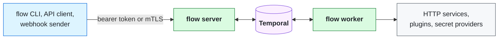
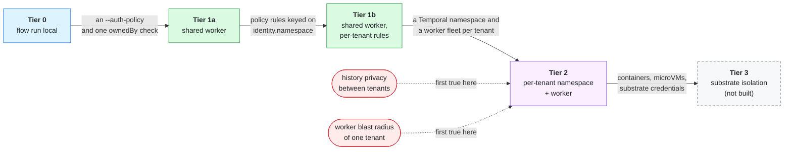

# Deployment

A Flowstate deployment runs three kinds of process. This page is the reference
for running them for a team: what isolation each arrangement gives you, what
each topology looks like as commands and unit files, and where the sharp edges
are. It states what is true today and cites the code that makes it true.

[Get started](GETTING_STARTED.md) covers `flow server dev`, the single-process
stack for a laptop. Everything below is about running the pieces separately.

## What you run

| Process | What it does | What it needs |
| --- | --- | --- |
| **Temporal** | Stores every run's history, timers, and signals, and hands work to workers. | A Temporal service you operate, or Temporal Cloud, and a namespace per isolation boundary ([below](#read-this-before-you-share-a-temporal-namespace)). |
| **`flow server`** | Serves the ConnectRPC API: authenticates each caller, then starts, signals, cancels, and reads runs through Temporal. Also serves webhooks and, when federating, publishes signing keys. | A trust policy (`--auth-policy`) naming the issuers it accepts; `--rpc-resource` when an issuer mints bearer tokens; TLS, or `--tls-terminated-upstream` behind a proxy, off loopback. |
| **`flow worker`** | Executes runs: evaluates the workflow, calls tasks and plugins, resolves secrets, and enforces egress and task policy. | A Worker Deployment version (`--temporal-deployment-name`, `--build-id`) that has been made current; the policies, secret providers, and plugins its runs need. |

The server and the workers never talk to each other: they meet at Temporal. A
run submitted with no worker polling its task queue is accepted and waits.


```mermaid
flowchart LR
  Caller["flow CLI, API client,<br/>webhook sender"]
  Server["<b>flow server</b>"]
  Temporal[("<b>Temporal</b>")]
  Worker["<b>flow worker</b>"]
  Targets["HTTP services,<br/>plugins, secret providers"]

  Caller -->|"bearer token or mTLS"| Server
  Server <--> Temporal
  Temporal <--> Worker
  Worker --> Targets

  classDef authoring fill:#DDF4FF,stroke:#0969DA,color:#1F2328
  classDef runtime fill:#DAFBE1,stroke:#1A7F37,color:#1F2328
  classDef durable fill:#FBEFFF,stroke:#8250DF,color:#1F2328
  classDef neutral fill:#F6F8FA,stroke:#57606A,color:#1F2328
  class Caller authoring
  class Server,Worker runtime
  class Temporal durable
  class Targets neutral
```

### Before a production rollout

1. **Decide how tenants are isolated.** Anyone with Temporal access to a
   namespace can read every run in it. Choose a tier from
   [the four-tier isolation model](#the-four-tier-isolation-model).
2. **Configure the server.** A trust policy with at least one issuer,
   `--rpc-resource` set to the URI clients reach, and TLS
   ([blockers](#blockers)).
3. **Version the workers, and promote each build.** Give every build a
   `--build-id`, then make it the deployment's current version with Temporal's
   CLI or UI; `flow` does not. See [Worker versioning, every
   time](#worker-versioning-every-time).
4. **Write an egress policy.** With none, the `http` task refuses internal
   addresses and may reach any public one. An `--egress-policy` file with `allow:`
   rules turns that into an allowlist.
5. **Grant secrets deliberately.** Nothing is readable until a `secrets:` rule
   allows it; configure only the providers you use. See
   [Secrets and credentials](SECRETS.md).
6. **Restrict tasks if you need to.** With no `--task-policy`, every identity
   may dispatch every task; see the [task policy reference](reference/task-policy.md).
7. **Pin plugins.** Keep the plugin directory writable only by its owner, and
   [pin each plugin's digest](#pinning-which-bytes-a-plugin-name-may-run).
8. **Watch it.** Wire [health checks](#health-checks-and-probes),
   [metrics](#metrics), and the [audit trail](#audit-trail) before the first
   real run, and decide whether an audit outage should stop work
   (`--audit-required`).

The [systemd recipe](#single-vm-ec2-or-similar-systemd--the-best-supported-production-shape)
is the best-supported starting point, and
[Architecture: Deployment portability](ARCHITECTURE.md#deployment-portability)
shows the same process shapes against local, self-hosted, and Temporal Cloud.

## Read this before you share a Temporal namespace

> [!WARNING]
> If two tenants' runs execute in the same Temporal namespace, anyone with
> Temporal UI or `tctl`/`temporal` CLI access to that namespace can read **every
> tenant's** workflow history: the full compiled specification, every step's
> inputs and outputs, the identity claims a run carries, and its memo.

That access is Temporal's, not Flowstate's — Temporal's own visibility and
namespace permissions are what would have to gate it, and most self-hosted
clusters don't gate per-workflow.

Flowstate's own tenancy checks are real: `Get`, `GetTimeline`, `Signal`,
`Cancel`, and `Terminate` on another tenant's run all answer `NotFound` (one
`ownedBy` check, reported as not found rather than `PermissionDenied` so a
probe learns nothing about what exists), `List` returns only the caller's own
runs, and a run's
namespace comes from the authenticated caller, never from the workload itself
(`docs/ARCHITECTURE.md#tenancy`). None of that reaches someone who talks to
Temporal directly instead of through the Flowstate API. **The Flowstate API's
tenancy governs the Flowstate API, and nothing downstream of it.**

This is the argument for [Tier 2](#the-four-tier-isolation-model) below: if
two tenants must not be able to read each other's history, they need separate
Temporal namespaces, not just separate rows filtered by the Flowstate server.
Everything else in this document is detail underneath that one sentence.

## The worker is the tenancy boundary

Every tenant whose runs a worker processes shares that worker's process. A
plugin binary the worker launches, or a program `exec:` starts, runs *inside*
that boundary — with the same process authority the worker itself has,
including the ability to read anything the worker's own memory holds. This
follows from how plugins are isolated at all: separate processes protect
against a crash or a runtime bug, not against code doing deliberately what its
author wrote (`docs/ARCHITECTURE.md#plugins`). A launched plugin is trusted
code, full stop; the controls after that point — `secret_inputs`, the output
scrubber — narrow what a *vetted* plugin can leak by accident, and are not
containment against one that is actively hostile.

Concretely: a plugin, or anything that achieves code execution inside a
worker process, reaches every secret material that worker holds for every
tenant it serves — not just the tenant whose run happened to launch it.

**What the host isolates, stated plainly (#1010):** a plugin runs as the same
user as the worker, with the worker's full filesystem, network and kernel
reach. The host guarantees which bytes run when pinned, and that the plugin
does not directly inherit the worker's environment. The clean launch
environment is not a confidentiality boundary: where the OS permits
same-user process inspection, a plugin may still read the worker's
environment and memory. It does not constrain what the plugin does with the
worker's own privileges — resource limits, filesystem visibility and syscall
filtering are the deployment's job, exactly as they are for the worker
itself. The host isolates **by process, not by privilege**, and no schema
vocabulary claims otherwise; see [the four-tier isolation
model](#the-four-tier-isolation-model) for where that kind of control
actually lives.

Two more claims are true only within narrower limits than they first sound,
for the same reason as above: same-user process inspection. A plugin's
socket rejects a caller that never received the per-launch token, but that
token sits in the worker's own memory before launch and moves into the
plugin's own memory afterward — over a pipe on an inherited descriptor
rather than the environment, so it is not one more thing `pluginEnv` has to
guard, but memory inspection does not care which path a value arrived by
(`launch.go`'s `tokenPipe`, `transport.go`'s `authInterceptor`). The
guarantee is against a stranger that was never handed the token, not
against the plugin itself or a same-user process that can read either
process's memory. And group termination reaches every descendant left in
the plugin's process group whether the host stops it while the leader is
still alive (`instance.stop`) or the leader exits or crashes on its own
first — the launch goroutine that reaps it signals the group immediately,
then polls and escalates to SIGKILL (`launch.go`'s
`escalateAbandonedGroup`) — but only a descendant that stayed in the
group; one a plugin deliberately forked into a session of its own is
unreached either way, and neither path is containment against a plugin
actively working to evade it, which the opening paragraph already says
plainly. `instance.stop` waits for that escalation to finish before it
returns. If the caller's context ends first, the escalation is cut short
and sends its SIGKILL at once (bounded by a further second for it to
land), the same rule `instance.stop` applies to a leader that outlives
its context. So a caller winding a plugin or the whole host down
(`Host.Close`) does not return, and the worker process does not exit,
leaving a stubborn descendant that nothing will kill. Run the worker under
an init process (`docker run --init`, tini) rather than as PID 1: orphaned
helpers reparent to PID 1, and one that never reaps them leaves zombies
that keep the group looking alive, so every plugin stop waits out its full
grace period (#2078).

### Pinning which bytes a plugin name may run

A plugin name is a mutable reference: whoever can write the file at that
path chooses what this worker executes under it, forever and silently. A
digest pin turns one name into an immutable reference, checked before the
process exists — a compromised plugin's own announcement of itself cannot
take part in the decision to admit it. It is opt-in per name: an unpinned
name launches exactly as it always has, so pinning is adopted one plugin at a
time rather than as a flag day for a whole fleet (`pkg/flowstate/v1/plugin/config.go`).

Read the digest to pin from `flow plugins --plugin-dir DIR`, which prints it
as `distribution_digest:` under each plugin (`flow plugins -o json` carries the
same value as `distributionDigest`). It is the value the host measures at
launch, and the worker's own "plugin ready" log record reports it as
`distribution`. `flow plugins` launches each plugin with the pins you configure,
so a pinned plugin whose binary does not match is refused rather than printed;
the printed value is what that launch measured, not an attestation. A name with
no pin, as in first adoption, launches unpinned. Where
descriptor execution is unavailable (a non-Linux host, a Linux host without a
usable `/proc`, or a script or other interpreter-run image) the host hashes
the opened file but executes the path, so a replacement between the two could
make the printed digest differ from the bytes that ran; a pinned launch is
refused there for exactly that reason (`pkg/flowstate/v1/plugin/admission.go`).
To check it independently, `sha256sum` over the installed binary, prefixed
`sha256:`, gives the same value provided the file at that path is unchanged:

```console
$ echo "sha256:$(sha256sum /usr/local/lib/flowstate/plugins/flowstate-plugin-github | cut -d' ' -f1)"
sha256:1f3d...c2
```

Rather than copying digests by hand, `flow plugins` turns what it measures into
the pins file and checks a pins file against it:

```console
$ flow plugins --plugin-dir /usr/local/lib/flowstate/plugins --emit-pins \
    > /etc/flowstate/plugin-pins.yaml
$ flow plugins --plugin-dir /usr/local/lib/flowstate/plugins \
    --diff-pins /etc/flowstate/plugin-pins.yaml
changed  github
  pinned:   sha256:1f3d...c2
  measured: sha256:77aa...09
added    slack (found but not pinned; it launches unpinned)
missing  jira (pinned but not found; a worker restricted to it would refuse to start)
$ echo $?
1
```

`--emit-pins` writes the same `pins:` document `--plugin-pins` reads, one entry
per plugin found. It is a measurement, not a verdict: run against a directory
nobody has vetted, it pins whatever is there, which is trust on first use.
Review the binaries (or run it on a build you produced) before committing the
file. `--diff-pins` compares the directory with a file and reports each plugin
as `changed`, `added` (found, unpinned) or `missing` (pinned, not found),
exiting 1 on any drift and 0 when they match, so a swapped binary is a review
artifact before a worker restart turns it into a refusal. Both modes launch
the plugins unpinned (a `--plugin-pin` or `--plugin-pins` given alongside is
not applied) and take no `--output` format; the diff is the same
launch-time measurement described above, with the same limit where descriptor
execution is unavailable. For an upgrade, emit again and review the file's
diff in version control.

One-off pins go straight on the command line, repeatable:

```console
$ flow worker --plugin-dir /usr/local/lib/flowstate/plugins \
    --plugin-pin github=sha256:1f3d...c2
```

A deployment pinning more than a couple of plugins keeps them in a file
instead — the artifact an operator diffs in code review — and points every
verb that launches plugins at it, the same way `--task-policy` and
`--egress-policy` point at theirs:

```yaml
# /etc/flowstate/plugin-pins.yaml
pins:
  github: sha256:1f3d...c2
  slack: sha256:9ab0...44
```

```console
$ flow worker --plugin-dir /usr/local/lib/flowstate/plugins \
    --plugin-pins /etc/flowstate/plugin-pins.yaml
```

Unknown keys and a name pinned twice — in the file, on the command line, or
split across both — are startup errors rather than a pin silently dropped:
the same "fail closed on configuration" rule `--task-policy` follows. A pin
naming a plugin `--plugin` does not admit, or any pin given with no
`--plugin-dir` for it to apply to, is refused for the identical reason: a
pin nothing can ever check is not protecting anything, however confidently
an operator believes it is. `$FLOWSTATE_PLUGIN_PINS` is the pins-file
default, mirroring `$FLOWSTATE_PLUGIN_DIR`, and every worker-facing verb that
launches plugins — `worker`, `server`, `mcp`, `run local`, `lsp`, `plugins` —
takes both flags, because all of them build a host through the one place in
the CLI that does (`cmd/flow/plugins.go`'s `pluginFlags.host`).

A pin says only that these exact bytes are the ones entitled to answer to
this name. It says nothing about who built them or whether anyone vouches
for them — that is the open half of #146, and it is not what this answers.

**The good news, which nobody had written down before this document:**
`pluginEnv` builds a plugin's environment from nothing, not by inheriting the
worker's own (`pkg/flowstate/v1/plugin/launch.go`, `pluginEnv`). The worker's
environment is where its own credentials live — a Temporal API key, a cloud
role, whatever the deployment set as `FLOWSTATE_SECRET_*` — and a plugin's
*own* environment block does not carry any of it unless an operator names it
explicitly in `Config.Env`: that is non-inheritance, the narrower claim the
caveat above already draws the line around, not immunity from the same-user
process inspection that caveat names. So the blast radius above is real, but
it is *not* "a plugin can read `$FLOWSTATE_SECRET_DB_PASSWORD` off the
worker's environment just by existing, with no OS-level access beyond its
own process" — it has to be handed a secret through the sanctioned path
(`TaskManifest.secret_inputs`, resolved worker-side and passed over the
socket), find it through the inspection the caveat above admits, or reach it
some other way. Know this before either over-trusting a plugin ("it's
sandboxed, right?") or over-building a containment layer that duplicates a
property the worker already has.

### SQL plugin deployment and migration

`sql.query` and `sql.exec` now require the entire `dsn` input to be a host
secret reference. Literal DSNs are rejected during validation and again before
plugin dispatch. Move each existing DSN into the deployment's configured secret
backend and write `${secret('provider:name')}` in the Flowfile; `flow fix` cannot
do this safely because creating or authorizing deployment secret state is not a
source rewrite.

Upgrade the worker and `flowstate-plugin-sql` together. The host refuses an SQL
manifest that does not assert the required-secret contract for both tasks, so a
pre-policy SQL binary cannot continue under a newer worker even though other
protocol-v3 plugins remain compatible.

Credential source is not destination authorization. A worker loading the SQL
plugin must also receive `--egress-policy` with `postgres` in `egress.schemes`
and exact allow rules/networks/ports for the database. The host forwards that
same operator-owned policy snapshot to the first-party SQL plugin, so a file
replacement during startup cannot make HTTP and SQL enforce different bytes. A
worker started without `--egress-policy` grants the default policy its own
built-in HTTP task runs under, and the SQL plugin refuses to connect under it
with a message naming the flag: a database destination is not something a
deployment authorizes by not writing a file. That refusal does not stop the
plugin from serving discovery and validation, so `flow plugins` and `flow tasks`
still describe it. A malformed policy never reaches the plugin at all: `flow`
refuses the file when it reads it, and the plugin host refuses the grant before
it launches anything. The SQL plugin checks
host and port rules before DNS, resolves
and authorizes every address for every DSN host, pins that set, rechecks the
actual TCP target immediately before each connection, requires verified TLS,
and rejects Unix sockets and filesystem-reading connection options.
Egress policy files are limited to 64 KiB. Besides bounding configuration work,
this leaves room for the immutable base64 snapshot below Linux's per-string
environment limit when the worker launches the plugin.

Released SQL plugins no longer execute SQLite DSNs. Embedded SQLite grants the
plugin worker-filesystem authority (including URI modes, symlinks, `ATTACH`, and
`VACUUM INTO`) that a network egress policy cannot bound. Migrate those workflows
to PostgreSQL rather than treating the plugin process as filesystem confinement.
Finally, allow `sql.query` and `sql.exec` separately in task policy: read access
does not imply the write capability.

### Slack outbound plugin

`slack.post` and `slack.update` are the notification half of approval and
human-in-the-loop flows. They post and replace Slack messages (plain text, a
vendor-neutral card, or native Block Kit) and keep an approval's outcome on the
message that asked for it; they do not receive Slack interactions or authorize
an approval. Verified inbound events bridging into Flowstate signals remain a
separate control-plane concern.

The entire `token` input must be a host-resolved secret reference such as
`${secret('env:SLACK_BOT_TOKEN')}`. Destination authority comes from the worker's
egress grant, and the actual HTTP client enforces DNS, address, port, redirect,
TLS, credential/identity-aware CEL rules, and response bounds on it. A worker
with no `--egress-policy` grants the default policy built-in HTTP runs under,
which permits public HTTPS and therefore `slack.com:443`; a deployment that wants
this plugin narrowed to that one destination — or stopped entirely — writes the
policy, and `examples/plugins/slack/egress-policy.yaml` is that shape. A grant
that cannot be read at all (no worker launched the process) still fails closed.
Neither the Flowfile nor the plugin manifest grants that destination authority,
and running the plugin as another process does not confine its ambient network
or filesystem access.

Every post also requires the host-attested production mode. Local rehearsal and
unknown modes are refused before network access, because a preview that sends a
real notification is not a safe rehearsal. Operators must allow `slack.post` and
`slack.update` in task policy independently from permitting the plugin binary to
launch.

A post carries a workflow-supplied UUID (`idempotency_key`) as Slack's
`client_msg_id`, but Slack does not document a complete deduplication guarantee.
The plugin retries nothing internally: a definite 429 or initial-hop operator
rate-limit refusal carries a bounded delay into the workflow retry mechanism,
while connection loss, timeout, malformed acknowledgement, a rate limit after a
redirect, and ambiguous server errors on a post return non-retryable unknown
outcomes. Inspect Slack before manually retrying one of those. An update names
its message, so the same outcomes on `slack.update` are retryable: applying the
same content to the same message twice is the same as once.

### Webhook outbound plugin

`webhook.send` signs a body and POSTs it once to a receiver, which is the sending
half of a webhook trigger's `verify:` block. Its `scheme` is `hmac_sha256`
(default) or `stripe`, the schemes the engine's receiver verifies, and it signs
with the engine's own signer, so a delivery it sends verifies at a Flowstate
receiver holding the same key and at nothing else. The signed bytes are the
`body` text, byte for byte; nothing is re-encoded.

The entire `signing_key` input must be a host-resolved secret reference such as
`${secret('env:PEER_WEBHOOK_KEY')}`; the key is resolved worker-side, used only as
the HMAC key, and never sent, returned, or echoed in an error. Should a receiver
echo the key or the signature, the `response` output replaces them with
`[redacted]`. Destination authority is the worker's egress grant, taken exactly
as `slack` takes it: the default permits public HTTPS and denies internal ranges,
and an operator policy narrows it (`examples/plugins/webhook/egress-policy.yaml`).
A delivery is marked as carrying a credential, so a `credentials && ...` rule
sees it. Redirects are not followed, so a signed delivery goes only to the URL
the author named. The body is capped at 1 MiB, the response output at 64 KiB, one
request is bounded to 30 seconds, and nothing is retried inside the plugin: a
429 carries its delay into the workflow retry mechanism, while a lost response
or a 5xx is an unknown outcome that is not retried automatically. Send an
`idempotency_key` (the `Idempotency-Key` header) so a receiver can deduplicate
the delivery you choose to retry.

## The four-tier isolation model

Each tier is a set of claims a security reviewer can check independently.
Nothing here is aspirational — every ✅ is traced to code, and every ❌ is
something to stop assuming once you've read it.

Each tier adds exactly one boundary to the one before it, and the two claims
people most often assume they already have arrive last:


```mermaid
flowchart LR
  T0["<b>Tier 0</b><br/>flow run local"]
  T1a["<b>Tier 1a</b><br/>shared worker"]
  T1b["<b>Tier 1b</b><br/>shared worker,<br/>per-tenant rules"]
  T2["<b>Tier 2</b><br/>per-tenant namespace<br/>+ worker"]
  T3["<b>Tier 3</b><br/>substrate isolation<br/>(not built)"]

  T0 -->|"an --auth-policy<br/>and one ownedBy check"| T1a
  T1a -->|"policy rules keyed on<br/>identity.namespace"| T1b
  T1b -->|"a Temporal namespace and<br/>a worker fleet per tenant"| T2
  T2 -->|"containers, microVMs,<br/>substrate credentials"| T3

  History(["history privacy<br/>between tenants"]) -.->|"first true here"| T2
  Blast(["worker blast radius<br/>of one tenant"]) -.->|"first true here"| T2

  classDef authoring fill:#DDF4FF,stroke:#0969DA,color:#1F2328
  classDef runtime fill:#DAFBE1,stroke:#1A7F37,color:#1F2328
  classDef durable fill:#FBEFFF,stroke:#8250DF,color:#1F2328
  classDef govern fill:#FFEBE9,stroke:#CF222E,color:#1F2328
  classDef planned fill:#F6F8FA,stroke:#57606A,stroke-dasharray:5 4,color:#1F2328
  class T0 authoring
  class T1a,T1b runtime
  class T2 durable
  class T3 planned
  class History,Blast govern
```

Tier 3 is dashed because it is documented and not built: it is what a substrate
provides, not something Flowstate implements. The same claims as a grid, which is
the form to hand a reviewer:

| Claim | Tier 0 | Tier 1a | Tier 1b | Tier 2 | Tier 3 |
| --- | --- | --- | --- | --- | --- |
| Identity is verified rather than asserted | ❌ | ✅ | ✅ | ✅ | ✅ |
| Every cross-tenant API verb refused | n/a | ✅ | ✅ | ✅ | ✅ |
| Secrets, tasks and egress scoped per tenant | rehearsal only | ❌ | ✅ | ✅ | ✅ |
| Workflow history private between tenants | n/a | ❌ | ❌ | ✅ | ✅ |
| Worker blast radius is one tenant | ❌ | ❌ | ❌ | ✅ | ✅ |
| Enforcement below the process (network, kernel) | ❌ | ❌ | ❌ | ❌ | substrate's |

A cell is a summary of the tier's section below, which is where the tracing to
code lives; read the section before relying on a tick.

One definition the grid depends on, because a reviewer will otherwise find the
counter-example immediately: **Tier 1a means `flow server --auth-policy`.**
`--insecure-no-auth` is not a weaker Tier 1a, it is Tier 0's identity model with
a network listener in front of it — every caller is admitted anonymously
(`auth.InsecureAnonymousVerifier`), so every run belongs to the same empty
namespace and there is no tenancy for the `ownedBy` check to enforce. The code
draws the same line: `authVerifier` refuses to start a server given neither a
policy nor that flag, and treats the flag as a thing an operator says out loud
rather than a fallback for a policy that failed to load
(`cmd/flow/main.go`). The Local development recipe below is labelled a Tier 0/1a
*boundary* for this reason.

Naming both is refused at start-up rather than resolved by priority. A server
given `--insecure-no-auth` alongside `--auth-policy` — or alongside an inherited
`FLOWSTATE_AUTH_POLICY`, which is the same sentence typed somewhere else — would
otherwise authenticate nobody while its configuration still read as Tier 1a,
with a trust policy beside it that nothing opens. Pass one or the other.

### Tier 0 — `flow run local`

No server, no Temporal, no worker process boundary. A single command runs a
Flowfile to completion in the calling process.

- ✅ Isolation is the OS user running the command — normal filesystem and
  process permissions, nothing Flowstate-specific.
- ❌ Identity is *asserted*, not verified: `--as-namespace`, `--as-deployment`,
  and `--as-claim` on `flow run local` let you rehearse policy as any tenant
  you like, with no credential check, because that is the point of local
  rehearsal (`runLocalCmd` flags in `cmd/flow/main.go`). Every surface that
  reads an identity reads that one — the secret rules, a credential the run
  assumes, plugin tasks, `run.identity`, and the `--task-policy` and
  `--egress-policy` rules — so what you rehearse is what the worker would
  decide. What an assertion cannot do is travel: `run.local` reads true, and a
  credential minted for a local run carries a `_local` subject component no
  server-attested run can produce, so a cloud trust policy written for
  production will not match a rehearsal's.
> [!WARNING]
> Never run Tier 0 as a shared service. There is no authentication surface to
> turn on — it doesn't have one to withhold, and every `--as-*` flag above is
> an assertion anyone reaching it can make.

### Tier 1a — shared worker, zero configuration

One Temporal namespace, one worker fleet, one Flowstate server, `flow server`
started with an OIDC/workload-identity `--auth-policy`. This is what running
`flow worker` and `flow server` with no per-tenant flags gets you.

The policy is part of the definition, not a recommendation inside it: every
claim below rests on a caller whose identity was *attested*, and `flow server
--insecure-no-auth` — which the server accepts only because an operator asked
for it in as many words — admits everyone anonymously into one empty namespace,
which is Tier 0's model reachable over a socket rather than a weaker Tier 1a.
Read the ticks below as claims about a server started with a policy.

Every issuer entry says which control-plane actions its caller may perform, in
an `actions:` list that is required: an entry without one is refused when the
policy loads, because an omission that grants everything is how a caller ends up
holding more than anyone decided. Actions use the schema-owned OAuth scope spellings advertised by the
protected-resource metadata; `role` remains a descriptive audit label and grants
nothing by itself:

```yaml
issuers:
  - name: dashboard
    issuer: https://idp.example.com
    audiences: [https://flowstate.example.com/rpc]
    role: reader
    actions: [workload.read]
    require:
      - claim: client_id
        any_of: [dashboard]
  - name: ci
    issuer: https://idp.example.com
    audiences: [https://flowstate.example.com/rpc]
    role: submitter
    actions: [workload.run]
    require:
      - claim: client_id
        any_of: [ci]
```

A token can narrow what its entry grants but never widen it. The token's `scope` (space-delimited) or `scp` (an array, or a space-delimited string as Microsoft Entra issues it) claim is
intersected with it: a token whose scopes name only some of the listed actions
holds only those, one that names none of them holds none, and a scope the entry
does not list adds nothing. A token with no scope claim holds the entry's full
list, and a token carrying both
claims or either in the wrong shape is refused.

These disjoint entries let the dashboard inspect and CI submit while neither may
terminate. `actions: []` grants no control-plane action. Every action is granted
only to an entry that lists it, with one exception: `identity.read`, which
`Whoami` (`flow auth whoami`) needs, is held by every caller, because the answer
is only the caller's own principal and withholding it would hide exactly the
misconfiguration it diagnoses. An embedder's decider can still refuse it. The disclosure actions
`workload.reveal_sensitive` ([Secrets](SECRETS.md)), `payload.decode`, and `payload.encode`
([Payload encryption](ENCRYPTION.md)) also gate what is shown, so a reader that
may see sensitive values lists both the read and the reveal:

```yaml
    actions: [workload.read, workload.reveal_sensitive]
```

Grants match exactly: `workload.run` does not imply cancel or terminate, and
token `scope`/`scp` claims do not grant authority in this slice.

- ✅ The Flowstate API refuses every cross-tenant verb: one shared addressing
  gate checks Flowstate execution membership and then `ownedBy`, reported as
  `NotFound` — see [above](#read-this-before-you-share-a-temporal-namespace).
- ✅ No schema field lets a caller name a namespace, a fairness weight, or a
  sender — a run's tenancy comes only from the authenticated caller, never
  from anything a Flowfile or a request body can set.
- ✅ Secrets bind per-identity and fail closed: a deployment that registers no
  secret rules refuses every reference (`SecretAccessPolicy`, "absent means
  nothing" — `pkg/flowstate/v1/auth/secretpolicy.go`).
- ✅ Metadata endpoints (cloud instance-metadata IPs) are denied even inside an
  otherwise-allowed network — netpolicy's default posture, not a rule someone
  has to remember to add.
- ⚠️ The built-in task set is `log`, `http` and `exec`. `log` and `http` have
  nothing to escape. `exec` is denied until `--exec-policy` /
  `FLOWSTATE_EXEC_POLICY` names the programs, directories, environment, time and
  output bounds, and it is **not a sandbox**: the child runs as the worker's user
  with no namespace, cgroup, seccomp or filesystem confinement, and the egress
  policy does not apply to it. Enable it only on workers whose tenancy you accept
  that for (see THREAT_MODEL.md).
- ❌ **Cannot claim history privacy.** See the top of this document — this is
  the tier where it bites hardest, because there is exactly one Temporal
  namespace and it holds everyone's history.
- ❌ **Cannot claim plugin or process containment.** A launched plugin runs
  with the worker's authority; see [above](#the-worker-is-the-tenancy-boundary).
- ⚠️ **Per-tenant egress is a Tier 1b property, not a limitation of the tier.**
  One worker still runs one netpolicy configuration, but that configuration's
  CEL rules can now key on the calling tenant — see Tier 1b below. A single
  rule set that ignores identity governs every tenant's `http:` steps alike;
  writing an identity-scoped rule is what makes egress per-tenant on one worker.

### Tier 1b — shared worker, per-tenant policy rules

Same topology as 1a, plus rules that key on the calling tenant. Real today,
cheap to turn on, and undocumented until now.

- ✅ Secret rules see the workload as an object, including its namespace:
  `secret.scheme == "env" && workload.namespace == "acme"` is a rule you can
  write today (`SecretAccessPolicy.Allow` doc comment,
  `pkg/flowstate/v1/auth/secretpolicy.go`). It's wired through the same
  `--auth-policy` file passed to `flow worker` — the flag's own help text
  says plainly that its secrets rules "authorize worker-side resolution."
- ✅ Two tenants sharing one worker can therefore have secrets that resolve
  differently, or not at all, purely as a function of `workload.namespace` in
  one YAML file.
- ✅ **Task policy keyed on `identity.namespace` is now real.** The design
  record this document is written from (issue #236) described it as "once
  #228 lands" — #228 landed during the writing of this document. It is a
  *separate* mechanism from the secret rules above: `--task-policy` (or
  `$FLOWSTATE_TASK_POLICY`) on `flow worker` and `flow run local` — never on
  `flow server` or `flow validate`, for the same reason egress policy isn't:
  a deployment refusal is not a file diagnostic (`cmd/flow/taskpolicy.go`).
  A rule is CEL over `task` (the qualified task name) and `identity`
  (`identity.subject`, `.issuer`, `.namespace`, `.claims`, `.principal`, `.kind`,
  `.actions` — the run's attested identity, the same `principal.Caller` shape
  egress and exec rules read), so `task == "log" && identity.namespace != "platform"` denies a
  task to every tenant but one. Fail-closed the same way secret rules are: no
  policy configured permits everything (today's default, unchanged); a
  malformed policy refuses the command to start rather than running
  unrestricted. `examples/task-shape-policy/` is the worked example — a
  Flowfile with no gate left in it at all, refused purely by worker
  configuration. Two separate files, two separate flags
  (`--auth-policy`'s `secrets:` rules and `--task-policy`'s rules), governing
  two separate decisions — don't conflate them when writing one deployment's
  configuration.
- ✅ **Egress keyed on `identity.namespace` is now real (#240).** The egress
  CEL environment carries an `identity` object — `identity.subject`, `.issuer`,
  `.namespace`, `.claims`, `.principal`, `.kind`, `.actions` — the same run identity the secret and task rules
  read, from the same source. So `identity.namespace == "team-a" && host ==
  "partner-a.example.com"` in one worker's `--egress-policy` file lets team-a
  reach a host that every other tenant on that worker is denied — the one
  asymmetry that previously kept egress out of this tier. It is available in
  both rule scopes, so a resolved-address rule (`... && ip == "10.0.0.5"`) can
  be tenant-scoped too. Fail-closed like the others: a run that names no
  identity (one predating identity, or a local rehearsal started without
  `--as-namespace`) presents an empty namespace and matches no tenant rule. A
  local run started *with* one presents it, so `flow run local --egress-policy
  ... --as-namespace team-a` rehearses the answer this worker would give
  team-a rather than the answer it gives a caller with no tenant at all
  (#295) — asserted, never verified, which is what Tier 0 above says about
  every `--as-*` flag. `examples/egress-policy.yaml` is the worked example. This is Tier 1b — one shared worker — not the per-tenant worker of
  Tier 2, which remains the stronger answer where history privacy is also
  required.
- ❌ Still no history privacy and no plugin/process containment — those are
  Tier 2 properties, not policy-rule properties.

### Tier 2 — per-tenant Temporal namespace + per-tenant worker

A tenant's runs execute against their own Temporal namespace, polled by a
worker fleet that serves only that tenant.

- ✅ The routing exists on the server side and is fail-closed, not
  fail-open. `auth.Tenancy` (a field of the trust policy loaded from
  `--auth-policy`) maps a Flowstate namespace onto a Temporal namespace;
  `temporalclient.Pool` dials one client per mapped namespace at server
  startup — an unreachable namespace fails the *start*, not the first
  tenant's request; and `FlowstateServer.clientFor` **refuses** a tenant the
  mapping doesn't cover, rather than silently routing it onto the default
  client (`clientFor`'s own doc comment: "a refusal is a misconfiguration
  someone fixes; a fallback is a tenancy breach nobody notices" —
  `pkg/flowstate/v1/server/server.go`). This is genuinely built, tested, and
  undocumented before this file.
- ✅ **The worker side is built.** `flow server --task-queue-prefix <prefix>`
  routes each tenant's runs to a task queue of that tenant's own, named
  `<prefix>_<namespace>`, derived from the *authenticated* tenant and never
  from the request — the same rule the tenant memo and the fairness key
  already follow. `flow worker --tenant <namespace> --task-queue-prefix
  <prefix>` starts a fleet that polls exactly that queue, and **refuses** any
  run belonging to anyone else, terminally and non-retryably, rather than
  executing it with this worker's secrets, egress policy and plugins. Both
  sides compose the name with the same function, which is the only way they
  can be relied on to agree.

  Unset, the prefix routes nothing and every tenant's runs go to
  `flowstate-run-task-queue` exactly as they always have — a single-team
  deployment has nothing to route between and should not have to say so.

  Two combinations are refused at startup rather than documented as things not
  to do. `--tenant` with no queue of its own is refused, because a
  tenant-restricted worker on the *shared* queue would race the general fleet
  for every tenant's runs and fail the ones it won — a flag meant to contain
  one misconfiguration turned into an outage for everybody else.
  `--task-queue-prefix` with no `--tenant` is refused because the queue a
  prefix composes is a function of the tenant, so half the pair addresses
  nothing.

  **Why the queue name cannot be forged across a tenant boundary.** A
  namespace is `auth.ValidateNamespace`'s grammar — lowercase letters, digits,
  and a dash that is never first — so it cannot contain `_`; a prefix is
  checked against the same grammar, so it cannot either; and the composed name
  joins them with exactly one `_`. The first `_` is therefore always the
  separator, at `len(prefix)`, so two `(prefix, namespace)` pairs that composed
  one string would have to be the same pair. The default tenant's component is
  `_default`, which begins with the one character a namespace may not contain,
  so a tenant named `default` gets `<prefix>_default` and the default tenant
  gets `<prefix>__default` — different queues. This is the same argument the
  `_default` component of an assertion subject makes, and it is the fix for the
  ambiguity that let the env secrets provider resolve two tenants' secrets to
  one variable (`CLAUDE.md`). Asserted over a cross product of straddling
  pairs by `TestTaskQueueNamesCannotBeForged`.

  What this is *not*: per-**step** queue routing ("run this step on the GPU
  fleet"), which is the same mechanism applied at a different level and is not
  built.
- ✅ What Tier 2 buys once wired to a distinct namespace per tenant: worker
  blast radius drops to one tenant (a plugin compromise on tenant A's worker
  fleet cannot reach tenant B's secrets, because they're different
  processes), history is isolated (the point at the top of this document, now
  actually addressed), and per-tenant egress becomes a *deployment* fact — run
  tenant A's worker fleet with tenant A's `--egress-policy` file — rather than
  something netpolicy's CEL would need a namespace attribute for.
- ⚠️ **Mapping completeness is a warning, not a refusal.** A tenant mapped
  onto a Temporal namespace, or onto a task queue, with nothing polling it
  does not fail: its runs are accepted, start, and sit `RUNNING` forever with
  nothing wrong reported anywhere — invariant 9's failure shape arriving
  through a configuration path. `flow server` therefore checks, at startup,
  whether a worker is polling each routable tenant's queue and logs a warning
  naming the tenant and the queue when none is. It warns rather than refusing
  because a server that would not start until its fleet was already polling
  deadlocks every deployment that starts the server first, and because a
  poller count is true at an instant rather than durably. **Watch for that
  line**; it is the difference between finding this at deploy time and finding
  it when somebody asks why their run has been running since Tuesday.

  Note the tenant that is easiest to miss: a mapping with a `default` also
  routes the *empty* namespace — what an unauthenticated caller, and a caller
  whose token names no namespace, belongs to. It has a queue like any other
  and appears in the mapping under no name at all.

**A worked Tier 2 command line, both sides:**

```console
# Server: route each tenant onto its own queue, tenants mapped onto Temporal
# namespaces by the trust policy's `tenancy:` block.
$ flow server --auth-policy /etc/flowstate/trust.yaml \
    --rpc-resource https://flowstate.example.com/rpc \
    --task-queue-prefix flowstate-run

# One fleet per tenant. Each gets that tenant's own egress policy and secrets,
# which is the whole point: a compromise of this process reaches one tenant's
# material, which is the claim Tier 1 structurally cannot make.
$ flow worker --tenant team-a --task-queue-prefix flowstate-run \
    --temporal-namespace temporal-team-a \
    --egress-policy /etc/flowstate/team-a/egress.yaml \
    --secret-dir /etc/flowstate/team-a/secrets \
    --temporal-deployment-name flowstate --build-id "$(git rev-parse --short HEAD)"

# And the default tenant of a deployment whose trust policy has a `default`:
$ flow worker --tenant= --task-queue-prefix flowstate-run ...
```

`FLOWSTATE_TASK_QUEUE_PREFIX` sets the prefix on both sides, which is the
convenient way to keep them equal — a worker that spelled it differently would
poll a queue nothing submits to, do nothing forever, and report nothing.

**History encryption follows the same line.** A payload keyring gives each Temporal
namespace its own keys, so a Tier 2 tenant's history is sealed under keys no other
tenant's namespace uses. The server holds every namespace's keys; give each tenant's
fleet a keyring listing only its own namespace
(`--payload-keyring /etc/flowstate/team-a/payload-keyring.yaml`), so a compromise of
that fleet reaches that tenant's history and no other's. A Tier 1 shared namespace
shares its keys. See [ENCRYPTION.md](ENCRYPTION.md).

### Identity egress: where the trust policy may fetch keys from

Every OIDC discovery document and key set the trust policy names is fetched
through an egress policy of its own, `auth.DefaultEgressPolicy`: https only,
to public addresses only, because an issuer URL is operator-supplied and a
discovery document's `jwks_uri` is *issuer*-supplied, so both are addresses an
outside party gets a say in. A self-hosted identity provider is usually not a
public address, and the refusal says which option admits it:

```console
$ flow auth check --auth-policy trust.yaml --token-file alice.jwt
ERROR
auth: issuer metadata or keys are unavailable: issuer "https://idp.local" fetch of
http://127.0.0.1:8555/jwks.json blocked by identity egress policy: denied by
egress policy: http://127.0.0.1:8555/jwks.json (scheme: "http" is not one of
https); configure the trust policy's egress: section to allow this fetch: add
`schemes: [http, https]` to admit a plain-http fetch (what a loopback rehearsal
needs; a loopback address also needs `allow_loopback: true`)
```

The section is the trust policy's own `egress:` block, and its fields are the
ones the worker's `--egress-policy` file takes (the complete set is
`netpolicy.EgressConfig`: it also narrows with `deny_networks`, `allow_ports`,
`deny_ports` and CEL rules, and sets timeouts, TLS and proxy). The four that
widen what an identity provider may be are
`schemes`, `allow_loopback`, `allow_private_networks` and `allow_networks`. A
policy file whose issuer or `jwks_url` the section would refuse (a plain `http`
URL it does not admit, or an IP-literal host in an address class it does not
admit) is refused when it loads, with the sentence above, rather than at the
first token. That check reads the exact request, and the address only when the
host is a literal; a host name is not resolved at load, so one that points at a
denied address is still refused at the first fetch. The in-cluster case, an
identity provider on a private address, admits private networks and keeps https:

```yaml
issuers:
  - name: keycloak
    issuer: https://keycloak.keycloak.svc.cluster.local:8443/realms/acme
    audiences: [https://flowstate.example.com/rpc]
    actions: [workload.run, workload.read]
    namespace: acme

egress:
  allow_private_networks: true
```

A loopback rehearsal on a laptop admits plain http on this machine only:

```yaml
issuers:
  - name: rehearsal
    issuer: http://127.0.0.1:8555
    audiences: [http://127.0.0.1:9233]
    actions: [workload.run, workload.read]
    namespace: rehearsal

egress:
  schemes: [http, https]
  allow_loopback: true
```

`allow_networks:` names one CIDR rather than a whole class, which is the
narrower form for production. Link-local and cloud metadata addresses have no
option, on purpose. The boundary stays default-deny; what the section changes
is what this deployment's own identity provider is allowed to be.

For local rehearsal or an air-gapped deployment, the policy can load a bounded
JSON Web Key Set from disk instead. This performs no identity HTTP request and
therefore needs no `egress:` exception:

```console
$ flow keys public --in ./issuer.pem --jwks > ./issuer.jwks
```

```yaml
issuers:
  - name: local-issuer
    actions: [workload.run, workload.read]
    issuer: https://issuer.example.invalid
    audiences: [http://127.0.0.1:9233]
    namespace_claim: namespace
    jwks_file: /absolute/path/to/issuer.jwks
```

`jwks_file` and `jwks_url` are mutually exclusive. The path must resolve to a
regular file. Its contents are capped at 1 MiB, parsed at server startup, and
never reread while that process is running. Replace it and restart the server to
rotate keys; retain old public keys in the set for the overlap during which
already-minted tokens remain valid. A relative path is resolved from the server
process's working directory, so deployment units should prefer an absolute path.

Every URL the trust policy or a credential exchanger is configured with —
`issuer`, `jwks_url`, a token or IAM endpoint, a protected resource — is refused
if it carries an `@`, or its percent-encoded `%40`, anywhere after the scheme's
`//`: in the path, the query or the fragment as much as before the host, on a
loopback host as much as a public one. Such a URL is refused as carrying
credentials, because a password whose leading characters are digits parses as a
port and leaves the rest of it, and the real host, in what looks like a path
([#2038](https://github.com/picatz/flowstate/issues/2038)). No issuer, key set,
token, resource or metadata URL that Google, Okta, Auth0, Entra ID, Keycloak,
GitHub Actions or AWS and GCP STS publish carries one; the service account email
in GCP's impersonation request is a path this server composes itself under a
validated `iam_endpoint`, not one an operator writes.

### Carrying claims and groups into policy

A token holds far more than authorization needs, and what a run carries is
recorded in its history and can be signed into assertions sent to third parties.
So a policy rule sees only what the issuer entry that admitted the caller says to
carry, in the entry itself; there is no server-wide flag. Everything a rule reads
as `identity.claims` (egress, exec, task, secret and assumption rules) or
`sender.identity.claims` and `run.identity.claims` (`signals:`, `debug:`,
`manual:`) is exactly this, on both drivers:

```yaml
issuers:
  - name: keycloak
    issuer: https://idp.example.com/realms/acme
    audiences: [https://flowstate.example.com/rpc]
    namespace: acme
    actions: [workload.run, workload.read]
    carry_claims:
      - {claim: team, type: string}
      - {claim: acme.cost_center, as: cost_center, type: string}
    groups_claim: realm_access.roles
    group_map:
      flowstate-sre: sre
      flowstate-dev: dev
```

`carry_claims` lists typed claims. `claim` is a top-level name or a dotted path
into nested objects (at most four segments; a token claim whose own name has
dots, such as `https://example.com/team`, is read by that exact name first),
`type` is `string`, `string_list`, `bool` or `number`, and `as` renames the claim
as rules see it (default: the `claim` text, dots included, as
`identity.claims["acme.cost_center"]`). A claim that is absent, of another type
than declared, or over the carried-claim bounds is left out, never coerced or
trimmed, so a rule reading it errors and denies. At most 32 claims are carried;
a list or object claim is at most 4 KiB, 4 levels deep and 512 values.

`groups_claim` is the dotted path of the token's group list, carried as the
list-valued claim `groups`, so `"sre" in identity.claims.groups` reads the same
on every surface whichever IdP supplies it. `group_map` renames IdP values (a
name, an Entra GUID) to the Flowstate group a rule names, and when present it is
also the allowlist: a value it does not list is not carried, so a rule that must
deny on a group has to map that group. The name `groups` is reserved for
`groups_claim`: a `carry_claims` entry that carries it is refused when the policy loads.
The names `act` and `may_act` are reserved the same way, because they are RFC 8693
delegation claims: carry such a claim under another name with `as`.

A claim set that a run or plugin hands back over the carried-claim bounds (a
claim nested deeper than four levels or holding more than 512 values, or more than
32 claims) is refused, not trimmed, and the refusal travels with the identity:
every policy rule that touches `identity.claims`, on egress, exec, task shape,
secret, assumption and signal surfaces, is an evaluation error and denies,
whatever it does with them: a membership or absence test, a comparison with `==`
or `!=` in either order, `size`, or a comprehension. That includes a rule that
only tests absence, such as `!("contractors" in identity.claims)`,
which would otherwise read the dropped claim as missing and permit. Rules that
read no claim are unchanged.

A group list is never trimmed. At most 64 groups of 256 bytes are carried, and a
token that exceeds that, or carries an overage indicator (Entra's
`_claim_names.groups` and `hasgroups`, or `groups_truncated` from a gateway that
flags a cut list), is refused: the server logs an error naming the entry and the
claim, and the caller sees only "token group membership is incomplete or over the
supported bound". Fix it at the IdP: send fewer groups, assign the application
only the groups it needs, or use app roles (`groups_claim: roles`) with a
`group_map`. A token with no groups claim at all carries no groups.

A `kind: mtls` entry carries only the claim `subject` and no groups.

`flow validate --auth-policy auth.yaml workflow.yaml` reads every identity
expression in the Flowfiles (`signals:`, `debug:`, `triggers: manual:`) and in the
policy's own `secrets:` and `federation:` rules. A claim read that no entry
carries is a diagnostic: a rule requiring it can never match. Embedders
that need a different mapping pass `auth.WithClaimMapper` to the verifier; its
result is held to the same bounds.

### Accepting delegated tokens: the `act` chain

An agent that acts for a person arrives with a token that says so: RFC 8693's
`act` claim names the actor, and may nest the actor it acts for in turn. By
default Flowstate refuses such a token (the status is 401, and the reason says
`unsupported "act" delegation claim`), because admitting it as the bare subject
would record the request as the person acting alone. An entry opts in with a
`delegation:` stanza, naming every actor its tokens may list and what each leaves
the caller able to do:

```yaml
issuers:
  - name: agents-idp
    issuer: https://idp.example.com
    audiences: [https://flowstate.example.com/rpc]
    namespace: acme
    principal_kind: human
    actions: [workload.run, workload.read, workload.signal]
    delegation:
      max_depth: 1            # 1 (default) or 2
      actors:
        - issuer: https://agents.example.com
          subject: triage-bot
          actions: [workload.read, workload.signal]
```

The token's chain is read as `{"act": {"iss": "https://agents.example.com",
"sub": "triage-bot"}}`; each link needs a string `iss` and `sub` of at most 1024
bytes. A token is refused whole, never trimmed, when its chain nests deeper than
two or than `max_depth`, when a link is malformed, or when any actor is not listed
by exact `issuer` and `subject` (no wildcard or pattern). `may_act` is refused on
every entry.

A delegated caller holds the **intersection** of what the entry grants the
subject (itself narrowed by the token's own `scope`) and each actor's `actions`.
An actor can take authority away and never add it, so the example above leaves a
caller with `workload.read` and `workload.signal` and without `workload.run`,
even though the person could run alone; an actor that lists an action the entry
does not grant is refused when the policy loads. `kind`, `issuer_entry` and the
namespace still come from the entry alone, and nothing in the chain is carried as
a claim.

What a policy sees is `identity.actors` (a list of `{issuer, subject}`, current
actor first) and `identity.delegated` on every surface, on both drivers, and the
audit record for each decision names the chain beside the subject
(`flowstate.audit.identity.actors`). Guard a read with `delegated`:

```cel
!identity.delegated || identity.actors[0].subject == "triage-bot"
```

`flow auth check` and `flow auth whoami` print the chain and the narrowed actions,
and `flow validate --auth-policy` reports a rule that reads `actors` or
`delegated` when no entry has a `delegation:` stanza. The chain is vouched for only
by the issuer that signed the token; see the threat model's note on delegation.
A stanza must name at least one actor; there is no way to accept every actor.

Delegated callers cannot mint or broker credentials yet. The assertion issuer
and the credential broker refuse an identity that carries a chain (the error
reads `a delegated caller cannot mint or broker credentials yet`), because the
assertions they sign have no `act` claim and would present the delegator as
acting alone. The `jose.verify` task refuses a delegated token for the same
reason.

### Trust policy per identity provider

One issuer entry per identity provider, each pinning the issuer string exactly
(no normalization, so a trailing slash or a `/v2.0` is part of it), an audience
this server's `--rpc-resource` names, and the claims that identify the caller.
Every block below is a complete policy that `flow auth check --auth-policy`
loads, and `go test ./pkg/flowstate/v1/auth` loads each one from this page, so an
example cannot drift from the schema. What the examples cannot prove is what a
provider mints: where a claim name or issuer shape comes from a provider's own
documentation rather than from this repository, a note says to check it against
a real token (`flow jwt inspect`, or your provider's token inspector) before you
rely on it.

A tenant claim that is not already a namespace (lowercase letters, digits and
dashes) is mapped with `namespace_map`: an exact table from a claim value to a
namespace, where a value the table does not list is refused rather than defaulted.
A policy whose entries name a namespace must do so for every entry, so each block
below is one deployment's whole policy, not a fragment to paste beside another's.

**GitHub Actions.** The workflow requests a token for the audience with
`permissions: id-token: write`. `repository` is `owner/name`, which is not a
namespace, so it is mapped:

```yaml
issuers:
  - name: github-actions
    issuer: https://token.actions.githubusercontent.com
    audiences: [https://flowstate.example.com/rpc]
    algorithms: [RS256]
    actions: [workload.run, workload.read]
    namespace_claim: repository
    namespace_map:
      acme/infra: infra
      acme/platform: platform
    max_token_age: 10m
```

**GitLab CI.** A job declares `id_tokens:` with an `aud:` of the RPC resource.
`project_path` is `group/project`, so it is mapped. For a self-managed GitLab the
issuer is the instance's own URL. Add a `require:` rule on `ref_protected` to
admit only protected branches (a note to check: GitLab documents it as the
string `"true"`):

```yaml
issuers:
  - name: gitlab
    issuer: https://gitlab.com
    audiences: [https://flowstate.example.com/rpc]
    actions: [workload.run, workload.read]
    namespace_claim: project_path
    namespace_map:
      acme/infra: infra
      acme/platform: platform
    require:
      - claim: ref_protected
        any_of: ["true"]
    max_token_age: 10m
```

**Kubernetes projected service-account tokens.** The issuer is the cluster's
`--service-account-issuer` value and the audience is the `audience:` of the
`serviceAccountToken` projection; read both from the cluster rather than from
this page. The subject is `system:serviceaccount:NAMESPACE:NAME`, so mapping it
names exactly the service accounts admitted. The control plane must be able to
read the issuer's discovery document, which an in-cluster issuer behind a
private address needs the `egress:` section for (see
[Identity egress](#identity-egress-where-the-trust-policy-may-fetch-keys-from));
a `jwks_url` or `jwks_file` avoids discovery:

```yaml
issuers:
  - name: kubernetes
    issuer: https://oidc.cluster.example.com
    audiences: [https://flowstate.example.com/rpc]
    actions: [workload.run, workload.read]
    namespace_claim: sub
    namespace_map:
      system:serviceaccount:team-a:runner: team-a
      system:serviceaccount:team-b:runner: team-b

egress:
  allow_private_networks: true
```

**Keycloak.** An audience mapper on the client puts the RPC resource in `aud`.
Realm roles arrive in `realm_access.roles`. Keycloak has no tenant claim of its
own, so the tenant is the entry's fixed `namespace`:

```yaml
issuers:
  - name: keycloak
    issuer: https://keycloak.example.com/realms/acme
    audiences: [https://flowstate.example.com/rpc]
    actions: [workload.run, workload.read]
    namespace: acme
    groups_claim: realm_access.roles
    group_map:
      flowstate-sre: sre
      flowstate-dev: dev
```

**Okta.** Use a custom authorization server (the org authorization server's
access tokens are not for your own APIs) whose audience is the RPC resource.
Okta does not add a `groups` claim to an access token by default; add one in the
authorization server's Claims tab (a note to check against a real token):

```yaml
issuers:
  - name: okta
    issuer: https://acme.okta.com/oauth2/default
    audiences: [https://flowstate.example.com/rpc]
    actions: [workload.run, workload.read]
    namespace: acme
    groups_claim: groups
    group_map:
      flowstate-sre: sre
      flowstate-dev: dev
```

**Microsoft Entra ID.** Set the API's `accessTokenAcceptedVersion` to 2 so `iss`
is the v2.0 issuer below, with the directory's GUID in place of `TENANT`. The
`tid` claim names the directory, so it maps a directory GUID to a namespace.
Prefer app roles (`roles`) to `groups`, whose values are GUIDs and which Entra
replaces with an overage indicator past a size limit; a token that carries the
indicator (`_claim_names.groups`) is refused here even with `groups_claim: roles`
(see above). `group_map` renames what a rule reads; it does not gate admission,
which the audience, `require:` and the namespace rules decide. The audience Entra puts in `aud` is the
application ID URI or client ID of your API: check a real token:

```yaml
issuers:
  - name: entra
    issuer: https://login.microsoftonline.com/00000000-0000-0000-0000-000000000000/v2.0
    audiences: [api://11111111-1111-1111-1111-111111111111]
    actions: [workload.run, workload.read]
    namespace_claim: tid
    namespace_map:
      00000000-0000-0000-0000-000000000000: acme
    groups_claim: roles
    group_map:
      Flowstate.Sre: sre
      Flowstate.Dev: dev
```

**Auth0.** The issuer ends in a slash, and the discovery document repeats it, so
leave it. The audience is the API identifier. Auth0 puts custom claims on an
access token only under a namespaced name you choose in an Action, such as the
URL below (a note to check: the name is yours, not Auth0's):

```yaml
issuers:
  - name: auth0
    issuer: https://acme.us.auth0.com/
    audiences: [https://flowstate.example.com/rpc]
    actions: [workload.run, workload.read]
    namespace: acme
    groups_claim: https://flowstate.example.com/groups
    group_map:
      sre: sre
      dev: dev
```

AWS and GCP identity tokens are issued by ordinary OIDC issuers and take the same
shape: pin the issuer and audience, then identify the caller with a `require:`
rule on the claim that names it. The claim names are the provider's to document,
so this page does not guess them.

### Bearer-token audiences are per surface

A `flow server` whose trust policy has a `kind: oidc` issuer requires a canonical
Connect RPC resource URI via `--rpc-resource` or `FLOWSTATE_RPC_RESOURCE`. The
exact string must appear in at least one such issuer's `audiences`, and every
bearer token spent on Connect RPC must carry that exact `aud` value. It must be
an absolute HTTPS URI (HTTP is accepted only for loopback), with no fragment or
trailing slash.

The requirement follows the bearer issuer, not the flag. A trust policy of
nothing but `kind: mtls` entries admits callers by client certificate, which
carries no audience claim — `kind: mtls` entries are refused an `audiences` list
outright — so there is nothing to bind and no resource is required. Passing
either flag on such a deployment is an error rather than a no-op, so an operator
is never left believing an audience is being enforced on a surface that has
none. `--insecure-no-auth` refuses both for the same reason.

Do not reuse this identifier for remote MCP. A deployment might use
`https://flowstate.example.com/rpc` for Connect RPC and
`https://flowstate.example.com/mcp` for `flow mcp serve`; a future ordinary HTTP
API gets its own third identifier. Even when one `TrustedIssuer` lists all of
them, each surface's exact check prevents replay between surfaces.

One consequence to expect from that split. `--protected-resource` publishes the
RFC 9728 document for the *MCP* resource, and a 401 from Connect RPC names that
document only when it describes the RPC surface too. Give the two flags
different values — as recommended above — and Connect RPC's 401 challenge reads
`Bearer error="invalid_token"` with no `resource_metadata`, because sending a
discovery-driven client to a document advertising the MCP audience would have it
mint precisely the token Connect RPC is configured to refuse. Discovery for the
RPC surface therefore has no document to point at yet; RPC clients are
configured with their audience directly.

**Migration:** older deployments accepted any audience listed on the matched
issuer. First add the RPC URI to the issuer's audience list and configure clients
to request it, then set `--rpc-resource`. If that cannot be atomic,
`--allow-issuer-wide-audiences` explicitly restores the old behavior for one
migration window. It is mutually exclusive with `--rpc-resource`; remove it to
complete migration. New deployments should never set it.

### Interactive login with `flow login`

A person at a terminal signs in with the OAuth 2.0 Device Authorization Grant
([RFC 8628](https://www.rfc-editor.org/rfc/rfc8628)); nothing is pasted from an
IdP console and no token is ever an argument:

```sh
flow login --issuer https://idp.example.com/realms/acme --client-id flow-cli \
  --address flowstate.example.com:9233
# To sign in, open: https://idp.example.com/realms/acme/device
# and enter the code: WDJB-MJHT          (printed to stderr)
flow auth whoami --address flowstate.example.com:9233
flow logout
```

The command reads `device_authorization_endpoint` and `token_endpoint` from the
issuer's `/.well-known/openid-configuration` (and `revocation_endpoint` when
advertised), prints the verification URL and user code to stderr, polls at the
interval the IdP names (adding five seconds on `slow_down`, giving up when the
code expires), and stores the result. `--issuer`, `--client-id`, `--address`
(required), `--scope` (default `openid offline_access`) and `--audience` also
come from `FLOWSTATE_ISSUER`, `FLOWSTATE_CLIENT_ID`, `FLOWSTATE_ADDRESS`,
`FLOWSTATE_SCOPE` and `FLOWSTATE_AUDIENCE`. The issuer and every endpoint it names must be https, or
http on a loopback host, and the discovery document must name the issuer you
asked for; redirects away from the original origin are refused.

Where the login lives and when it is used:

- One file per issuer and client ID under the user config directory
  (`$XDG_CONFIG_HOME/flowstate/login` on Linux), mode 0600 in a 0700 directory,
  written atomically. A file or directory that is group- or world-accessible
  is refused, not read. Anyone who can read the file can act as you until the
  tokens expire or are revoked, so treat it like an SSH key.
- The login is bound to the server `--address` named when it was made: its
  origin (scheme, host and port, lowercased, default ports dropped; an address
  with userinfo, a path or a query is refused) is stored with the tokens, and
  the token is presented to that origin and no other. A command aimed anywhere
  else, whether by a mistyped or a hostile `--address`, fails with a message
  naming `flow login --address ...` instead of sending the token or going
  anonymous. This applies to `--credential-source login` too. To use another
  server, log in again for it.
- Every server command presents it after `--token-file` and `FLOWSTATE_TOKEN`,
  so existing setups are unchanged; `--credential-source login` asks for it by
  name. It is refreshed with the refresh token a minute before the access token
  expires. A login that cannot be refreshed (revoked, expired, no refresh token)
  is an error that says to run `flow login` again; it is never sent expired and
  never silently anonymous. With several stored logins, pick one with
  `FLOWSTATE_ISSUER` and `FLOWSTATE_CLIENT_ID`.
- `flow logout` asks the IdP to revoke the stored refresh token at the
  `revocation_endpoint` when it advertises one
  ([RFC 7009](https://www.rfc-editor.org/rfc/rfc7009); best effort, a failure is
  a warning) and deletes the file. An access token already issued may stay valid
  until it expires, because revoking a refresh token does not promise to revoke
  it.
- A logged-in user who needs to reach a different server unauthenticated or
  with another credential runs `flow logout`, or supplies one explicitly with
  `--token-file` or `FLOWSTATE_TOKEN`, which outrank the stored login.

What the server verifies is the **access token**, so the IdP must issue a JWT
access token whose `iss` and `aud` match an issuer entry in the trust policy
(the audience being the `--rpc-resource`). Register the CLI as a *public*
client with the device grant enabled; a confidential client secret is not
supported. Per-IdP notes (check your provider's current documentation for the
exact console wording):

| IdP | Issuer | Notes |
| --- | --- | --- |
| Keycloak | `https://host/realms/NAME` | Enable "OAuth 2.0 Device Authorization Grant" on a public client. Add an audience mapper so the access token's `aud` is the RPC resource. `offline_access` yields a refresh token. |
| Okta | `https://ORG.okta.com/oauth2/default` (a custom authorization server) | On the Native app enable both the Device Authorization and Refresh Token grant types. Use a custom authorization server whose audience is the RPC resource (the org authorization server's access tokens are not for your own APIs), and allow the Device Authorization grant in that server's access-policy rule. Requesting `offline_access` alone does not yield renewable tokens. |
| Auth0 | `https://TENANT.auth0.com/` (note the trailing slash; the discovery document must repeat it exactly) | Enable the Device Code and Refresh Token grants on a Native application. Pass `--audience` with the API identifier, or the access token is opaque. Enable "Allow Offline Access" on the API for refresh. |
| Microsoft Entra ID | `https://login.microsoftonline.com/TENANT/v2.0` | Enable "Allow public client flows". Request a scope on your own API, such as `api://APP-ID/.default openid offline_access`, and set the API's `accessTokenAcceptedVersion` to 2 so `iss` matches the v2.0 issuer. No `revocation_endpoint` is advertised, so `flow logout` only forgets the tokens locally. |

An IdP whose device flow returns opaque access tokens (Google's, for one)
cannot sign in to a Flowstate server this way.

### Tier 3 — substrate isolation

Containers or microVMs per tenant, network-level enforcement, per-tenant cloud
credentials issued by the substrate rather than by Flowstate.

- This tier is **documented, not built**, deliberately. Flowstate is designed
  to run *on* a substrate that provides this, not to reimplement it —
  Kubernetes namespaces-with-NetworkPolicy, gVisor/Firecracker, per-tenant IAM
  roles, whatever your platform already does for isolation between untrusted
  workloads. The one exception worth taking seriously later is VISION's
  sandbox-provider plugin shape (Modal or similar, `docs/VISION.md`), which is
  a *task* a workflow calls into for untrusted work — not an orchestrator
  Flowstate would have to build and maintain.

## Deployment matrix

Every recipe below that runs `flow worker` in a production setting sets one of
`FLOWSTATE_TEMPORAL_DEPLOYMENT_NAME`/`FLOWSTATE_BUILD_ID` (or, deliberately for
non-production, `--allow-unversioned-interpreter`) — the worker refuses to
start with neither, per invariant 10 in `ARCHITECTURE.md`, and every recipe
below shows the flag because the alternative is discovering the refusal at
your first deploy rather than while reading this document.

### Local development

```console
$ flow server dev
```

That one command starts Temporal, the server, and a worker on loopback. By
default it takes the same anonymous posture as `flow server
--insecure-no-auth`, so there is no tenancy to speak of — everyone is anonymous.
Fine for a laptop; never a service that anyone but you can reach.

To rehearse the real bearer-token middleware, endpoint-bound audience, named
principal, and namespace mapping without building a local identity server:

```console
$ flow server dev --auth
```

The startup banner prints a copyable `flow jwt sign` command and matching `flow
run` and `flow list` commands carrying the resolved server address. The stack
generates an ES256 private key in a mode-0700 temporary directory, writes a
`jwks_file` trust policy beside it, and directs the bearer token there too so a
normal shell umask cannot expose it through a shared working directory. It
removes the directory at shutdown. With `--db ./flowstate.db`, it instead reuses
the mode-0600 key and token location in `./flowstate.db.flowstate-auth/` so
restarting the durable dev stack does not silently invalidate its credentials.
The audience and printed client address follow the loopback endpoint the server
actually bound, including an automatically selected port.

This is authentication rehearsal, not an OAuth service or production issuer:
there is no login, refresh, revocation, or automatic rotation. The generated
token says it represents local subject `developer` in namespace `default`; the
command is visible so you can change those claims deliberately. Move to `flow
server --auth-policy ... --rpc-resource ...` and a discoverable organizational
issuer for a shared deployment.

Claims beyond subject, issuer, and namespace are not copied into durable run or
signal-sender identity unless the issuer entry carries them (see
[Carrying claims and groups into policy](#carrying-claims-and-groups-into-policy)).
The generated dev entry carries one, `team` (a string), so
`flow jwt sign --claim team=...` reaches a local `signals:`
(`sender.identity.claims.team`) or `identity.claims.team` rule; the
[authenticated approval journey](../examples/approval-gate/README.md#run-an-authenticated-approval)
uses it.

### Docker Compose

`examples/observability/docker-compose.yaml` is a working compose file
standing up Temporal (`start-dev`), a Flowstate server and worker, and a full
Grafana/Tempo/Loki/Prometheus/OTel-Collector stack — see
`examples/observability/README.md`. It runs `--insecure-no-auth` and
`--allow-unversioned-interpreter` deliberately, and every published port binds
`127.0.0.1` — read that README's "Insecure by design" section before adapting
it into anything that leaves your laptop; it says plainly what has to change
and why each choice was made assuming nothing else is reachable.

```console
$ docker compose -f examples/observability/docker-compose.yaml up
```

### Single VM (EC2 or similar), systemd — the best-supported production shape

No Kubernetes needed. Two systemd units on one host, or split across two hosts
for Tier 2: one worker unit per tenant's Temporal namespace.

Each unit runs as its own system user, so the server — the process that faces
the network — cannot read the worker's secrets. Only the worker joins the key
group, which can read only the federation signing key; the server reads a separate
public copy of it and never holds a signing key.
Neither user's home is under `/home`: the worker's `ProtectHome=yes` makes that
unreadable, and `flow worker` reads Temporal's client configuration from
`$HOME` and refuses to start on a file it cannot read. `PrivateTmp=yes` gives
each unit a writable `/tmp`, where a worker makes its plugins' socket
directories; `ProtectSystem=strict` otherwise leaves it read-only. `flow keys
generate` writes a key with mode 0600, owned by whoever ran it, so hand it to
the shared group (the server is not in it: it reads only the public copy) and the secret directory to the worker alone:

```console
$ sudo groupadd --system flowstate-keys
$ sudo useradd --system --user-group --home-dir /var/lib/flowstate --no-create-home \
    --shell /usr/sbin/nologin flowstate-worker
$ sudo useradd --system --user-group --home-dir /nonexistent --no-create-home \
    --shell /usr/sbin/nologin flowstate-server
$ sudo install -d -o flowstate-worker -g flowstate-worker -m 0750 /var/lib/flowstate
$ sudo chown root:flowstate-keys /etc/flowstate/identity-2026-07.pem
$ sudo chmod 0640 /etc/flowstate/identity-2026-07.pem
$ sudo install -d -m 0755 /etc/flowstate/public-keys
$ sudo flow keys public --in /etc/flowstate/identity-2026-07.pem --pem \
    | sudo tee /etc/flowstate/public-keys/identity-2026-07.pem >/dev/null
$ sudo chown -R root:flowstate-worker /etc/flowstate/secrets
$ sudo chmod -R u=rwX,g=rX,o= /etc/flowstate/secrets
```

`/etc/flowstate/worker.env`:

```env
TEMPORAL_ADDRESS=temporal.internal:7233
TEMPORAL_NAMESPACE=production
FLOWSTATE_TEMPORAL_DEPLOYMENT_NAME=flowstate
FLOWSTATE_AUTH_POLICY=/etc/flowstate/policy.yaml
FLOWSTATE_IDENTITY_KEY=/etc/flowstate/identity-2026-07.pem
FLOWSTATE_SECRET_DIR=/etc/flowstate/secrets
```

The worker unit is a template with one instance per build, because a promotion
needs the old build's worker running beside the new one until the runs pinned
to it finish. The instance name is the build id, passed as `--build-id` so no
`FLOWSTATE_BUILD_ID` left in `worker.env` can override it, and each build's
binary lives in its own directory. Keep build ids to letters, digits, `.`, `_`,
and `-`: systemd escapes anything else in an instance name, and the escaped form
would no longer match the id you promote. `/etc/systemd/system/flowstate-worker@.service`:

```ini
[Unit]
Description=Flowstate worker, build %i
After=network-online.target
Wants=network-online.target

[Service]
Type=exec
EnvironmentFile=/etc/flowstate/worker.env
ExecStart=/usr/local/lib/flowstate/%i/flow worker --build-id %i --plugin-dir /usr/local/lib/flowstate/plugins
Restart=on-failure
RestartSec=5s
User=flowstate-worker
Group=flowstate-worker
SupplementaryGroups=flowstate-keys
NoNewPrivileges=yes
ProtectSystem=strict
ProtectHome=yes
PrivateTmp=yes
ReadWritePaths=/var/lib/flowstate

[Install]
WantedBy=multi-user.target
```

To deploy a build, install its binary and start its instance, then, once its
worker is polling (a version with no pollers is refused), make it the current
version (or ramp a share of new runs to it with `set-ramping-version`),
or it receives no new runs. The `temporal` CLI does not read the units'
environment files, so give it the same Temporal address (and TLS or API-key
options, if the units use them):

```console
$ sudo install -D -m 0755 ./flow /usr/local/lib/flowstate/2026.08.06-a1b2c3d/flow
$ sudo systemctl enable --now flowstate-worker@2026.08.06-a1b2c3d
$ temporal worker deployment set-current-version --yes \
    --address temporal.internal:7233 --namespace production \
    --deployment-name flowstate --build-id 2026.08.06-a1b2c3d
```

Leave the previous build's instance running until `temporal worker deployment
describe --name flowstate` (with the same connection options) shows it drained,
then `sudo systemctl disable --now flowstate-worker@<previous-build-id>`.

`/etc/flowstate/server.env`:

```env
FLOWSTATE_ADDRESS=127.0.0.1:9233
TEMPORAL_ADDRESS=temporal.internal:7233
TEMPORAL_NAMESPACE=production
FLOWSTATE_DEPLOYMENT_NAME=flowstate
FLOWSTATE_AUTH_POLICY=/etc/flowstate/policy.yaml
FLOWSTATE_IDENTITY_KEY=/etc/flowstate/public-keys/identity-2026-07.pem
FLOWSTATE_RPC_RESOURCE=https://flowstate.example.com/rpc
```

`/etc/systemd/system/flowstate-server.service`:

```ini
[Unit]
Description=Flowstate API server
After=network-online.target
Wants=network-online.target

[Service]
Type=exec
EnvironmentFile=/etc/flowstate/server.env
ExecStart=/usr/local/bin/flow server
Restart=on-failure
RestartSec=5s
User=flowstate-server
Group=flowstate-server
NoNewPrivileges=yes
ProtectSystem=strict
PrivateTmp=yes

[Install]
WantedBy=multi-user.target
```

Both units name an `FLOWSTATE_IDENTITY_KEY` because this `policy.yaml`
configures `federation:`: the worker signs the short-lived assertions a step
exchanges for credentials with the private key, and the server publishes the
matching public key, so it is given only the PKIX public key PEM that `flow keys
public --pem` prints. Name the two files alike, since the file's base name is the
published key id and the server and the worker must agree on it. The server
refuses a private key at start-up, so it never reads signing material. Either
process refuses to start with `federation:` and no key, or a key and no
`federation:`, so a deployment that does not federate removes the line from both
files. [Secrets and credentials](SECRETS.md#signing-keys) covers rotation, which
restarts both. Past one VM, [keep the key in Vault Transit](#signing-keys-in-vault-transit)
instead of a file.

The server holds no signing key. This shape has one key, so it federates one
tenant, the default one: runs that carry no namespace, signed under
`federation.issuer` itself. A deployment with named tenants gives each its own
issuer and its own key, so that a compromise of one tenant's worker reaches that
tenant's federated credentials and no other's:
[per-tenant issuers](#per-tenant-issuers) below.

`FLOWSTATE_IDENTITY_KEY` holds one path, and a rotation needs two for its
overlap, so for that window the keys go on each unit's command line, new first.
Repeated `--identity-key` flags replace the variable's value rather than adding
to it. Give the new worker key the same ownership as the first, and derive the
server's public copy of it, before either unit opens it:

```console
$ sudo chown root:flowstate-keys /etc/flowstate/identity-2026-10.pem
$ sudo chmod 0640 /etc/flowstate/identity-2026-10.pem
$ sudo flow keys public --in /etc/flowstate/identity-2026-10.pem --pem \
    | sudo tee /etc/flowstate/public-keys/identity-2026-10.pem >/dev/null
```

```ini
ExecStart=/usr/local/lib/flowstate/%i/flow worker --build-id %i --plugin-dir /usr/local/lib/flowstate/plugins \
    --identity-key /etc/flowstate/identity-2026-10.pem \
    --identity-key /etc/flowstate/identity-2026-07.pem
```

The server unit gets the same two flags, naming the public copies under
`/etc/flowstate/public-keys/`. After editing the units, run `sudo
systemctl daemon-reload`, then restart the server before any worker instance,
so it publishes the new key before a worker signs with it. After
`federation.key_retention`, drop the flags, point `FLOWSTATE_IDENTITY_KEY` in
both files at the new key, and reload and restart again.

`FLOWSTATE_RPC_RESOURCE` is what this unit's `flow server` binds its Connect
RPC audience to, and it is required because `policy.yaml` names a `kind: oidc`
issuer — write the URI clients actually reach this deployment at, and list that
exact string in the issuer's `audiences:`. A server started without it does not
run degraded; it refuses to start, which on this shape is a unit that fails and
a message in `journalctl -u flowstate-server`.

`FLOWSTATE_ADDRESS=127.0.0.1:9233` above is loopback, so `flow server` needs
no TLS configuration of its own to start — [blockers](#blockers) below is
where the choice this shape has already made gets explained. Two ways to
finish it, and this recipe assumes the first:

- **Terminate TLS in front of it** (nginx, Caddy, an ALB/NLB with a listener
  certificate), forwarding to `127.0.0.1:9233` as configured above. Nothing
  else in this file changes.
- **Terminate TLS in `flow server` itself**, skipping the reverse proxy:
  set `FLOWSTATE_ADDRESS` to the address you actually want reachable (not
  loopback) and add `FLOWSTATE_TLS_CERT_FILE`/`FLOWSTATE_TLS_KEY_FILE` to
  `server.env`, pointing at a certificate this unit can read. No further flag
  needed — a certificate configured is what [blockers](#blockers) below calls
  the ordinary way past the refusal.

To reach Tier 2 on this shape: run a worker template per tenant, each as its
own system user with its own secret and state directories (sharing only
`flowstate-keys`, so one tenant's worker cannot read another's secrets, and
giving each its own signing key, as [per-tenant issuers](#per-tenant-issuers)
describes), its own `TEMPORAL_NAMESPACE`, and its own
`--egress-policy` / `--auth-policy` files, and map each tenant onto its namespace in the trust
policy the server loads (`tenancy:` under `--auth-policy`, `auth.Tenancy` /
`temporalclient.Pool`).

### Per-tenant issuers

Federation is per tenant. A tenant is a Flowstate namespace, and each one the trust
policy lists is its own OIDC issuer, `https://HOST/tenants/NAMESPACE`, with its own
discovery document, its own key set, and its own `iss` on every assertion minted
for its runs. A relying party pins that URL: an AWS IAM OIDC provider, a Google
workload identity pool provider, or an Azure federated credential configured for
`acme` accepts `acme`'s assertions and has never heard of `globex`'s, because they
come from a different issuer signed with a different key. The deployment's own
`federation.issuer` stays the issuer of the default tenant, the runs that carry no
namespace.

```yaml
federation:
  issuer: https://flowstate.example.com
  tenants: [acme, globex]
  targets:
    - name: aws-acme
      aws:
        role_arn: arn:aws:iam::123456789012:role/flowstate-acme
        audience: sts.amazonaws.com
```

`tenants` is the whole roster, at most 256 names, each a namespace as the rest of
Flowstate spells one (lowercase letters, digits and dashes, no leading dash). A
namespace not listed has no issuer, no key and no URL: a worker for it does not
start, and the server answers 404 for it, the same 404 it gives a path that is not
a tenant at all, so the response does not say which tenants exist.

A relying party that matches the subject exactly, or bounds its length, cannot take a
subject per step: an Azure federated identity credential holds one exact subject and an
application has few of them, and a GCP `google.subject` is length-limited. A target
therefore says how much of the position its assertion names with `subject_level: step`,
`workflow` or `deployment` (`flowstate:acme/prod/deploy-service/_any`,
`flowstate:acme/prod/_any/_any`), validated when the policy loads. It changes only what
the relying party reads: the assumption rules still decide per step. See
[Secrets and credentials](SECRETS.md#subject-level) for the table and the Azure shape.

Each tenant's key is its own, and each process holds only what it needs:

- **A worker serves one tenant** (`flow worker --tenant acme`) and holds that
  tenant's private key in `--identity-key`, or names that tenant's Transit key in
  `--identity-signer`. Its issuer signs for `acme` and refuses an identity from any
  other namespace, so a mint for `globex` fails before anything is signed. A worker
  with no `--tenant` is the default tenant's, and signs for no named one. A `flow
  run local` rehearsal signs for its `--as-namespace` the same way.
- **The server holds public keys only.** `--identity-key-dir DIR` is a directory
  of `DIR/TENANT/KEY.pem`, each a PKIX public key PEM (`flow keys public --in
  KEY.pem --pem`; the file's base name is the key id, as it is for a worker), and
  the server publishes each tenant's at that tenant's issuer. The default tenant's
  keys are `--identity-key`, as before.

```console
$ flow keys generate --out /etc/flowstate/acme/identity-2026-10.pem
$ sudo install -d /etc/flowstate/public-keys/acme
$ flow keys public --in /etc/flowstate/acme/identity-2026-10.pem --pem \
    | sudo tee /etc/flowstate/public-keys/acme/identity-2026-10.pem >/dev/null

# acme's worker: its own key, and only its own
$ flow worker --tenant acme --task-queue-prefix flowstate-run \
    --identity-key /etc/flowstate/acme/identity-2026-10.pem

# the server: every tenant's public keys, no private key anywhere
$ flow server --auth-policy /etc/flowstate/policy.yaml \
    --rpc-resource https://flowstate.example.com/rpc \
    --identity-key-dir /etc/flowstate/public-keys
```

The server refuses to start rather than publish something it was not told to: a
listed tenant with no key, a key directory for a tenant the policy does not list,
a private key, more than 16 keys for one tenant, and one public key under two
tenants (a key that verified at both issuers would be one worker able to sign for
either). Its start-up log has one line per issuer, with the discovery URL to
configure the relying party with.

Rotation is the same restart it is for one key, per tenant: add the new public key
to that tenant's directory, restart the server, then that tenant's worker with the
new key first, and drop the old one after `federation.key_retention`. Adding a
tenant is a policy edit plus a key directory, and a server restart.

Nothing here is a flag-day for a deployment with no named tenants: the default
tenant's issuer URL, key flags and assertions are what they were. A deployment
whose runs carry namespaces did federate under one issuer before and must now list
them, since an assertion for a namespace the policy does not list is refused. The
subject (`flowstate:NAMESPACE/DEPLOYMENT/WORKFLOW/STEP`) and the `namespace` claim
are unchanged; what changes is `iss`, so every relying party is reconfigured with
the tenant's issuer URL once.

With Vault or OpenBao Transit, one key per tenant is the same shape, and
`{tenant}` in the key name makes one URL name them all, so the worker's and the
server's units cannot disagree about whose key is whose:

```ini
FLOWSTATE_IDENTITY_SIGNER=vault-transit://vault.internal.example.com:8200/flowstate-{tenant}
```

A worker fills it with its `--tenant` (and a default-tenant worker, having no name
to fill it with, refuses it), and the server fills it once for each tenant in
`federation.tenants` and reads their public versions. Grant each tenant's worker
`update` on its own `transit/sign/flowstate-TENANT` and nothing else, and the
Vault policy, not Flowstate, is what keeps its token off another tenant's key. A
`{tenant}` signer names the named tenants only; the default tenant's key is
`--identity-key`, or a signer URL without the placeholder.

### Signing keys in Vault Transit

A key file is the right shape for one VM and the wrong one past it. The
`--identity-key` file is on every worker of its tenant, in each one's memory, and
a compromise of any of them is a compromise of that tenant's issuer
([THREAT_MODEL.md §7](../THREAT_MODEL.md#7-the-issuer-as-a-single-point-of-failure)).
Past a single VM, **keep the key in a Vault or OpenBao Transit engine instead**: the
key is created non-exportable, Flowstate asks Transit to sign, and the private half
is never in a Flowstate process, on its disk, or in anything it logs. Self-hosting
stays the baseline, since Transit is Vault's or OpenBao's own engine and needs no
cloud account.

Create the key once, as an operator, with a type the issuer publishes
(`ecdsa-p256` signs ES256 and `ed25519` signs EdDSA; other types are refused):

```console
$ vault secrets enable transit
$ vault write transit/keys/flowstate-identity type=ecdsa-p256 exportable=false allow_plaintext_backup=false
```

Grant the processes exactly what they use and nothing else. A worker signs, so it
needs `update` on the sign path and `read` on the key; the server only publishes,
so it needs the `read` alone:

```hcl
# worker policy
path "transit/sign/flowstate-identity" { capabilities = ["update"] }
path "transit/keys/flowstate-identity" { capabilities = ["read"] }

# server policy
path "transit/keys/flowstate-identity" { capabilities = ["read"] }
```

Withhold `create` on the sign path: Flowstate only ever signs with a key that
already exists, so granting it adds nothing. Do not grant `export`, `rotate`, `config`, or `trim` to a Flowstate
token: rotation is an operator's act, below.

Point both processes at the key with `--identity-signer` (or
`FLOWSTATE_IDENTITY_SIGNER`) in place of `--identity-key`:

```ini
# worker.env and server.env
FLOWSTATE_IDENTITY_SIGNER=vault-transit://vault.internal.example.com:8200/flowstate-identity
FLOWSTATE_SECRET_VAULT_TOKEN_FILE=/run/vault-agent/token
```

The URL names the host and the key. `?mount=` names a Transit mount other than
`transit`, `?namespace=` a Vault namespace, and `?kubernetes_role=ROLE` logs a
worker in with its service account instead of a token file, which is the better
choice in a cluster since the token renews itself. The token is never part of the
URL (one that is is refused), and never on a command line: it comes from the
file, or from `FLOWSTATE_SECRET_VAULT_TOKEN`, the same places the Vault secrets
provider reads it. A token file is re-read when Vault rejects the token in hand,
and the request is retried once, so a Vault Agent sink that rotates the token is
picked up without a restart; a static `FLOWSTATE_SECRET_VAULT_TOKEN` is not. The requests leave through the trust policy's `egress:` section
like every other identity fetch, so a Vault on a private network is reached by
naming that network there (`allow_networks`), and a redirect is never followed.
`--identity-signer` and `--identity-key` are alternatives: giving both is refused.

What the processes do with it:

- **The key is read from the backend, never from a copy.** The algorithm comes from
  the key's type, and the published key id is `<key>-v<N>` from its version, so a
  rotation is a new id in the key set. A worker proves the pairing at start-up: it
  has Transit sign once and refuses to start unless that signature verifies against
  the public key Transit reported, so a backend that answers with the wrong key
  fails the deployment instead of every relying party. A backend that does not
  answer, or answers 403, stops the process; nothing falls back to a local key,
  since there is none.
- **Every signature names its version.** The worker pins the version it published,
  so an operator rotating mid-flight cannot produce an assertion whose `kid` names
  one key and whose signature is another's.
- **Rotation keeps the overlap file keys have.** Rotate in Transit
  (`vault write -f transit/keys/flowstate-identity/rotate`), then restart the
  server and then the workers: the worker signs with the new version and publishes
  every older version Transit still serves for verification only, and the server
  publishes all of them, so assertions signed before the restart keep verifying
  with no key list to maintain. To end the overlap, raise `min_decryption_version`
  on the key (`vault write transit/keys/flowstate-identity/config
  min_decryption_version=N`) and restart: versions below it are no longer
  published.
- **Every mint is a round trip.** A signature is one request to Vault, bounded by
  the issuer's signing timeout, so Vault's availability is the availability of
  minting, and its audit log records every assertion signed.

`flow keys public --signer 'vault-transit://…'` prints what the backend holds as a
key set, current version first, which is the check to run after creating or
rotating a key.

### Kubernetes

The same two binaries as containers: a `Deployment` for `flow server` behind
an `Ingress`/`Service` doing TLS termination, and a `Deployment` per worker
fleet — one per tenant namespace for Tier 2, replicas for throughput within a
tenant. Plugins are Unix-socket subprocesses launched by the worker process
itself, so no extra container or sidecar is needed for them; a `--plugin-dir`
pointed at a `ConfigMap`- or `initContainer`-populated directory works as
long as that directory isn't writable by other users — group or world (see
[blockers](#blockers)).
Secrets mount as files (`--secret-dir`) or environment (`--secret-env`) the
ordinary Kubernetes way — Secret volumes or `envFrom`.

**Set `--identity` (or `FLOWSTATE_WORKER_IDENTITY`) to the pod name.** Left
unset, a worker's identity in Temporal's Event History and Task Queue poller
list is built from `--temporal-deployment-name`/`--build-id`, `--tenant` if set, and
this process's hostname — better than the SDK's own `pid@hostname` default
(every container's PID 1 is `1`), but a pod hostname is still a hash an
operator has to cross-reference against `kubectl get pods`. Wire the
downward API's pod name straight through instead:

```yaml
env:
  - name: FLOWSTATE_WORKER_IDENTITY
    valueFrom:
      fieldRef:
        fieldPath: metadata.name
```

so a stuck task in Temporal's UI names the exact pod to `kubectl exec` into,
with nothing to look up.

**The pod's `FLOWSTATE_ADDRESS` needs a flag alongside it, and which one
depends on where TLS actually ends.** A pod almost always sets
`FLOWSTATE_ADDRESS=0.0.0.0:9233` (or lets the default resolve to it): the
Service that routes an Ingress's traffic to the pod addresses it by pod IP,
which a `localhost`-only listener never answers, so the container needs the
wildcard bind the same way `examples/observability/docker-compose.yaml`'s
container does. `flow server` reads that as "reaches past this machine" and
refuses to start without one of:

- **`--tls-terminated-upstream`** (or `FLOWSTATE_TLS_TERMINATED_UPSTREAM=1`),
  when the `Ingress` (or a `Service` of type `LoadBalancer` fronted by
  something doing TLS) is genuinely the TLS boundary and forwards plaintext
  to the pod on the cluster network — the ordinary shape for `nginx-ingress`
  and most managed ingress controllers by default. Say so on the container's
  `command`/`args`, not by editing the Ingress: the pod is what refuses, and
  the pod is what needs telling. This is the honest use of that flag — see
  its own help text — because the Ingress really is doing the job the flag's
  name used to claim for itself and no longer does.
- **`FLOWSTATE_TLS_CERT_FILE`/`FLOWSTATE_TLS_KEY_FILE`** (a Secret volume
  mount), when you would rather `flow server` terminate TLS itself — mutual
  TLS to the pod, or an Ingress controller that only proxies TCP — and skip
  `--tls-terminated-upstream` entirely, the same certificate-first choice the
  systemd recipe above describes.

Never set `--tls-terminated-upstream` on a `Service` of type `LoadBalancer`
or `NodePort` with no TLS-terminating `Ingress`, controller, or mesh actually
in front of it: that is exactly the plaintext-to-the-internet case the flag's
help text tells you not to use it for, and the cluster network is not a
substitute boundary the way a container's published-port binding is.

### Health checks and probes

`flow server` answers `GET`/`HEAD /healthz` with `200` and an empty body —
nothing else, deliberately: an unauthenticated endpoint that describes the
deployment (version, config, dependency state) is reconnaissance served on
request (`healthzHandler`, `cmd/flow/routing.go:183-191`). It is mounted in
two places:

- On the **public** listener, unauthenticated, always — `serverHandler`,
  `cmd/flow/routing.go:112`.
- On the **internal** listener, if `--internal-listen`
  (`FLOWSTATE_INTERNAL_ADDRESS`) names a loopback address — `internalHandler`,
  `cmd/flow/routing.go:187`. The internal listener also carries `/debug/pprof/*`
  (`cmd/flow/routing.go:197-201`), which is why it has no default and is
  refused off loopback (`checkInternalListenAddress`,
  `cmd/flow/internallistener.go:95-110`): pprof can read this process's memory
  and running goroutines, and the listener has no TLS or authentication of its
  own.

There is exactly one probe endpoint — `flow server` does not expose a
separate readiness or startup route. What makes `/healthz` usable as more than
a bare liveness check is startup ordering: `flow server` dials Temporal with
the SDK's eager `client.DialContext` (`pkg/flowstate/v1/temporalclient/temporalclient.go:269`,
reached from `cmd/flow/main.go:288` through `temporalclient.DialWithNamespace`)
and mounts the HTTP mux — the one carrying `/healthz` — only after that dial,
and every other startup check (TLS configuration, auth policy load, plugin
catalog build), succeeds. So the first `200` from `/healthz` already implies
the initial Temporal connection worked; it does not mean the connection is
*still* good, since nothing re-checks it afterward, and it says nothing about
the pool's per-tenant Temporal clients (`temporalclient.Pool`) reconnecting
after that.

`flow worker` takes the same `--internal-listen` flag
(`FLOWSTATE_INTERNAL_ADDRESS`), with the same default — **unset, so nothing is
bound** — and the same refusal off loopback. Set it and the worker serves
`/healthz` and `/debug/pprof/*` on that address and nothing else; leave it
alone and the worker binds no socket at all, which is what every recipe in
this document does today.

What a `200` from a worker's `/healthz` means, precisely: the listener binds
only *after* `w.Start()` returns, which is after the egress and task policies
loaded, the secret providers opened, the plugin fleet launched and passed its
strict start-up check, the Temporal client dialed, and the worker began
polling its queue. So the first `200` implies all of that happened. It does
**not** re-check any of it afterwards — the same caveat the server's route
carries.

There is deliberately no `/readyz`. A worker's readiness question is "are this
worker's pollers actually attached to the task queue right now", and the Go
SDK does not expose that: `worker.Worker` reports no poller state, and the
only health call available (`client.Client.CheckHealth`) answers a question
about the *frontend*, not about this worker's pollers — a worker whose pollers
died would keep answering `200` to that, which is worse than not offering the
route. What does answer the real question is already wired: the SDK's own
metrics, exported over OTLP when `OTEL_EXPORTER_OTLP_ENDPOINT` is set (see
[Metrics](#metrics)), carry poller counts and task-queue backlog per worker.
Use those for readiness and this endpoint for liveness.

A worker's liveness therefore still comes from the process itself where no
listener is configured: run it under a supervisor that treats process exit as
the signal (`systemd`'s `Restart=on-failure` in the [systemd
recipe](#single-vm-ec2-or-similar-systemd--the-best-supported-production-shape)
above, or a Kubernetes `Deployment`'s own restart-on-crash). With the listener
configured, add an `exec` probe — and it has to be `exec`, never `httpGet`,
for the reason the next paragraph gives about loopback and the kubelet:

```yaml
        # flow worker, with --internal-listen 127.0.0.1:9090 set on the
        # container's command line (or FLOWSTATE_INTERNAL_ADDRESS in its env).
        livenessProbe:
          exec:
            command: ["/bin/sh", "-c", "wget -q -O- --timeout=2 http://127.0.0.1:9090/healthz || exit 1"]
          periodSeconds: 10
          failureThreshold: 3
```

Two things to weigh before turning it on, both of which are why it is off by
default. The port serves `/debug/pprof/*` alongside `/healthz` — one flag
turns on both, there is no way to take the health route without the profiler —
and a heap profile of a worker contains whatever that worker's address space
contains, which on a worker means secret values resolved for an in-flight
step. That is precisely the material the [secrets
model](ARCHITECTURE.md#secrets) keeps out of Temporal's history, so anything
that can reach this socket can read past that boundary. It has no authentication and no TLS
of its own; loopback and a shared network namespace are the entire access
control, which is why a non-loopback address is refused rather than warned
about (`checkInternalListenAddress`, `cmd/flow/internallistener.go`). Weigh
that against a liveness probe, and against the capacity runbook below, which
is what wants the profiler.

A Kubernetes `httpGet` probe is dialed by the kubelet from the node's own
network namespace, against the pod's IP — not from inside the pod's network
namespace — so it can only reach a listener bound to an address the pod IP
routes to. That is exactly what the public listener is, per the "pod's
`FLOWSTATE_ADDRESS` needs a flag alongside it" note above (`0.0.0.0:9233`,
wildcard bind). The internal listener is the opposite on purpose: refused
off loopback (`checkInternalListenAddress`,
`cmd/flow/internallistener.go:95-110`), so it never accepts a connection that
didn't originate in the same network namespace — which rules it out for a
`httpGet` probe target, not just as a matter of style. So:

The `httpGet` probes below assume the **upstream-terminated-TLS** shape from
the [Kubernetes](#kubernetes) section above (`--tls-terminated-upstream`,
Ingress does the TLS): the pod's public listener speaks plain HTTP, and
`httpGet`'s `scheme` defaults to `HTTP`, so it needs no `scheme:` field to
line up. If the pod terminates TLS itself
(`FLOWSTATE_TLS_CERT_FILE`/`FLOWSTATE_TLS_KEY_FILE` instead), `/healthz`
shares that listener with everything else `flow server` serves
(`healthzHandler` is mounted on the same mux the TLS-wrapped `http.Server`
answers — `cmd/flow/main.go:1484`, `:1576`) and comes back over HTTPS
only; an `httpGet` probe with no `scheme:` then dials plaintext against a
TLS port and every probe fails, which reads as a healthy pod stuck in a
restart loop, not as a TLS error anywhere the kubelet reports. Setting
`scheme: HTTPS` gets the handshake started, but does not finish it if the
pod also requires client certificates (`--tls-client-auth` /
`client_certificate_required`, `cmd/flow/main.go:1526`) — the kubelet's probe
client presents none, and a `Kubernetes` probe has no field to give it one.
When the pod terminates TLS itself, point the probes at the loopback `exec`
probe below instead of `httpGet`.

```yaml
        # startupProbe: gives Temporal-dial-plus-policy-load startup room
        # before liveness/readiness get a vote, without lowering their own
        # timeouts to cover a case that only happens once per pod.
        startupProbe:
          httpGet:
            path: /healthz
            port: 9233
          failureThreshold: 30
          periodSeconds: 2
        livenessProbe:
          httpGet:
            path: /healthz
            port: 9233
          periodSeconds: 10
          failureThreshold: 3
        # readinessProbe: same route as liveness, because flow server has no
        # separate readiness check today. It answers "the process is up and
        # its one-time startup checks passed" (see above), not "Temporal is
        # reachable right now" — a mid-run Temporal outage does not flip this
        # to unready, so a readiness probe alone will not pull a pod out of
        # an Ingress/Service's rotation for that failure mode.
        readinessProbe:
          httpGet:
            path: /healthz
            port: 9233
          periodSeconds: 10
          failureThreshold: 3
```

The internal listener is also the fix for server-terminated TLS **when that
TLS comes from an explicit `--tls-cert-file`/`--tls-key-file` pair**, and not
only a way to keep credential-free probe traffic off the RPC port when that
is a concern on the upstream-terminated shape above — either way it works
the same, just not through `httpGet`. It does not apply when TLS comes from
`--tls-acme-hosts`: `resolveACMESettings` refuses to start `flow server` if
`--internal-listen` is set alongside it at all (`cmd/flow/acme.go:185-194`),
because the internal listener is loopback or a private address by design and
a public CA can never issue it a certificate. An ACME deployment needing
probe traffic off the TLS-terminated port has no `httpGet` workaround here;
the options are a sidecar or a probe that speaks the ACME-issued cert's
protocol.

For the explicit-certificate case, set `--internal-listen 127.0.0.1:9090`
and point **`exec` probes** at it instead of `httpGet` — for all three
probes above, not just liveness, since `startupProbe` and `readinessProbe`
are equally plaintext `httpGet` checks against the TLS-terminated port and
fail the same way if left as they are. `exec` runs the command inside the
container's own network namespace, which loopback is reachable from, and the
internal listener never carries TLS or client-cert requirements of its own
(`internalHandler`, `cmd/flow/routing.go:233`) regardless of what the public
listener demands:

```yaml
        startupProbe:
          exec:
            command: ["/bin/sh", "-c", "wget -q -O- --timeout=2 http://127.0.0.1:9090/healthz || exit 1"]
          failureThreshold: 30
          periodSeconds: 2
        livenessProbe:
          exec:
            command: ["/bin/sh", "-c", "wget -q -O- --timeout=2 http://127.0.0.1:9090/healthz || exit 1"]
          periodSeconds: 10
          failureThreshold: 3
        readinessProbe:
          exec:
            command: ["/bin/sh", "-c", "wget -q -O- --timeout=2 http://127.0.0.1:9090/healthz || exit 1"]
          periodSeconds: 10
          failureThreshold: 3
```

That trades a probe dependency on the container image having `wget` (or
`curl`) for keeping probe traffic off the RPC port and away from anything
that terminates TLS in front of it; whether that trade is worth making is a
per-deployment call this document isn't going to make for you.

### Graceful shutdown

`flow worker` catches SIGINT and SIGTERM — the signal every recipe above
actually sends: `docker stop`, `systemctl stop`, and a Kubernetes pod
termination all send SIGTERM first and SIGKILL only after a grace period. On
either signal it stops polling for new work immediately, then gives in-flight
activities and workflow tasks up to `--worker-stop-timeout`
(`FLOWSTATE_WORKER_STOP_TIMEOUT`, default `2m`) to finish before exiting
regardless.

That timeout only does its job if the deployment's own grace period is at
least as long, or the platform's hard kill lands first and the wait was for
nothing:

- **systemd** — add `TimeoutStopSec=` to the `[Service]` block in the unit
  above, at least as large as `--worker-stop-timeout` (systemd's own default
  is 90s, shorter than this document's 2-minute worker default).
- **Docker / Docker Compose** — `docker stop` defaults to a 10-second grace
  period; pass `--time` (or `stop_grace_period:` in Compose) to raise it, or
  lower `--worker-stop-timeout` to fit inside the default if 10s is enough for
  your activities.
- **Kubernetes** — set the worker `Deployment`'s pod
  `terminationGracePeriodSeconds` (default 30s) to at least
  `--worker-stop-timeout`'s value; the kubelet sends SIGKILL the moment that
  elapses; it does not wait on the container.

Size `--worker-stop-timeout` to the longest activity you expect in flight, not
to the platform default — the platform default is not a fact about your
workflows, and the two are independently configured on purpose.

### Cloud Run / fly.io

These need attention before they're a good fit, not because they can't work:

- Neither `flow server` nor `flow worker` honors `$PORT` — Cloud Run and
  fly.io both expect a service to bind the port they inject via that
  variable, and neither reads it (verified: no `os.Getenv("PORT")` anywhere in
  `cmd/flow`). `flow server --listen 0.0.0.0:$PORT` says it on the command
  line (`FLOWSTATE_ADDRESS` is still the default it falls back to), so a
  container command referencing `$PORT` is the whole workaround — no
  entrypoint script translating one variable into another.
- That `0.0.0.0` bind needs `--tls-terminated-upstream` (or
  `FLOWSTATE_TLS_TERMINATED_UPSTREAM=1`) alongside it, on both platforms, for
  the same reason the Kubernetes recipe above needs it: `flow server` reads a
  non-loopback address with no certificate configured as reaching past the
  machine and refuses to start. Both Cloud Run and fly.io terminate TLS at
  their own edge and forward plaintext to the container over their internal
  network, which is the honest case this flag exists for — it is not shipping
  plaintext anywhere the platform doesn't already own. If you point either
  platform at your container over a raw TCP proxy with no TLS termination of
  its own, that stops being true, and `FLOWSTATE_TLS_CERT_FILE`/
  `FLOWSTATE_TLS_KEY_FILE` (a certificate the container loads itself) is the
  flag you want instead.
- Temporal's address is `--temporal-address` on `flow worker`/`flow server`,
  and the socket the server binds is `--listen`. It used to be that both
  commands spelled Temporal's `--address` — the spelling every client verb
  uses for the *Flowstate* server — which was a real foot-gun on a platform
  that hands you an `--address`-shaped port variable and expects it to mean
  "listen here." `--address` on those two commands is now refused outright,
  naming both replacements, rather than quietly dialing Temporal at your
  listen address (picatz/flowstate#580).
- Once the port is sorted: `fly.io` works with a `dev-server`
  (`temporal server start-dev` in a sidecar/separate machine, Tier 0/1a-only,
  fine for a demo), a self-hosted Temporal cluster reached over Fly's private
  networking, or Temporal Cloud (below) — same three choices as any other
  topology, since the connection layer doesn't care what's hosting it.

### Temporal Cloud

The SDK envconfig `flow` already uses supports this today —
`pkg/flowstate/v1/temporalclient`, via `go.temporal.io/sdk/contrib/envconfig`:

```env
TEMPORAL_ADDRESS=your-namespace.a1b2c.tmprl.cloud:7233
TEMPORAL_NAMESPACE=your-namespace.a1b2c
TEMPORAL_API_KEY=tmprl_...
```

or, for mTLS instead of an API key:

```env
TEMPORAL_ADDRESS=your-namespace.a1b2c.tmprl.cloud:7233
TEMPORAL_NAMESPACE=your-namespace.a1b2c
TEMPORAL_TLS=true
TEMPORAL_TLS_CLIENT_CERT_PATH=/etc/flowstate/client.pem
TEMPORAL_TLS_CLIENT_KEY_PATH=/etc/flowstate/client.key
```

```console
$ flow worker --temporal-deployment-name flowstate --build-id "$(git rev-parse --short HEAD)"
$ flow server --auth-policy /etc/flowstate/policy.yaml \
    --rpc-resource https://flowstate.example.com/rpc
```

The server's two flags are its own authentication, unrelated to Temporal Cloud
and unchanged by it: every `flow server` either loads a trust policy or says
`--insecure-no-auth`, and one whose policy trusts a bearer issuer names the
audience its Connect RPC surface answers as (see
[bearer-token audiences](#bearer-token-audiences-are-per-surface)).

Both pick the Temporal settings up from the environment with no
Flowstate-specific configuration — that's the whole point of following Temporal's own
`envconfig` convention instead of inventing one.

**Honesty check, because this is the one recipe in this document that isn't
backed by a green CI job:** this capability exists in the code and nothing
else. No test in this repository dials Temporal Cloud, no example is wired to
it, and `EnsureSearchAttributesRegistered` (used by the `--filter` search-
attribute path) has not been verified against Cloud's managed search
attributes. Treat the two env blocks above as "should work, per the SDK
contract" rather than "proven to work by something CI runs." If you exercise
this and it doesn't work as described, that's a gap in this document, not a
gap you're supposed to work around silently.

## Blockers

Read these before you assume any of the topologies above is further along
than it is.

- **`flow server` refuses to bind a non-loopback address without a TLS
  answer, and there are exactly two acceptable answers.** `--tls-cert-file`/
  `--tls-key-file` (or `FLOWSTATE_TLS_CERT_FILE`/`FLOWSTATE_TLS_KEY_FILE`)
  make it terminate TLS itself — `cmd/flow/tls.go`, `http.Server.ServeTLS`.
  `--tls-terminated-upstream` (or `FLOWSTATE_TLS_TERMINATED_UPSTREAM=1`) says
  instead that something in front of it already does — a reverse proxy, a
  Kubernetes `Ingress`, a load balancer with a TLS listener, a service mesh
  sidecar, or (the compose lab's case) a container publish binding that
  bounds reachability the same way a TLS-terminating proxy would. Loopback
  addresses (`flow server dev`, and the systemd recipe above as written) need
  neither: the bearer token authenticating every request never leaves the
  machine. Every other recipe above assumes one of the two flags is present,
  and says which. This refusal is not a "for now" gap to route around
  quietly — see `cmd/flow/tls.go`'s `refusePlaintextListener` for the code,
  and its help text (`flow server --help`) for the same choice stated at the
  command line.
- **No `$PORT` support.** Covered under [Cloud Run / fly.io](#cloud-run--flyio)
  above — an entrypoint translation is required today.
- **Plugins are Unix-domain-socket only, which makes workers POSIX.**
  `pkg/flowstate/v1/plugin` dials plugins over `AF_UNIX`
  (`internal/protocol.NetworkUnix`), with nothing conditionally compiled for
  another transport on Windows. **Windows support is for authoring, not for
  running workers.** `flow validate`, `flow fix`, `flow tasks`, `flow lsp` and
  `flow run local` with no `--plugin-dir` work on Windows; a worker process, or
  any of those five given `--plugin-dir`, needs a POSIX host. (`flow validate`,
  `flow tasks` and `flow fix` take that flag as of #724 — every authoring verb
  that can launch a plugin launches it over the same `AF_UNIX` transport, so
  none of them is an exception to this line; the split is "told to launch
  plugins" versus "not", never which verb it is.) State that posture to
  anyone asking "does this run on Windows" — the honest answer is "your
  editor does, your worker fleet doesn't."
- **`--plugin-dir` refuses a directory other users can write to**, group as
  well as world, and rightly:
  `plugin.doc.go` documents this refusal (a plugin directory is arbitrary
  code execution; a directory anyone can write to is arbitrary code execution
  by anyone), with `--allow-insecure-plugin-dir` as the explicit, named escape
  hatch. This bites naive container builds: a Dockerfile step that does
  `mkdir -p /plugins && chmod 777 /plugins` "to avoid permission hassles" will
  make the worker refuse to start. Set ownership correctly instead of
  widening the mode.

## Noisy neighbor

A run is scheduled under a Temporal fairness key taken from its authenticated
tenant's namespace (`FlowstateServer`'s `Priority{FairnessKey: namespace}` —
`pkg/flowstate/v1/server/server.go`), and activities inherit it from the run,
so it covers every task a run goes on to schedule and survives
Continue-As-New. That part is verified and correctly wired.

Temporal made Task Queue Priority and Fairness GA in Server 1.31+. Priority is
enabled by default there; Fairness is not. A self-hosted deployment enables it
with `matching.enableFairness: true` at Task Queue, Namespace, or cluster scope.
Temporal Cloud enables it per Namespace, where it is a paid feature. Flowstate
does not change either setting.

This is still **not** an isolation guarantee. Fairness is weighted and
approximate within each Task Queue partition, does not account for tasks already
dispatched to workers, and is not guaranteed across Worker Deployment versions.
Flowstate supplies the authenticated tenant as the key and leaves its weight at
Temporal's default; deployment-side weight overrides and per-key rate limits
remain operator controls. The honest claim is: **the key is set correctly;
whether and how it is enforced is a property of your Temporal deployment.**
Don't take "we set a fairness key" as "one tenant cannot crowd out another"
without Server 1.31+ and Fairness enabled.

For the volume dimension — one tenant submitting so many runs that Temporal
itself falls over, as opposed to one tenant's runs sitting ahead of another's
in a queue — the answer is Temporal's own namespace-level rate limits, not
an app-layer limiter in front of `flow server`. A rate limiter Flowstate wrote
itself would duplicate a control the substrate already has, in front of a
substrate whose whole job is being the thing that enforces limits
correctly under load; this repo's own design bias (`CLAUDE.md`, "proto-first",
"leaning into Temporal") is to surface what Temporal does rather than
reimplement it, and this is exactly that call.

Schedules are the one exception, because they are the one shape where Flowstate
itself chooses the volume: a tenant writes a cadence once, and every firing after
that starts a run under their fairness key with nobody present and no request for
a rate limit to see. Two bounds close that, both constants in the root package
beside the other bounds (`pkg/flowstate/v1/size.go`). `MinScheduleInterval` (one
minute) is the fastest cadence a schedule may declare, refused by `flow validate`,
by `flow schedule create` and by `CreateSchedule` with one sentence naming the
value written and the floor; the check reads a cadence's seconds — `every:`, a
seven-field expression's first field, `@every`, a calendar's `second:` — and,
because a block's cadences are unioned, refuses two cadences on different
seconds of the minute together, since it cannot evaluate whether they ever share
one. `MaxSchedulesPerNamespace` (100) is how many schedules one tenant may hold,
counted at `CreateSchedule` through the same listing `flow schedule list` reads
and refused past it with `ResourceExhausted` naming the count. Neither is a
flag: a deployment that needs a faster cadence for one workload should say so in
an issue with the workload, since the floor exists precisely for the cadence
nobody reviews. The count is read from Temporal's visibility store, which
follows a create by a moment, so a burst of creates racing at the limit can
each pass it; that is a few schedules over in a burst, not a way around the
bound.

That refusal is about *inbound* admission — runs arriving at `flow server` —
and is unchanged. It is not in tension with the outbound bound described under
[Per-host egress rate limits](#per-host-egress-rate-limits) below: no substrate
control knows that some third-party API publishes a limit, so there is nothing
there to surface rather than reimplement, and the bound that does exist for it
is the API's own 429.

## Telemetry resource identity

Every exported span, metric, and log identifies the emitting binary with
`service.name`, `service.version`, and a random `service.instance.id`. The
instance ID is created once per process: all signal providers in one process
share it, and a restart gets a new one. It is deliberately not derived from a
hostname or PID, both of which can be shared or reused, and it is a version 4
UUID — 122 bits of randomness and nothing else, rather than a version 7 whose
leading bits would carry the process start time.

The attribute is always set. Flowstate reads randomness through `crypto/rand`,
which is documented never to return an error: if its source fails it crashes the
program irrecoverably, and on Linux a source not yet seeded at early boot blocks
in `getrandom(2)` instead. Either way Flowstate is never handed a failure it
could degrade on, so there is no mode in which the attribute is omitted and a
warning is logged.

Flowstate also uses the OTel SDK's built-in detectors for `host.name`,
`container.id` (when the platform exposes a supported cgroup container ID),
`process.pid`, `process.executable.name`, `process.runtime.name`, and
`process.runtime.version`. Missing host or container data is simply omitted.
There is no Kubernetes API or downward-API detector here, so Flowstate does not
claim `k8s.pod.*`, `k8s.deployment.*`, or other Kubernetes topology attributes.
Set those explicitly in the deployment when they are useful and authoritative.

`OTEL_RESOURCE_ATTRIBUTES` is merged last and therefore overrides both fixed
defaults and detected string values, including `service.instance.id` and
`host.name`; `OTEL_SERVICE_NAME` likewise overrides the built-in service name.
This is the supported way for a deployment to provide more authoritative
identity or topology. OTel parses resource attributes supplied through the
environment as strings, so do not use it to replace typed attributes such as the
integer-valued `process.pid`.

The broad `resource.WithProcess` detector is intentionally not used. It exports
the argument vector, which can contain values such as `--input token=...`, on
every telemetry signal. Flowstate also omits the executable path, process owner,
runtime description, and durable host ID: those values add private or
unnecessarily long-lived identity without helping distinguish a running copy.

## Metrics

Telemetry is OTLP push, gated per signal on the standard `OTEL_*` environment
variables (`telemetryConfigFromEnv` in `cmd/flow/telemetry.go`). An
`OTEL_EXPORTER_OTLP_ENDPOINT`, or one of the signal-specific
`OTEL_EXPORTER_OTLP_{TRACES,METRICS,LOGS}_ENDPOINT`, enables the signals it
names; `OTEL_TRACES_EXPORTER`, `OTEL_METRICS_EXPORTER` and `OTEL_LOGS_EXPORTER`
select one signal each — `none` disables it whatever endpoint is set, and
`otlp` enables it even with no endpoint anywhere, in which case the exporter
uses its own `http://localhost:4318` default. Any other value is refused at
startup with a message naming the variable and the value. Traces, metrics and
logs are therefore independent: exporting metrics alone builds no tracer
provider and no log exporter. Ask for no signal — set none of these variables,
or set every selector to `none` — and nothing is emitted at all: no exporter,
no goroutines, no network, no global propagator.
There is no Prometheus-shaped `/metrics` scrape endpoint on either listener;
[internalHandler](#health-checks-and-probes)'s own doc comment says why —
standing one up means a second telemetry pipeline (a registry plus an
exporter) this tree does not carry today (`cmd/flow/routing.go:141-146`). If
your metrics stack expects to scrape, point an OTel Collector's OTLP receiver
at it and let the collector's own Prometheus exporter serve `/metrics` from
there; `examples/observability/docker-compose.yaml` wires exactly that
(Collector receiving OTLP, Prometheus scraping the Collector).

Every metric below is real code, cited by call site — not a proposal.

**RPC metrics**, from the `otelconnect` interceptor wired onto every command
that speaks Connect RPC — `flow server` (`cmd/flow/main.go:923`), `flow server
dev` (`cmd/flow/serverdev.go:724`), and every CLI/MCP client call
(`cmd/flow/client.go:270`). `otelconnect.NewInterceptor()` is called with no
options, so both its default instruments are active
(`connectrpc.com/otelconnect/instruments.go:44-49`, `connectrpc.com/otelconnect@v0.9.0`):

| Metric | Type | Unit | Labels | Meaning |
| --- | --- | --- | --- | --- |
| `rpc.server.duration` / `rpc.client.duration` | histogram | ms | `rpc.system`, `rpc.service`, `rpc.method`, `rpc.connect.error_code` or `rpc.grpc.status_code`, `net.peer.name`, `net.peer.port` | Wall time per RPC, server- or client-side depending which end recorded it |
| `rpc.server.request.size` / `rpc.client.request.size` | histogram | bytes | same as above | Uncompressed request message size |
| `rpc.server.response.size` / `rpc.client.response.size` | histogram | bytes | same as above | Uncompressed response message size |
| `rpc.server.requests_per_rpc` / `rpc.client.requests_per_rpc` | histogram | 1 | same as above | Messages received per RPC (1 for every non-streaming call) |
| `rpc.server.responses_per_rpc` / `rpc.client.responses_per_rpc` | histogram | 1 | same as above | Messages sent per RPC |

(`rpc.service`/`rpc.method` come from the Connect procedure path;
`net.peer.*` from the connection's remote address — `connectrpc.com/otelconnect/attributes.go:48-83`,
same module.)

**Plugin metrics**, from every plugin process a worker launches
(`pkg/flowstate/v1/plugin/telemetry.go:42-47`):

| Metric | Type | Unit | Labels | Meaning |
| --- | --- | --- | --- | --- |
| `flowstate.plugin.operation.duration` | histogram | s | `flowstate.plugin.name`, `flowstate.plugin.operation`, `flowstate.task.name` (when the operation is task-scoped), `flowstate.plugin.outcome` | Duration of one host-to-plugin operation (`launch`, `start`, `health`, `execute`) |
| `flowstate.plugin.calls` | counter | — | same as above | One increment per operation, same attribute set as the duration it accompanies |
| `flowstate.plugin.health.checks` | counter | — | `flowstate.plugin.name`, `flowstate.plugin.health.status` (`serving`, `not serving`, or `unreachable` — `HealthStatus.String`; `unknown` is the pre-poll default and is never recorded, since an unspecified poll response is mapped to `not serving` before the metric is written) | One increment per health poll result (`Plugin.CheckHealth`) |
| `flowstate.plugin.restarts` | counter | — | `flowstate.plugin.name` | One increment per relaunch actually attempted, after the restart budget and backoff both let it through (`Plugin.restart`) |
| `flowstate.plugin.launch.failures` | counter | — | `flowstate.plugin.name` | One increment per failed plugin launch (`launch`) |
| `flowstate.plugin.protocol.errors` | counter | — | `flowstate.plugin.name` | One increment when a launch fails specifically on handshake — `ErrHandshake` or `ErrHandshakeTimeout` (`launch`) |

All three carry `flowstate.plugin.name` at the call site — each records the
plugin's installed name so an operator can tell which one is restarting or
failing to launch. `flowstate.plugin.name` and
`flowstate.task.name` are `ClassConfiguration` labels (bounded by which
plugins/tasks a deployment installs, not by a caller) and every label passes
through `pkg/flowstate/v1/metricschema` before reaching an instrument, which
drops an unrecognized key and caps a runaway value's cardinality behind an
`OverflowValue` sentinel rather than losing the measurement — see that
package's doc comment for the full policy.

**Task-execution metrics**, recorded by the shared task observation both the
local and durable drivers call (`pkg/flowstate/v1/taskmetrics.go`):

| Metric | Type | Unit | Labels | Meaning |
| --- | --- | --- | --- | --- |
| `flowstate.task.duration` | histogram | s | `flowstate.task.name`, `flowstate.task.outcome`, `flowstate.driver`, `error.type` (on failure) | Duration of one task attempt, including a first attempt or retry |
| `flowstate.task.executions` | counter | — | same as `flowstate.task.duration` | One increment per task attempt, with its terminal outcome |
| `flowstate.task.retries` | counter | — | `flowstate.task.name`, `flowstate.driver` | One increment when an attempt after the first starts |

`flowstate.task.retries` counts retries, not all attempts: a first attempt adds
to executions and duration but not retries. A retry increments when its work
starts, so cancellation during backoff adds nothing, while a started retry is
counted whether it later succeeds, fails, or panics. Its terminal outcome is
already represented by `flowstate.task.executions` and
`flowstate.task.duration`; it does not add another retry series. Divide retries
by executions for the fraction of task work spent retrying. The attempt number
itself remains on task spans only — making it a metric label would create one
series per configured attempt value. Task names pass through the shared
cardinality limiter; attempt numbers, run/execution/delivery IDs, inputs, error
messages, and secret values never become labels.

**Server metrics**, recorded by the control plane's own interceptor chain
(`pkg/flowstate/v1/server/recover.go`):

| Metric | Type | Unit | Labels | Meaning |
| --- | --- | --- | --- | --- |
| `flowstate.server.panics` | counter | — | `rpc.method` (the WorkflowService method name, e.g. `Get`) | One increment per RPC handler panic the server recovered; each also produces an `ERROR` log line and an `AUDIT_DECISION_INTERNAL_ERROR` audit record — see [Audit trail](#audit-trail) |

**Temporal SDK metrics** are also live once telemetry is on: `initTelemetry`
wires a `client.MetricsHandler` (`opentelemetry.NewMetricsHandler`, meter name
`temporal-sdk`) into both the server's and the worker's Temporal client
options, which the SDK had never had a handler for before this landed
(`cmd/flow/telemetry.go:35-41`, `:290-292`). That handler emits the Go SDK's
own instrument set — task-queue backlog, poller counts, workflow-task
latency, activity failures among them — under names and label conventions
Flowstate does not define and this document is not going to restate, since
they belong to `go.temporal.io/sdk` and drift with it rather than with this
codebase; see the [Temporal SDK metrics
reference](https://docs.temporal.io/references/sdk-metrics) for the current
list. Verified here only as "on and reachable," not enumerated.

**Go runtime metrics** are registered on every long-running process the same
way the Temporal SDK handler is: inside `initTelemetry`, gated on
`OTEL_METRICS_EXPORTER`/`OTEL_EXPORTER_OTLP_METRICS_ENDPOINT` specifically —
not on tracing or logging alone — via
`go.opentelemetry.io/contrib/instrumentation/runtime`
(`cmd/flow/telemetry.go`, beside where the meter provider is built). That
package's v0.70.0 flipped `OTEL_GO_X_DEPRECATED_RUNTIME_METRICS`'s default
from `true` to `false`, so what actually reaches a collector today is the
`go.memory.*`/`go.goroutine.count` convention below, not the older
`process.runtime.go.*` set — which the package still emits under that exact
name for an operator who opts back in, but Flowstate does not, so this
document tracks what ships by default:

| Metric | Type | Unit | Meaning |
| --- | --- | --- | --- |
| `go.memory.used` | up-down counter | bytes | Runtime memory in use, split by the `go.memory.type` attribute (`stack`, `other`) |
| `go.memory.limit` | up-down counter | bytes | Configured Go memory limit (`GOMEMLIMIT`), if one is set |
| `go.memory.allocated` | counter | bytes | Cumulative heap bytes allocated by the application |
| `go.memory.allocations` | counter | allocations | Cumulative heap allocation count |
| `go.memory.gc.goal` | up-down counter | bytes | Heap size target for the end of the next GC cycle |
| `go.goroutine.count` | up-down counter | goroutines | Live goroutine count |
| `go.processor.limit` | up-down counter | threads | `GOMAXPROCS`: OS threads that can run user Go code at once |
| `go.config.gogc` | up-down counter | percent | Configured `GOGC` heap-growth target (100 by default) |
| `runtime.uptime` | counter | ms | Time since the process started reporting |

The per-region heap breakdown (`heap_idle`/`heap_inuse`/`heap_sys`/
`heap_released`, object and pointer-lookup counts) and the GC-pause histogram
the deprecated set used to carry have no successor in this table: the new
convention reports memory as the two-way `go.memory.used` split above and
does not wire a GC-pause instrument by default (the package's separate
`NewProducer`, which would add `go.schedule.duration`, is not registered
here). That detail now lives only behind `--internal-listen` and pprof, same
as before for anything a gauge never covered.

Registered whenever metrics are enabled — including a short client command
like `flow get`, not only `flow server`/`flow worker` — but that costs a
single extra export at the command's own shutdown flush rather than a second
exporter or a second goroutine; see the doc comment beside
`otelruntime.Start` in `cmd/flow/telemetry.go` for why splitting this by verb
was rejected. On the two long-running processes it is the answer to the "How
to read this process's own CPU/memory" guidance below without reaching for
pprof: `go.memory.used` and `go.goroutine.count` climbing together tracks the
same "is this worker's own memory the constraint" question a heap profile
answers, over OTLP instead of a loopback `kubectl exec`.

**Run-lifecycle metrics** (#917), the gap the paragraph above used to record
rather than fill: a run's own started/completed/failed and its duration,
independent of a step's. Recorded at the one place each driver already
witnesses the whole of a run — locally at `RunWithInputs`/`observeRun`
(`pkg/flowstate/v1/runspan.go`), durably at `engine.Run`
(`pkg/flowstate/v1/engine/workflow.go`) through Temporal's own replay-safe
`workflow.GetMetricsHandler`, since a run's boundary is workflow code there
and the plain OTel meter API is not safe to call from it (see
`engine/runmetrics.go`'s doc for the mechanism and why the two drivers reach
these instruments through genuinely different code).

| Metric | Type | Unit | Labels | Meaning |
| --- | --- | --- | --- | --- |
| `flowstate.run.starts` | counter | — | `flowstate.workflow.name`, `flowstate.driver` | One increment per run, once — never once per Continue-As-New segment |
| `flowstate.run.duration` | histogram | s | `flowstate.workflow.name`, `flowstate.driver`, `flowstate.run.outcome`, `error.type` (on failure) | Duration from start to terminal outcome. Durably this is the segment that ends the run, not the sum of every Continue-As-New segment a long workload took — see `metricschema.InstrumentRunDuration`'s doc for why |
| `flowstate.run.executions` | counter | — | same as `flowstate.run.duration` | Run completions, by outcome — the "step failure rate" and "runs per workflow" answer this table previously said did not exist |

The `flowstate.workflow.name` attribute is present only when the admitting
boundary selected a deployment-owned trusted workflow (including registered
webhooks). Open, ad-hoc submissions still contribute to the run totals and
outcomes, but omit the name: a request-controlled name must not consume the
process-wide workflow-name cardinality budget shared by other tenants.

A Continue-As-New segment boundary records neither instrument: it is a
handover to the next segment, not a completion, and counting it as one would
make one submission look like several runs. `flowstate.workflow.name` and
`flowstate.driver` are the only identity these carry — no run id, no
execution id, no tenant — the same `ClassConfiguration`/`ClassConstruction`
split every other `flowstate.*` label in this document follows; see
`pkg/flowstate/v1/metricschema` for the allowlist and why a run id can never
reach an instrument.

What is still not here: any label scoped to a tenant rather than a workflow —
this system has no `ClassConfiguration`-bounded tenant label declared yet, so
"runs per tenant per hour" still means filtering `flow list` or a trace by
namespace rather than reading one off this table.

`examples/observability/grafana/dashboards/flowstate.json`'s "Run lifecycle"
row panels the table above; its "Runs and steps" row now also panels
`temporal_workflow_task_schedule_to_start_latency` and `temporal_num_pollers`
— on the wire since the Temporal SDK metrics handler was wired up, but
previously undashboarded, which left the slot-exhaustion runbook below's
"watch both" only half-answerable from the shipped dashboard.

## Audit trail

`flow server`, `flow server dev`, and authenticated `flow mcp serve` write down
every authorization decision — allow and deny alike — before the mutation the
decision permits. `flow worker` writes down every *enforcement* decision it
makes about a workload it is running. This is not telemetry: it is
unconditional, it is not sampled, and it does not depend on `OTEL_*` being
configured at all. picatz/flowstate#1018 is the design and #1379 is the
worker's half; this is the part of it an operator turns a knob on. Local `flow
mcp` over stdio makes no bearer authorization decision and therefore emits no
MCP authorization record.

**What is recorded.** One record per decision, keyed by the closed
`AuthorizationAction` vocabulary (`proto/flowstate/v1/authorization.proto`)
rather than a second list of verbs — the audited surface is every action a
WorkflowService RPC or registered MCP tool actually reaches, derived from the
same bindings the RPC and MCP conformance tests check, so a new operation
cannot arrive unaudited without a test failing first. Each record carries the
action, the allow/deny decision, exactly one operation name (`rpc` or
`mcp_tool`), the caller's attested `WorkloadIdentity` (absent when a Connect
deployment runs `--insecure-no-auth`), the bounded operator-chosen trusted
issuer name and role that admitted the caller, the kind and id of the resource
addressed (a workflow id, a schedule name, or a namespace), the server's own
clock, and — on a denial — a code from a small closed set
(`NAMESPACE_UNROUTABLE`, `RESOURCE_NOT_FOUND`, `TENANT_MISMATCH`,
`POLICY_DENIED`; the worker's and the webhook receiver's codes are below). There is no free-text field: no error message, request
payload, specification, token, claims, MCP arguments or results, prompt,
session id, or JSON-RPC request id. One record is the correlation unit for one
resolved operation decision. That is deliberate, not an oversight — see
`pkg/flowstate/v1/audit`'s package doc and `proto/flowstate/v1/audit.proto`'s
file comment for why a scrubber was rejected in favor of a record with nothing
in it for a scrubber to catch.

**A second decision on the same RPC.** `Run`'s and `SignalWithStart`'s
admission ALLOW answers one question — may this caller start work in their
own namespace — and is written before either can reach a further question the
target workflow itself declares an opinion on: whether its `manual:` block
permits this caller to start it at all, and, for `SignalWithStart` delivering
to an entity that already exists, whether the entity's own `signals:` policy
permits this sender's delivery. Each is a second, independent decision, so a
refusal there writes a second record under the same `rpc` name, coded
`POLICY_DENIED` and scoped to the run (`RUN`, keyed by the workflow id), rather
than leaving the admission ALLOW as the only trace of a request that was in
fact turned away (picatz/flowstate#1889; the delivery half is #1883). The two
records do not always name the same resource: `SignalWithStart`'s admission
ALLOW is already scoped to that run, while `Run`'s is scoped to the caller's
`NAMESPACE`, so correlate a refused `Run` by request rather than by resource.

**What `flow worker` records.** The same record, in the same sinks, for the
four decisions a worker makes about a workload already running: whether a task
may dispatch (the deployment's `--task-policy`), whether a secret reference may
be read (the `secrets:` rules of `--auth-policy`), whether a request may leave
(`--egress-policy`), and whether a credential target may be assumed (the
assumption rules). Allow and deny alike. Instead of `action` and `rpc`, such a
record carries `enforcement_point` — `TASK_DISPATCH`, `SECRET_ACCESS`,
`EGRESS`, `CREDENTIAL_ASSUMPTION` — because the `AuthorizationAction`
vocabulary is the OAuth scope list a *caller* can be granted, and none of these
is a scope anyone holds. It names what was addressed the same way the control
plane does (`resource_kind` gains `TASK`, `SECRET`, `ENDPOINT`,
`CREDENTIAL_TARGET`), carries the run's attested identity, and adds `rule`: the
operator's own CEL rule that decided, verbatim, when a single rule did. Denials
use four further codes — `DENY_RULE`, `NO_ALLOW_RULE`, `RULE_ERROR`,
`NOT_CONFIGURED` — plus `DESTINATION_NOT_PERMITTED` for a destination the
egress policy refuses on its scheme, port, resolved address, redirect, or
because it addressed the control plane. `RULE_ERROR` is the one to alert on: it
means a rule could not be evaluated and the policy is failing closed on work it
never decided about.

Task policy remains fresh across retries: local and Temporal workers evaluate
it before every execution attempt. Those records are grouped by `dispatch_id`,
which is stable for the logical step dispatch, and each carries the substrate's
1-based `attempt`. Two allow records with one `dispatch_id` therefore mean one
logical dispatch was permitted on two execution attempts, not that two
independent dispatches were authorized. Count logical dispatches by non-empty
`dispatch_id`; inspect attempts when asking whether a policy change took effect
between retries. Older records can have an empty `dispatch_id` and cannot be
grouped into logical dispatches after the fact. Report those records separately
as ungrouped execution-attempt decisions rather than collapsing the empty
values into one dispatch or presenting each as a known logical dispatch.

One narrowing on `EGRESS`: those records are the built-in `http` task's
decisions. A first-party plugin — `slack`, `sql` — enforces the same
`--egress-policy` in its own process, and nothing running there can reach this
worker's recorder, so its allows and denials are not recorded and
`--audit-required` does not gate them. The traffic is still governed; only the
record is missing. Tracked as
[#1399](https://github.com/picatz/flowstate/issues/1399).

**What the webhook receiver records.** A deployment started with `--webhook`
serves the one entry path that is unauthenticated by design — a sender proves
itself with a signature — and every decision the receiver makes about a
delivery is written to the same trail, as an enforcement record with
`enforcement_point` `WEBHOOK_DELIVERY` (picatz/flowstate#1774; the bridge to a
parked gate used to write under an RPC verb no action binds, which a
deployment with a recorder could not record, picatz/flowstate#1797). An
accepted delivery is one allow record naming the run it started or answered
(`resource_kind` `RUN`), the trigger as its principal
(`flowstate://webhook#<workflow>/<trigger>`), the `delivery_id` the run's own
trigger context carries, and `joined` when the run already existed; it is
written before the start or the signal it permits, and a redelivery adds a
second record with `joined` true beside its admission. A refused delivery is
one deny record against the route it addressed (`resource_kind`
`WEBHOOK_ROUTE`, key `<workflow>/<trigger>`, empty for a route this receiver
does not serve — never the path the sender wrote), coded by class:
`SIGNATURE_INVALID`, `SIGNATURE_MISSING`, `REPLAY_WINDOW`,
`TOO_MANY_SIGNATURES`, `PAYLOAD_TOO_LARGE`, `BINDING_FAILED` (verified, and the
payload did not map — the one refusal recorded under the trigger's identity,
because the sender proved the key), `RESOURCE_NOT_FOUND` for an unknown route
or a bridged delivery naming no run, `NOT_CONFIGURED` for a declared scheme
with no resolved key, and `POLICY_DENIED` for a gate whose `signals:` refuse
the trigger. Refusals are bounded: one record per class per route per minute,
carrying `count` — how many refusals it stands for, this one and every one the
previous minute swallowed — so a signature-guessing flood cannot use the audit
sink as its amplifier and "refusals per route per hour" is still a sum over
the trail. No record carries the body, a header, the signature, the
idempotency key or the request path; `pkg/flowstate/v1/server/webhookaudit.go`
is the seam and `TestARefusedDeliveryIsRecordedByClass` is the proof.

Still no free text. A rule that *matched* is configuration and is recorded; a
rule that failed to evaluate is recorded by its code alone, because its detail
quotes the evaluation error and an evaluation error can quote the data the rule
was reading. An egress record names `scheme://host:port` and no other part of
the URL — a webhook URL keeps its credential in the path. A secret record names
the `scheme:name` reference and never a resolved value; there is no field one
could occupy.

Two costs, stated. An egress *allow* is written when the policy's transport
answers, which is after the request left: the verdict is reached inside the
transport, and evaluating the policy a second time to move the record earlier
would be a second evaluator for one concept. The deny direction is unaffected —
a denied request never left. And `flow run local`, `flow test` and `flow task
run` install no recorder at all: a rehearsal has no deployment to audit, its
refusals are already reported in full to the person running it, and the
exemption is argued in `pkg/flowstate/v1/audit`'s package doc rather than
inherited by accident.

**Where it goes.** Every deployment gets stderr, unconditionally, one JSON
object per line — the floor that survives an operator who configured no
collector. When telemetry logs are configured (`OTEL_LOGS_EXPORTER=otlp`, or
`OTEL_EXPORTER_OTLP_ENDPOINT`/`OTEL_EXPORTER_OTLP_LOGS_ENDPOINT` — the same
[variables the Metrics section above documents](#metrics)), records also go
out through an OTel `LoggerProvider` the audit trail owns for itself, on its
own instrumentation scope (`flowstate.audit`) and its own event name
(`flowstate.audit.authorization_decision`). It is never the global logger
provider telemetry logs use: that one is a no-op until an operator configures
it, which is correct for ordinary logs and exactly wrong for a trail that has
to survive nobody configuring anything. A collector can therefore route or
filter on the scope without having to recognize an audit record by shape.

**`--audit-required`.** By default a sink's own failure is swallowed: an
operator's collector outage does not become an outage of the service they
never asked to gate on it, and the record simply does not reach that sink this
time. `--audit-required` changes that trade — pass it, and a decision that
cannot be written to *every* configured sink fails the request instead,
matching the shape `flow worker --allow-unversioned-interpreter` already
uses for the same kind of choice: a deployment's refusal belongs at the
command, with a `--help` entry, not in an environment variable documented only
in prose. The cost is stated in the flag's own help text: this is availability
traded for a complete trail, and it is why the OTel sink switches from an
ordinary batch processor to a synchronous one under `--audit-required` — a
batch processor's export happens after the request has already been answered,
so a "required" sink backed by one would prove nothing at the decision point.
Stderr follows the same trade: in the default mode records enter a bounded
background queue, and a full queue drops a record rather than blocking the RPC
on a stalled logging consumer. Dropped records are counted and reported to the
same stderr stream as one summary line naming the count, so the loss is
visible to whoever reads the trail rather than silent. Under
`--audit-required`, stderr writes are synchronous so returning success proves
that the record was written.

The default is auditing **on**, best-effort — every deployment gets a stderr
trail from the moment it starts serving, and nothing has to be configured to
get one. `--audit-required` is the opt-in for a deployment that would rather
refuse a request than let it go unrecorded. The alternative default —
auditing off until asked for — was rejected: an audit trail nobody remembered
to enable is indistinguishable, to whoever goes looking for it after the
fact, from one that was never built at all, and the whole cost of the
default here is a line of JSON on stderr per decision.

**Recording the decision, not the effect.** A record is written *before* the
mutation it authorizes, because the record's subject is the decision, not what
happened afterward: "this caller was authorized for `workload.signal` on run X
at server time T" is true the instant the check returns, whether or not
Temporal goes on to deliver the signal. The same is true when an allowed MCP
tool later returns an execution error or its context is cancelled: the one
allow record remains truthful and no second outcome record is emitted. This
trail therefore cannot answer "did the signal actually reach the run" or "did
the tool finish" — the run's own timeline, Temporal's event history, and
ordinary execution diagnostics are the artifacts for those questions, not
this one. The one second record is a handler panic: the server's recover
interceptor writes a record with decision `AUDIT_DECISION_INTERNAL_ERROR`
for the same `rpc` and identity, sharing the server-minted `correlation_id`
the request's allow record carries and that the caller is told in its
`CodeInternal` error, while the panic value and stack go to the process log
at `ERROR` and `flowstate.server.panics` increments — so the trail never
says a request was permitted and nothing else when nobody answered it.

## Worker capacity

`flow worker` builds its Temporal worker from six fixed fields —
`DeploymentOptions`, `Interceptors`, `DeadlockDetectionTimeout`,
`WorkflowPanicPolicy`, `Identity`, `WorkerStopTimeout` — plus, as of #783, four capacity options an operator can
set: `--max-concurrent-activities`, `--max-concurrent-workflow-tasks`,
`--max-activities-per-second`, and `--task-queue-activities-per-second`
(`FLOWSTATE_WORKER_MAX_CONCURRENT_ACTIVITIES`,
`FLOWSTATE_WORKER_MAX_CONCURRENT_WORKFLOW_TASKS`,
`FLOWSTATE_WORKER_MAX_ACTIVITIES_PER_SECOND`,
`FLOWSTATE_WORKER_TASK_QUEUE_ACTIVITIES_PER_SECOND`; `cmd/flow/main.go`), plus,
as of #921, one more: `--sticky-cache-size`
(`FLOWSTATE_WORKER_STICKY_CACHE_SIZE`). All five default to `0`, but that
default does not mean the same thing on the fifth flag — see below. `flow
server dev`'s embedded worker does not read any of these; it exists for the
laptop, where the SDK defaults are the right answer.

**Defaults, unset.** The Go SDK sizes an untuned worker at
`MaxConcurrentActivityExecutionSize` = 1000, `MaxConcurrentWorkflowTaskExecutionSize`
= 1000, and both rate limits at 100000/s (`go.temporal.io/sdk@v1.47.0/internal/internal_worker.go:55-64`
— effectively unlimited for the rate limits). That is generous enough that
most single-tenant deployments never touch these flags; they exist for the
deployment that does.

**When to raise slots versus scale out.** Temporal's own troubleshooting
guidance for slot exhaustion — `temporal_worker_task_slots_available` sitting
at zero, schedule-to-start latency climbing (watch both; see
[Metrics](#metrics) above for how Flowstate wires the SDK's metrics handler
that emits them) — names two remedies, and they cost differently here:

- **Raise `--max-concurrent-activities` / `--max-concurrent-workflow-tasks`.**
  Free if the process has CPU and memory headroom: no new connection, no new
  plugin launch, no new secret-provider handshake, just more of this worker's
  own goroutines running at once. The cost moves downstream instead —
  Temporal's own caveat applies unchanged: raising how much a worker
  *dispatches* raises the load on whatever its activities *call*, so a higher
  slot count without a matching `--task-queue-activities-per-second` (or a
  more forgiving downstream) trades one bottleneck for another. And it does
  not help once the process itself is the constraint: CPU-bound workflow
  determinism or memory-bound activities top out before the slot count does.
- **Scale out (add a replica).** The expensive remedy in this system
  specifically, not scale-out in general: each `flow worker` process launches
  its own plugin fleet and opens its own secret providers (`cmd/flow/main.go`,
  the ordering documented at the top of `runWorker`), so a new replica pays
  for a whole plugin fleet and a secret-provider handshake to buy additional
  slots, where raising the existing process's slots buys the same slots for
  free if the headroom is there. Scale out when the constraint is the
  process's own CPU/memory, when durability against a single host failing
  matters more than this replica's plugin-launch cost, or once raising slots
  has pushed the bottleneck downstream far enough that more of this process
  would not help.

**`--task-queue-activities-per-second` is per queue, not per worker.**
Server-enforced across every worker polling the queue, so on a dedicated
per-tenant queue (`--task-queue-prefix`/`--tenant`, [Tier
2](#tier-2--per-tenant-temporal-namespace--per-tenant-worker) above) it is a
real per-tenant dispatch cap today. Two workers on the same queue setting it
differently is last-writer-wins on the server — treat it as a fleet-wide
setting, not a per-process one. Setting it also disables the SDK's eager
activity execution for this worker.

**Metrics to watch while tuning either lever**: the Temporal SDK slot and
poller instruments named in [Metrics](#metrics) above (task-queue backlog,
poller counts, schedule-to-start latency — see the [SDK metrics
reference](https://docs.temporal.io/references/sdk-metrics) for exact names),
plus this process's own CPU/memory if raising slots is the lever being
pulled, since that is what tells you when the free remedy has run out of
room.

**How to read this process's own CPU/memory.** Go runtime metrics are
registered on both binaries once metrics are enabled (`OTEL_METRICS_EXPORTER`
or an OTLP metrics endpoint — see [Go runtime metrics](#metrics) above for the
full table), so an operator who already points `OTEL_EXPORTER_OTLP_ENDPOINT`
somewhere gets `go.memory.used` and `go.goroutine.count` on a dashboard for
free — no flag, no pprof session, no shell into the pod. GC-pause detail is
no longer part of that free set (see the note under [Go runtime
metrics](#metrics)); it joins "which allocation" and "which stack" as a
question a gauge cannot answer. What the worker *also* has, for exactly that
class of question, is `--internal-listen`
(`FLOWSTATE_INTERNAL_ADDRESS`), off by default, loopback or refused, described
under [Health checks and probes](#health-checks-and-probes) above along with
what turning it on exposes. Start the worker with it, then, from inside that
process's own network namespace — the host for the `systemd` recipe, `kubectl
exec` into the pod for Kubernetes:

```console
$ go tool pprof -top http://127.0.0.1:9090/debug/pprof/heap       # memory: is this worker's heap the constraint?
$ go tool pprof -top http://127.0.0.1:9090/debug/pprof/profile    # CPU, 30s sample: is it CPU-bound?
$ curl -s http://127.0.0.1:9090/debug/pprof/goroutine?debug=1 | head -n 1
```

That last line is the cheapest read of the three: a goroutine count climbing
with the slot count and a stack profile piling up in one activity is "raise
the slots, this process has room"; a flat count with the CPU profile pinned is
"the process itself is the constraint", which is the rung where the answer
turns into a replica. Turn the flag back off — or leave it bound to loopback
and reachable only by `kubectl exec` — once the question is answered, since a
heap profile of a worker carries whatever secrets that worker resolved.

**Sticky workflow cache (`--sticky-cache-size`).** Sticky execution is the
affinity between a workflow execution's tasks and the worker that last handled
them: as long as that worker keeps the execution's evaluated state cached, the
next workflow task resumes from it instead of replaying the run's history from
the start. `--sticky-cache-size` (`FLOWSTATE_WORKER_STICKY_CACHE_SIZE`) sets
how many executions this process keeps cached; the SDK's own default is 10000
(`worker.SetStickyWorkflowCacheSize`,
`go.temporal.io/sdk@v1.47.0/internal/internal_task_handlers.go:41`), sized for
a lighter per-entry cost than Flowstate's — the cache holds an evaluated
interpreter state per entry, not a bare workflow struct.

Read both signals before changing it, in either direction:

- **Raise** when `temporal_sticky_cache_total_forced_eviction` is non-zero and
  rising while `temporal_sticky_cache_size` sits at the configured limit
  (panel in `examples/observability/grafana/dashboards/flowstate.json`,
  `temporal_sticky_cache_hit`/`_miss` beside it for the hit-rate half of the
  same picture). A forced eviction is a replay an operator is paying for that
  more cache would have avoided.
- **Lower** when `go.memory.used` (`go.memory.type=other`; see "How to read
  this process's own CPU/memory" above) climbs with cache size, and a heap
  profile taken through `--internal-listen` shows the sticky cache rather
  than activity execution as the growth. A larger cache is memory traded for
  fewer replays; on a memory-constrained worker that trade can go the other
  way.

**The zero sentinel means something different here than on the other four
flags — do not assume it generalizes.** `worker.SetStickyWorkflowCacheSize`
assigns its argument unconditionally (there is no SDK-side "0 means default"
substitution the way `augmentWorkerOptions` provides for the four flags
above), so passing `0` straight through would configure a *zero-entry* cache —
every workflow task forced to replay its full history, the opposite of what
an operator typing `0` for "leave this alone" means. `runWorker` therefore
calls the setter only when `--sticky-cache-size` was set to a value greater
than zero; an unset (or explicitly `0`) flag leaves the SDK's own default in
place by never calling the setter at all. See `workerCapacity`'s doc comment
and `applyStickyCacheSize` in `cmd/flow/main.go` for where this is
implemented, and `TestApplyStickyCacheSizeNotCalledWhenUnset` in
`cmd/flow/worker_test.go` for the test that pins the negative direction.

**This setter is process-global, not per-worker.** `worker.SetStickyWorkflowCacheSize`
configures a cache "shared between workers running within same process"
(the SDK's own doc comment) and must be called before any worker in the
process starts. `flow worker` builds exactly one worker per process today, so
there is only one caller of it and no ordering question. If `flow worker` (or
any future verb) ever starts a second `worker.New` in the same process, this
call has to move to wherever the *first* of them starts, and a second call
later in the process's life would silently resize the cache the first worker
is already relying on rather than configuring a cache of its own — read
`cmd/flow/main.go`'s comment at the call site before adding a second worker to
this process.

**Poller counts (`MaxConcurrentActivityTaskPollers` /
`MaxConcurrentWorkflowTaskPollers`) have no flag, on purpose.** #921's design
pass considered exposing them and refused, for a reason worth restating so it
is not re-proposed without new facts: setting either to a fixed count is not
merely "one more knob", it silently opts this worker out of the SDK's own
poller autoscaling. The SDK's doc for both fields is explicit — if neither the
field nor `ActivityTaskPollerBehavior`/`WorkflowTaskPollerBehavior` is set,
and the worker's namespace is enrolled in server-side poller autoscaling, the
worker automatically autoscales its poller count instead of running with a
fixed one. A flag whose effect is "stop autoscaling", shipped on a deployment
whose operator may not know their namespace is enrolled at all, is a knob that
makes an operator's situation worse by being used, not better. (The
`PollerBehavior` alternative that would ask for a target rather than a fixed
count is itself `NOTE: Experimental` in the SDK, so it is not a safer
substitute today either.)

The metric this refusal points an operator at instead is not
`temporal_num_pollers` by itself — it only reports the count actually
configured, fixed or autoscaled, which is not a saturation signal on its own.
The shape that *is* a saturation signal is two series read together, both
already on the `examples/observability` dashboard:
`temporal_workflow_task_schedule_to_start_latency` climbing **while**
`temporal_worker_task_slots_available` stays non-zero — slots sitting idle
because nothing is fetching work to fill them. When that shape appears, the
remedy is enrolling the namespace in poller autoscaling, or scaling out (each
replica brings its own poller set) — not a flag this binary declines to offer.

**The resource-based slot supplier / `WorkerTuner` stays deferred.** #921's
design pass considered adopting `worker.Options.Tuner` — Temporal's newer,
resource-aware alternative to fixed slot counts — in place of
`--max-concurrent-activities`/`--max-concurrent-workflow-tasks`, and deferred
it rather than shipping it, for three reasons on the record so the next
proposal starts from them instead of re-discovering them:

1. `Tuner` is `NOTE: Experimental` in the SDK, and it is **mutually exclusive**
   with `MaxConcurrentActivityExecutionSize`/`MaxConcurrentWorkflowTaskExecutionSize`
   — the two flags already shipped and documented above. Adopting it is a
   breaking change to a published CLI surface, not an additive one.
2. The resource-based tuner (`worker.NewResourceBasedTuner`) requires an
   `InfoSupplier`, and the SDK's own implementation of one lives in
   `contrib/sysinfo`, a separate Go module — adopting it pulls in a new
   third-party dependency and a new `govulncheck` surface in exchange for an
   experimental API replacing a stable one.
3. A resource tuner targeting a fraction of memory is only as correct as what
   it reads memory *from*. A host-level reading taken inside a memory-limited
   container targets a fraction of the *node's* memory, not the container's
   limit, and keeps issuing slots on that basis until the container's own
   limit — not the host's — triggers an OOM kill. That is the fail-closed
   posture this document asks for everywhere else, inverted, in exactly the
   deployment shape this runbook is written for.

Preconditions that would reopen this, stated so a future proposal can check
them rather than re-litigate them from scratch: `Tuner` loses `Experimental`
status in the SDK; a cgroup-correct `SysInfoProvider` is available (from
`contrib` or written here); and any adoption replaces
`--max-concurrent-activities`/`--max-concurrent-workflow-tasks` rather than
sitting beside them — two live spellings of "how many slots" is a
maintenance burden, not a feature.

### Per-host egress rate limits

Neither worker-capacity lever above can say "at most 100 requests per second to
`api.stripe.com`". Both bound *this deployment's activity start rate*, and one
task queue serves every step, so throttling to one API's published limit
throttles `log`, every other API, and every tenant with it (#912). What can say
it is the egress policy, which is already host-scoped, deployment-owned, and
sitting on the chokepoint every outbound HTTP call crosses:

```yaml
egress:
  max_requests_per_second_per_process:
    api.stripe.com: 100
    api.github.com: 10
```

Loaded the same way every other egress setting is — `flow worker
--egress-policy` / `flow run local --egress-policy` (or
`FLOWSTATE_EGRESS_POLICY`). There is no new flag and no new mechanism: it is a
field in the file `examples/egress-policy.yaml` already demonstrates.

**The number is per worker process. N workers multiply it.** The token bucket
lives in the policy object, and one policy is bound into the `http` task once
per process, so a fleet of ten workers loading this file sends up to ten times
these numbers. Dividing by the worker count is the operator's job, and a fleet
that autoscales is a fleet whose effective ceiling moves with it. This is the
same property `--max-activities-per-second` has, named for the same reason
rather than hidden.

**The deployment-wide bound is the upstream's own 429, and it now works.** A
429 used to be classified as a permanent invalid-input failure, which meant the
`Retry-After` header the http task parsed and attached was never consulted by
either driver — the one status the header exists for was the one that dropped
it. `ErrorKindRateLimited` (retryable) fixed that: a rate-limited response is
retried, and its `Retry-After` is what schedules the next attempt, on both the
local and the durable driver. So the honest division of labor is: **the API's
own limit is what protects the API; this field caps what one process
contributes before the API has to say no.** If you need a true fleet-wide cap,
this is not it, and nothing in Flowstate is — the API's 429 is.

**Exceeding it is not a denial, and nothing blocks.** A refused request fails
as `RateLimited` carrying the wait until the bucket frees a token, and the
step's retry schedules from that. It deliberately does not sleep inside the
activity: a limiter that waited would hold a worker slot for the whole wait,
turning a bound on one host's traffic into a concurrency bound on everything
the worker does. The visible cost of refusing instead is that a held-back
attempt spends one of the step's `attempts:`, so a step calling a
heavily-limited host wants a retry policy with room in it.

**Two more properties worth knowing before writing a number.** The key is the
host with no port and no wildcards, normalized the way the `host` rule attribute
is (case, the trailing root dot, Punycode, and canonical IP literals) — so one
host serving two services on two ports shares one budget. And the budget is
counted per process: the worker's `http` task keeps one, and a plugin that
enforces the egress policy it is granted at launch (the first-party `git`,
`github`, `slack`, `sql`, and `vcs` plugins do) keeps its own. A third-party
plugin that opens connections without the SDK's governed client is not bound by
the policy at all; confine it at the substrate.

## Worker versioning, every time

Every recipe in this document that starts a production worker sets
`FLOWSTATE_TEMPORAL_DEPLOYMENT_NAME`/`FLOWSTATE_BUILD_ID` or
`--allow-unversioned-interpreter` explicitly, because the worker **refuses to
start** with neither — see
[Versioning: pinned within a run, upgraded between runs](ARCHITECTURE.md#versioning-pinned-within-a-run-upgraded-between-runs).
A deployment that discovers this at its first production rollout, rather than
while reading a deployment guide, has already had a worse morning than
necessary.

A versioned worker also receives **no new runs until its version is the
deployment's current or ramping version**, and nothing in `flow` sets either.
Promote each build once its workers are polling, against the same Temporal
address and namespace they poll (`--address`, `--namespace`, and any TLS or
API-key options; the CLI defaults to `localhost:7233`):

```console
$ temporal worker deployment set-current-version --yes \
    --deployment-name flowstate --build-id 2026.08.06-a1b2c3d
```

A run that no polling version receives is accepted and waits with nothing
recorded until one does. After a promotion, runs already in flight stay pinned to the version
they started on, so keep the previous build's workers running until
`temporal worker deployment describe --name flowstate` shows it drained.
Ramping a share of new runs to a version first is Temporal's
`set-ramping-version`. [examples/operations/worker-versioning](../examples/operations/worker-versioning/README.md)
walks through a promotion end to end.
