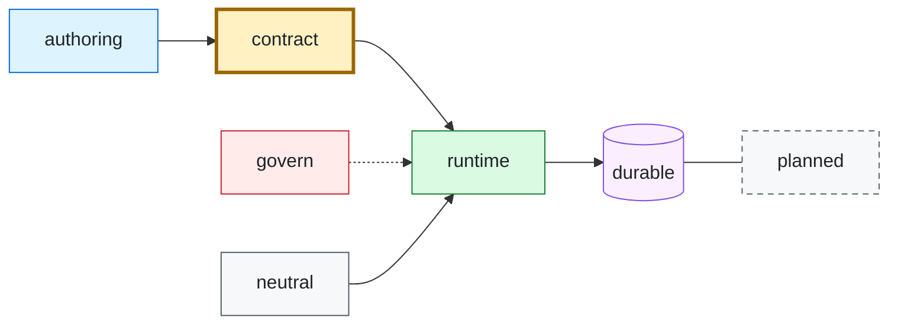

# Diagrams

Every diagram in this repository is Mermaid, rendered by GitHub, so it has to
read on a light page and a dark page without a theme switch. This page is the
one place that fixes how: a shared palette, the diagram type for each job, and
the limits of GitHub's renderer.

## One palette, one meaning per color

GitHub picks the page theme and Mermaid's theme colors follow it, but a node
that sets only `fill` or only `color` can end up as light text on a light
background in one theme. So a node always sets **fill, stroke, and text color
together**. Fills are light tints with near-black text (`#1F2328`), which stay
legible on both a white and a near-black page; the stroke carries the hue.

| Class | Fill | Stroke | Means |
| --- | --- | --- | --- |
| `authoring` | `#DDF4FF` | `#0969DA` | What a person writes or runs by hand: Flowfiles, the CLI, callers. |
| `contract` | `#FFF1C2` | `#9A6700`, 3px | The compiled specification: the one artifact everything else agrees on. At most one per diagram. |
| `runtime` | `#DAFBE1` | `#1A7F37` | Code that executes: drivers, workers, servers, activities. |
| `durable` | `#FBEFFF` | `#8250DF` | State that survives a crash: Temporal, history, durable timers and signals. |
| `govern` | `#FFEBE9` | `#CF222E` | Policy, identity, secrets, and the places a request is refused. |
| `neutral` | `#F6F8FA` | `#57606A` | Supporting material that is none of the above: registries, targets, decisions. |
| `planned` | `#F6F8FA` | `#57606A`, dashed | Designed but not built. |



Copy the `classDef` lines you use into each diagram, because Mermaid has no
include; keep the values identical so a reader learns the colors once. Never
color an edge or an edge label: those follow the page theme, which is what
keeps them readable on either background. Subgraph backgrounds follow the theme
for the same reason, so do not set `style` on a subgraph.

## Composition

- **Solid arrows are data or control flow; dotted arrows are constraint or
  assistance** (policy governing a component, a registry offering completions).
  Label every dotted arrow with the verb.
- **Group with `subgraph` only for a real boundary** (authoring versus
  execution), named with a short noun phrase. Do not nest.
- **Lead the eye to the contract.** Lay the diagram out so the specification
  sits in the middle of the flow, bold, in the `contract` color.
- Put a short title in bold (`<b>…</b>`) first in a node and the detail on the
  next line after `<br/>`. Keep a node to two lines.
- Prefer left-to-right (`LR`) for pipelines and top-to-bottom (`TB`) for layers.
  Aim for no more than about a dozen nodes; split the diagram instead.

## Pick the type by the question

| The reader asks | Use |
| --- | --- |
| How do the pieces connect? Where does data go? | `flowchart` |
| Who says what to whom, in what order? | `sequenceDiagram` |
| What states can this be in, and what moves it? | `stateDiagram-v2` |
| How do these entities relate? | `erDiagram` |

A protocol exchange is a `sequenceDiagram`, never a flowchart with numbered
edges. Sequence and state diagrams take the page theme and need no `classDef`.

## What GitHub renders

GitHub renders Mermaid in a sandbox. Keep to what it supports:

- **No `click` directives and no links.** Interactivity is stripped; put the
  link in the prose beside the diagram.
- **Only basic HTML in labels:** `<br/>`, `<b>`, `<i>`. No `<small>`, `<span>`,
  `<a>`, ``, or inline `style=` attributes.
- **No custom `%%{init}%%` themes.** GitHub controls the theme; the explicit
  `classDef` colors above are what stay constant.
- **Quote any label** that contains punctuation (`"…"`), and write a literal `$`
  or `|` inside a quoted label, never bare.

## Checking a diagram

Render it in both themes before committing, and read the result:

```console
$ npx -p @mermaid-js/mermaid-cli mmdc -i diagram.mmd -t default -b white -o light.png
$ npx -p @mermaid-js/mermaid-cli mmdc -i diagram.mmd -t dark -b '#0d1117' -o dark.png
```

A diagram that fails to parse makes `mmdc` exit nonzero; a diagram that parses
can still be unreadable, so look at both images for text that disappears into
its background.
