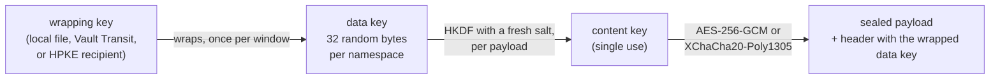

# Payload encryption

Flowstate can encrypt everything a run writes to durable history, under keys
your deployment holds and the Temporal cluster never sees. This page is the
contract: what is protected, from whom, where plaintext still exists, how to
turn it on, how to operate keys, and what to do when something goes wrong.

> [!IMPORTANT]
> Encryption is **off** unless you configure a payload keyring. A server or
> worker without one logs `payload encryption is off` at startup and writes
> step outputs, signals and failure messages to history in plaintext. Set
> `--require-payload-encryption` in production so a missing keyring stops the
> process instead.

## What is protected, and from whom

Four kinds of data move through a run, and they are handled differently.

| Kind | Example | What Flowstate does |
| --- | --- | --- |
| Credentials | an API token a task sends | Kept out of history entirely. A workflow carries a secret *reference*; only the activity that uses it resolves the value, worker-side. Encryption is a second layer, not the mechanism. See [ARCHITECTURE.md](ARCHITECTURE.md), invariant 7. |
| Sensitive application data | a customer record a step returned | Legitimately part of the run, so it is in history. With a keyring, it is sealed there. `sensitive: true` on an input or output controls display, not storage: `flow server` withholds such values from `Get` and `GetTimeline` unless the caller holds `workload.reveal_sensitive` and asks, but it does not keep them out of history. |
| References and handles | `secret("env:TOKEN")`, a run id | Names, not material. Stored like any other value, so a reference name that is itself revealing is sealed only if a keyring is configured. |
| Operational metadata | workflow type, task queue, timestamps, search attributes | Never encrypted: Temporal needs it to schedule and index. See [What stays visible](#what-stays-visible). |

Encryption protects history **at rest and in the cluster**. It is for the
people and systems that can read Temporal's store but should not read your
workloads' data:

| Party | Without a keyring | With a keyring |
| --- | --- | --- |
| Temporal operator, database admin, backup reader, Temporal Web user | Reads every payload | Reads ciphertext, sizes and metadata |
| Another tenant in a separate Temporal namespace | Isolated by Temporal's namespace ACLs | Also isolated cryptographically: different keys, namespace authenticated into every payload |
| Another tenant in a **shared** Temporal namespace | Reads what the namespace permits | Same key, so encryption does not separate them; separate them with namespaces (see [DEPLOYMENT.md](DEPLOYMENT.md)) |
| A Flowstate worker or server with the keyring | Plaintext | Plaintext: it has to compute on the data |
| A caller of `flow codec serve` | n/a | Plaintext of its own tenant's namespace, only with the `payload.decode` action |
| Code running inside a worker (a task, a plugin) | Plaintext of what it is given | Unchanged. Encryption is not a sandbox |

Plaintext necessarily exists in the memory of every Flowstate process holding
the keys, in anything those processes log (a `log:` step prints what its
author told it to print; worker error logs can quote an input), and on the
screen of whoever decodes history through the codec server. Encryption does not
change any of those.

## What is encrypted

Every payload the Temporal Go SDK passes through the client's data converter,
as verified against the pinned SDK (`go.temporal.io/sdk` v1.48.0) and against
raw history in `pkg/flowstate/v1/server/encryption_e2e_test.go`:

- workflow start input (the run's specification and inputs) and result
- activity arguments and results, including local activities
- signals, including signal-with-start
- queries and updates, arguments and results
- memos: tenant, starter, workflow name, signal policy, request ids
- heartbeat details
- the state carried across Continue-As-New
- schedule actions and schedule memos
- failure messages and stack traces, at every level of a cause chain, and
  failure details (the failure converter's `EncodeCommonAttributes` is forced
  on whenever a codec is configured)

### How a payload is sealed

Envelope encryption, in three layers:



- The **wrapping key** stays with its key provider. For a Vault Transit key
  that means it never enters a Flowstate process.
- The **data key** is generated by the process, wrapped once, and reused for a
  bounded window: ten minutes, 2²⁰ payloads or 64 GiB by default. Its wrapped
  copy travels in every payload it sealed, so history needs nothing else
  Flowstate stores to be read, and a provider is called once per window
  instead of once per payload.
- Each payload's **content key** is derived by HKDF-SHA256 (RFC 5869) from the
  data key and a fresh 256-bit salt, and seals exactly one payload.

Beside the content key, a 32-byte **key commitment** is derived and checked
before decryption, so a payload opens under exactly the data key that sealed
it and no other. The header, the suite, the key id and the Temporal namespace
are authenticated, so a payload cannot be edited, relabelled to another key,
or moved to another namespace without failing. The whole payload is sealed,
metadata included, so even the message type is hidden. The construction and
its argument, with references, are in
[`pkg/flowstate/v1/payloadcodec/envelope`](../pkg/flowstate/v1/payloadcodec/envelope/envelope.go).

## What stays visible

| Visible | Why |
| --- | --- |
| Search attributes: `FlowstateNamespace` (the tenant), `FlowstateWorkflowName`, `TemporalChangeVersion` | The cluster indexes them, so the SDK always writes them with the default converter. Nothing payload-derived is ever projected into one. The tenant name is therefore visible even though its memo copy is sealed. |
| Headers (trace context) | Context propagators encode their own headers; trace ids only. |
| Workflow and activity types, workflow ids, run ids, task queues, timestamps, event types and order | Temporal's own scheduling data. A Flowstate workflow id can embed a digest of a request, never its content. |
| Each payload's size, plus a bounded header | Ciphertext length follows plaintext length. |
| Each payload's envelope version, suite, wrapping key id and version, and escrow key ids | Needed to choose a key before decrypting. Key ids are chosen by you; do not put anything secret in one. |
| Messages the Temporal server writes itself, such as a timeout | They carry no workload data. |

## Where keys live

Every key in a keyring is one of three kinds, and a namespace can mix them:

| Kind | The wrapping key is | A compromised worker can | Rotation | Operate |
| --- | --- | --- | --- | --- |
| `file` / `env` (local) | 32 bytes in every process that uses it | Unwrap every data key it wrapped, forever | Add a key, then switch (two rollouts) | Nothing to run. The self-hosted baseline |
| `vault` (Vault or OpenBao Transit) | Held by Vault; never in the process | Ask Vault to unwrap, only while its credentials last, with every call in Vault's audit log | `vault write -f transit/keys/<key>/rotate`; nothing to roll out | A Vault or OpenBao server, Kubernetes or token auth |
| `hpke` (RFC 9180 recipient) | A public key; the private key is wherever you keep it | Nothing: the public half only wraps | Add a key pair | For escrow: the private key stays offline |

Vault is the recommended production choice: disabling the Transit key, raising
its minimum decryption version, or revoking the workers' policy makes history
unreadable from then on, without touching a Flowstate process, and it is the
only kind whose wrapping key a compromised worker never holds. A cloud KMS
(AWS, GCP, Azure) is reachable through Vault's managed keys or, later, a key
provider plugin; nothing in the core depends on one.

## Turning it on

### 1. Make a key

With Vault or OpenBao, create an AEAD Transit key and a policy that can use
only it:

```sh
vault secrets enable transit
vault write -f transit/keys/flowstate-default type=aes256-gcm96
vault policy write flowstate-payloads - <<'POLICY'
path "transit/encrypt/flowstate-default" { capabilities = ["update"] }
path "transit/decrypt/flowstate-default" { capabilities = ["update"] }
path "transit/keys/flowstate-default"    { capabilities = ["read"] }
POLICY
```

Grant `update`, not `create`, so a deleted key is an error rather than
silently recreated. Without Vault, generate a local key:

```sh
flow codec keygen --out /etc/flowstate/payload-keys/default-2026-09.key
```

The key is 32 random bytes, base64 on one line, written at mode 0600. Nothing
of it is printed. `keygen` refuses to overwrite a file.

A keyring refuses to load a key file, or an escrow private key, that anyone
but its owner can read, or that is owned by any account other than the one
Flowstate runs as or root. Mode 0600 on a file another account owns protects
nothing: that account could have written its own key there.

Keep a backup of every local key somewhere at least as protected as the key
itself, or configure an [escrow key](#escrow-and-recovery). **A lost key is
lost history**: nothing can decrypt what it sealed, except through escrow.

### 2. Write a keyring

A keyring names each Temporal namespace's keys by location, never by value, so
it can live in configuration management:

```yaml
# /etc/flowstate/payload-keyring.yaml
namespaces:
  default:
    current: default-vault
    keys:
      - id: default-vault
        vault: {provider: corp, key: flowstate-default}
providers:
  - name: corp
    vault:
      address: https://vault.internal:8200
      kubernetes: {role: flowstate}     # or token_env: VAULT_TOKEN
```

or, with a local key:

```yaml
namespaces:
  default:
    current: default-2026-09
    keys:
      - id: default-2026-09
        file: payload-keys/default-2026-09.key   # relative to this file
```

It is a `flowstate.v1.PayloadKeyring` message, defined with its validation
rules in [`proto/flowstate/v1/payload_encryption.proto`](../proto/flowstate/v1/payload_encryption.proto).
A local key is held in a `file` (owner-only permissions, or it is refused) or
an `env` variable. A key id names one key across the whole keyring. Quote an
id that is all digits, or YAML reads it as a number.

Each namespace can also set:

| Field | Default | Meaning |
| --- | --- | --- |
| `suite` | `PAYLOAD_SUITE_AES256_GCM` | What new payloads are sealed with. `PAYLOAD_SUITE_XCHACHA20_POLY1305` is faster without AES hardware and is not FIPS-approved |
| `decrypt_suites` | every suite this process may use | What is read. Narrow it to retire a suite |
| `escrow` | none | Up to three `escrow_keys` every data key is also wrapped to |
| `data_key.max_age` | `600s` | How long one data key seals, and how long an unwrapped one is cached. Durations are written in seconds |
| `data_key.max_messages`, `data_key.max_bytes` | 2²⁰, 64 GiB | The other two bounds on one data key; `max_bytes` is at least 2 MiB, so any payload fits a fresh key |
| `data_key.stale_grace` | `0s` | How long past `max_age` a data key keeps sealing while the provider is unreachable |
| `data_key.decode_cache_entries` | 4096 | How many unwrapped data keys a process keeps for reading |

### 3. Point every process at it

```sh
export FLOWSTATE_PAYLOAD_KEYRING=/etc/flowstate/payload-keyring.yaml
export FLOWSTATE_REQUIRE_PAYLOAD_ENCRYPTION=true

flow server --auth-policy /etc/flowstate/auth.yaml --rpc-resource https://flowstate.example.com/rpc
flow worker
```

`flow server`, `flow worker` and `flow codec` take the same values as
`--payload-keyring` and `--require-payload-encryption`. `flow server dev` and
`flow run local` read the environment variables. Every client is built with
its own namespace's codec. A process that dials a namespace the keyring does
not cover refuses to start, instead of writing that namespace in plaintext.

### 4. Check it

```sh
flow codec status
```

```text
payload encryption: on (required)

namespace default
  seals with AES256_GCM; reads AES256_GCM, XCHACHA20_POLY1305
  data keys roll over every 10m0s, 1048576 payloads or 68719476736 bytes
  default-vault            vault  v3                current
  default-2026-09          local  58c8b4949fd07dd6  decrypt only
  break-glass              hpke   9d0f3a1c5e2b7a44  escrow, wrap only
```

The third column is the provider's key version for a Vault key, and a one-way
fingerprint for a local or HPKE key. Run `status` on every machine: two
processes whose fingerprints for one id differ hold different keys, and each
will refuse the other's payloads. `status` opens the keyring the way a worker
does, so it also proves every provider is reachable and every key usable.
`-o json` writes a `flowstate.v1.PayloadEncryptionStatus`.

## Journeys

### Local development

`flow run local` has no durable history, so nothing is encrypted. It still
loads and validates the keyring from `FLOWSTATE_PAYLOAD_KEYRING` exactly as a
worker would. A keyring that would stop a worker, such as one with a
world-readable key file, stops the rehearsal too.

### An encrypted run you can inspect

```sh
flow codec keygen --out default.key
cat > keyring.yaml <<'EOF'
namespaces:
  default:
    current: dev-1
    keys: [{id: dev-1, file: default.key}]
EOF

FLOWSTATE_PAYLOAD_KEYRING=$PWD/keyring.yaml flow server dev
flow run examples/parameterized-deploy/workflow.yaml --input-file examples/parameterized-deploy/inputs.json
```

Look at the stored history with Temporal's own CLI, which has no key:

```sh
temporal workflow show -w <workflow id> -o json | grep -c '<a value from your inputs>'   # 0
```

Every payload's `encoding` reads `binary/flowstate-envelope-v1`. `flow get`
still shows the result, because the server holds the keyring.

### Reading history in Temporal Web or the CLI

`flow codec serve` is the codec endpoint Temporal's tools call. For local use:

```sh
flow codec serve --insecure-no-auth --payload-keyring keyring.yaml
temporal workflow show -w <workflow id> --codec-endpoint http://127.0.0.1:8089
```

`--insecure-no-auth` serves anyone who can reach the listener, so it is refused
on any address but loopback.

In production, callers authenticate against your trust policy and need the
decode action explicitly:

```yaml
# auth.yaml (excerpt)
issuers:
  - name: sso
    issuer: https://sso.example.com
    audiences: [https://codec.example.com]
    namespace_claim: team
    actions: [workload.read, payload.decode]
tenancy:
  temporal:
    team-a: tenant-a
    team-b: tenant-b
```

```sh
flow codec serve --listen 0.0.0.0:8089 \
  --auth-policy /etc/flowstate/auth.yaml \
  --codec-resource https://codec.example.com \
  --payload-keyring /etc/flowstate/payload-keyring.yaml \
  --cors-origin https://temporal.example.com \
  --tls-cert-file codec.crt --tls-key-file codec.key
```

In Temporal Web, set the Codec Server endpoint to the server's URL and turn on
passing the user's access token. With the CLI, pass `--codec-endpoint` and
`--codec-auth "Bearer <token>"`.

The server's rules:

- **Its own audience.** A bearer token must name `--codec-resource` in its
  `aud` claim. An issuer trusted for several of this deployment's surfaces
  lists all their audiences, and without this a token minted for the RPC or
  MCP surface could be spent here to decode history. It is required whenever
  the trust policy trusts a token issuer.
- **Client certificates as `flow server` takes them.** A trust policy's
  `kind: mtls` entry needs `--tls-client-auth require`, and a verified
  certificate authenticates the caller only with
  `--tls-client-auth-identity`; a policy naming one without the flag is
  refused at startup rather than admitting no one.
- **Explicit action.** The caller's policy entry must list `payload.decode`
  (or `payload.encode` to encrypt what someone types into the UI). An entry
  that lists no actions is *not* granted it. This differs from the RPC
  actions, where no list means unrestricted.
- **Own namespace only.** `X-Namespace` must be the Temporal namespace the
  caller's own tenant maps to. A caller who names another is refused.
- **No shared namespaces.** If more than one tenant maps to the namespace, or
  it is the tenancy default, a decode cannot tell whose payload it was given.
  It is refused unless you start the server with `--allow-shared-namespaces`,
  accepting that any authorized tenant there reads all of them.
- **Bounded before keys are used.** Bodies are capped at 4 MiB, requests at
  256 payloads, and each caller at 600 requests a minute. At most 16 requests
  are read and decoded at once across every caller, and one caller holds at
  most four of them; past that a request is refused with 503 before its body
  is read, so the server never holds more than 64 MiB of request bodies. A
  request holding a slot has ten seconds to send its body.
- **Nothing kept or echoed.** Responses are `Cache-Control: no-store`. Errors
  never contain a payload, a key, or which of wrong key, wrong namespace or
  tampering made a payload undecodable. CORS origins are compared exactly.
- **Audited.** Every decision about an authenticated caller, allow or deny,
  is an audit record with `httpEndpoint: /decode`, the Temporal namespace
  addressed as its resource, the caller and their tenant, and no payload. With `--audit-required`, a decision that cannot be
  recorded is answered 503 and not acted on. A request the trust policy
  refuses before it reaches the codec is logged, not audited, as on
  `flow server`, so an unauthenticated caller cannot write the trail at will.

The protocol names a namespace and nothing else, so no codec server can
authorize per run. A person who may decode a namespace may decode every run in
it. If that is too broad, give tenants their own namespaces.

### Two tenants

Map each tenant to its own Temporal namespace, and give each namespace its own
keys:

```yaml
namespaces:
  tenant-a:
    current: a-2026-09
    keys: [{id: a-2026-09, file: keys/a-2026-09.key}]
  tenant-b:
    current: b-2026-09
    keys: [{id: b-2026-09, file: keys/b-2026-09.key}]
```

A worker serving only tenant A can be given a keyring with only
`tenant-a`, so it holds no key that reads tenant B. `flow server` serves every
tenant and holds every key. Both can use identical secret names and step ids;
the keys are what differ. `pkg/flowstate/v1/codecserver/codecserver_test.go`
exercises a forged namespace header and ciphertext moved between tenants.

### Rotating a key

**A Vault key** rotates in Vault: `vault write -f transit/keys/<key>/rotate`.
Data keys wrapped from then on use the new version, old ones still unwrap, and
no Flowstate process needs to change. Raising the key's
`min_decryption_version` retires old versions, and makes what they wrapped
unreadable.

**Data keys** rotate themselves: every `data_key.max_age`, or sooner at the
message or byte bound. Nothing to do.

**A local key** rotates in two rollouts, so no process ever meets a payload
sealed under a key it has not been given:

1. **Distribute.** Add the new key to the namespace's `keys`, leaving
   `current` alone. Roll every server, worker and codec server. Check
   `flow codec status` everywhere.
2. **Switch.** Set `current` to the new id. Roll again. New payloads are sealed
   under it; old ones still decrypt under the old key.

Keep the old key in the keyring for as long as any history sealed under it
must stay readable. That is at least the namespace's retention period after
the switch, plus the life of any run still in flight or in a backup you might
restore. `TestRotationKeepsAnInFlightRunReadable` rotates keys under a run
parked at an approval and finishes it on the new fleet.

### Emergency and loss

| Situation | What happens | What to do |
| --- | --- | --- |
| A key file is unreadable or has loose permissions | The process refuses to start and names the key | Fix the file; nothing was written with a partial keyring |
| A key is missing from one worker's keyring | A payload under it that the run's workflow code reads on that worker (a signal, an activity or child result) fails the run, naming the missing key, rather than being taken for a corrupt signal or a failed step. The payload stays in history | Distribute the key before any worker writes with it (`flow codec status` fingerprints), then reset the failed runs |
| The same id holds different material on two machines | Each refuses the other's payloads as failing authentication | Treat as a misconfiguration; restore the right key from backup |
| A key is suspected compromised | Everything sealed under it is readable by whoever has it | Rotate immediately (both steps), then re-evaluate how long the old key must stay |
| A key is lost with no backup | History sealed under it is unrecoverable; runs that need it cannot progress | Terminate those runs; there is no recovery |
| The keyring is gone and encryption is required | Nothing starts | Restore the keyring. Never turn encryption off to "get running": new plaintext would sit beside history no one can read |
| Vault is unreachable at startup | The process refuses to start, naming the key | Restore Vault or the network path; `flow codec status` shows when it works |
| Vault becomes unreachable while running | Reads of data keys already cached continue. Writes continue until the current data key's window closes, plus `stale_grace`, then fail; an activity's write is retried by Temporal, and nothing is written in plaintext. A read in workflow code of a data key this worker has not cached fails the run, as the next row says. The codec server answers 503 | Restore Vault. Set `stale_grace` if you prefer availability over how quickly a disabled key takes effect |
| Vault is unreachable when a run's workflow code reads a payload under a data key this worker has not cached: a signal, or an activity or child result another worker sealed | The run fails, naming the unavailable provider. Returned as an error, Temporal would discard the signal as corrupt, or the result would fail a step that succeeded, and a replay could take a different branch. The payload stays in the run's history | Restore Vault, then reset the run to before the signal (`temporal workflow reset`). A provider that answers within its `timeout` never trips Temporal's deadlock detector, whatever the timeout |
| A Vault key must stop working now | Disable it, raise its minimum version, or revoke the policy. Running processes stop within `data_key.max_age` (plus `stale_grace`), as cached data keys expire | This is crypto-shredding with a bounded delay; lower `max_age` if the delay matters |
| Vault refuses the key at startup because it "does not bind the encryption context" | The server drops `associated_data`, so a wrap it made would unwrap for any namespace. Flowstate probes for this at startup | Upgrade to Vault 1.13 or later, or OpenBao |
| Many payloads arrive at the codec server with data keys nobody wrapped | `flow codec serve` asks its providers to unwrap at most 200 unseen data keys a second (bursts of 2000); past that the request is refused with 503 for the caller to retry, so a flood does not become a flood of Vault calls. Workers and `flow server` are not limited: they read history written by processes holding the keys, and a replay burst after a restart is legitimate | Find who is sending them; legitimate history misses once per data key |
| A primary key is lost, and an escrow key was configured | Workers cannot read what it wrapped | Read it through escrow: see [Escrow and recovery](#escrow-and-recovery) |
| An escrow private key is lost | Nothing changes for running processes; the recovery path is gone | Generate a new pair, add it to `escrow_keys` and the namespaces, roll out |

Removing a key on purpose makes everything sealed under it unreadable. That is
crypto-erasure, and it is all-or-nothing per key. It is not deletion of one
person's data, and it does nothing about copies that were decrypted and stored
elsewhere, such as logs, exports, or the result a client already fetched.

### Escrow and recovery

An escrow key is a second way to unwrap every data key, held offline. The
default is a post-quantum hybrid HPKE key (ML-KEM-768 with X25519), so what is
wrapped to it today stays confidential if either algorithm holds.

```sh
flow codec keygen --hpke --out break-glass.key   # private: keep offline
# break-glass.key.pub is the public key workers name
```

Workers name only the public key:

```yaml
namespaces:
  default:
    current: default-vault
    keys: [{id: default-vault, vault: {provider: corp, key: flowstate-default}}]
    escrow: [break-glass]
providers:
  - name: corp
    vault: {address: https://vault.internal:8200, kubernetes: {role: flowstate}}
escrow_keys:
  - id: break-glass
    hpke: {public_key: {file: break-glass.key.pub}}
```

Every data key is then also wrapped to it, which adds about 1.2 KiB to each
payload's header. A worker can wrap to it and unwrap nothing with it: `status`
shows it as `escrow, wrap only`.

To recover, run a process whose keyring holds the private key and leaves the
namespace decode-only (no `current`), such as `flow codec serve` on an
isolated machine:

```yaml
namespaces:
  default:
    escrow: [break-glass]
escrow_keys:
  - id: break-glass
    hpke:
      public_key: {file: break-glass.key.pub}
      private_key: {file: break-glass.key}
```

It reads every payload whose data key was wrapped to the escrow key, whatever
became of the primary, and writes nothing. The key commitment is what makes
several wrapped copies safe: whichever copy is unwrapped, only the data key
that sealed a payload opens it.

> [!IMPORTANT]
> What a recovery process reads through escrow is **confidential, not
> authentic**. An escrow public key is not a secret, so a party that can
> rewrite history and holds it can wrap a data key of its own and plant a
> payload the recovery process will open. Three rules keep that from reaching
> a running system: an HPKE key can be only an escrow key, never a namespace's
> own; only a decode-only codec, one with no `current` key, reads through
> escrow, so a worker never does; and recovery is for reading and exporting,
> not for driving workflows. Treat what it produces the way you would treat a
> backup restored from a store someone else could write to.

### Suites and FIPS 140-3

A payload names its suite in its header, and each namespace says what it seals
with and what it reads, so changing algorithm is a configuration change, not a
migration: add the new suite to `decrypt_suites` everywhere, then switch
`suite`, then remove the old one from `decrypt_suites` once no history needs
it.

Under Go's FIPS 140-3 mode (`GODEBUG=fips140=on`), only approved suites are
used: AES-256-GCM, through the FIPS module's own random-nonce construction.
A keyring that names XChaCha20-Poly1305 refuses to start there. Under
`GODEBUG=fips140=only`, an escrow key using the classical X25519 KEM is refused
too; the ML-KEM hybrids and P-256 are accepted. `flow codec status` reports
the mode.

### Turning encryption on for existing history

History written before a keyring existed is plaintext, and a namespace that
requires encryption refuses to read it. While old runs are still in flight,
let that one namespace read them:

```yaml
namespaces:
  default:
    current: default-2026-09
    accept_unencrypted: true   # remove once no pre-encryption history is needed
    keys: [{id: default-2026-09, file: default-2026-09.key}]
```

Everything written is still sealed. Remove the setting once the namespace's
retention has passed. While it is set, anything able to write a plaintext
payload into that namespace's history is read back as though it were
protected, which is exactly what the default refusal prevents.

> [!WARNING]
> `flow server` reads its own memos (a run's tenant, starter, labels) through
> one reader for every namespace, and that reader accepts unencrypted payloads
> only if **every** namespace in the keyring does. In a keyring with several
> namespaces, set `accept_unencrypted` on all of them for the migration, or the
> server will treat pre-encryption runs in the migrating namespace as not found
> even though workers can still finish them. Per-namespace server reads are
> [#2163](https://github.com/picatz/flowstate/issues/2163).

## Embedding

A Go program running its own worker uses the same pieces:

```go
keyring, err := envelope.LoadFile(ctx, "/etc/flowstate/payload-keyring.yaml")
if err != nil {
	return err
}
codecs := keyring.PayloadCodecConfig()

// One client per namespace, each with that namespace's codec.
temporal, namespace, err := temporalclient.DialWithNamespace(ctx, temporalclient.Config{Codec: codecs})
if err != nil {
	return err
}
mine, err := codecs.ForNamespace(namespace)
if err != nil {
	return err
}

w := worker.New(temporal, engine.RunTaskQueueName, worker.Options{})
engine.Register(w, engine.TaskRuntimeConfig{}.WithDataConverter(mine.DataConverter()))
```

The interpreter's converter is bound to the worker it is registered on, so
several workers with different keyrings can run in one process.

> [!CAUTION]
> Pass the converter to `engine.Register` (or `embed.RunDurable`) whenever the
> client has a codec. Without it, the interpreter falls back to the SDK's
> default converter for everything it writes from workflow code, and the first
> activity's arguments reach history unencrypted before the strict activity
> side refuses them. `flow worker` and `flow server dev` always pass it; an
> embedding program has to. Removing this requirement is
> [#2164](https://github.com/picatz/flowstate/issues/2164).

## Guarantees and limits, by boundary

| Data | Boundary | Enforced by | Proved by | Limitation |
| --- | --- | --- | --- | --- |
| Payloads | Worker/server → Temporal history | Envelope codec on every client (`temporalclient.Config.Options`) | `TestEncryptedHistoryHoldsNoPlaintext`, `TestContinueAsNewCarriesOnlyCiphertext` (real Temporal, raw history) | Sizes, types, ids, timing visible |
| Failure messages and stacks | Worker → history | Failure converter forced to encode | Same tests: every failure message reads `Encoded failure` | Server-generated failures (timeouts) are plaintext, carrying no workload data |
| Memos | Server → history | Client data converter; server reads through the keyring reader | Same tests, plus `TestCodecMemosAreReadThroughTheConfiguredConverter` | The server's reader holds every namespace's keys, so it cannot detect a memo moved between two of its namespaces, and it accepts unencrypted memos only if every namespace does |
| Workflow-side writes in an embedding program | Interpreter → history | The worker's converter, passed with `TaskRuntimeConfig.WithDataConverter` | `TestCodecCoversInputsSignalsAndOutputs`, `TestSignalsAreLostWhenTheInterpreterBypassesTheCodec` | An embedder who omits it writes the first activity's arguments in plaintext |
| Plaintext payloads in history | History → any reader | Decode refuses unencrypted payloads unless `accept_unencrypted` | `TestUnencryptedPayloadsAreRefusedUnlessAccepted`, `TestAMarkedPayloadNeverDowngrades` | Migration setting reopens it for one namespace |
| Tampered or spliced payloads | History → worker | AEAD over the header, suite, key id and namespace; key commitment checked first | `TestEveryByteIsAuthenticated`, `TestTheCommitmentIsCheckedBeforeTheAEAD`, `TestCrossNamespaceSpliceFailsEvenUnderTheSameKey`, `TestAnIndependentSealerIsReadByDecode`, fuzzing | Not bound to a run: a history writer can move or replay a payload within one namespace |
| Data keys | Process → key provider | Wrapped under the namespace's wrapping key, bound to namespace, key id and suite; cached bounded in count and age | Provider conformance (`keyprovidertest`) for local, HPKE and Vault; `TestConcurrentReadsOfOneDataKeyAskTheProviderOnce`; `TestAnUnreachableProviderStopsWritesNotReads` | A process holds the data keys it is using, in memory, for up to `max_age` |
| Wrapping keys | Disk, env or Vault → process | Owner-only files, bounded reads, closure-held material; a Vault key never leaves Vault | `TestKeyringRefusesKeysItCannotRead`, `TestKeysDoNotFormat`, `TestAVaultKeyringSealsThroughTransit` | A compromised process holding a local key reads everything it wrapped |
| Escrow | History → a recovery process | HPKE (ML-KEM-768 + X25519) to an offline key | `TestEscrowRecoversWhatThePrimaryKeyCannot`, `TestARecoveryKeyringReadsThroughEscrow` | Whoever holds the escrow private key reads every namespace that names it |
| Decoded history | Codec server → a person | Trust policy, explicit action, own-namespace, no shared namespaces, bounds, audit | `codecserver_test.go`, `TestCodecServeAuthenticatesWithTheTrustPolicy` | Per-namespace, never per-run; the person sees plaintext |
| Search attributes, headers | Worker/server → history | Nothing: never encrypted | `walkHistoryEvent` excludes them explicitly | Tenant and workflow name visible |
| Worker and server logs | Process → log sink | Not encrypted | — | A `log:` step and some error logs print plaintext; treat logs as sensitive |

## See also

- [THREAT_MODEL.md](../THREAT_MODEL.md), "Run to history", for how this fits
  the rest of the boundaries.
- [DEPLOYMENT.md](DEPLOYMENT.md) for giving tenants their own namespaces.
- [reference/cli.md](reference/cli.md) for every `flow codec` flag.
