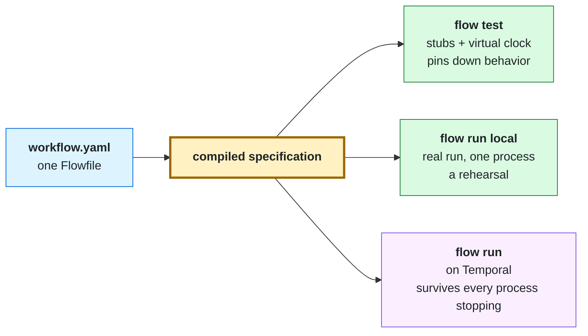

# Get started

This tutorial builds a workflow that asks a person to approve a refund and
then pays back each line of the order. You will write it, check it, test
it, step through it in the debugger, and run it on your machine. Then you will
run it durably, stop every process while it waits for the approval, start them
again, and approve it from another terminal.

It takes about twenty minutes. Nothing requires an account, a cloud service, or
an existing Temporal installation.

By the end you will know:

- how a Flowfile is put together: inputs, steps, expressions, and outputs;
- the authoring loop: `flow validate`, `flow test`, and `flow run local`;
- how to read a run from the inside with the debugger;
- what changes when the same file runs durably on Temporal.

## Before you begin

You need:

- **Go 1.27 or newer** to install the `flow` binary. With Go's default
  `GOTOOLCHAIN=auto`, any Go since 1.21 downloads the required toolchain for
  you.
- **A terminal**, and a second one for the durable part.
- **[jq](https://jqlang.org/)** (optional) to pull one field out of a JSON
  answer. Every step says what to do without it.
- **Network access the first time you run `flow server dev`.** It downloads the
  Temporal CLI once and caches it.

## 1. Install `flow`

```console
$ go install github.com/picatz/flowstate/cmd/flow@latest
```

The binary lands in `$(go env GOBIN)`, or `$(go env GOPATH)/bin` when `GOBIN`
is unset. Make sure that directory is on your `PATH`, then check:

```console
$ flow --help
```

From a checkout of this repository you can use `go run ./cmd/flow` wherever
this page writes `flow`.

## 2. Write the workflow

Make a directory called `refund-approval` and save this as
`refund-approval/workflow.yaml`. The same file is in the repository at
[`examples/refund-approval/`](../examples/refund-approval/).

<!-- mirrors: examples/refund-approval/workflow.yaml -->
```yaml
edition: v2026.4
name: refund-approval
description: Asks a person to approve a refund, then pays back each line of the order.
inputs:
  order_id:
    type: string
    required: true
    description: the order being refunded
  lines:
    type: list(int)
    default: [1500, 4200]
    description: the cents to give back on each line of the order
steps:
  - id: total
    value: ${inputs.lines.sum()}
  - id: ask
    log:
      message: refund of ${steps.total.value} cents on ${inputs.order_id} is waiting for approval
  - id: approval
    wait_for_signal:
      name: refund-approved
      prompt: Approve refunding ${steps.total.value} cents on ${inputs.order_id}?
      timeout: 1h
  - id: approved
    value: ${steps.approval.payload.?approved.orValue(false)}
  - id: payout
    if: ${steps.approved.value}
    for_each:
      items: ${inputs.lines}
      as: line
      steps:
        - id: refund
          log:
            message: refunding ${line} cents
outputs:
  approved:
    value: ${steps.approved.value}
  total_cents:
    value: ${steps.total.value}
```

Here is what each part does.

**`edition:`** names the version of the Flowfile grammar the file is written
in. It is required. When the grammar changes, `flow fix` rewrites a file from
one edition to the next.

**`inputs:`** declares the run's typed arguments. `order_id` must be supplied;
`lines` has a default. A caller who sends the wrong type, or forgets
`order_id`, is refused before anything runs.

**`steps:`** run in the order written. Every step has an `id` and does exactly
one thing, named by its key:

| Step | Kind | What it does |
| --- | --- | --- |
| `total` | `value:` | Computes a value (here, a sum) and records it as the step's output. |
| `ask` | `log:` | Runs the built-in `log` task. A task is where work happens. |
| `approval` | `wait_for_signal:` | Waits, for up to an hour, for a signal named `refund-approved`. |
| `approved` | `value:` | Reads the decision out of the signal's payload. |
| `payout` | `for_each:` | Runs its own `steps:` once per line, but only when its `if:` holds. |

**`${...}`** is an expression in [CEL](https://cel.dev/), the Common Expression
Language. Expressions compute values; they cannot perform I/O or read the clock,
so they behave the same way every time a run is replayed. An expression reads
data through a few roots:

- `inputs.order_id` is an argument the run was started with.
- `steps.total.value` is an output of an earlier step. Referring to a step is
  also how order and data flow are expressed: `ask` reads `total`, so `total`
  must have finished first.
- `line` is the name `for_each` bound with `as:`, and exists only inside the
  loop body.
- `steps.approval.payload` is the JSON object the approver sent. `.?approved`
  reads a field that might be absent, and `.orValue(false)` supplies a default,
  so "no answer" and "no `approved` field" both count as not approved.

**`outputs:`** is the run's public result, computed after the last step.

> [!TIP]
> If your editor speaks the Language Server Protocol, point it at `flow lsp`
> now. You get the same diagnostics as `flow validate` while you type, plus
> completion for step ids, task inputs, and expression roots. See
> [Editor setup](EDITORS.md).

## 3. Validate and compile

```console
$ flow validate refund-approval/workflow.yaml
refund-approval/workflow.yaml: ok
```

`flow validate` checks the file without running anything: the grammar, every
expression's syntax and types, every step reference, and every task's inputs
against that task's schema. A problem is reported as
`file:line:column: message`, the same form compilers use, so editors and CI can
point at it.

`flow compile` shows what the file becomes:

```console
$ flow compile refund-approval/workflow.yaml | jq -r '.steps[].id'
total
ask
approval
approved
payout
```

The output is a `flowstate.v1.Workflow` message, written as JSON, with each
expression already parsed. The YAML is how you write a workflow; this compiled
specification is what actually runs, on your machine or on a server. Without
`jq`, look at the whole document with `flow compile refund-approval/workflow.yaml`.

## 4. Rehearse it locally

`flow run local` executes the workflow in the current process. There is no
server and no Temporal, so a waiting step cannot be answered later: give the
signal up front with `--signal`, and it is delivered when the run reaches the
gate.

```console
$ flow run local refund-approval/workflow.yaml \
    --input order_id=o-1000 \
    --signal 'refund-approved={"approved": true}'
running locally
INFO refund of 5700 cents on o-1000 is waiting for approval
INFO refunding 1500 cents
INFO refunding 4200 cents
COMPLETED workflow refund-approval
outputs
  approved true
  total_cents 5700
```

Try `--signal 'refund-approved={"approved": false}'` and the `payout` step is
skipped. Leave `--signal` out and the run tells you it will block until the
gate's hour runs out, and how to answer it; press Ctrl-C to stop it.

When standard output is a pipe rather than a terminal, the same command writes
one JSON document instead, which is what a script reads:
`flow run local ... | jq .runOutputs`.

> [!NOTE]
> A local run is a rehearsal. It uses the same compiled specification and the
> same step executor as a durable run, so expressions, branches, retries, and
> timeouts behave the same. It has no persisted history: if the process stops,
> the run is gone. Section 7 shows the difference.

## 5. Test it

Real runs are slow to set up and hard to repeat. A test file runs the workflow
against stubbed tasks and scripted signals, on a virtual clock, with no network.
Save this as `refund-approval/workflow.test.yaml`:

<!-- mirrors: examples/refund-approval/workflow.test.yaml -->
```yaml
edition: v2026.4
defaults:
  inputs:
    order_id: o-1000
  stubs:
    - task: log
      returns: {}
tests:
  - name: an approval pays back every line
    workflow: ./workflow.yaml
    signals:
      - name: refund-approved
        payload:
          approved: true
    expect:
      ran: [total, ask, approval, approved, payout]
      outputs:
        approved: true
        total_cents: 5700

  - name: a rejection pays back nothing
    workflow: ./workflow.yaml
    signals:
      - name: refund-approved
        payload:
          approved: false
    expect:
      ran: [total, ask, approval, approved]
      others: skipped
      outputs:
        approved: false
        total_cents: 5700

  - name: nobody answering within the hour counts as a rejection
    workflow: ./workflow.yaml
    expect:
      ran: [total, ask, approval, approved]
      others: skipped
      outputs:
        approved: false
        total_cents: 5700
```

```console
$ flow test refund-approval/
PASS  refund-approval/workflow.test.yaml: an approval pays back every line
PASS  refund-approval/workflow.test.yaml: a rejection pays back nothing
PASS  refund-approval/workflow.test.yaml: nobody answering within the hour counts as a rejection
refund-approval/workflow.test.yaml  6/6 steps reached

1 file · 3 cases · 3 passed · 0.0s
```

What the file says:

- **`defaults:`** applies to every case: the same inputs, and a stub that
  answers every `log` call with no outputs. A task with no matching stub fails
  the case, so a test never reaches the network by accident.
- **`signals:`** scripts what an approver sends. The third case sends nothing,
  and its one-hour wait lapses at once, because a test's clock only moves when
  the run is waiting.
- **`expect:`** states the result. `ran:` lists steps that must have run;
  `others: skipped` says every other step must have been skipped, so a step
  added later cannot slip past the test unnoticed. `outputs:` must name every
  output the workflow declares.
- **`6/6 steps reached`** is coverage across all cases, including the `refund`
  step inside the loop.

Break the workflow on purpose to see a failure: change `orValue(false)` to
`orValue(true)` and run `flow test` again. The third case fails and prints a
transcript of every step, with timestamps on the virtual clock. Change it back
before you continue.

## 6. Step through a case

A failing test tells you *that* something is wrong. The debugger shows *why*,
by holding the run at a step so you can ask questions about it. Start it on one
case:

```console
$ flow test --debug --run 'approval pays' refund-approval/
```

At the `debug>` prompt, set a breakpoint inside the loop, continue to it, and
look around:

```text
debug> break refund
breakpoint at refund
debug> continue
  total -> value: 5700
  ask completed
  approval -> payload: {"approved":true}, sender: {"accepted_at":"","identity":{"deployment":"","issuer":"","kind":"","namespace":"","principal":"","subject":""},"local":true}, timed_out: false
  approved -> value: true
break at payout[0]/refund (task "log")
debug> inspect line
1500
debug> inspect steps.approval.payload
{"approved":true}
debug> scope
steps: approval, approved, ask, total
locals: line
inputs: lines, order_id
run: identity, local, run_id, started_at, workflow_id
trigger: delivery_id, kind, name, principal, scheduled_at
debug> continue
  refund completed
break at payout[1]/refund (task "log")
debug> inspect line
4200
debug> delete refund
deleted breakpoint at refund
debug> continue
  refund completed
  payout -> results: [{"refund":{}},{"refund":{}}]
PASS  refund-approval/workflow.test.yaml: an approval pays back every line
```

The breakpoint holds once per loop iteration, so the second stop sees the
second line. `inspect` evaluates any expression the step itself could have
written, and `scope` lists every name in reach. Tab completes commands, step
ids, and names.
`help` lists the rest; [Debugging a workflow](DEBUGGING.md) covers them, and the
same session is available to an editor over DAP and to an agent over MCP.

## 7. Run it durably

Now run the same file on Temporal. `flow server dev` starts everything a durable
run needs, from one command, on loopback: a Temporal development server, the
Flowstate API server, and a worker. `--db` keeps its state in a file, so you
can stop it and start it again.

In your first terminal:

```console
$ flow server dev --db ./flowstate.db
```

It prints the addresses it listens on and the development postures it takes
for you: callers are anonymous, and the worker is unversioned. Both are safe
only because nothing listens beyond this machine.

In a second terminal, from the directory that holds `refund-approval/`, start
a run and keep its id:

```console
$ ID=$(flow run --detach refund-approval/workflow.yaml --input order_id=o-1000 -o json | jq -r .workflowId)
$ flow get "$ID"
RUNNING workflow flowstate-request-59e8… run 01a1144a-… (running for 5s) on approval
  waiting at approval for signal "refund-approved", lapsing in 59m55s
  prompt: Approve refunding 5700 cents on o-1000?
```

Without `jq`, run `flow run --detach refund-approval/workflow.yaml --input order_id=o-1000`
and copy the workflow id it prints.

The run is now parked at the gate. It is not holding a thread or a process
open: the wait is state in Temporal, recorded in the run's history.

Prove it. Go back to the first terminal and press Ctrl-C. Temporal, the API
server, and the worker all stop. Start them again with the same command:

```console
$ flow server dev --db ./flowstate.db
```

Back in the second terminal, the run is still there, still waiting:

```console
$ flow list
NAME             STATUS     STARTED               FINISHED  WORKFLOW_ID
refund-approval  > RUNNING  2026-10-07T02:57:25Z  -         flowstate-request-59e8…
```

Approve it:

```console
$ flow signal "$ID" refund-approved --data '{"approved": true}'
delivered refund-approved to flowstate-request-59e8…
$ flow watch "$ID"
COMPLETED workflow flowstate-request-59e8… run 01a1144a-… after approval, approved, ask, payout, total
outputs
  approved true
  total_cents 5700
```

A value the workflow declares `sensitive: true` is shown as `[redacted: <name>]`.
Nothing in this workflow is sensitive, so every value above is shown. Revealing
a sensitive value needs an authenticated caller the server's trust policy allows
to; see [Deployment](DEPLOYMENT.md).

`flow run` without `--detach` follows the run to the end in one command and
prints its outputs itself, since it holds the file it submitted.

To see what the run did, event by event, read its history:

```console
$ flow timeline "$ID"
```

A few more commands to try on a new run: `flow cancel` asks a run to stop and
lets it clean up, `flow terminate` stops it at once, and
`flow list --filter 'status == "RUNNING"'` narrows the listing with a CEL
expression.

## 8. Clean up

Press Ctrl-C in the first terminal, and delete `flowstate.db` when you no
longer want the runs it holds. Without `--db`, `flow server dev` keeps nothing
between sessions.

## What you did

You wrote one file and ran it three ways, all from the same compiled
specification:

- **`flow test`** ran it against stubs and a virtual clock. This is where most
  of a workflow's behavior is pinned down.
- **`flow run local`** ran it for real in one process, as a rehearsal.
- **`flow run`** ran it durably. Temporal recorded every step, the wait
  survived every process stopping, and the signal resumed it.



The development stack skipped two things a shared deployment needs:
authenticated callers, and a versioned worker. With authentication, the
approval can also be restricted to particular people; the
[approval-gate example](../examples/approval-gate/README.md#run-an-authenticated-approval)
walks through that with separate requester and approver credentials.

## Next steps

- [Concepts](CONCEPTS.md): how Flowfiles, the compiled specification, drivers,
  the server, workers, and policy fit together.
- [The Flowfile language](LANGUAGE.md): every construct, with examples.
- [Examples](../examples/README.md): workflows that exercise each feature, all
  tested in CI.
- [Testing workflows](TESTING.md): the full test file format.
- [Deployment](DEPLOYMENT.md): running Flowstate for a team.
