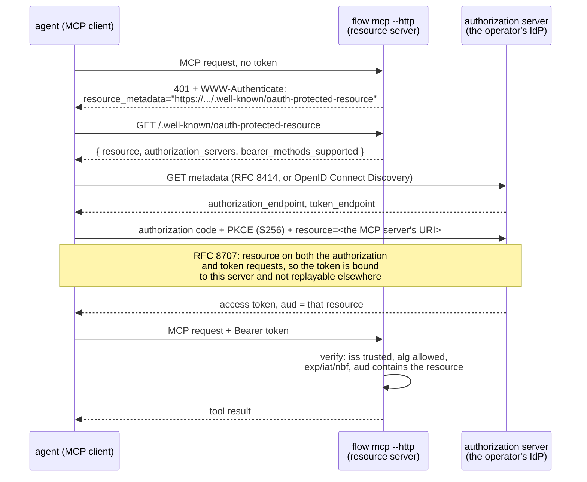

# MCP over HTTP: authorizing an agent

`flow mcp` over stdio inherits whatever the process that launched it can do —
there is exactly one caller, and it is trusted the way the shell that spawned
it is trusted. The moment `flow mcp` is reachable over HTTP there are many
callers, of several kinds, and "whoever can open a socket" is not an identity.
This page is the recipe for that surface: what a client does to get a token,
what an operator configures to accept one, and — as much as the rest — what
this deployment deliberately does not do yet.

It assumes the design recorded on [#558](https://github.com/picatz/flowstate/issues/558)
and sequenced on [#567](https://github.com/picatz/flowstate/issues/567), and
describes S7a of that sequence: a token-gated HTTP MCP surface with no scope
vocabulary and no delegation claims accepted. Read those issues for the
reasoning; this page is the operator-facing result.

## Nothing changes for stdio

The Model Context Protocol's own authorization spec says implementations using
stdio SHOULD NOT run this flow at all, and SHOULD take credentials from the
environment instead. `flow mcp` without `--http` (or whatever flag PR-1 lands
under) keeps doing exactly that: it serves the control plane to the process
that spawned it, with that process's own identity, and the tool description
`flow mcp` prints already says so plainly. None of what follows applies to
that mode. It is not a stopgap on the way to HTTP — the spec treats it as a
different, permanently valid transport with different rules, and so does this
deployment.

## The 401-first bootstrap, end to end

A client that has never talked to this server holds no token and does not
know where to get one. The whole point of RFC 9728 is that it does not have
to be told out of band — the server hands it the map on the first request:



Six steps, and every one of them already has a name in a spec:

1. **The bare request is refused with a pointer, not a wall.** `401` plus a
   `WWW-Authenticate: Bearer resource_metadata="..."` header naming the RFC
   9728 document. A client that has never seen this server before learns
   where to look from the failure itself.
2. **The protected-resource document says what this server is and who it
   trusts.** `resource` is this server's own canonical URI — the exact string
   every accepted token's `aud` claim must carry — and `authorization_servers`
   lists the issuer(s) whose tokens this server will verify. Both come from
   configuration, never from the request: naming an authorization server here
   that the trust policy does not also list is a startup failure, not a
   runtime surprise.
3. **The client discovers the authorization server's endpoints** from
   whichever of RFC 8414 or OpenID Connect Discovery the AS publishes — the
   MCP spec requires a client to support both, so either is a compliant
   answer.
4. **The client runs OAuth 2.1 authorization code with PKCE**, at the
   operator's own identity provider — flowstate is not that IdP, and does not
   stand in the middle of this exchange in any way. `resource` is sent on both
   the authorization request and the token request, per RFC 8707 §2, which is
   what makes the resulting token unusable against any other resource.
5. **The token comes back audience-bound.** Its `aud` claim names this MCP
   server's resource URI specifically.
6. **`flow mcp` verifies it the same way every other Connect RPC's bearer
   token is verified** — signature against the issuer's published keys, `iss`
   exact match against a trusted issuer, `aud` contains the accepted
   resource, `exp`/`iat`/`nbf` — because this is the same verifier
   (`auth.OIDCVerifier`) every authenticated surface in this repository
   already uses, not a second one built for MCP.

The audience check in step 6 is the one a deployment cannot skip and still
call itself compliant: a token minted for some other service must never be
accepted here just because it happens to be signed by a trusted issuer. That
is also this package's own answer to "does the resource server merely verify,
or does it also become an authorization server" — it verifies only. There is
no token endpoint here, and no code, refresh token, or client registration to
lose.

## What an operator configures

Two things, both already-familiar shapes rather than new machinery:

- **A trusted issuer whose audiences include this server's resource URI**, in
  the existing trust policy — the same `auth.TrustedIssuer` entry every other
  authenticated surface in this repository is configured with:

  ```yaml
  issuers:
    - name: agent-idp
      issuer: https://acme.okta.com
      audiences:
        - https://flowstate.example.com/mcp
      role: mcp-caller
      namespace: acme
  ```

  Nothing MCP-specific lives in this block. It is a trust policy entry like
  any other; what makes it usable from MCP is only that its `audiences` value
  matches the resource this server advertises.

- **The protected-resource metadata and its authorization server list**,
  which PR-1 adds as `--protected-resource` (this server's own resource URI)
  and `--authorization-server` (repeatable, one per trusted issuer this
  surface should advertise) on `flow mcp`. Every value passed to
  `--authorization-server` must already be a trusted issuer in the policy
  above — advertising one the trust policy does not accept is refused at
  start-up, on the fail-closed principle that a resource server should never
  point a client at a door the policy itself keeps locked.

  ```sh
  flow mcp --http :8443 \
    --auth-policy /etc/flowstate/policy.yaml \
    --protected-resource https://flowstate.example.com/mcp \
    --authorization-server https://acme.okta.com
  ```

With both in place, the wire exchange in the diagram above is the whole of
what a compliant MCP client needs from *flowstate* — no flowstate-specific
client library, and no credential flowstate itself hands out. One step may
remain at the identity provider: an authorization-code client still needs a
`client_id` the AS recognizes (OAuth 2.0 §2.2). An IdP supporting dynamic
client registration or Client ID Metadata Documents grants one on the fly;
against an IdP supporting neither, the operator must pre-register the MCP
client there and configure the client with the ID it was given, before the
flow above can start. That registration belongs to the IdP, not to
flowstate — nothing here reads or stores it.

## What this deliberately does not do (yet)

Naming the gaps is as much the point of this page as the recipe is, because a
half-built authorization story that reads as finished is worse than one that
says plainly what it is missing.

- **Flowstate is not an authorization server.** No authorization endpoint, no
  token endpoint, no PKCE verification performed here, no refresh tokens
  issued. Every one of those stays the operator's identity provider's job. If
  a deployment has no IdP, HTTP MCP is not available to it today —
  `--insecure-no-auth` covers loopback development only.
- **No scope vocabulary yet.** `scopes_supported` is not advertised, and no
  `401`/`403` challenge names a `scope` parameter. This is deferred by
  omission rather than half-specified: the action/scope vocabulary is one
  decision shared across the policy surface, the protected-resource metadata,
  and MCP's own step-up challenges (#567's D1), and until that decision is
  made, this surface names none of it rather than shipping a spelling that
  would have to migrate later. Authorization here is coarse — a caller with a
  verified, audience-bound token from a trusted issuer may call every tool
  the trust policy's claim rules and role admit — the same granularity every
  other authenticated Connect RPC already has.
- **No delegation.** A token carrying an RFC 8693 `act` or `may_act` claim —
  the shape an agent acting for a human produces — is refused outright, not
  silently accepted as the bare subject and not stripped down to one. Refusal
  preserves what the token itself claims; silently admitting it as an
  undelegated caller would let the request proceed under a story the audit
  trail no longer tells. This is deferred fail-closed rather than
  deferred-by-omission, because unlike a missing scope string, a delegation
  claim this deployment cannot yet interpret is exactly the shape a confused
  deputy attack takes. Delegation semantics are `PrincipalKind` and
  `on_behalf_of` on the schema (#567's S3, gated on the D2 naming decision)
  and RFC 8693 `actor_token` support in the existing token exchanger (S8);
  neither has landed.
- **No dynamic client registration and no Client ID Metadata Documents.** A
  resource server needs neither — client registration is an authorization
  server's obligation, and flowstate is not one. Revisit only alongside the
  authorization-server work above, if it is ever taken on.
- **Local execution is off by default on this surface.** `flowstate_run_local`
  executes submitted code in the server process; over HTTP that is remote
  code execution as a feature, and it stays opt-in, separately from
  everything above. `flowstate_test` — a stubbed rehearsal that reaches
  nothing by construction — is served.

## Relation to stdio's identity caveat

`flow mcp`'s stdio tool descriptions already warn that "the signal is
delivered as this process's own identity, not as the identity of whoever asked
for it" and that nothing on that transport can attest a particular human
approved anything. An authenticated HTTP session with a verified, audience-
bound token is what changes that: the caller a tool handler authorizes
against is a real, verified principal rather than the process's own identity.
What it is not, yet, is a principal that can say *whose* agent it is — that is
exactly the delegation gap named above, and it is why an approval ceremony
that depends on knowing a human authorized it should not be built on this
surface until that gap closes.
