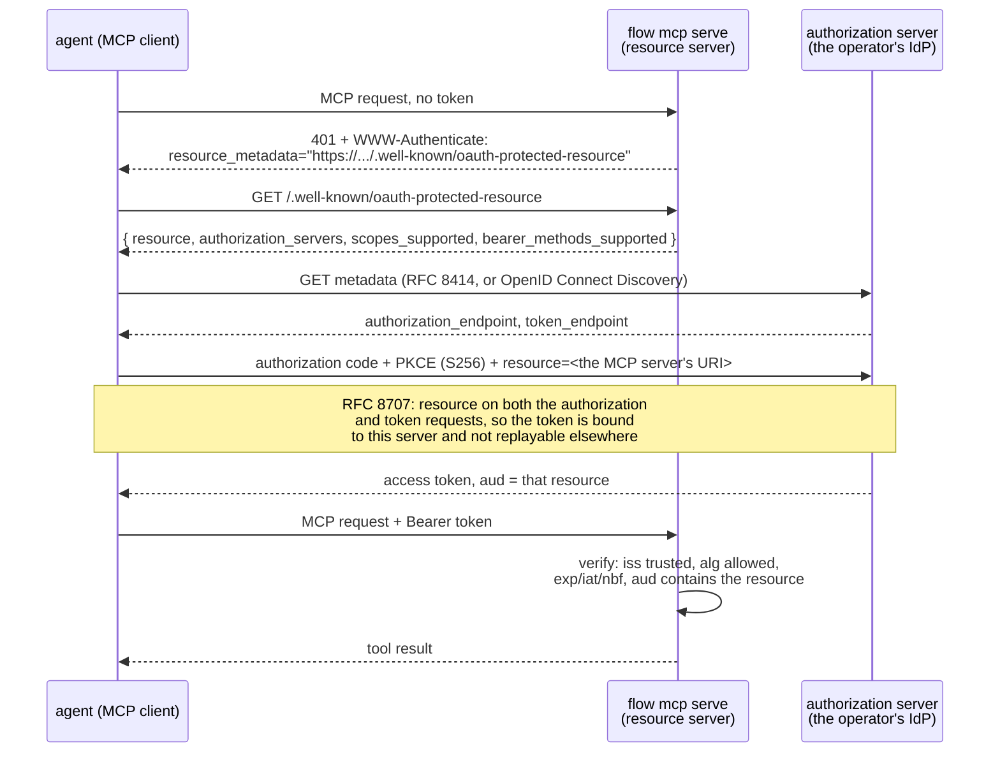

# MCP over HTTP: authorizing an agent

`flow mcp` over stdio inherits whatever the process that launched it can do —
there is exactly one caller, and it is trusted the way the shell that spawned
it is trusted. The moment `flow mcp` is reachable over HTTP there are many
callers, of several kinds, and "whoever can open a socket" is not an identity.
This page is the recipe for that surface: what a client does to get a token,
what an operator configures to accept one, and — as much as the rest — what
this deployment deliberately does not do yet.

It assumes the design recorded on [#558](https://github.com/picatz/flowstate/issues/558)
and sequenced on [#567](https://github.com/picatz/flowstate/issues/567), and
describes a token-gated HTTP MCP surface with a shared scope vocabulary and no
delegation claims accepted. Read those issues for the
reasoning; this page is the operator-facing result.

The surface is `flow mcp serve` — its own verb, not a flag on `flow mcp`.
That is #558's decision 2, and the reasoning is in the section below on what
this surface deliberately does not serve.

## Nothing changes for stdio

The Model Context Protocol's own authorization spec says implementations using
stdio SHOULD NOT run this flow at all, and SHOULD take credentials from the
environment instead. `flow mcp` — the bare verb, with no subcommand — keeps
doing exactly that: it serves the control plane to the process
that spawned it, with that process's own identity, and the tool description
`flow mcp` prints already says so plainly. None of what follows applies to
that mode. It is not a stopgap on the way to HTTP — the spec treats it as a
different, permanently valid transport with different rules, and so does this
deployment.

## The 401-first bootstrap, end to end

A client that has never talked to this server holds no token and does not
know where to get one. The whole point of RFC 9728 is that it does not have
to be told out of band — the server hands it the map on the first request:



Six steps, and every one of them already has a name in a spec:

1. **The bare request is refused with a pointer, not a wall.** `401` plus a
   `WWW-Authenticate: Bearer resource_metadata="..."` header naming the RFC
   9728 document. A client that has never seen this server before learns
   where to look from the failure itself.
2. **The protected-resource document says what this server is and who it
   trusts.** `resource` is this server's own canonical URI — the exact string
   every accepted token's `aud` claim must carry — and `authorization_servers`
   lists the issuer(s) whose tokens this server will verify. Both come from
   configuration, never from the request: naming an authorization server here
   that the trust policy does not also list is a startup failure, not a
   runtime surprise.
3. **The client discovers the authorization server's endpoints** from
   whichever of RFC 8414 or OpenID Connect Discovery the AS publishes — the
   MCP spec requires a client to support both, so either is a compliant
   answer.
4. **The client runs OAuth 2.1 authorization code with PKCE**, at the
   operator's own identity provider — flowstate is not that IdP, and does not
   stand in the middle of this exchange in any way. `resource` is sent on both
   the authorization request and the token request, per RFC 8707 §2, which is
   what makes the resulting token unusable against any other resource.
5. **The token comes back audience-bound.** Its `aud` claim names this MCP
   server's resource URI specifically.
6. **`flow mcp serve` verifies it the same way every other Connect RPC's bearer
   token is verified** — signature against the issuer's published keys, `iss`
   exact match against a trusted issuer, `aud` contains the accepted
   resource, `exp`/`iat`/`nbf` — because this is the same verifier
   (`auth.OIDCVerifier`) every authenticated surface in this repository
   already uses, not a second one built for MCP.

The audience check in step 6 is the one a deployment cannot skip and still
call itself compliant: a token minted for some other service must never be
accepted here just because it happens to be signed by a trusted issuer. That
is also this package's own answer to "does the resource server merely verify,
or does it also become an authorization server" — it verifies only. There is
no token endpoint here, and no code, refresh token, or client registration to
lose.

## What an operator configures

Two things, both already-familiar shapes rather than new machinery:

- **A trusted issuer whose audiences include this server's resource URI**, in
  the existing trust policy — the same `auth.TrustedIssuer` entry every other
  authenticated surface in this repository is configured with:

  ```yaml
  issuers:
    - name: agent-idp
      issuer: https://acme.okta.com
      audiences:
        - https://flowstate.example.com/mcp
      role: mcp-caller
      namespace: acme
  ```

  Nothing MCP-specific lives in this block. It is a trust policy entry like
  any other; what makes it usable from MCP is only that its `audiences` value
  matches the resource this server advertises.

- **The protected-resource metadata and its authorization server list**,
  spelled `--protected-resource` (this server's own resource URI) and
  `--authorization-server` (repeatable, one per trusted issuer this surface
  should advertise). Both are required — a `flow mcp serve` with neither
  refuses to start rather than serving an unauthenticated surface — and both
  also exist on `flow server`, which serves the same RFC 9728 document for
  its Connect RPC surface. Every value passed to
  `--authorization-server` must already be a trusted issuer in the policy
  above — advertising one the trust policy does not accept is refused at
  start-up, on the fail-closed principle that a resource server should never
  point a client at a door the policy itself keeps locked.

  ```sh
  flow mcp serve --listen 127.0.0.1:8617 \
    --auth-policy /etc/flowstate/policy.yaml \
    --protected-resource https://flowstate.example.com/mcp \
    --authorization-server https://acme.okta.com
  ```

  `--listen` defaults to loopback. Any other address requires
  `--tls-cert-file`/`--tls-key-file` here, or `--tls-terminated-upstream` when
  a proxy in front of this process already terminates TLS — the same refusal
  `flow server` makes, for the same reason: a bearer token on a cleartext
  connection that leaves this machine is a credential handed to whatever sits
  in between.

  The metadata document is served at RFC 9728 §3.1's constructed location,
  which inserts the well-known component *before* the resource's own path. A
  resource of `https://flowstate.example.com/mcp` publishes its document at
  `https://flowstate.example.com/.well-known/oauth-protected-resource/mcp`,
  not at the bare prefix, and that exact URL is what the `WWW-Authenticate`
  challenge names.

With both in place, the wire exchange in the diagram above is the whole of
what a compliant MCP client needs from *flowstate* — no flowstate-specific
client library, and no credential flowstate itself hands out. One step may
remain at the identity provider: an authorization-code client still needs a
`client_id` the AS recognizes (OAuth 2.0 §2.2). An IdP supporting dynamic
client registration or Client ID Metadata Documents grants one on the fly;
against an IdP supporting neither, the operator must pre-register the MCP
client there and configure the client with the ID it was given, before the
flow above can start. That registration belongs to the IdP, not to
flowstate — nothing here reads or stores it.

## The bounds, and why there are several

An authenticated client controls several resources on this surface
independently, and bounding one bounds none of the others, so each has its
own:

- `--max-request-bytes` (default 1 MiB) caps one request body. A tool call
  here carries a Flowfile and a test document, so the default is generous by
  two orders of magnitude; anything over it is refused with `413` rather than
  buffered. The cap is applied below the MCP library as well as through it,
  so no path the library treats specially can miss it.
- `--max-sessions` (default 32) caps how many streamable-HTTP sessions are
  open at once. Each holds a goroutine and an initialized server, and how
  many exist is the client's choice: one POST without an `Mcp-Session-Id`
  header opens another. A request that would open one past the limit gets
  `503` with a `Retry-After` hint. Sessions idle for five minutes are closed
  and their slots returned.

- `--max-session-requests` (default 8) bounds how many requests one session
  may have in flight at once. `--max-sessions` bounds how many sessions exist
  and says nothing about how many connections one of them is replayed over —
  each is a goroutine, and each queues behind the registry lock below. Per
  session rather than global, because sessions are already bounded: the
  product bounds the surface, and one caller saturating their own session
  cannot refuse anybody else's request.
- `--test-timeout` (default 2m) bounds one `flowstate_test` call. A submitted
  workflow can park forever on its own — flowtest's virtual clock advances only
  when every participant is parked, so a `wait_for_signal:` with no timeout and
  no scripted signal has no deadline to advance to — and that is a legal
  Flowfile, so the refusal cannot live in validation. It matters more here than
  the two above because a `flowstate_test` call also holds the surface's
  registry lock while it runs, so an unbounded one stops the surface for
  everyone rather than only for the caller who asked. A call the deadline
  stops is reported as a stopped call, never as a verdict: `flowtest` reads a
  cancelled run as a run that failed, so a case declaring `expect.failed: true`
  would otherwise be marked passed on a workflow that never completed.

Sessions are also pinned to the principal that opened them: the verified
token's issuer and subject become the session's owner, and a request carrying
a different principal's token on that session is refused with `403` even
though the token itself is perfectly valid.

## What this deliberately does not do (yet)

Naming the gaps is as much the point of this page as the recipe is, because a
half-built authorization story that reads as finished is worse than one that
says plainly what it is missing.

- **Flowstate is not an authorization server.** No authorization endpoint, no
  token endpoint, no PKCE verification performed here, no refresh tokens
  issued. Every one of those stays the operator's identity provider's job. If
  a deployment has no IdP, HTTP MCP is not available to it today —
  `--insecure-no-auth` covers loopback development only.
- **Scopes are actions, not another policy model.** The protected-resource
  document publishes stable `flowstate:<action>` values derived from the same
  authorization actions policy evaluates. A 401 precisely names
  `invalid_token`; a denial may name the required scope only after the caller
  is known and disclosure cannot reveal a hidden resource. DPoP-bound requests
  receive `DPoP` challenges and bearer requests receive `Bearer`.
- **No delegation.** A token carrying an RFC 8693 `act` or `may_act` claim —
  the shape an agent acting for a human produces — is refused outright, not
  silently accepted as the bare subject and not stripped down to one. Refusal
  preserves what the token itself claims; silently admitting it as an
  undelegated caller would let the request proceed under a story the audit
  trail no longer tells. This is deferred fail-closed rather than
  deferred-by-omission, because unlike a missing scope string, a delegation
  claim this deployment cannot yet interpret is exactly the shape a confused
  deputy attack takes. Delegation semantics are `PrincipalKind` and
  `on_behalf_of` on the schema (#567's S3, gated on the D2 naming decision)
  and RFC 8693 `actor_token` support in the existing token exchanger (S8);
  neither has landed.
- **Client registration remains the authorization server's job.** Clients may
  use a pre-registered identifier, dynamic registration only where the provider
  explicitly enables it, or an HTTPS Client ID Metadata Document. Documents are
  fetched without redirects through the public-network SSRF policy, with DNS/IP
  checks at connection time, strict JSON content type and byte bounds, exact
  redirect-URI matching, bounded caching, and no stale-on-error fallback.
- **A reduced tool list, by absence rather than by a flag.** Two groups are
  not registered on this surface at all, so a model does not see them and
  there is no flag that turns either on:

  - `flowstate_run_local` executes submitted code in the server process. Over
    HTTP that is remote code execution as a feature (#558's decision 3). It
    is absent rather than disabled because a tool a model can see is a tool it
    will try, and a tool list is the honest place to say no.
  - The run-lifecycle tools — `flowstate_run`, `flowstate_get`,
    `flowstate_signal`, `flowstate_signal_with_start`, `flowstate_list`,
    `flowstate_cancel`, `flowstate_terminate` — dispatch to a *deployment*
    through a client this process authenticates as **itself**. Serving them
    to a caller this surface cannot yet authorize per principal would spend
    this process's authority on that caller's behalf, which is the confused
    deputy the specification's "MUST NOT pass the client's token through"
    rule is about, arrived at from the other direction. They return when this
    surface can authorize per principal (S7b).

  What is served is what answers in this process and touches no run and no
  tenant: `flowstate_validate`, `flowstate_compile`, `flowstate_get_catalog`
  — plus `flowstate_test`, which is served deliberately (#558's Q3) because a
  stubbed run replaces every task implementation before a step executes and
  so reaches nothing whatever the process was started with.

- **`--reveal-sensitive` is refused here.** Over stdio it is one deliberate
  decision by the person who started the process and is its only caller. Over
  HTTP the same sentence reads "show declared-sensitive values in the clear
  to whoever authenticates", so this surface refuses the flag at start-up
  rather than honouring it. `--insecure-no-auth` is refused for the
  corresponding reason: a protected resource that authenticates nobody is not
  one.

## Relation to stdio's identity caveat

`flow mcp`'s stdio tool descriptions already warn that "the signal is
delivered as this process's own identity, not as the identity of whoever asked
for it" and that nothing on that transport can attest a particular human
approved anything. An authenticated HTTP session with a verified, audience-
bound token is what changes that: the caller a tool handler authorizes
against is a real, verified principal rather than the process's own identity.
What it is not, yet, is a principal that can say *whose* agent it is — that is
exactly the delegation gap named above, and it is why an approval ceremony
that depends on knowing a human authorized it should not be built on this
surface until that gap closes.

## Human, headless-agent, and workload sequences

A **human client** discovers the resource and authorization-server documents,
selects authorization code, requires PKCE `S256`, uses PAR when advertised, and
opens the authorization endpoint in the user's browser. It sends the exact same
`redirect_uri`, code verifier, resource indicator, and requested Flowstate scopes
at the token endpoint. A provider advertising DPoP binds both requests and the
resource call to the same proof key.

A **headless agent** prefers the device authorization grant when the provider
advertises its endpoint. The agent displays the verification URI and user code,
polls within the server's interval, and requests an audience-bound token. If the
provider lacks device authorization, an operator must provision a pre-registered
non-browser client; silently falling back to an embedded password is not allowed.

A **workload** has no human browser. It uses a pre-registered confidential client
(`private_key_jwt` or mTLS), or RFC 8693 token exchange when advertised. When mTLS
endpoint aliases are published it uses those aliases as a unit, never mixing a
regular endpoint with an mTLS credential. Dynamic registration is used only under
an explicit operator/provider opt-in. In every sequence metadata is discovery,
not authority: unsupported PKCE, client authentication, PAR, DPoP, device flow,
or token exchange causes that flow to stop rather than downgrade.
