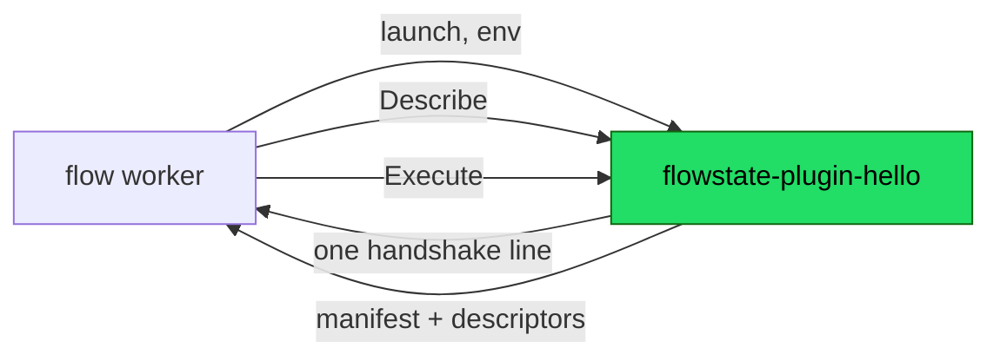

# Writing a plugin

For someone outside this repository. A plugin is a separate executable a
Flowstate worker launches; nothing about writing one requires a checkout, a
`replace` directive, or permission. This page is the path from an empty
directory to a task of your own showing up in `flow plugins`, and then the five
places where the contract between your binary and the engine is real but not
written down anywhere you would look.

If you only want to *use* a plugin somebody else wrote,
[examples/plugins/greet](../examples/plugins/greet) is that page. If you want the
protocol rather than the Go SDK, skip to
[Writing one in another language](#writing-one-in-another-language).

Everything below was run against `c4ead7c`, from a module outside this
repository, and the transcripts are what the commands actually printed.

## Contents

- [The shape of the thing](#the-shape-of-the-thing)
- [Chapter one: a plugin that runs](#chapter-one-a-plugin-that-runs)
- [Chapter two: the schema is the contract](#chapter-two-the-schema-is-the-contract)
- [Five places the contract is implicit](#five-places-the-contract-is-implicit)
- [The rest of the manifest](#the-rest-of-the-manifest)
- [Classifying failures](#classifying-failures)
- [Writing one in another language](#writing-one-in-another-language)
- [Known limitations](#known-limitations)

## The shape of the thing

A plugin is a process, not a library. A worker discovers an executable named
`flowstate-plugin-<name>` on a directory it was told to look in, launches it with
a magic cookie and a socket path in its environment, waits for one line on
stdout, and then talks Connect RPC to it over that socket for as long as the
worker lives.



The green box is all you write. The handshake, the socket, the token check, the
signal handling and the shutdown are
[`pkg/flowstate/v1/plugin/sdk`](../pkg/flowstate/v1/plugin/sdk)'s, and the host
half is documented end to end in
[`pkg/flowstate/v1/plugin`'s package doc](../pkg/flowstate/v1/plugin/doc.go)
(`doc.go:70-98` is the handshake, field by field).

## Chapter one: a plugin that runs

Two files, one of which `go mod tidy` writes.

```console
$ mkdir flowstate-plugin-hello && cd flowstate-plugin-hello
$ go mod init example.com/flowstate-plugin-hello
```

`main.go`:

```go
package main

import (
	"context"
	"fmt"

	flowstatev1 "github.com/picatz/flowstate/pkg/flowstate/v1"
	"github.com/picatz/flowstate/pkg/flowstate/v1/plugin/sdk"
)

func main() {
	sdk.Main(sdk.Plugin{
		Name:        "hello",
		Version:     "0.1.0",
		Description: "Greets someone.",
		Tasks: []sdk.Task{{
			Name:    "greet",
			Summary: "Greet someone by name.",
			Fn:      greet,
		}},
	})
}

func greet(_ context.Context, inputs map[string]*flowstatev1.Value, _ *flowstatev1.Scope) (*flowstatev1.Node_Outputs, error) {
	name := inputs["name"].GetLiteral().GetStringValue()
	if name == "" {
		return nil, sdk.InvalidInput("name is required")
	}
	return &flowstatev1.Node_Outputs{NamedValues: flowstatev1.NewNamedValues(map[string]any{
		"message": fmt.Sprintf("Hello, %s!", name),
	})}, nil
}
```

`sdk.Main` is the whole of `func main` (`sdk/sdk.go:312-325`). The manifest the
engine sees is derived from that struct rather than written beside it, so a
plugin cannot advertise a capability it did not implement: `Secrets` being set
is what advertises secret resolution, and a non-empty `Tasks` is what advertises
tasks (`sdk/sdk.go:688-730`).

Resolve the dependency, build under the name discovery looks for, and ask what a
worker would find:

```console
$ go mod tidy
go: found github.com/picatz/flowstate/pkg/flowstate/v1/plugin/sdk in
    github.com/picatz/flowstate v0.0.0-20260821212057-c4ead7c54469
$ mkdir -p bin
$ go build -o bin/flowstate-plugin-hello .
$ flow plugins --plugin-dir ./bin
hello 0.1.0
  Greets someone.
  /.../bin/flowstate-plugin-hello

  hello.greet
    Greet someone by name.
    receives prior step outputs: no
  inputs  none
  outputs  none
```

The name is not a convention you may vary. Discovery reads the plugin's name off
the binary's suffix and ignores everything without the prefix
(`plugin/discover.go:19`, `:140-144`), so `bin/hello` is not a plugin and
`flow plugins` will tell you the directory is empty. The suffix is also the
qualifier a Flowfile writes — `hello.greet:` — and a plugin cannot choose or
forge it, which is why two plugins may each provide `post` without colliding
(`sdk/sdk.go:204-212`).

Run the binary from a shell and it explains itself rather than speaking a binary
protocol at your terminal (`sdk/sdk.go:333-367`):

```console
$ ./bin/flowstate-plugin-hello
hello is a Flowstate plugin, not a command.
...
To use it, put it in a directory on a worker's plugin search path — the file has
to be named flowstate-plugin-hello — and configure the worker to look there.
```

That is chapter one, and it took one file. It is also, as printed above, a task
that documents nothing and validates nothing. Chapter two is the part that
matters.

## Chapter two: the schema is the contract

`inputs none` in that listing does not mean "takes nothing". It means "declares
nothing", and the difference is everything the descriptor pipeline exists for. A
task's `Input` and `Output` are zero values of protobuf messages whose
descriptors travel to the engine in the manifest, which is what lets the engine
validate a workflow using your task, complete its fields in an editor, and
document it — without compiling a line of your code
(`sdk/sdk.go:217-226`, `plugin/descriptor.go:25-29`).

So: a schema of your own.

```proto
syntax = "proto3";

package hello.v1;

option go_package = "example.com/flowstate-plugin-hello/gen/hello/v1;hellov1";

message GreetInputs {
  string name = 1;
  string greeting = 2;
}

message GreetOutputs {
  string message = 1;
}
```

Generated the way the in-tree example generates its own — `buf.gen.yaml` at the
module root, `buf.yaml` beside the protos, and `protoc-gen-go` from the version
your `go.mod` already pins, so regenerating needs no network beyond the module
cache (see
[`examples/flowstate-plugin-example/buf.gen.yaml`](../pkg/flowstate/v1/plugin/examples/flowstate-plugin-example/buf.gen.yaml)):

```console
$ GOBIN=$PWD/tools go install google.golang.org/protobuf/cmd/protoc-gen-go
$ PATH=$PWD/tools:$PATH go run github.com/bufbuild/buf/cmd/buf@v1.72.0 generate proto
```

Then name the messages on the task and decode through them:

```go
Tasks: []sdk.Task{{
	Name:    "greet",
	Summary: "Greet someone by name.",
	Input:   &hellov1.GreetInputs{},
	Output:  &hellov1.GreetOutputs{},
	Fn:      greet,
}},
```

```go
func greet(_ context.Context, inputs map[string]*flowstatev1.Value, _ *flowstatev1.Scope) (*flowstatev1.Node_Outputs, error) {
	var in hellov1.GreetInputs
	if err := sdk.DecodeInputs(inputs, &in); err != nil {
		return nil, sdk.InvalidInput("%v", err)
	}
	if in.GetName() == "" {
		return nil, sdk.InvalidInput("name is required")
	}
	greeting := in.GetGreeting()
	if greeting == "" {
		greeting = "Hello"
	}
	outputs, err := sdk.EncodeOutputs(&hellov1.GreetOutputs{
		Message: fmt.Sprintf("%s, %s!", greeting, in.GetName()),
	})
	if err != nil {
		return nil, sdk.Failed("%v", err)
	}
	return outputs, nil
}
```

The same command now prints a task somebody could write a step against:

```console
$ flow plugins --plugin-dir ./bin
  hello.greet
    Greet someone by name.
    receives prior step outputs: no
  inputs   name      string
           greeting  string
  outputs  message   string
```

Output field names are the names a later step reads —
`${hi.message}` — because `EncodeOutputs` turns one message field into one named
output (`sdk/values.go:269-298`). A task whose output shape is not fixed declares
the field as `google.api.expr.v1alpha1.Value` and builds it with `sdk.Literal`
(`sdk/values.go:430-450`); any other message type is refused rather than
converted approximately (`sdk/values.go:399-412`).

You can check a Flowfile against it without a worker, a server, or Temporal:

```console
$ flow validate --plugin-dir ./bin workflow.yaml
```

`flow validate --plugin-dir` launches the plugins on that path through the same
discovery and handshake a worker uses and checks the file against what they
provide (`cmd/flow/main.go:1531-1563`). Without `--plugin-dir` it reports the
task as one it has not been told about, which is correct rather than unhelpful:
whether a plugin is installed is a deployment's decision and not a property of
the file.

## Five places the contract is implicit

Everything above works. What follows is what an outside author learns by walking
that path and hitting the parts nothing says out loud — each of them invisible at
your build time and visible later, at a host, to somebody who cannot fix it.

### 1. Declaring no schema is a silent opt-out of the whole contract

`Task.Input` and `Task.Output` may be nil (`sdk/sdk.go:225-226`), the host
accepts a manifest that names no message for a side
(`plugin/descriptor.go:34-36`), and `flow plugins` renders it as `inputs none`
(`cmd/flow/tasks.go:592-597`, rendered from `cmd/flow/plugins.go:298-301`). Every
part of that is deliberate, and the sum of it is a task with no contract at all,
described in the same word a task with genuinely no inputs uses.

Nothing checks the inputs going in: the host has no descriptor to check against,
and inside the plugin `DecodeInputs` ignores an input the message has no field
for, on purpose, so a workflow written against a newer version of a task does not
fail against an older plugin (`sdk/values.go:42-46`). The two are individually
right and jointly silent.

Measured on the two plugins this page builds, against the same Flowfile with
`name` misspelled as `nmae`:

```console
$ flow validate --plugin-dir ./bin workflow.yaml     # no descriptors
workflow.yaml: ok

$ flow validate --plugin-dir ./bin3 workflow.yaml    # descriptors
workflow.yaml:6:13: step "hi" input "nmae": task "hello.greet" has no such
input; did you mean "name"?
```

Same engine, same command, same file. The difference is entirely whether your
task shipped a schema.

> [!IMPORTANT]
> Chapter one is a way to see a plugin run, not a way to ship one. A task
> without descriptors cannot be validated, completed, or documented by anything,
> and neither its author nor the operator installing it is told so.

Nothing today reports a descriptor-less task as a finding; see
[known limitations](#known-limitations).

### 2. What you are depending on is not versioned yet

There are no tags on this repository, so both `go mod tidy` and an explicit
`go get github.com/picatz/flowstate@latest` resolve to a pseudo-version of
whatever the default branch was at that moment
(`v0.0.0-20260821212057-c4ead7c54469`, above). It works — you do not need a
`replace`, and the walkthrough on this page was built without one — but what you
get is a moving target with nothing said about what within it is stable.

Two things follow that are worth knowing before you build on it:

- **The SDK is not separable from the engine.** Depending on
  `pkg/flowstate/v1/plugin/sdk` pulls the module: 368 packages across 126 modules
  in the graph for the chapter-one plugin, and a 24 MB binary. That is a
  consequence of `TaskFunc` speaking in `flowstatev1.Value` and
  `flowstatev1.Scope` (`sdk/sdk.go:301`), which is also what makes a plugin task
  identical in shape to a built-in one.
- **The wire protocol is versioned; the Go API is not.** The protocol is
  negotiated at launch and a mismatch is refused at startup with a message saying
  which side to upgrade (`sdk/sdk.go:608-621`, `protocol.go:171` for the current
  version). Nothing equivalent covers the Go types you compile against.

The two in-tree plugin modules are not the counter-example they look like. Each
pins `github.com/picatz/flowstate v0.0.0-00010101000000-000000000000` behind a
`replace => ../..` that its own `go.mod` calls a local-development convenience
(`plugins/git/go.mod:66-69`) — correct for a module inside this repository, and
not a line to copy.

### 3. The manifest's string lists are claims nothing cross-checks

`DeferredInputs`, `ExpressionInputs` and `SecretInputs` name inputs by string.
The SDK copies them into the manifest as given (`sdk/sdk.go:734-762`), and the
host's `checkManifest` validates the manifest's shape, its capabilities, its
schemes and its task-name uniqueness — and never intersects those three lists
with the descriptors sitting beside them in the same message
(`plugin/plugin.go:504-594`). A typo in one is therefore accepted at launch and
discovered at execution.

The full path, measured, with `SecretInputs: []string{"tokn"}` and a Flowfile
writing `token: ${secret('env:GREET_TOKEN')}`:

```console
$ flow validate --plugin-dir ./bin workflow.yaml
workflow.yaml: ok

$ flow run local workflow.yaml --plugin-dir ./bin --secret-env GREET_TOKEN \
    --auth-policy auth.yaml
ERROR
error running workflow locally: step "hi": task "hello.greet": input "token" is
a secret reference, which this task did not declare as accepting one; this task
accepts one in tokn
```

The refusal is a good one — it is deny-by-default and it names what the task
*does* accept (`plugin/task.go:392-395`, `:410-418`) — and it arrives at
execution, to whoever is running the workflow rather than to whoever wrote the
plugin. `flow validate` cannot catch it: the manifest's `secret_inputs` reaches
the registry as `TaskDef.SecretInputs` (`registry.go:155-172`), but the
validator's secret checking consults only `NestedSecretInputs`, for structures
that hold a reference inside them (`flowfile/secret.go:261`, `registry.go:378`).

All three lists are checkable against the descriptors at `sdk.Run` time, which is
earlier than either and reaches the person who can fix it. Nothing does it today;
see [known limitations](#known-limitations).

### 4. Three traps the code knows about and no authoring surface teaches

**A stray write to stdout before serving corrupts the handshake.** The SDK
points `os.Stdout` at stderr, but only *after* announcing, because the
announcement is the one thing stdout is for (`sdk/sdk.go:489-497`). Anything
printed before that — a debug line, a dependency's `init`, a library's banner —
lands where the host is reading a protocol:

```console
$ flow plugins --plugin-dir ./bin
ERROR
plugin "hello" (/.../bin/flowstate-plugin-hello): plugin: handshake failed:
handshake line starts with "debug: starting", want "FLOWSTATE-PLUGIN" — is this
a Flowstate plugin?
```

That message is as good as it can be (`internal/protocol/protocol.go:257`), and
it still names your first debug line as a protocol failure. Log through
`sdk.WithLogger` or to stderr; after `sdk.Main` is serving, `fmt.Println` is
harmless, since stdout has been redirected — but Go code writing to file
descriptor 1 directly, such as linked C, gets through regardless
(`sdk/sdk.go:494-497`).

**`ShapesOutputs` is a claim about your executor, and three host surfaces believe
it.** Setting it says this task reads an input named `outputs` as a mapping of
name to expression and returns *those* names instead of its declared ones. The
compiler, the validator and the language server all describe the step in those
terms, so a task that sets it and returns its declared outputs anyway gets all
three describing a step that produces something else (`sdk/sdk.go:275-292`).
False is the right answer for every ordinary task, including one that happens to
have an input called `outputs`.

**A relaunched plugin must describe itself the same way.** The host restarts a
plugin that exits, with backoff, and refuses one that comes back claiming
different schemes or different tasks, because adapters already handed to the
engine are bound to the first answer (`plugin/doc.go:117-123`). A manifest built
from anything that varies per launch — an environment lookup, a feature flag, a
directory listing — is a plugin that works until it restarts.

### 5. There was no walkthrough

This page is that gap closed. The route an outside author previously had was to
find `pkg/flowstate/v1/plugin/examples/flowstate-plugin-example` by reading the
SDK's source, which is still the best worked example in the tree — it advertises
both capabilities from one process, resolves secrets scoped by namespace, and
takes a host-managed secret in a task input — and is now linked from
[the docs index](README.md) rather than only from a doc comment.

## The rest of the manifest

The fields not covered above, each a claim the engine acts on:

| Field | What it says | Reference |
| --- | --- | --- |
| `NeedsScope` | This task receives prior step outputs and enclosing loop variables. Most tasks do not, and asking for it puts data on the wire for nothing. | `sdk/sdk.go:255-259` |
| `DeferredInputs` | This task evaluates these inputs' expressions itself, in a scope the workflow does not have. The engine passes them through untouched. | `sdk/sdk.go:228-236` |
| `ExpressionInputs` | These inputs must be *written* as `${...}` rather than as a literal — a different question from who evaluates them. | `sdk/sdk.go:238-253` |
| `SecretInputs` | A Flowfile may write `${secret(...)}` into these inputs. The host resolves the reference before your process sees the request, so `Fn` always receives a value and never a reference. | `sdk/sdk.go:261-271` |
| `ShapesOutputs` | This task returns the output names its `outputs` input maps, in place of its declared ones. | `sdk/sdk.go:275-292` |
| `Health` | Whether the plugin can serve. Leave it nil unless you depend on something; report not-serving when that dependency is unreachable rather than failing every request. | `sdk/sdk.go:138-148` |

`ExpressionInputs` is enforced by `flow validate` when the validator has been
told about your plugin. Against the chapter-two plugin declaring `greeting` as
one, a literal is refused at the author's terminal:

```console
$ flow validate --plugin-dir ./bin3 workflow.yaml
workflow.yaml:7:17: step "hi" input "greeting": task "hello.greet" evaluates
input "greeting" as an expression, so it has to be written as one: wrap the
value in ${...}
```

The mechanism is `MustBeExpression` over the registry
(`registry.go:426-428`, read at `flowfile/schema.go:128`), and what makes it
reach a plugin's task is `--plugin-dir` registering the host into that registry
(`cmd/flow/plugins.go:383`). Without `--plugin-dir` the validator has not been
told the task exists, so the declaration is inert — not because it is
unimplemented, but because nothing asked.

## Classifying failures

Whether a step is retried is decided by the error your task returns, and only
your plugin knows whether its backend's failure was transient. Return through the
constructors rather than as a bare error (`sdk/errors.go:22-30`):

| Constructor | Meaning | Retried |
| --- | --- | --- |
| `NotFound` | The secret or resource does not exist | no |
| `PermissionDenied` | The backend refused | no |
| `InvalidInput` | The inputs or the reference are wrong | no |
| `Conflict` | A compare-and-swap lost to a concurrent writer | no |
| `Failed` | It failed, and another attempt will not fix it | no |
| `OutcomeUnknown` | It may or may not have taken effect | no |
| `Unavailable` | The backend could not be reached, or timed out | **yes** |

`UnavailableAfter` is `Unavailable` carrying a delay a backend named — a 429 or a
503 with `Retry-After` — which the host maps onto the step's retry hint
(`sdk/errors.go:121-136`).

> [!WARNING]
> An error from a plugin is surfaced to users and written to workflow history,
> which is durable and broadly readable. Never interpolate a secret, a token, or
> a credential-bearing backend message into one. The same applies to what a
> `Health` check returns, which the engine logs (`sdk/sdk.go:977-987`).

## Writing one in another language

Nothing about the protocol requires Go. The services are
[`proto/flowstate/plugin/v1/plugin.proto`](../proto/flowstate/plugin/v1/plugin.proto),
spoken over Connect on a Unix socket, and the launch contract — the environment
variables, the handshake line's fields, the per-request token header, the
inherited pipe that tells you the host died — is documented end to end in
[`pkg/flowstate/v1/plugin/doc.go`](../pkg/flowstate/v1/plugin/doc.go) under
"The handshake, end to end".

Two things to know before you start. The Go constants naming those environment
variables and that header live in
`pkg/flowstate/v1/plugin/internal/protocol/protocol.go`, an internal package: you
can read it in the repository, but it is not importable and it does not appear in
published documentation, so the prose in `doc.go` is the specification you are
working from. And there is no conformance harness to run your implementation
against — see [known limitations](#known-limitations).

## Known limitations

Gaps rather than design, listed here so that nothing above reads as an
endorsement of the workaround. Each is tracked on
[#713](https://github.com/picatz/flowstate/issues/713).

1. **A descriptor-less task is reported as `none`, not as unspecified.** There is
   no signal — to the author at `sdk.Run`, or to the operator running
   `flow plugins` — distinguishing "declares no inputs" from "takes anything and
   validates nothing". A `flow plugin lint`, or a strict option on `sdk.Run`,
   would make it a finding rather than a silence.
2. **No tag, and no compatibility statement.** An external author writes
   `go get ...@latest` and gets an untagged branch tip. What in `sdk` and in the
   `flowstatev1` types it forces on `TaskFunc` is covenant, and when the first
   tag happens, are open questions. A `plugins/TEMPLATE` module with no
   `replace`, built in CI, would keep the answer honest, since CI would then
   build it the way an outside author does.
3. **The manifest's `DeferredInputs`, `ExpressionInputs` and `SecretInputs` are
   not cross-checked against the descriptors** — not at `sdk.Run`, where the
   message would reach the author, and not at bind time in `checkManifest`, where
   it would reach the operator. Today a typo is a runtime refusal.
4. **There is no conformance harness for a non-Go implementation.** The material
   exists — the handshake and task-conformance tests in
   `pkg/flowstate/v1/plugin` — but only as tests of this repository's own code. A
   `flow plugin conform <binary>` would turn a prose contract into a checkable
   one.

## See also

- [`examples/plugins/greet`](../examples/plugins/greet) — running a plugin task,
  from the workflow author's side, with the commands for a local rehearsal and a
  durable run.
- [`pkg/flowstate/v1/plugin/examples/flowstate-plugin-example`](../pkg/flowstate/v1/plugin/examples/flowstate-plugin-example)
  — the worked in-tree plugin: both capabilities, namespace-scoped secret
  resolution, and a task consuming a host secret.
- [ARCHITECTURE.md](ARCHITECTURE.md#plugins) — why plugins are processes, what a
  plugin cannot do, and where the trust boundary is.
- [EMBEDDING.md](EMBEDDING.md) — the other way to add a task: in your own Go
  program, in process, with no plugin at all.
- [DEPLOYMENT.md](DEPLOYMENT.md) — installing a plugin on a worker, and the
  directory permissions discovery insists on.
