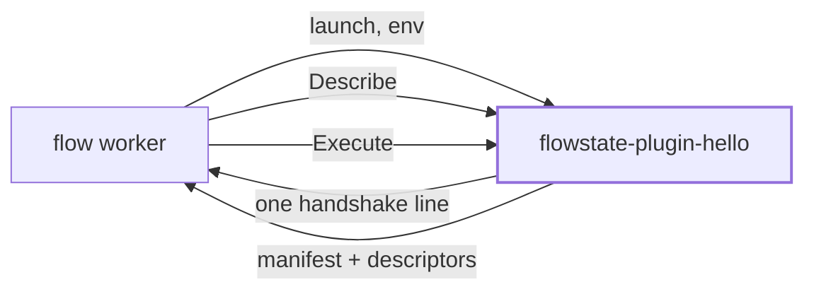

# Writing a plugin

For someone outside this repository. A plugin is a separate executable a
Flowstate worker launches; nothing about writing one requires a checkout, a
`replace` directive, or permission. This page is the path from an empty
directory to a task of your own showing up in `flow plugins`, and then the five
places where the contract between your binary and the engine is real but not
written down anywhere you would look.

If you only want to *use* a plugin somebody else wrote,
[examples/plugins/greet](../examples/plugins/greet) is that page. If you want the
protocol rather than the Go SDK, skip to
[Writing one in another language](#writing-one-in-another-language).

Every transcript below is what the command actually printed, run from a module
outside this repository against `c4ead7c`; the `file:line` references are against
`5ab0309`, which changes nothing on this path.

## Contents

- [The shape of the thing](#the-shape-of-the-thing)
- [Chapter one: a plugin that runs](#chapter-one-a-plugin-that-runs)
- [Chapter two: the schema is the contract](#chapter-two-the-schema-is-the-contract)
- [Five places the contract is implicit](#five-places-the-contract-is-implicit)
- [The rest of the manifest](#the-rest-of-the-manifest)
- [Reaching the network](#reaching-the-network)
- [Classifying failures](#classifying-failures)
- [Writing one in another language](#writing-one-in-another-language)
- [Known limitations](#known-limitations)

## The shape of the thing

A plugin is a process, not a library. A worker discovers an executable named
`flowstate-plugin-<name>` on a directory it was told to look in, launches it with
a magic cookie and a socket path in its environment, waits for one line on
stdout, and then talks Connect RPC to it over that socket for as long as the
worker lives.



The thick box is all you write. The handshake, the socket, the token check, the
signal handling and the shutdown are
[`pkg/flowstate/v1/plugin/sdk`](../pkg/flowstate/v1/plugin/sdk)'s, and the host
half is documented end to end in
[`pkg/flowstate/v1/plugin`'s package doc](../pkg/flowstate/v1/plugin/doc.go)
(`doc.go:70-98` is the handshake, field by field).

## Chapter one: a plugin that runs

Two files, one of which `go mod tidy` writes.

```console
$ mkdir flowstate-plugin-hello && cd flowstate-plugin-hello
$ go mod init example.com/flowstate-plugin-hello
```

`main.go`:

```go
package main

import (
	"context"
	"fmt"

	flowstatev1 "github.com/picatz/flowstate/pkg/flowstate/v1"
	"github.com/picatz/flowstate/pkg/flowstate/v1/plugin/sdk"
)

func main() {
	sdk.Main(sdk.Plugin{
		Name:        "hello",
		Version:     "0.1.0",
		Description: "Greets someone.",
		Tasks: []sdk.Task{{
			Name:    "greet",
			Summary: "Greet someone by name.",
			Fn:      greet,
		}},
	})
}

func greet(_ context.Context, inputs map[string]*flowstatev1.Value, _ *flowstatev1.Scope) (*flowstatev1.Node_Outputs, error) {
	name := inputs["name"].GetLiteral().GetStringValue()
	if name == "" {
		return nil, sdk.InvalidInput("name is required")
	}
	return &flowstatev1.Node_Outputs{NamedValues: flowstatev1.NewNamedValues(map[string]any{
		"message": fmt.Sprintf("Hello, %s!", name),
	})}, nil
}
```

`sdk.Main` is the whole of `func main` (`sdk/sdk.go:314-327`). The manifest the
engine sees is derived from that struct rather than written beside it, so a
plugin built this way cannot advertise a capability it did not implement:
`Secrets` being set
is what advertises secret resolution, and a non-empty `Tasks` is what advertises
tasks (`sdk/sdk.go:690-732`).

Resolve the dependency, build under the name discovery looks for, and ask what a
worker would find:

```console
$ go mod tidy
go: found github.com/picatz/flowstate/pkg/flowstate/v1/plugin/sdk in
    github.com/picatz/flowstate v0.0.0-20260821212057-c4ead7c54469
$ mkdir -p bin
$ go build -o bin/flowstate-plugin-hello .
$ flow plugins --plugin-dir ./bin
hello 0.1.0
  Greets someone.
  /.../bin/flowstate-plugin-hello

  hello.greet
    Greet someone by name.
    receives prior step outputs: no
  inputs  none
  outputs  none
```

The name is not a convention you may vary. Discovery reads the plugin's name off
the binary's suffix and ignores everything without the prefix
(`plugin/discover.go:19`, `:140-144`), so `bin/hello` is not a plugin and
`flow plugins` will tell you the directory is empty. The suffix is also the
qualifier a Flowfile writes — `hello.greet:` — and a plugin cannot choose or
forge it, which is why two plugins may each provide `post` without colliding
(`sdk/sdk.go:203-212`).

Run the binary from a shell and it explains itself rather than speaking a binary
protocol at your terminal (`sdk/sdk.go:335-369`):

```console
$ ./bin/flowstate-plugin-hello
hello is a Flowstate plugin, not a command.
...
To use it, put it in a directory on a worker's plugin search path — the file has
to be named flowstate-plugin-hello — and configure the worker to look there.
```

That is chapter one, and it took one file you wrote. It is also, as printed above, a task
that documents nothing and validates nothing. Chapter two is the part that
matters.

## Chapter two: the schema is the contract

`inputs none` in that listing does not mean "takes nothing". It means "declares
nothing", and the difference is everything the descriptor pipeline exists for. A
task's `Input` and `Output` are zero values of protobuf messages whose
descriptors travel to the engine in the manifest, which is what lets the engine
validate a workflow using your task, complete its fields in an editor, and
document it — without compiling a line of your code
(`sdk/sdk.go:218-226`, `plugin/descriptor.go:25-29`).

So: a schema of your own. Three files beside the `main.go` you already have.

`proto/hello/v1/hello.proto`:

```proto
syntax = "proto3";

package hello.v1;

option go_package = "example.com/flowstate-plugin-hello/gen/hello/v1;hellov1";

message GreetInputs {
  string name = 1;
  string greeting = 2;
}

message GreetOutputs {
  string message = 1;
}
```

The `go_package` matters: it is where the generated code lands and therefore what
`main.go` imports. Change the module path and this line changes with it.

`proto/buf.yaml`, which is what marks that directory as the module `buf` compiles:

```yaml
version: v1
```

`buf.gen.yaml`, at the module root beside `go.mod`:

```yaml
version: v1
plugins:
  - plugin: go
    out: ./gen
    opt:
      - paths=source_relative
```

Generated the way the in-tree example generates its own, with `protoc-gen-go`
built from the version your `go.mod` already pins rather than a remote plugin, so
regenerating needs no network beyond the module cache (see
[`examples/flowstate-plugin-example/buf.gen.yaml`](../pkg/flowstate/v1/plugin/examples/flowstate-plugin-example/buf.gen.yaml)):

```console
$ GOBIN=$PWD/tools go install google.golang.org/protobuf/cmd/protoc-gen-go
$ PATH=$PWD/tools:$PATH go run github.com/bufbuild/buf/cmd/buf@v1.72.0 generate proto
$ ls gen/hello/v1
hello.pb.go
```

Then name the messages on the task and decode through them. `main.go` gains one
import, `hellov1 "example.com/flowstate-plugin-hello/gen/hello/v1"`:

```go
Tasks: []sdk.Task{{
	Name:    "greet",
	Summary: "Greet someone by name.",
	Input:   &hellov1.GreetInputs{},
	Output:  &hellov1.GreetOutputs{},
	Fn:      greet,
}},
```

```go
func greet(_ context.Context, inputs map[string]*flowstatev1.Value, _ *flowstatev1.Scope) (*flowstatev1.Node_Outputs, error) {
	var in hellov1.GreetInputs
	if err := sdk.DecodeInputs(inputs, &in); err != nil {
		return nil, sdk.InvalidInput("%v", err)
	}
	if in.GetName() == "" {
		return nil, sdk.InvalidInput("name is required")
	}
	greeting := in.GetGreeting()
	if greeting == "" {
		greeting = "Hello"
	}
	outputs, err := sdk.EncodeOutputs(&hellov1.GreetOutputs{
		Message: fmt.Sprintf("%s, %s!", greeting, in.GetName()),
	})
	if err != nil {
		return nil, sdk.Failed("%v", err)
	}
	return outputs, nil
}
```

The same command now prints a task somebody could write a step against:

```console
$ flow plugins --plugin-dir ./bin
  hello.greet
    Greet someone by name.
    receives prior step outputs: no
  inputs   name      string
           greeting  string
  outputs  message   string
```

Output field names are the names a later step reads — a step with `id: hi` gives
a later step `${steps.hi.message}` — because `EncodeOutputs` turns one message
field into one named output (`sdk/values.go:269-298`). The `steps.` prefix is not
optional — a bare `${hi.message}` is refused, and the diagnostic says so:

```console
workflow.yaml:9:16: step "shout" input "message": `hi` is a step, and a step is
named `steps.hi` now; run `flow fix` to rewrite this file
```

That is the rooted-name rule the whole language follows, and it applies to a
plugin's outputs exactly as it does to a built-in's
([DSL.md](DSL.md#scope-and-the-id-namespace)).

An output field whose type is another message becomes a **map keyed by that
message's own field names**, and a `repeated` one becomes a list of those maps.
So a task declaring

```protobuf
message LogOutputs {
  repeated Commit commits = 1;
}

message Commit {
  string sha = 1;
  Signature author = 2;      // itself a message: another map
  repeated string parent_hashes = 3;
}
```

is read by a workflow as `${steps.log.commits[0].author.name}` and
`${steps.log.commits[0].parent_hashes}`. The keys are the descriptor's field
names — `parent_hashes`, not `parentHashes` — so the schema you wrote is the
shape the author sees, nested to any depth. Every field is present whether or
not the task set it, so reading one the task left empty gives that field's zero
value rather than failing with "no such key"; the exception is a singular
message, which is `null` when unset.

Two kinds are not converted. A well-known type — `google.protobuf.Timestamp`,
`Duration` and their siblings — is refused, because what one means on the
workflow side is a schema-wide question rather than this SDK's to answer
(picatz/flowstate#1436); a task that needs one today carries it as a string, the
way `Commit.author.when` above holds RFC 3339. And a task whose output shape is
not fixed at all declares the field as `google.api.expr.v1alpha1.Value` and
builds it with `sdk.Literal` (`sdk/values.go`), which stays the right choice for
genuinely dynamic data such as a parsed response body.

You can check a Flowfile against it without a worker, a server, or Temporal:

```console
$ flow validate --plugin-dir ./bin workflow.yaml
```

`flow validate --plugin-dir` launches the plugins on that path through the same
discovery and handshake a worker uses and checks the file against what they
provide (`cmd/flow/main.go:1531-1563`). Without `--plugin-dir` it reports the
task as one it has not been told about, which is correct rather than unhelpful:
whether a plugin is installed is a deployment's decision and not a property of
the file.

### Your field comments, in somebody else's editor

Everything above travels: names, types, required-ness, protovalidate bounds. The
sentences you wrote over each field in the `.proto` do not, unless you ask for
them — and the reason is protoc's rather than this SDK's. `protoc-gen-go` strips
`SourceCodeInfo` from what a `.pb.go` embeds, so the descriptor your plugin holds
at run time has the shape of your schema and none of its prose. There is nothing
for the SDK to forward.

`buf build` is the command that keeps the comments. Build a descriptor set beside
the generated code, from the same `.proto`, and hand it to the SDK:

```console
$ go run github.com/bufbuild/buf/cmd/buf@v1.72.0 build --exclude-imports -o schema.descriptorset.binpb proto
```

```go
//go:embed schema.descriptorset.binpb
var schemaProse []byte

func main() {
	sdk.Main(sdk.Plugin{
		Name:        "hello",
		Version:     "0.1.0",
		SchemaProse: schemaProse,
		Tasks:       []sdk.Task{{ /* ... */ }},
	})
}
```

`--exclude-imports` for the reason the engine's own artifact uses it: the
comments worth carrying are the ones you wrote, and carrying protobuf's and
protovalidate's as well would multiply the bytes to document files nobody asks
about.

Hovering `greeting:` in a Flowfile then shows what you wrote over that field,
the same way hovering a built-in task's input shows what the engine's schema
says about it. Nothing new crosses the boundary to make that work: the prose is
attached to the descriptors your manifest already shipped
(`pkg/flowstate/v1/messagedescriptor.go`), and the language server's existing
"prefer the descriptor's own source info" branch is what reads it.

Three properties worth knowing, all of them the fail-closed direction:

- **It is opt-in, and omitting it costs only the paragraph.** A plugin that sets
  no `SchemaProse` behaves exactly as every plugin did before the field existed.
  Hover renders one paragraph fewer; nothing errors.
- **A descriptor set built from a `.proto` that has since changed is ignored.**
  A comment's location addresses a declaration by index, so stale prose does not
  fail to apply — it applies to whichever field now sits at that index. The SDK
  compares the declarations it is describing against the ones this binary
  compiled in and drops the prose when they disagree, because a sentence attached
  to the wrong field is worse than no sentence. Rebuild the artifact whenever you
  regenerate, and pin it in CI the way this repository pins its own.
- **Bytes that are not a descriptor set fail at startup**, where you see them,
  rather than silently.

## Five places the contract is implicit

Everything above works. What follows is what an outside author learns by walking
that path and hitting the parts nothing says out loud — each of them invisible at
your build time and visible later, at a host, to somebody who cannot fix it.

### 1. Declaring no schema is a silent opt-out of the whole contract

`Task.Input` and `Task.Output` may be nil (`sdk/sdk.go:225-226`), the host
accepts a manifest that names no message for a side
(`plugin/descriptor.go:34-36`), and `flow plugins` renders it as `inputs none`
(`cmd/flow/tasks.go:592-596`, rendered from `cmd/flow/plugins.go:298-301`). Every
part of that is deliberate, and the sum of it is a task with no contract at all,
described in the same word a task with genuinely no inputs uses.

Nothing checks the inputs going in: the host has no descriptor to check against,
and inside the plugin `DecodeInputs` ignores an input the message has no field
for, on purpose, so a workflow written against a newer version of a task does not
fail against an older plugin (`sdk/values.go:42-46`). The two are individually
right and jointly silent.

Measured on the two plugins this page builds — chapter one's kept aside as
`./bin-nodesc`, chapter two's in `./bin` — against the same Flowfile with `name`
misspelled as `nmae`:

```console
$ flow validate --plugin-dir ./bin-nodesc workflow.yaml
workflow.yaml: ok

$ flow validate --plugin-dir ./bin workflow.yaml
workflow.yaml:6:13: step "hi" input "nmae": task "hello.greet" has no such
input; did you mean "name"?
```

Same engine, same command, same file. The difference is entirely whether your
task shipped a schema.

> [!IMPORTANT]
> Chapter one is a way to see a plugin run, not a way to ship one. A task
> without descriptors cannot be validated, completed, or documented by anything,
> and neither its author nor the operator installing it is told so.

Nothing today reports a descriptor-less task as a finding; see
[known limitations](#known-limitations).

### 2. What you are depending on is not versioned yet

There are no tags on this repository, so both `go mod tidy` and an explicit
`go get github.com/picatz/flowstate@latest` resolve to a pseudo-version of
whatever the default branch was at that moment
(`v0.0.0-20260821212057-c4ead7c54469`, above). It works — you do not need a
`replace`, and the walkthrough on this page was built without one — but what you
get is a moving target with nothing said about what within it is stable.

Two things follow that are worth knowing before you build on it:

- **The SDK is not separable from the engine.** Depending on
  `pkg/flowstate/v1/plugin/sdk` pulls the module: 368 packages across 126 modules
  in the graph for the chapter-one plugin, and a 24 MB binary. That is a
  consequence of `TaskFunc` speaking in `flowstatev1.Value` and
  `flowstatev1.Scope` (`sdk/sdk.go:303`), which is also what makes a plugin task
  identical in shape to a built-in one.
- **The wire protocol is versioned; the Go API is not.** The protocol is
  negotiated at launch and a mismatch is refused at startup with a message saying
  which side to upgrade (`sdk/sdk.go:649-667`, `protocol.go:361` for the current
  version, 5, which the egress grant moved it to). Nothing equivalent covers the Go types you compile against.

The in-tree plugin modules are not the counter-example they look like. Each
pins `github.com/picatz/flowstate v0.0.0-00010101000000-000000000000` behind a
`replace => ../..` that its own `go.mod` calls a local-development convenience
(`plugins/git/go.mod:66-69`) — correct for a module inside this repository, and
not a line to copy.

### 3. The manifest's string lists are claims nothing cross-checks

`DeferredInputs`, `ExpressionInputs`, `SecretInputs` and
`RequiredSecretInputs` name inputs by string.
The SDK copies them into the manifest as given (`sdk/sdk.go:736-764`), and the
host's `checkManifest` validates the manifest's shape, its capabilities, its
schemes and its task-name uniqueness — and never intersects those four lists
with the descriptors sitting beside them in the same message
(`plugin/plugin.go:504-594`). A typo in one is therefore accepted at launch and
discovered at execution.

The full path, measured, on a build of the plugin above with
`SecretInputs: []string{"tokn"}` added, against a Flowfile writing
`token: ${secret('env:GREET_TOKEN')}`:

```console
$ flow validate --plugin-dir ./bin-typo workflow.yaml
workflow.yaml: ok

$ flow run local workflow.yaml --plugin-dir ./bin-typo --secret-env GREET_TOKEN \
    --auth-policy auth.yaml
ERROR
error running workflow locally: step "hi": task "hello.greet": input "token" is
a secret reference, which this task did not declare as accepting one; this task
accepts one in tokn
```

The refusal is a good one — it is deny-by-default and it names what the task
*does* accept (`plugin/task.go:392-395`, `:410-418`) — and it arrives at
execution, to whoever is running the workflow rather than to whoever wrote the
plugin. `flow validate` does not catch it, even told about the plugin: the
manifest's `secret_inputs` reaches
the registry as `TaskDef.SecretInputs` (`registry.go:155-172`), but the
validator's secret checking consults only `NestedSecretInputs`, for structures
that hold a reference inside them (`flowfile/secret.go:259-262`, `registry.go:378`).

(`--secret-env` is what makes `env:GREET_TOKEN` resolvable, and `--auth-policy`
is what authorizes reading it: a process holding a secret provider with no access
policy is refused. [examples/plugins/greet](../examples/plugins/greet) has a
policy file for exactly this and explains why it looks the way it does.)

`RequiredSecretInputs` is the security-specific exception: every name must also
be in `SecretInputs`, or the host refuses the manifest. For a coherent declaration,
`flow validate` requires the named input to be a whole secret reference and the
runtime repeats the check before resolution and dispatch, so a literal cannot
enter durable history or reach the plugin. The broader descriptor-name typo gap
for all four lists remains.

All four lists are checkable against the descriptors at `sdk.Run` time, which is
earlier than both and reaches the person who can fix it. No full check does so today;
see [known limitations](#known-limitations).

### 4. Three traps the code knows about and no authoring surface teaches

**A stray write to stdout before serving corrupts the handshake.** The SDK
points `os.Stdout` at stderr, but only *after* announcing, because the
announcement is the one thing stdout is for (`sdk/sdk.go:488-499`). Anything
printed before that — a debug line, a dependency's `init`, a library's banner —
lands where the host is reading a protocol:

```console
$ flow plugins --plugin-dir ./bin
ERROR
plugin "hello" (/.../flowstate-plugin-hello): plugin: handshake failed:
handshake line starts with "debug: starting", want "FLOWSTATE-PLUGIN" — is this
a Flowstate plugin?
```

That message is as good as it can be (`internal/protocol/protocol.go:522`), and
it still names your first debug line as a protocol failure. Log through
`sdk.WithLogger` or to stderr; after `sdk.Main` is serving, `fmt.Println` is
harmless, since stdout has been redirected — but Go code writing to file
descriptor 1 directly, such as linked C, gets through regardless
(`sdk/sdk.go:496-499`).

**`ShapesOutputs` is a claim about your executor, and three host surfaces believe
it.** Setting it says this task reads an input named `outputs` as a mapping of
name to expression and returns *those* names instead of its declared ones. The
compiler, the validator and the language server all describe the step in those
terms, so a task that sets it and returns its declared outputs anyway gets all
three describing a step that produces something else (`sdk/sdk.go:275-294`).
False is the right answer for every ordinary task, including one that happens to
have an input called `outputs`.

**A relaunched plugin must describe itself the same way.** The host restarts a
plugin that exits, with backoff, and refuses one that comes back claiming
different schemes or different tasks, because adapters already handed to the
engine are bound to the first answer (`plugin/doc.go:117-123`). A manifest built
from anything that varies per launch — an environment lookup, a feature flag, a
directory listing — is a plugin that works until it restarts.

### 5. There was no walkthrough

This page is that gap closed. The route an outside author previously had was to
find `pkg/flowstate/v1/plugin/examples/flowstate-plugin-example` by reading the
SDK's source. That example is still the best worked one in the tree — it
advertises both capabilities from one process, resolves secrets scoped by
namespace, and takes a host-managed secret in a task input — and finding it no
longer requires reading a doc comment to know it exists.

## The rest of the manifest

The fields not covered above, each a claim the engine acts on:

| Field | What it says | Reference |
| --- | --- | --- |
| `NeedsScope` | This task receives prior step outputs and enclosing loop variables. Most tasks do not, and asking for it puts data on the wire for nothing. | `sdk/sdk.go:257-261` |
| `DeferredInputs` | This task evaluates these inputs' expressions itself, in a scope the workflow does not have. The engine passes them through untouched. | `sdk/sdk.go:228-236` |
| `ExpressionInputs` | These inputs must be *written* as `${...}` rather than as a literal — a different question from who evaluates them. | `sdk/sdk.go:238-255` |
| `SecretInputs` | A Flowfile may write `${secret(...)}` into these inputs. The host resolves the reference before your process sees the request, so `Fn` always receives a value and never a reference. | `sdk/sdk.go:263-273` |
| `ShapesOutputs` | This task returns the output names its `outputs` input maps, in place of its declared ones. | `sdk/sdk.go:275-294` |
| `Health` | Whether the plugin can serve. Leave it nil unless you depend on something; report not-serving when that dependency is unreachable rather than failing every request. | `sdk/sdk.go:138-148` |

`ExpressionInputs` is enforced by `flow validate` when the validator has been
told about your plugin. Against the chapter-two plugin declaring `greeting` as
one, a literal is refused at the author's terminal:

```console
$ flow validate --plugin-dir ./bin workflow.yaml
workflow.yaml:7:17: step "hi" input "greeting": task "hello.greet" evaluates
input "greeting" as an expression, so it has to be written as one: wrap the
value in ${...}
```

The mechanism is `MustBeExpression` over the registry
(`registry.go:426-428`, read at `flowfile/schema.go:128`), and what makes it
reach a plugin's task is `--plugin-dir` registering the host into that registry
(`cmd/flow/plugins.go:383`). Without `--plugin-dir` the validator has not been
told the task exists, so the declaration is inert — not because it is
unimplemented, but because nothing asked.

## Distinguishing a rehearsal from production

Every task request carries `flowstate.v1.WorkloadIdentity.mode`, an operational
fact set by the host that launched the plugin. In Go, read its normalized value
through `sdk.Caller.Mode()`; in another language, read the same enum directly
from `ExecuteRequest.identity.mode`. This exposes a fact to the plugin. It does
not grant authority, change host policy, or make the identity a credential.

The safe test is a positive one:

```go
caller, ok := sdk.CallerFromContext(ctx)
if !ok || caller.Mode() != flowstatev1.WorkloadIdentityMode_WORKLOAD_IDENTITY_MODE_PRODUCTION {
	return nil, sdk.PermissionDenied("this operation requires an established production caller mode")
}
```

Do not write `mode != REHEARSAL`. `UNSPECIFIED` is the zero value on purpose and
means unknown: a new plugin receives it from an older host that never sent the
field, from a request that omitted identity entirely, and from an enum value the
SDK does not understand. All of those must remain non-production. A current host
still sends an explicit empty identity with the host-established mode when no
caller authenticated. A new host's additive field is ignored by an old plugin,
so old-host/new-plugin and new-host/old-plugin pairings both remain wire
compatible without making absence mean production.

The value is authoritative only on today's directly launched, private Unix
socket transport. It is set from the local host's unforgeable in-process
rehearsal marker or from the durable driver itself, never from claims or task
input. A future remote-plugin transport must authenticate the host and preserve
that property; otherwise it must deliver `UNSPECIFIED`, not forward a mode
supplied by a workflow or remote caller.

## Reaching the network

Your plugin process starts with an environment built from nothing — not a copy of
the worker's, which is where the worker's own credentials live. One thing is in
it that you did not ask for: the deployment's egress policy, the same bytes the
operator wrote in `--egress-policy` and the same ones governing the built-in
`http` task, base64-encoded under `FLOWSTATE_EGRESS_POLICY_B64`.

It is a snapshot taken at your launch, not a subscription. You hold the bytes
your own launch carried, so an operator who edits the policy file afterwards
governs the plugins the worker starts next — the running ones keep what they were
given until the worker relaunches them. The SDK captures it once, while `sdk.Run`
is reading the launch environment and before any of your task code has run, and
answers from that capture forever after; a plugin that serves by hand without
`Run` captures at its first `EgressPolicy` or `HTTPClient` call instead. A grant a
process could re-read is a grant that process can rewrite, and self-granting must
not be one line of a plugin's own code. What stays outside that line is code that
runs before `Run` — package initialization, or a `main` that does work first —
which is your own program deciding what its process starts with, and no more than
opening a raw socket already gives it.

Ask the SDK for a client rather than building one:

```go
client, err := sdk.HTTPClient()
if err != nil {
	return nil, sdk.Failed("egress: %v", err)
}

response, err := client.Do(request)
```

**Credentials.** An operator's rule may name `credentials` — as in
`deny: ['credentials && !(host in ["partner.example"])']`, which says a secret
leaves only towards one place. The client marks a request automatically when it
carries an `Authorization`, `Proxy-Authorization` or `Cookie` header, and the
mark then covers the whole redirect chain rather than the one hop that showed it,
so a credentialed exchange bounced to another host is refused there too.

That header set is the header-visible half of what the built-in `http` task
counts. The task decides from its own inputs, and two of those have no header
form the SDK could see — `credential:`, and a secret reference nested in a JSON
or form body — so a plugin carrying the equivalent has to say so itself. That is
what `sdk.WithCredentials` is for: when your credential is somewhere the SDK
cannot see — a token in a query string, a signature in a custom header, a
credential in the body — say so:

```go
response, err := client.Do(request.WithContext(sdk.WithCredentials(ctx)))
```

Call it whenever the request carries a secret the header set above would miss; a
rule written to keep credentials off an unapproved host is silently weaker for
every request that does not. It only ever marks — there is no way to tell the
policy a request is *not* credentialed.

That client checks the destination before the request goes out, again in the
dialer for every address it actually connects to, and again on every redirect
hop — so a hostname that resolves to something the policy denies is refused where
the connection is made, not only where the URL was read. Bodies are capped and
the request is bounded, per the operator's policy. `sdk.EgressPolicy()` returns
the `*netpolicy.Policy` itself, for a plugin speaking something other than HTTP
that has to apply it on its own dial path (`plugins/sql` does this for
PostgreSQL).

**When the grant is absent, both refuse.** No policy is an error naming
`FLOWSTATE_EGRESS_POLICY_B64`, never an empty policy that permits everything:
having been told nothing about what you may reach is not permission to reach
anything, and a plugin cannot tell "the operator allowed it all" from "nobody
told me". A plugin run outside a worker — directly, from a shell — sees the same
refusal, which is the correct answer rather than a bug.

**A worker with no `--egress-policy` still grants a policy.** It grants the one
its own built-in `http` task runs under: internal ranges denied, loopback denied
unless the worker opted in, public HTTP and HTTPS permitted. The document says so
about itself (`deployment_default: true`), and `sdk.EgressPolicyIsDeploymentDefault()`
reports it, so absent now means only that no worker launched this process.

That marker is part of protocol version 6, and it needed a version of its own
rather than arriving quietly: `netpolicy.ParseConfig` is strict, so a plugin
built against version 5 refuses the whole document over the unknown key. A host
and its plugins are refused at the handshake when they disagree about this,
which is the failure to prefer over a plugin reporting an operator's policy as
malformed.

Which posture to take toward the default is yours, and both are defensible. A
plugin whose work is an ordinary request to a public host accepts it — `git`,
`vcs`, `github` and `slack` do, so a worker nobody configured reaches public hosts
uniformly, and installing a plugin does not require writing a policy file to get
back what the worker already does. A plugin whose authority is of another class
refuses it: `sql` will not open a database connection under a policy no operator
wrote, and says `--egress-policy` in the refusal so the remedy is in the message.
What is never right is treating the default as no grant at all.

```go
isDefault, err := sdk.EgressPolicyIsDeploymentDefault()
if err != nil {
	return nil, sdk.Failed("egress: %v", err)
}
if isDefault {
	return nil, sdk.PermissionDenied(
		"this task requires an operator egress policy passed with --egress-policy")
}
```

**A protocol that is not an HTTP fetch may state its own bounds.**
`sdk.HTTPClientWithBounds(maxResponseBytes, timeout)` is `sdk.HTTPClient()` for a
transport whose responses are not the shape an operator sizes
`max_response_bytes` for — a git packfile, a paginated API listing — and
`sdk.EgressPolicyWithBounds` returns the same policy for a plugin that needs the
policy itself. Both change what is *bounded* and never what may be *reached*:
schemes, address categories, networks, ports, rules, redirects and the TLS floor
come from the grant untouched, and the client marks credentials exactly as
`sdk.HTTPClient()` does. Prefer the client: composing your own out of the policy
loses the marking, and an operator's `deny: ['credentials && ...']` evaluating
false for a clone that sends a token is a rule that did not fire rather than one
that allowed. The consequence worth knowing: an operator's `max_response_bytes`
governs built-in HTTP and every plugin using `sdk.HTTPClient()`, not a bound a
plugin states for its own transport.

**Absent means the variable is not set, not that it is empty.** An operator whose
`--egress-policy` names an empty document has configured a policy — the one an
empty document builds, which is exactly what the built-in `http` task then runs
under — so the host sets the grant to the empty string and `sdk.EgressPolicy()`
parses it. A plugin reading presence with `os.Getenv` instead of `os.LookupEnv`
collapses the two and denies where the same deployment's built-in task allows.

**A proxy policy brings its proxy with it.** When the deployment's policy sets
`proxy_from_environment: true`, your launch environment also carries the worker's
own `HTTP_PROXY`, `HTTPS_PROXY` and `NO_PROXY` (and their lowercase spellings),
copied verbatim — so `sdk.HTTPClient()` routes exactly where the built-in `http`
task does. They are granted, not inherited: nothing else from the worker's
environment crosses, and when the policy does not proxy, none of them do either.
Without that grant a plugin's `http.ProxyFromEnvironment` would find nothing and
dial straight out, which on a deployment whose egress is only permitted through
a proxy is the plugin going around the control rather than taking a different
route. An operator who wants a plugin to use a different proxy names it in the
host's `Env`, and that entry wins over the worker's.

The policy is at most **64 KiB** before encoding (`plugin.MaxEgressPolicyBytes`).
It travels as one environment string through `exec`, which Linux bounds at 128
KiB, and a policy over the limit is refused by `flow` when it reads the file and
by the plugin host when it accepts a `Config` — in both cases naming the bound,
rather than failing every plugin launch on the worker with an `exec` errno that
names nothing.

Nothing here confines you. A separate process can open whatever socket the
operating system will give it, and a plugin that builds its own
`http.Client` is not stopped by this SDK or by the worker; it has simply left the
path the deployment governs, which is a thing a deployment is entitled to notice
and a reviewer of a first-party plugin is entitled to reject. Real confinement of
a plugin that wants out is the deployment's job — a container, a network
namespace, a firewall — and [THREAT_MODEL.md](../THREAT_MODEL.md) says where that
line is.

**Which first-party plugins enforce the grant.** The host grants it to every
plugin it launches, and that is all a host can do; enforcement is each plugin's
own code. The five first-party destination clients read it and apply it on their
real connection paths: `slack` and `github` through the governed HTTP client,
`git` and `vcs` on go-git's transport, `sql` on every resolved PostgreSQL socket
target. A deny rule an operator writes therefore reaches a `git.*`, `github.*`,
`slack.*`, `sql.*` or `vcs.*` task. The first-party Codex plugin is different: it
launches an operator-selected subprocess and does not pass the grant to it. The
Codex CLI's own control-plane traffic therefore always bypasses the grant; its
separate sandbox policy governs network access only for commands the agent
starts. It needs deployment-level confinement, just like a third-party plugin
that declines to ask.

## Classifying failures

Whether a step is retried is decided by the error your task returns, and only
your plugin knows whether its backend's failure was transient. Return through the
constructors rather than as a bare error (`sdk/errors.go:22-30`):

| Constructor | Meaning | Retried |
| --- | --- | --- |
| `NotFound` | The secret or resource does not exist | no |
| `PermissionDenied` | The backend refused | no |
| `InvalidInput` | The inputs or the reference are wrong | no |
| `Conflict` | A compare-and-swap lost to a concurrent writer | no |
| `Failed` | It failed, and another attempt will not fix it | no |
| `OutcomeUnknown` | It may or may not have taken effect | no |
| `Unavailable` | The backend could not be reached, or timed out | **yes** |

`UnavailableAfter` is `Unavailable` carrying a delay a backend named — a 429 or a
503 with `Retry-After` — which the host maps onto the step's retry hint
(`sdk/errors.go:121-136`).

> [!WARNING]
> An error from a plugin is surfaced to users and written to workflow history,
> which is durable and broadly readable. Never interpolate a secret, a token, or
> a credential-bearing backend message into one. The same applies to stderr and
> what a `Health` check returns, which the engine logs (`sdk/sdk.go:979-989`). As
> accidental containment, the host scrubs known resolved values and their common
> encodings from plugin stderr, reserved post-handshake stdout, health text, and
> manifest text. It retains at most 256 delivered values per plugin process while
> their calls are in flight and for five minutes after return, and marks a changed
> log record with `scrubbed=true`. While any values are retained, the host
> suppresses the content of a truncated stderr line because a captured prefix
> cannot be matched safely against a secret crossing the line bound. If all 256 slots hold
> in-flight values, or the 8 MiB raw-value budget cannot admit another, it
> suppresses plugin-controlled log text for the rest of that process rather than
> forget a value that can still leak. Multiline secret retention suppresses
> framed stderr content, and a health message at the SDK's size boundary is
> suppressed while values are retained because either may contain only a secret
> fragment. Do not rely on this against deliberate transformation or disclosure.

## Writing one in another language

Nothing about the protocol requires Go. The services are
[`proto/flowstate/plugin/v1/plugin.proto`](../proto/flowstate/plugin/v1/plugin.proto),
spoken over Connect on a Unix socket, and the launch contract — the environment
variables, the handshake line's fields, the per-request token header, the
inherited descriptor carrying the per-launch token, the inherited pipe that tells
you the host died — is documented end to end in
[`pkg/flowstate/v1/plugin/doc.go`](../pkg/flowstate/v1/plugin/doc.go) under
"The handshake, end to end".

Two things to know before you start. The Go constants naming those environment
variables and that header live in
`pkg/flowstate/v1/plugin/internal/protocol/protocol.go`, an internal package: you
can read it in the repository, but it is not importable and it does not appear in
published documentation, so the prose in `doc.go` is the specification you are
working from. And there is no conformance harness to run your implementation
against — see [known limitations](#known-limitations).

## Known limitations

Gaps rather than design, listed here so that nothing above reads as an
endorsement of the workaround. Each is tracked on
[#713](https://github.com/picatz/flowstate/issues/713).

1. **A descriptor-less task is reported as `none`, not as unspecified.** There is
   no signal — to the author at `sdk.Run`, or to the operator running
   `flow plugins` — distinguishing "declares no inputs" from "takes anything and
   validates nothing". A `flow plugin lint`, or a strict option on `sdk.Run`,
   would make it a finding rather than a silence.
2. **No tag, and no compatibility statement.** An external author writes
   `go get ...@latest` and gets an untagged branch tip. What in `sdk` and in the
   `flowstatev1` types it forces on `TaskFunc` is covenant, and when the first
   tag happens, are open questions. A `plugins/TEMPLATE` module with no
   `replace`, built in CI, would keep the answer honest, since CI would then
   build it the way an outside author does.
3. **The manifest's `DeferredInputs`, `ExpressionInputs` and `SecretInputs` are
   not cross-checked against the descriptors** — not at `sdk.Run`, where the
   message would reach the author, and not at bind time in `checkManifest`, where
   it would reach the operator. Today a typo is a runtime refusal.
4. **There is no conformance harness for a non-Go implementation.** The material
   exists — the handshake and task-conformance tests in
   `pkg/flowstate/v1/plugin` — but only as tests of this repository's own code. A
   `flow plugin conform <binary>` would turn a prose contract into a checkable
   one.

## See also

Every Flowfile under `examples/plugins/` is validated in CI against a complete
catalog built from the first-party plugin binaries. The portable descriptors and
security claims from that build must match the reviewed
`examples/plugins/plugins.lock.json` artifact. A new plugin example that cannot
be checked by `make plugin-examples` is not evidence that the plugin is
reachable; update the artifact with `make plugin-example-catalog-update` and
review the task descriptor and security-claim changes it records. Native
executable digests vary by platform, so the gate retains them in its temporary
validation catalog but does not put them in the portable reviewed artifact.

- [`examples/plugins/greet`](../examples/plugins/greet) — running a plugin task,
  from the workflow author's side, with the commands for a local rehearsal and a
  durable run.
- [`pkg/flowstate/v1/plugin/examples/flowstate-plugin-example`](../pkg/flowstate/v1/plugin/examples/flowstate-plugin-example)
  — the worked in-tree plugin: both capabilities, namespace-scoped secret
  resolution, and a task consuming a host secret.
- [ARCHITECTURE.md](ARCHITECTURE.md#plugins) — why plugins are processes, what a
  plugin cannot do, and where the trust boundary is.
- [EMBEDDING.md](EMBEDDING.md) — the other way to add a task: in your own Go
  program, in process, with no plugin at all.
- [DEPLOYMENT.md](DEPLOYMENT.md) — installing a plugin on a worker, and the
  directory permissions discovery insists on.
