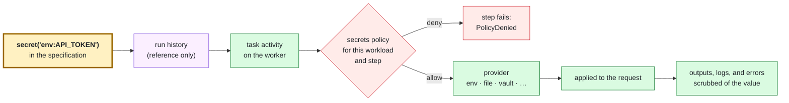

# Secrets and credentials

A Flowfile never contains a secret. It contains a *reference*, such as
`${secret('env:API_TOKEN')}`, and that reference is what gets compiled, stored,
and carried through the run's history. The value is looked up on the worker,
inside the task that needs it, after the worker has checked that this workload
and this step may read it. It is applied to the request and discarded; it is not
a step output, a log line, or part of an error.

This page covers writing references in a workflow, configuring the worker (or a
local run) that resolves them, minting short-lived credentials instead of storing
long-lived ones, and exactly what the design does and does not protect.

## In a workflow

```yaml
steps:
  - id: health
    http:
      bearer: ${secret('env:API_TOKEN')}
      url: https://api.example.com/status
  - id: with_header
    http:
      headers:
        Accept: application/json
        X-Api-Key: ${secret('env:API_TOKEN')}
      url: https://api.example.com/status
```

A reference is `scheme:name`. The scheme selects a provider (`env`, `file`,
`vault`, and others below); the name means whatever that provider says it means,
such as `vault:apps/api#token`. The argument must be written out as one string:
a computed reference is refused, because it could not be checked when the file
compiles.

A reference has to be the whole value of an input that accepts one:

| Accepts a reference | Refuses one |
| --- | --- |
| `http`'s `bearer:`, and one entry of its `headers:`, `form:`, or `json:` | `http`'s `query:` (query strings end up in logs), and text mixed with a reference (`Bearer ${secret(...)}`) |
| A plugin task input its manifest declares as a secret input | `vars:`, whether workflow or step |
| A webhook trigger's `verify:` keys | Anything the workflow evaluates itself: `if:`, `value:`, `items:`, wait expressions, `outputs:` |
| | `call:` arguments, loop `init:`/`update:`, `concurrency.key` |

Each refusal explains why and where the reference can go instead. One gap to know
about: a reference in a plain string input, such as a `log:` message or an
`http` `body:`, passes `flow validate` and is refused only when the step runs.

`http`'s `bearer:` and `credential:` are mutually exclusive, and a credential is
never sent over plain `http://` except to loopback.

### `sensitive:` is not a secret

An input or output declared `sensitive: true` is still an ordinary value,
stored in the run's history like any other: in the clear, unless the deployment
encrypts history with a payload keyring ([Payload encryption](ENCRYPTION.md)),
and then sealed along with everything else. The flag controls display: the CLI,
test output, and the MCP server show `[redacted: <name>]` unless the reader
passes `--reveal-sensitive`, and `flow server` withholds the values from its
`Get` and `GetTimeline` answers unless the caller asks and holds the
`workload.reveal_sensitive` action, listed explicitly in their trust policy
entry. A server running without authentication has no caller to grant it to,
so it never reveals them; `flow server dev` grants it to its developer
identity. An agent reaching Flowstate through `flow mcp` cannot ask for them
unless the operator started it with `--reveal-sensitive`. Against a server
older than this decision, the CLI and `flow mcp` withhold declared outputs, the
step transcript and carried state as before, and show failure text and wait
prompts as the server sent them, since that server returns them to any caller
allowed to read the run; upgrade the server to withhold those too. Use a secret
reference for anything that must stay out of history.

## How a reference is resolved



1. The compiler turns the reference into a `SecretRef` in the specification.
   Workflow-side code refuses to read one.
2. When the task runs, the worker evaluates its secrets policy against the
   run's authenticated identity, the workflow, and the step.
3. Only on an allow does it ask the provider for the value.
4. The task applies the value, and the worker registers it with a scrubber that
   removes it from anything leaving the activity.

Every decision, allow or deny, is written to the audit trail.

## Configuring a worker

A worker resolves secrets only when it has both a **provider** for the scheme and
a **policy** that allows the read. Either missing means every reference is
refused.

```sh
export FLOWSTATE_SECRET_API_TOKEN=...
flow worker \
  --temporal-deployment-name flowstate --build-id "$(git rev-parse --short HEAD)" \
  --secret-env API_TOKEN \
  --auth-policy /etc/flowstate/auth.yaml
```

`flow run local`, `flow server dev`, `flow mcp`, and `flow task run` take the same
flags with the same meaning, so a rehearsal runs under the rules production
applies:

```console
$ flow run local examples/http-secret/workflow.yaml \
    --secret-env API_TOKEN \
    --auth-policy examples/http-secret/auth-policy.yaml
```

### Providers

| Scheme | Enable with | Reads |
| --- | --- | --- |
| `env:` | `--secret-env NAME,…` | The environment variable `FLOWSTATE_SECRET_<NAME>`, for listed names only. The prefix keeps a workflow from reading the worker's own environment. |
| `file:` | `--secret-dir DIR` | A file under `DIR`, with traversal and symlink escapes refused. One trailing newline is trimmed. |
| `vault:` | `--secret-vault-addr`, plus one of `--secret-vault-token-file`, `--secret-vault-kubernetes-role`, or `FLOWSTATE_SECRET_VAULT_TOKEN` | A HashiCorp Vault or OpenBao KV v2 path, `vault:path#field`. See [examples/vault-secret](../examples/vault-secret/README.md). |
| `keychain:` | `--secret-keychain` | The macOS keychain. Refused on other platforms. |
| `op:` | `--secret-op` | A 1Password vault, through the `op` CLI. |
| `command:` | `--secret-command argv…` | The output of a command you configure, with `{{name}}` substituted and no shell. The escape hatch for `sops`, `age`, cloud KMS CLIs, and the like. |
| Plugin schemes | A plugin that provides a secrets backend | Whatever the plugin implements. The `oidc` plugin mints an OAuth access token per call. |

There is no built-in provider for a cloud secrets manager; use `command:` or a
plugin.

### The access policy

Reads are authorized by the `secrets:` section of the trust policy file given to
`--auth-policy`. Rules are CEL, compiled when the file loads:

```yaml
issuers:
  - name: ci
    actions: [workload.run, workload.read]
    issuer: https://token.actions.githubusercontent.com
    audiences: [https://flowstate.example.com/rpc]
    require:
      - claim: repository
        any_of: [example/deploys]

secrets:
  allow:
    - 'secret.scheme == "env" && secret.name == "API_TOKEN"'
    - 'secret.scheme == "vault" && workload.namespace == "payments" && secret.name.startsWith("payments/")'
  deny:
    - 'workload.step == "debug_dump"'
```

- No `secrets:` section, or no `allow` rule, means nothing may be read. A `deny`
  that matches wins, and a rule that errors denies.
- A rule sees `secret.scheme` and `secret.name`; the authenticated caller as
  `identity.subject`, `identity.issuer`, `identity.namespace`, and
  `identity.claims`; and the workload as `workload.namespace`,
  `workload.workflow`, `workload.run`, `workload.step`, and related fields.
  Reading a claim that is not present is an error, which denies; guard it with
  `"team" in identity.claims`.
- The file must also contain at least one valid `issuers:` entry, even on a
  worker, which does not authenticate callers itself. A server and its workers
  normally share one reviewed file.

### Several tenants on one worker

A worker serving several tenants can keep their secrets apart:

- `--secret-env-namespace team-a=TEAM_A_SECRET_` reads tenant `team-a`'s
  `env:` references from variables with that prefix instead. Prefixes must not
  overlap.
- `--secret-dir-namespaced` reads each tenant's `file:` references from
  `DIR/<tenant>/`. Vault paths are always namespaced by tenant.
- `--secret-require-namespace` refuses every read by a run with no tenant.

Policy rules on `workload.namespace` add a second, reviewable boundary. Keeping
tenants' secrets out of one another's *process* needs a worker per tenant; see
[the isolation tiers](DEPLOYMENT.md#the-four-tier-isolation-model).

### Secrets on the server

`flow server` resolves secrets for one purpose: the `verify:` keys of webhook
triggers, read at startup. It takes the same `--secret-*` provider flags for
that. Nothing else on the server resolves a secret.

## Short-lived credentials instead of stored ones

When the system a step calls accepts OAuth token exchange, client credentials,
or cloud workload identity, a workflow can use a credential minted for that one
request instead of a stored secret. The step names a **target** the deployment
configured:

```yaml
- id: health
  http:
    credential: partner-api
    url: https://api.partner.example.com/orders
```

Inside the activity, the worker checks the assumption policy, signs a
short-lived assertion stating which tenant, workflow, run, and step is asking,
exchanges it at the target's token endpoint, and applies the resulting token to
the request. Neither the assertion nor the token is ever a step output.

The deployment configures targets in the trust policy's `federation:` section,
and gives processes a signing key:

```yaml
federation:
  issuer: https://flowstate.example.com
  allow:
    - 'target == "partner-api" && workload.step == "health"'
  targets:
    - name: partner-api
      token_exchange:
        token_url: https://identity.partner.example.com/oauth2/token
        audience: https://identity.partner.example.com
        target_audience: https://api.example.com
```

> [!NOTE]
> Like `secrets:`, `federation:` fails closed: with no `allow` rule, no workload
> may assume any target, and `deny` rules alone permit nothing. Write an `allow`
> rule for every target.

A target is one of `token_exchange`, `client_credentials`, `gcp`, `aws`, or
`assertion` (present the signed assertion itself to a relying party that
verifies OIDC). The generic `http` task does not apply AWS session credentials,
which require SigV4 signing. [examples/http-federated](../examples/http-federated/)
and [examples/federation-flow-to-flow](../examples/federation-flow-to-flow/) are
worked examples.

### Signing keys

```sh
flow keys generate --out /etc/flowstate/keys/2026-09.pem
```

`--identity-key` names the key. The worker signs assertions; the server
publishes the public keys at `/.well-known/jwks.json`, beside
`/.well-known/openid-configuration`, so relying parties can verify them. Give
both processes the same ordered list of keys. Configuring `federation:` without
a key, or a key without `federation:`, refuses to start.

`--identity-key` repeats, and order matters: the first key signs, and every
later one is published for verification only. To rotate:

1. Generate a new key.
2. Restart the server and every worker with the new key first and the old key
   second. New assertions use the new key, and ones already issued still verify.
3. After `federation.key_retention` (default 24h), restart them all with the new
   key alone, and delete the old one.

[Workload identity federation](WORKLOAD_IDENTITY_FEDERATION.md) describes the
metadata documents a relying party reads and what each cloud requires of them.

## Secrets and plugins

A plugin can provide a scheme of its own. A worker launches it and registers the
schemes it advertises; `--plugin-scheme` restricts which schemes a plugin may
claim.

A plugin *task* that needs a secret declares which of its inputs are secret. The
worker resolves a reference in one of those inputs, under the same policy,
before calling the plugin, so the plugin receives the value and never a
reference or access to a provider. A reference in any other input is refused.
Values delivered to a plugin are scrubbed from its outputs, errors, and logs.
[Writing a plugin](PLUGINS.md) covers the manifest fields.

## In tests

`flow test` resolves no real secrets. A case binds each reference it needs:

```yaml
tests:
  - name: the bearer comes from the test, not a real vault
    workflow: ./workflow.yaml
    secrets:
      vault:apps/api#token: test-token
```

A reference the case does not bind is refused. See
[Testing](TESTING.md#secrets-in-a-test-file).

## What is guaranteed

- **A value is never persisted by Flowstate.** Specifications, run history,
  step outputs, logs, and error messages carry the reference, not the value. The
  secret type marshals only as a redacted placeholder and refuses to be decoded
  from data.
- **Resolution is authorized every time,** against the run's authenticated
  identity and the specific step, before the provider is consulted.
- **Accidental echoes are scrubbed.** The resolved value, and common encodings
  of it, are removed from anything leaving the activity: a service that reflects
  a token in an error, or a task that logs its own inputs.

And what is not:

- **Scrubbing stops accidents, not intent.** Code that transforms a value on
  purpose (a hash, a different encoding, a value split in two) defeats
  substring matching. A plugin is trusted code running with the worker's
  authority; the control over it is deciding which binaries a worker may launch.
  See [the threat model](../THREAT_MODEL.md).
- **The worker holds the values it resolves** in memory while a task runs, and a
  worker serving several tenants can reach all of their secrets. Separate
  workers are the boundary between tenants that must not share a process.
- **A `sensitive:` value is not protected** in history; see above.

## Next steps

- [Deployment](DEPLOYMENT.md): running workers and servers with these settings.
- [examples/http-secret](../examples/http-secret/README.md): a reference and its
  policy side by side.
- [Architecture: Secrets](ARCHITECTURE.md#secrets): the design behind the
  provider interface and the scrubber.
