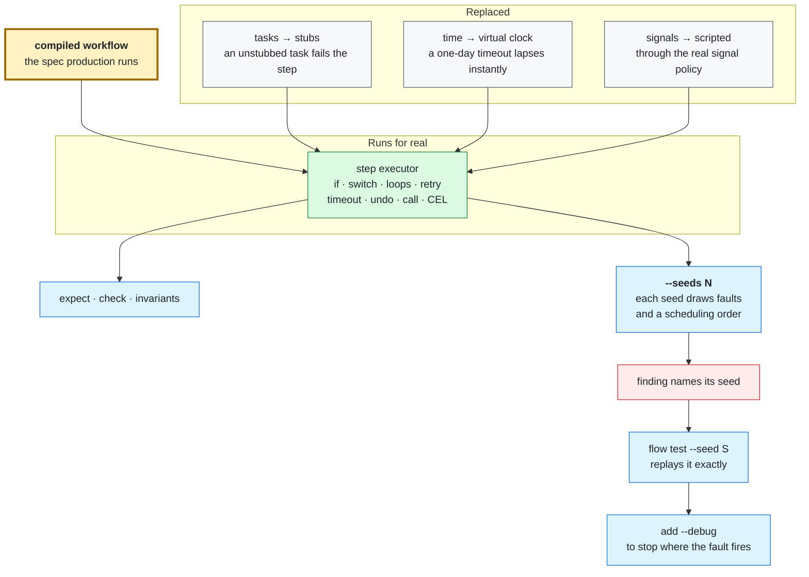

# Testing workflows

A `*.test.yaml` file beside a workflow says what the workflow should do under
conditions you choose: which inputs it gets, what each task answers, who sends
which signal and when. `flow test` runs those cases in milliseconds, with no
server, no Temporal, and no network, so you can run it on every edit.

```console
$ flow test examples/refund-approval/
PASS  examples/refund-approval/workflow.test.yaml: an approval pays back every line
PASS  examples/refund-approval/workflow.test.yaml: a rejection pays back nothing
PASS  examples/refund-approval/workflow.test.yaml: nobody answering within the hour counts as a rejection
examples/refund-approval/workflow.test.yaml  6/6 steps reached

1 file · 3 cases · 3 passed · 0.0s
```

New to Flowstate? [Get started](GETTING_STARTED.md) writes and tests that
workflow step by step. This page is the full account of the test file format
and the `flow test` command.

## What a test runs, and what it replaces

A case runs the real workflow through the local driver: the same compiled
specification and step executor as `flow run local` and a durable run. Every
`if:`, `switch:`, loop, retry, timeout, `undo:` compensation, `call:`, and
expression runs for real. Only two things are replaced:

- **Tasks.** Each task invocation is answered by a *stub* you declare. A task
  with no matching stub fails the step; `flow test` never lets a task run for
  real. A stub can replace a task inside a called workflow too, while the
  `call:` itself still runs; to replace the call itself, stub its step (see
  [Stubbing a call](#stubbing-a-call)).
- **Time.** Each case gets a virtual clock that starts at
  `2020-01-01T00:00:00Z` and jumps to the next deadline whenever nothing else
  can run. A one-day approval timeout lapses instantly; a `retry:` interval
  costs nothing.

Signals are scripted in the case. They reach the waiting step through the same
signal-policy check a server applies, so a case can prove who may and may not
answer a gate.

What a test does not prove is anything the local driver skips: persisted
history, recovery after a crash, Continue-As-New, server authentication, or a
real service behaving like its stub. Run the workflow durably for those; see
[Architecture](ARCHITECTURE.md#execution-model) for the exact boundary. Shared
conformance cases that both drivers run are what keep a test's answer the same
as production's.



## Anatomy of a test file

<!-- mirrors: examples/refund-approval/workflow.test.yaml -->
```yaml
edition: v2026.4
defaults:
  inputs:
    order_id: o-1000
  stubs:
    - task: log
      returns: {}
tests:
  - name: an approval pays back every line
    workflow: ./workflow.yaml
    signals:
      - name: refund-approved
        payload:
          approved: true
    expect:
      ran: [total, ask, approval, approved, payout]
      outputs:
        approved: true
        total_cents: 5700

  - name: a rejection pays back nothing
    workflow: ./workflow.yaml
    signals:
      - name: refund-approved
        payload:
          approved: false
    expect:
      ran: [total, ask, approval, approved]
      others: skipped
      outputs:
        approved: false
        total_cents: 5700

  - name: nobody answering within the hour counts as a rejection
    workflow: ./workflow.yaml
    expect:
      ran: [total, ask, approval, approved]
      others: skipped
      outputs:
        approved: false
        total_cents: 5700
```

The top-level keys:

| Key | Meaning |
| --- | --- |
| `edition` | The grammar edition, as in a workflow. `flow fix` stamps it. |
| `vars` | Values stated once and referenced as `${vars.<name>}` from fixtures. See [Values stated once](#values-stated-once-vars). |
| `defaults` | Fixture shared by every case in the file: `workflow`, `inputs`, `stubs`, `sender`, `check`. See [Sharing a fixture](#sharing-a-fixture). |
| `tests` | The cases. Required. |
| `coverage` | `allow_unreached:` names steps or `switch:` arms that no case needs to reach, each with a reason. |

The loader is strict: an unknown key is refused with the nearest legal one
(`unknown field "expct"; did you mean "expect"?`). A file holds at most 500
cases and 1 MiB.

## A case

| Key | Meaning |
| --- | --- |
| `name` | Required. Shown in results and matched by `--run`. |
| `skip` | A reason this case is not run. It is reported with the reason (`SKIP` in text, `<skipped>` in JUnit), counts in the summary, reaches no coverage, never fails the run, and is listed under `skipped` in the `-o json` report. On a table entry it skips every row. |
| `workflow` | The workflow file, relative to the test file. Usually stated once in `defaults:`. |
| `inputs` | The run's arguments, bound and checked exactly as a real run's are. |
| `stubs` | How each task invocation is answered. |
| `signals` | Signals to deliver, with an optional delay and sender. |
| `secrets` | Values for `${secret('scheme:name')}` references, for this case only. An unbound reference is refused. |
| `starter` | Who the run starts as, for the workflow's `signals:` policy. |
| `trigger` | How the run started: a replayed webhook delivery, or the `trigger.*` context set directly. |
| `cases` | Table rows that share this entry as a template. See [Tables](#one-fixture-many-rows). |
| `expect` | What must be true when the run ends. |

### Stubs

A stub names what it answers and how:

```yaml
stubs:
  - task: http                         # every http invocation...
    where: inputs.url.endsWith('/health')  # ...whose resolved url matches
    returns:
      status_code: 200
  - step: deploy                       # or one step, by id
    times: 1                           # answer once, then retire
    fails:
      kind: Upstream
      message: control plane briefly unreachable
  - step: deploy
    returns: {}
```

- **`task:` or `step:`** selects invocations of a task by name, or of one step
  by id. A step id is checked against the workflow, with a did-you-mean. A
  `step:` stub does not answer that step's `undo:`.
- **`where:`** is an optional CEL condition (no `${...}` fence). Stubs are tried
  in the order written, and the first that matches answers.
- **One answer:** `returns:` gives the step's outputs; `fails:` fails the
  attempt with an error `kind` (default `Upstream`) and `message`; `response:`
  gives an `http` step a raw response (`status_code`, `headers`, `body`) so the
  step's own `expect:` and `outputs:` run over it.
- **`times: N`** retires the stub after N answers, and matching falls through
  to the next one. That is how a case scripts "fail once, then succeed" and
  exercises a real `retry:` to recovery.

A `returns:` value is literal unless it is a whole-value `${...}`, which is
evaluated per invocation. Text mixed with a fence is refused.

**What a stub can see.** A stub's `where:` and `returns:` evaluate in the scope
of the step being stubbed, plus that task's own resolved inputs:

| Name | Holds |
| --- | --- |
| `inputs.<name>` | The task's resolved inputs: the URL an `http` step is about to fetch, the message a `log` step is about to write. This shadows the run's `inputs`. |
| a bare name | Whatever is bound where the step is written: a `for_each`'s `as:` name, the step's own `vars:`. |
| `vars.<name>` | The *workflow's* `vars:`, not the test file's. |
| `steps.<id>.<output>` | What earlier steps produced. |

The loop binding is what lets one stub answer each iteration differently:

```yaml
stubs:
  - task: http
    returns:
      name: '${service.name}'              # this iteration's own value
  - task: http
    where: service.name == 'search'        # or fail exactly one iteration
    fails: {kind: Upstream, message: service unavailable}
```

Inputs a task evaluates for itself, like `http`'s `expect:` and `outputs:`, are
not in `inputs`, and a `returns:` stub replaces them: the stub *is* the step's
answer, so it supplies the shaped output names later steps read. To exercise the
shaping itself, stub with `response:` instead.

### Stubbing a call

A `step:` stub may name a `call:` step. The callee's body does not run: the
stub's `returns:` stand for the outputs the callee declares, and the caller
reads them back as it would the real ones.

```yaml
stubs:
  - step: provision                 # a `call: ./workflows/provision-tenant.yaml` step
    where: inputs.tenant == "acme"  # inputs are the call's `with:` arguments
    returns: {url: https://acme.test, region_count: 2}
```

`returns:` is held to the callee: a name the callee does not declare under
`outputs:` is refused with a did-you-mean, and so is a declared output the stub
leaves out. Each value an answer carries is held to its output's declared type
and `must:` when the stub answers, so a string for an `int` fails the step as
the real call would. A callee that declares a `sensitive:` input or output
cannot be stubbed at its boundary (the stub would erase what keeps the value
out of the transcript), and `expect.compensated` is refused in a case that
stubs a call; run the callee inline for either. `where:`, `times:`, `fails:` and `invocations:` work as for a task
stub; a call is counted as the task `call.<callee name>` with hyphens written
as underscores. A call step no stub names still runs inline, so one file can
hold a case that stubs the boundary beside one that runs the callee. A
stubbed boundary runs none of the callee's steps, so test the callee's own
workflow to cover them.

**Warnings.** `flow test` warns about a stub that never answered, and about an
invocation with no stub or no matching stub (which also fails the step).
Inherited default stubs are exempt from the idle warning. `--fail-on-warning`
turns warnings into failures.

### Signals and time

```yaml
signals:
  - name: finance-approved
    at: 6s                       # delivered six virtual seconds into the run
    payload:
      approved: true
    sender:
      subject: finance-ops@example.com
      issuer: https://issuer.example.com
      claims:
        team: finance
```

- `at:` is a duration from the start of the run. Without it, the signal is
  delivered at once and held until a step waits for it. Ties are delivered in
  the order written.
- `sender:` is the identity the signal claims to come from. It is checked
  against the workflow's `signals:` policy through the same check the server
  performs. If the policy names senders and a case gives none, the signal is
  refused, exactly as an unauthenticated one would be.
- There is no clock key. Time moves only when the run is waiting: through a
  `sleep:`, a `wait_until:`, a wait's `timeout:`, a retry interval, or the next
  `at:`. Assertions should not depend on the absolute starting time.
- A case that waits for something nothing will ever deliver is stopped after 30
  seconds of real time.

### Expectations

| Field | Claim |
| --- | --- |
| `outputs` | The run's declared `outputs:`, exactly: every declared output must be named. Ignored when `failed: true`. |
| `failed` | Whether the run failed. `failed: false` is how a case claims "it finishes" and nothing more. |
| `error_contains` | Text the run's error must contain. |
| `ran` | Steps that must have run. Checked on failed runs too. |
| `skipped` | Steps that must not have run. |
| `others: skipped` | Closes `ran:`: every step not listed there must have been skipped, so a step added later fails the case until the case mentions it. |
| `compensated` | The steps whose `undo:` ran. |
| `denied_signals` | Signals the case sends that the workflow's `signals:` policy must refuse. Each needs at least one scripted delivery denied by the same check the server's Signal door runs; a signal another sender got through still counts. A name the workflow has no policy for, or the case never sends, is refused when the case loads. |
| `invocations` | How often tasks ran, and in what order. See below. |
| `check` | CEL claims over the finished run. See below. |
| `inputs`, `refused`, `idempotency_key` | For a case with a webhook `trigger:`: what the delivery bound, whether it was refused, and the key it produced. |
| `response` | For a case with a webhook `trigger:` whose webhook declares `respond_within:`: the document its receiver would answer with. `status:` is `completed`, `failed` or `running`; `outputs:` (completed only) must equal the declared outputs exactly, a sensitive one as the withheld marker. |

An `expect:` with nothing in it is refused, because a case that asserts nothing
passes whatever the run did.

### Invocations: how often, and in what order

`ran:` says a step ran; `invocations:` says how many times its task did, and in
what order, without a ladder of `where:` clauses on a stub.

```yaml
expect:
  invocations:
    - {task: slack.post, count: 2}          # exactly twice
    - {task: http, at_least: 1, at_most: 3} # a range
    - {step: notify_finance, never: true}   # never invoked
    - order: [charge, ship, notify]         # first invocations in this order
```

A `task:` entry counts every invocation of that task, callees and `undo:`
compensations included. A `step:` entry counts the attempts made for that step
of the workflow under test (a `retry:` that ran three times counts three), and
neither a callee's identically named step nor a compensation. An entry takes
exactly one of `count:`, `never:`, or `at_least:`/`at_most:`; `order:` stands
alone. Names are checked before the run, with a did-you-mean, and `order:` is
refused for a step inside a `parallel:` block, where the order is not
observable. A run past 100,000 invocations fails every entry rather than judge
a truncated log.

`ran:` and `skipped:` name top-level steps. A step inside a loop body reports
through its loop's `results`, so assert on those through `outputs:` or `check:`.

A mismatch prints both sides with their types, as a Flowfile declares them:
`expected string "1", got int 1`.

### Claims the named fields cannot make: `check:`

Each `check:` entry is a CEL expression over the finished run, or
`{that:, because:}` to add the sentence a failure prints:

```yaml
expect:
  ran: [plan, join]
  check:
    - size(steps.join.value.regions) == 2
    - that: steps.join.value.regions[0] == inputs.region
      because: the join must keep the order's own region, not the fleet default
```

A check can read `steps.*`, `inputs.*`, `vars.*`, and a `run` root with
`failed`, `error`, `local`, and what the run did about failing (below). It runs whether or not the run failed, so
`run.error.contains('must satisfy')` is a claim about a failure. A failing check
prints the values it read:

```text
expect.check[1]: check failed: steps.join.value.regions[0] == inputs.region
           because: the join must keep the order's own region, not the fleet default
           steps.join.value.regions[0] = "us-east-1"
           inputs.region = "eu-west-1"
```

`run` also says what compensation and the tasks did, so a claim can state a
saga's promise rather than one scripted path:

| Field | Value |
| --- | --- |
| `run.compensated` | `list(string)`: the steps whose `undo:` succeeded, in the order they ran (reverse registration). Always present, empty when nothing was undone. |
| `run.uncompensated` | `list(string)`: the steps whose `undo:` failed or was not attempted before a cancellation's budget ran out. Each registration is classified on its own, so a step an iteration of a `loop:` or `for_each:` registers more than once can appear in both lists, and being in `run.compensated` does not prove every registration was undone; a step that registered no `undo:` (skipped, failed, or without one) is in neither. |
| `run.signals.dropped` | `list(string)`: the signals a `faults:` entry lost a delivery of, sorted. Always present, empty when nothing was lost. |
| `run.signals.delayed` | `list(string)`: the signals a `faults:` entry made late, sorted, whether or not the run was still there when they arrived. Always present, empty when nothing was late. |
| `run.invocations.task` | `map(string, int)`: how many times each task ran anywhere in the run, callees and `undo:` compensations included. |
| `run.invocations.step` | `map(string, int)`: how many times each step of the workflow under test ran its task, one per attempt, so a retried step counts every attempt. Compensations are not counted. |

An absent key is zero, so test with `in` before indexing: `'debit' in run.invocations.step`.
`expect.compensated:` and `expect.invocations:` read the same account, so the
declarative and CEL spellings cannot disagree. `run.invocations` is unbound when
a case made more invocations than the log keeps, and a claim reading it then
fails rather than judging a prefix. These fields are bound for `invariants:` and
the debugger's `inspect` after a failing case too, because they are the same
scope.

The fund-transfer saga is the worked example
([`examples/enterprise-fund-transfer`](../examples/enterprise-fund-transfer/workflow.test.yaml)):

```yaml
invariants:
  - that: >-
      !run.failed
      || !('debit' in run.invocations.step)
      || 'debit' in run.compensated
    because: a failed transfer must never leave a debit standing
  - that: size(run.uncompensated) == 0
    because: every compensation this saga declares must be able to run
```

The antecedent is the invocation rather than `'debit' in steps`: an attempt that
faulted mid-flight still reached the bank, and that is the case the invariant
exists for. Under `--seeds` the same invariants judge every drawn failure.

A check is evaluated by the engine's own evaluator, under the workflow's
language profile and cost limit, the same as `inspect` in the
[debugger](DEBUGGING.md). An expression you settle on at a breakpoint pastes
into `check:` unchanged.

### Faults and invariants: `--seeds` under a failing world

`expect:` says what the workflow does when nothing goes wrong. `faults:` and
`invariants:` say what must stay true when something does:

```yaml
- name: survives a flaky gateway
  workflow: ./workflow.yaml
  stubs:
    - task: http
      returns: {status_code: 200, body: ''}
  faults:
    - step: fetch                       # or `task: http`; exactly one
      fails: {kind: Upstream, message: connection reset}
      rate: 0.5                         # chance per matching invocation, in (0, 1]; default 0.5
      at_most: 1                        # times it may fire in one run, 1..100; default 1
  invariants:
    - that: run.failed == false
      because: one failed attempt must be absorbed
  expect: {failed: false}
```

A plain `flow test` injects nothing, so a case with faults gives the same
verdict as the same case without them; it only refuses a `step:` fault whose step
the case never invokes, because a fault no run can reach reports resilience to
something that never happened. Under `--seeds N` each seed draws, per matching
invocation, whether the fault fires, and the run is judged by the case's
`invariants:` alone (the claims of `check:`, over the same run) plus one oracle
it owes without being told: a failure the world causes must not surface as an
`Internal` error. A violation is reported as a finding with the seed that
produced it, and `flow test --seed S` replays exactly those faults.

The `--seeds` summary counts the fault draws beside the scheduling decisions, and says it explored nothing only when it made neither: a file whose cases declare `faults:` is explored even with no `parallel:`. [`examples/data-enrichment`](../examples/data-enrichment/workflow.test.yaml) is a worked case: a lookup that retry must absorb, with the invariant that no record is lost.

A violation also prints the faults the seed fired as a `faults:` list pinned with
`on:` (the invocation numbers, from 1, that failed). Paste it over the case's
`faults:` and a plain `flow test` fires exactly those failures in every run,
the written-order one included, so the violation becomes a regression case
that fails until the workflow is fixed, with no seed and no `--seeds`. Invocation numbers name a call only when nothing was
reordered, so a seed that also permuted a `parallel:` block prints no pins and
keeps its seed for replay. The list is shrunk before it is printed: the seed's firings are
re-run in written order, delta-debugging style, until removing any one of the
remaining failures stops the violation, and the report says how many the seed
fired and how many re-runs that took. A pin the case declared itself is never
dropped. The re-runs are bounded (256); past that the shortest violating list
found is printed and the report says it may not be minimal. The shrunk list
violates *an* invariant, not necessarily the one the seed broke first. A search that is cut off
(cancelled, or out of the case's time) reports itself as not minimal. An invocation number counts
the calls a fault could hit whether or not another fault fired on them, so a script
keeps its meaning when a fault is removed; a script pasted before this was
so counted may have numbered a later overlapping fault differently, so
re-derive it from a fresh `--seeds` finding. A pinned
fault takes no `rate:` or `at_most:`, and a script whose invocation the run no
longer makes fails as drifted rather than passing for a fault that never
happened.

A fault can make an invocation late instead of broken. `delay:` holds a task or
step invocation on the virtual clock for a fixed duration (`15s`, `2m`, positive
and at most 24h) before the stubs answer, with no wall time spent:

```yaml
  faults:
    - step: lookup
      delay: 15s          # alone, the call is slow and then answers as stubbed
      at_most: 2          # a seed decides which calls are slow, never how slow
```

The step's `timeout:` and `total_timeout:` are measured on the same clock. A
delay past `timeout:` ends that attempt as a `Timeout` at the bound, and
`retry:` and `continue_on_error:` take it from there; a delay past
`total_timeout:`, which bounds every attempt together, ends the step with no
further retry. A delay under the bound only moves the answer later. With `fails:` beside it the call fails after the wait. The
account says `delayed 15s by faults[0]` at the moment the wait began, and a
pinned script printed for a violation keeps the `delay:`. The same key on a
`signal:` fault, below, makes a delivery late; the duration is fixed either way,
since a seed picking how long would need a pin that carries the drawn value.

A fault answers before the stubs and spends none of their `times:`. `fails.kind`
is any error kind a task reports except `Internal` and `Expression`, which are
defects, and `RunTimeout`, which only a whole run can have. Rows of a table inherit the entry's `faults:` and
`invariants:` when they state none.

A third target changes a signal's delivery instead of failing a task, either
losing it or making it late:

```yaml
  signals:
    - {name: finance-approved, at: 6s, payload: {approved: true}}
    - {name: finance-approved, at: 20m, payload: {approved: true}}
  faults:
    - signal: finance-approved   # a signal the case scripts; exactly one of task, step, signal
      drop: true                 # lost: the sender sent it and the run never learns of it
    # or: delay: 45m             # late: arrives that long after its `at:`, up to 720h
  invariants:
    - that: "!run.failed || 'finance-approved' in run.signals.dropped"
      because: the gate may lapse only when an approval was lost
```

`signal:` takes exactly one of `drop: true` and `delay: <duration>`. `rate:`,
`at_most:` and `on:` mean what they mean for a task fault, counted over the
scripted deliveries of that name in declaration order: `on: [2]` is the second
`signals:` entry of that name. A delivery is decided before the run starts, so
a seed changes the same deliveries however the clock orders them, but the fault
takes effect when the sender sends, at the delivery's own `at:`. A delayed
signal that arrives after the gate's `timeout:` is the case this exists for:
the sender was on time and the gate lapsed anyway, and `run.signals.delayed`
says so even though the signal never reached the run. A dropped delivery never
reaches the signal policy, so it is neither delivered nor denied. A delivery the
run ended before its sender sent it is untouched, and a pin for one fails as
drifted. A violation prints the pinned `signal:` entries, `delay:` kept, beside
any task faults, and the shrinker treats them alike. Duplicated and reordered
deliveries are not faults: a second `signals:` entry with the same
`delivery_id:` or a different `at:` already says them.

`--swarm` (with `--seeds` or `--seed`) runs each seed with a random subset of
the case's drawn `faults:` on instead of all of them, and at least one always on.
Every kind of fault on at once lets each one's effect hide the others', so a
failure that needs one kind alone, or two without a third, never occurs; a
subset lets it. A pinned (`on:`) fault is a script and stays on. A finding under
`--swarm` prints `--swarm` in its replay line, since the seed alone draws against
every fault and is a different run; the printed pinned `faults:` list replays
without either.

A dropped delivery to a gate with no `timeout:` leaves a run nothing can wake.
The harness reports that as a failure the moment it is true: `stuck: the run
waits for signal "go" and nothing pending can deliver it`, naming any signal a
fault dropped. It is a verdict like a failed invariant, so `--seeds` and
`--fuzz` find it, shrink it and print the replaying script, and no seed spends
the case's `--timeout`. It is a harness check on the local driver's virtual
clock; the durable driver holds the same run at the same gate.

Seeded exploration is the local driver's. The durable driver has one check of
its own that the local driver cannot have: a run survives the loss of its
worker. `TestWorkerRestartOverWorkflows` and `TestWorkerRestartOverUndoCases`
(`pkg/flowstate/v1/engine/workerrestart_test.go`) run the shared conformance
cases that need no trigger or inputs on a dev server, stop the first worker gracefully after a seed-chosen
activity completion, and let a second worker with an empty cache rebuild the
run from history and finish it with the answer both drivers already agree on.
A failure prints the seed, the boundary the second worker resumed at, and where
the run's history was kept. The restarted run must also complete as many
activities as the undisturbed one, so an activity run again after replay fails.
`FLOWSTATE_RESTART_SEEDS=N` (default 3, at most 50) sets the points per case.
`TestWorkerRestartWhileParkedAtAGate` does the same for a run held at a bounded
gate: the worker is lost while the run is parked and the gate is then answered
by a signal, or lapses while no worker is running, and the second worker must
leave it the same way an undisturbed run does.
`TestWorkerRestartAcrossContinueAsNew` runs shared cases with a step budget of
one, so the run is a chain of executions, and loses the worker after each
completion but the last, including ones that land after the first execution and
resume from the carryover. The chain must give what the undisturbed chain gives.
Not yet covered: a worker killed mid-activity.

### Inputs you did not think of: `--fuzz`

`flow test --fuzz N` runs each authored case over N generated sets of inputs.
Generation is driven by the workflow's declared `inputs:`: boundary values for
a `string` (empty, one character, non-ASCII, `${1 + 1}` as data, and `min_len:` or
`max_len:` characters, capped at 4096), an `int` (zero, one past either side of zero, 2^31, 2^53-1),
a `double` and a `bool`, a `timestamp` (epoch, a normal instant, the largest year), a
`duration` (`0s`, `90m`, a negative one) and `bytes` (empty, short, 256 zero bytes), every
`values:` entry for an enum, and each optional input absent. A `list(T)` is tried empty,
with one element and with two; a `map(string, T)` empty and with one entry; a record
declared under `types:` as an object with every field and as one with only its
`required:` fields, its fields drawn the same way, down to the type's own depth. Each
composite is capped at six candidates and 1024 nodes, picked rather than crossed. The first runs walk these boundary values one input at a time
with the others as the case wrote them, so a small `--fuzz N` still exercises
each boundary and a failure points at one input; later runs combine them at
random. Every candidate set is bound through the same `BindRunInputs` a
real submit uses, so a value the declaration refuses (a `must:` it fails) is
never run. The case's own `stubs:` answer, `expect:` is not applied (it
describes the authored inputs), and `faults:` are not injected.

A generated run fails when it ends in an `Internal` or `Expression` error (a
`no such key` or a division by zero is a defect that an input reached) or
breaks the case's `invariants:`. The first failure is reported apart from the
authored cases with its seed and the `inputs:` overlay to merge over the case's own;
`flow test --fuzz-seed S` replays exactly it (a `sensitive:` input is left out of the overlay, so the case keeps its own value for it). A finding is shrunk before it is printed: the inputs the seed changed are put back at the case's own values, delta-debugging style, until putting any one more back stops the failure, so the overlay holds only the inputs that matter. The search is bounded (256 re-runs) and reports itself as not minimal when it ran out; it finds *a* failure of the smaller set, not necessarily the first. An input the case supplies and the generated run left out cannot be written in an overlay, so the report names it separately to remove from the case. A generated case that errors before the run (an input the stubs have no answer for, for one) is reported as could not be judged, and a file where every generated case did so fails: nothing was verified. Inputs the workflow declares
`sensitive:`, and inputs whose record holds a `sensitive:` field, are never generated
or printed, and inputs with no declared shape to draw from (a `map(string, dyn)` or
`list(dyn)`, a record that refers to itself) are named in the report rather than
skipped silently. `--fuzz` is refused with `--seeds`, `--debug` and `--list`: a run
explores one dimension, so a finding names one cause. A finding can be an artifact of the stubs: they answer what the authored inputs
need, so an input that takes a branch reading a field the stub's fixed answer
lacks fails with a missing-key error that a real task would not. Read the
reported failure before treating it as a workflow defect, and widen the stub.
A `--fuzz` run in which no file judged a generated case fails, since it verified
nothing. Not yet covered: stub answers drawn from output descriptors,
and shrinking of a generated value within one input.

### Would the file notice the program changing: `--mutate`

A green test file can prove nothing. `flow test --mutate` measures that: it
compiles each workflow once, makes one deliberate fault in a copy (a *mutant*),
and runs the file's cases against it. A mutant a case fails on is *killed*; one
every case still passes *survived*, and the survivor is the part of the program
the file does not check.

The operators are fixed and each is one field edit on the compiled workflow:
`if-negate` and `if-drop` (a step's `if:` negated or removed), `undo-drop` (a
compensation removed), `retry-drop`, `continue-flip` (`continue_on_error:`
flipped), `switch-arm-drop` and `switch-default-drop`. Each survivor prints what
changed, where, and a replay command:

```text
survived: `if:` removed from step on_ready
       at workflow.yaml:13
       replay: flow test --mutant if-drop@on_ready.if -- workflow.test.yaml
```

That example is the instructive one: a file whose only case takes the `ready`
branch cannot tell the gate from its absence, so the fix is a second case that
takes the other branch and asserts `on_ready` was skipped. A survivor can also be
an equivalent mutant (a change no test could observe); there is no allow-list, so
read the survivor before adding a case.

Mutants run in written order with no faults, against the cases that passed, and
a file in which any case fails is not mutated (a red suite cannot tell a killed
mutant from a broken test), and neither is one a `--run` selection leaves cases
out of (a gate only an unselected case asserts would read as a survivor). A mutant the validator refuses is counted invalid,
never killed. `--mutate` bounds the mutants per workflow at 100; `--mutate=N`
sets the bound (at most 1000) and the report says when it truncated.
`--mutant ID` replays one. Any survivor fails the command, and the report
carries the account in `mutation` for `-o json`. `--mutate` is refused with
`--seeds`, `--fuzz`, `--debug`, `--watch` and `--list`. Not yet covered:
mutations inside a CEL expression, task inputs, `fail:` and signal rules, and
the durable driver (`--driver both` proves the unmutated program only).

## Does the run survive being suspended: `--driver both`

The local driver runs a case in one uninterrupted pass, which a durable run
never does: it suspends, serializes its state and resumes, possibly elsewhere.
A case that passes locally says nothing about the state a run carries across
that seam. `flow test --driver both` closes the gap: each passing case runs
again, in-process and with no server, on the same durable interpreter a worker
uses, with a Continue-As-New forced between every pair of steps and the case's
stubs bound afresh. The case fails where the drivers disagree: one finishes and
the other does not, or a step output the continued run kept differs from the
local one (maps compare as maps, so key order is not a disagreement).

What it proves is the carried state, the step outputs, loop frames and
variables a continued run hands to its next segment. A continued run retains
only the outputs later steps read, so a step it dropped is not compared. It
does not prove faults. Scripted `signals:` are replayed to the durable run at
the same offsets from the same senders, and only those the local run accepted:
a delivery its signal policy refused is absent, as a server would refuse it
before the workflow saw it. A signal that arrives before its gate is carried
across the Continue-As-New like any other. A workflow that requires plugins is
pinned to, and admitted against, a catalog holding exactly what it requires:
the plugins' tasks are the case's stubs, answered as on the local driver, and a
plugin task with no stub fails the case on the local driver, which runs first,
so the durable one is never asked. A case that injects `faults:`,
replays a trigger delivery, reads `run.local`, `run.identity`, `run.workflow_id` or `run.run_id`
(which differ by design), or stubs a step by id in a workflow with calls or compensations
stays on the local driver and reports `driver: local only: <why>`
as a warning, so a green never silently skipped the proof. A stub whose `where:` cannot be
evaluated on the durable side (it reads a loop binding an activity lacks) does
the same. Declared run outputs are compared whole; where the workflow declares
anything sensitive a disagreement names the step and quotes no value. A run that needs
more than 2000 segments is reported rather than truncated. `--driver both` is
refused with `--seeds`, `--fuzz`, `--mutate`, `--debug` and `--list`, each its
own dimension; `--driver local` is the default.

## One fixture, many rows

Cases that differ in one or two values can share an entry and list their
differences under `cases:`, like a Go table test:

```yaml
defaults:
  workflow: ./workflow.yaml
tests:
  - name: a declaration is enforced before the first step runs
    stubs:
      - task: http
        returns: {}
    expect:
      failed: true                   # true of every row
    cases:
      - name: the required argument is missing
        expect:
          error_contains: which service to deploy
      - name: a replica count above the declared bound
        inputs: {service: checkout, replicas: 99}
        expect:
          error_contains: must satisfy
```

The entry itself does not run; each row runs, reported as
`<entry name>/<row name>`. `--run` matches that whole name as a regular
expression, so `--run 'enforced before'` selects every row and
`--run 'enforced.*/a replica count'` selects one. Tables are one level deep, and
an empty `cases:` is refused.
[`examples/parameterized-deploy`](../examples/parameterized-deploy/workflow.test.yaml)
is a complete example.

## Sharing a fixture

Values flow down one chain, and the nearer level wins: a directory's
`testdefaults.yaml`, then the file's `defaults:`, then the table entry, then the
row.

- `inputs:` and `expect:` merge one level deep: a row that writes
  `expect.error_contains` keeps its entry's `expect.failed`.
- `signals:`, `secrets:`, `trigger:`, and `starter:` are inherited whole or
  replaced whole.
- `stubs:` merge: a case's stub for the same target and the same `where:`
  replaces its inherited twin, every other case stub is tried first, and the
  remaining inherited stubs answer what those do not.
- `check:` lists accumulate: every level's claims must hold.
- `sender:` in `defaults:` fills in only signals that name no sender. A case
  that means "no sender" writes `sender: {}`.

Because `expect:` merges, a row cannot assert less than its entry. Put only
what is true of every row on the entry.

Two stubs that select the same calls in the same way (same target, same
`where:`, the first without `times:`) are refused, since the second can never
answer. So is a filtered stub written after an unfiltered one for the same target
with no `times:`: the first answers every call, so write the filtered stubs first
and the catch-all last, or give the catch-all a `times:`. A case stub whose `where:` differs from a filtered default's for the
same target draws a warning, because both stay live.

### `testdefaults.yaml`

A directory of suites can share a fixture in a file named `testdefaults.yaml`.
It holds `vars:` and `defaults:` only; its name does not match `*.test.yaml`, so
it never runs as a suite.

```yaml
# testdefaults.yaml — shared by every suite in this directory
vars:
  issuer: https://issuer.example.com
defaults:
  workflow: ./workflow.yaml
  sender: {subject: approver@example.com, issuer: "${vars.issuer}"}
```

Only the suite's own directory is consulted, never a parent, so a suite depends
on at most two files you can see side by side. A suite loaded from bytes (the
MCP tool) or built in Go gets no directory defaults.
[`examples/testing-defaults`](../examples/testing-defaults/) shows two suites
sharing one.

## Values stated once: `vars:`

A test file's `vars:` holds literals the file repeats: a URL, an issuer, a
payload fragment. A fixture position (a case's `inputs:`, a trigger's fields, a
scripted `sender:`, `expect.outputs:`) references one as a whole-value
`${vars.x}`, substituted when the file loads. A `check:` reads `vars.x` when it
evaluates.

```yaml
vars:
  issuer: https://issuer.example.com
  order: {id: ord_123, region: eu-west-1}
tests:
  - name: the order is stated once
    inputs: {order: "${vars.order}"}
    signals:
      - name: approve
        sender: {subject: approver@example.com, issuer: "${vars.issuer}"}
    expect:
      check:
        - steps.join.value.region == vars.order.region
```

A var whose value is itself a whole-value `${...}` is computed from the other
vars when the file loads, in dependency order:

```yaml
vars:
  region: eu-west-1
  base: "${ {'id': 'ord_1', 'region': vars.region} }"
  rush: "${ {'id': vars.base.id + '_rush', 'region': vars.base.region} }"
  endpoint: "${'https://api.' + vars.region + '.example.com/v1'}"
```

The rules:

- **A computed var reads only other vars.** No `steps`, `inputs`, `run`, or
  `trigger`: the block is evaluated before any case runs. A cycle is refused
  with its path (`vars.a → vars.b → vars.a`).
- **No profile libraries.** A file's vars are not tied to one workflow, so a
  function from the workflow's language profile (`json_parse`, `split`,
  `base64.encode`) is refused here. Write that expression in `check:`, which
  compiles under the case's own profile.
- **A fence occupies a whole value.** `"https://${vars.host}/v1"` is refused;
  write `"${'https://' + vars.host + '/v1'}"`. Inside a YAML map or list, a
  fence may compute a scalar leaf but not return a map or list.
- **Bounded.** At most 200 computed values per file, which together may spend
  what one ordinary expression may.
- **`vars.` means the workflow's vars inside a stub.** A stub's `where:` and
  `returns:` evaluate in the run's scope, where `vars.` is the workflow's own
  block. Everywhere else in the test file, `vars.` is the file's.

### Secrets in a test file

A case's `secrets:` binds a value to a secret reference for that case only:

```yaml
secrets:
  env:API_TOKEN: test-token
```

A var that feeds a secret is treated as secret material. The taint follows the
dependency graph both ways, to every var computed from it and every var it was
computed from, and those values are withheld wherever the test prints them. A
tainted value redaction cannot hide is refused when the file loads: a number or
boolean derived from a secret (`${size(vars.token)}`), an empty string, or a map
or list built in CEL, since each can reveal the secret through its value or its
shape. Keep the shape in YAML and compute only string leaves:

```yaml
vars:
  token: s3cr3t
  headers:
    Authorization: "${'Bearer ' + vars.token}"   # withheld
    Accept: application/json                     # still visible
```

A var stated in `testdefaults.yaml` may not be on a path to a secret, because
the other suites in the directory would print it. Move it into the suite's own
`vars:`.

## Identity in a test

A case can say who started the run (`starter:`) and who sent each signal
(`sender:`). Both are assertions a case makes, not identities anyone attested.

They reach the workflow's own `signals:` policy, including a
`sender.identity.principal != run.identity.principal` clause, so a case can prove that an approver is admitted and
that the requester cannot approve their own run. They do not reach
`run.identity` (empty in every case, with `run.local` true), egress policy (a
stub answers the request that would have been checked), task-shape policy, or
secret-access policy. A green case therefore says what the workflow does for a
given identity; it says nothing about whether a deployment would let that
identity do it. The deployment's egress, task-shape and exec policies are
tested against a declared `principal` (kind, list claims, actions and actors
included) by [`flow policy test`](#a-deployments-policy-without-a-worker-flow-policy-test).

The `flow test` command takes no deployment policy flags, so no task-shape
policy applies and every dispatch is allowed. A suite run through the
`flowstate_test` MCP tool is the exception: under `flow mcp --task-policy`,
that policy is checked on every dispatch, stubbed or not, against the empty
`run.identity`. A rule that requires an identity therefore denies the case
there, although the same suite passes under `flow test`.
[`examples/approval-gate`](../examples/approval-gate/workflow.test.yaml) tests
its separation of duties this way.

### Who may act, without a run: `flow signals check`

A case runs the workflow as one identity. The question "who may approve this,
debug it, or start it?" is about the policy, not the run, and
`flow signals check` asks it directly: it compiles the Flowfile, runs no step,
contacts no server, and puts the identity to each gate through the check the
engine itself uses:

| Gate | Flowfile | Decided by |
|---|---|---|
| `signals.NAME` | `signals:` | `v1.SignalPolicyCheck`, the check a delivery meets on the server and in `flow run local` |
| `debug` | `debug:` | `v1.DebugPolicyCheck` |
| `triggers.manual` | `triggers: - manual:` | `v1.CheckManualStart` |

```console
$ flow signals check examples/approval-gate/workflow.yaml \
    --input-file examples/approval-gate/inputs.json \
    --starter-subject dev@example.com --starter-issuer https://issuer.example.com \
    --signal-as-subject sre-lead@example.com --signal-as-issuer https://issuer.example.com \
    --signal-as-claim team=release-managers
signals.deploy-approved  admitted
```

The sender is named with the `--signal-as-*` flags that `flow run local` takes,
and the run's starter, which a predicate reads as `run.identity`, with
`--starter-*`. Two defaults fail closed exactly as the engine does. A sender
that names nobody is unauthenticated, which no `allow:` predicate a deployment
writes admits, and a `triggers.manual` block that writes an `allow:` predicate refuses
(with no such block, any caller the server authenticates may start the workflow,
and the line says so). A starter that is not named
is unknown, so a predicate that reads `run.identity` errors, and an error refuses.
`--starter-anonymous` says the run was started by nobody authenticated, which is
how `flow run local` models a run given no `--as-*` flags. Arguments are given
with `--input` or `--input-file`, bound as a start binds them, so a predicate sees
defaults too.

With none of `--signal NAME`, `--debug` and `--manual`, every declared signal is
checked; naming any of them checks only what is named. Each line is `admitted` or
`refused`, and a refusal carries the engine's own sentence, which never quotes a
claim, an input or an evaluation error. A `sensitive:` input is never printed; a
refusal about an argument that is not sensitive can name it, as `flow run local`
does. Claims, subjects and matrix content are never quoted.

**In CI.** Without `--expect` the exit status is 0 whatever the answers, and
non-zero only for a usage or compile error. `--expect admitted|refused` turns
the answer into an assertion: exit status 1 when any decision differs, after the
answers are printed.

**Many identities.** `--matrix FILE` asks every gate about a table of identities
and prints senders by gates. The file is strict YAML, so a misspelled key is a
refusal rather than an assertion that checks nothing:

```yaml
identities:
  - name: sre-lead
    principal:
      subject: sre-lead@example.com
      issuer: https://issuer.example.com
      claims: {team: release-managers}
    starter: {principal: {subject: dev@example.com, issuer: https://issuer.example.com}}
    expect: admitted
  - name: self-approval            # the requester may not approve their own run
    principal:
      subject: dev@example.com
      issuer: https://issuer.example.com
      claims: {team: release-managers}
    starter: {principal: {subject: dev@example.com, issuer: https://issuer.example.com}}
    expect: refused
  - name: anonymous
    starter: {}                    # started by nobody authenticated
    expect: refused
```

`expect` is one outcome for every gate, and `expect_by_gate` a map from gate
(`signals.NAME`, `debug`, `triggers.manual`) to its outcome, which wins for the
gates it names. The file is defined by `proto/flowstate/v1/policy_check.proto`. A row's `inputs:` replace, by name,
the `--input` arguments given for every row, and a row with no `starter:` or
`expect:` takes `--starter-*` and `--expect`. A subject without an issuer, or the
reverse, is refused by the rule a test file's `sender:` is held to. A row's
`principal:` is the same `Principal` message a run records, so `kind:` is
`human`, `workload` or `agent`; the check reads strings only, and refuses a
claim that is not a string, `actions` and `issuer_entry` rather than ignore them. A matrix is
bounded at 256 identities and 256 KiB, and holds one YAML document, with no
anchors, aliases or merge keys. Nesting is bounded by counting bytes, not by
reading YAML: the file may hold at most 4096 `[` and `{` characters, wherever
they appear, and a line at most 128 leading spaces and 64 block indicators
(`- `, `? `, `: `); a tab in indentation is refused. A number of magnitude 2^53
or more in a row's `inputs:` is refused, whole or not, because the schema
carries inputs as doubles and would round it; give such a value with `--input`, which applies to every row. A row that does not match its expectation
makes the exit status 1.

What it is not: a decision that depends on state only a run has, such as a
signal already consumed, is not modelled, and `triggers.manual` is decided over
the caller and the inputs alone, as the server decides it. Like a case's
`sender:`, an identity here is an assertion, not one anybody attested, and the
check says nothing about whether a deployment would let that identity through its
authenticator.

### A deployment's policy, without a worker: `flow policy test`

`flow signals check` is about a workflow's own gates. The policies an operator
hands a worker (`--egress-policy`, `--task-policy`, `--exec-policy`) are the
deployment's, and `flow policy test <policy-file> <cases-file>` puts cases to
one of them, loaded as the worker loads it, with nothing started and no server
contacted. Each case is decided by the function the engine enforces that policy
with (`netpolicy.Policy.CheckURL` and `CheckAddr`, `TaskPolicy.Check`,
`execpolicy.Policy.Check`), so a pass says what the worker would do.

```yaml
surface: egress            # egress, task or exec; one per file
cases:
  - name: team-a reaches its partner API
    principal: {namespace: team-a}
    request: {url: "https://partner-a.example.com/v1"}
    expect: allow
  - name: team-b is refused team-a's partner API   # the case that matters
    principal: {namespace: team-b}
    request: {url: "https://partner-a.example.com/v1"}
    expect: deny
    rule: allow rules
```

`principal` is who the request is made as: the same `Principal` a run records,
which every surface's rules read as `identity.<field>`. It carries `subject` and
`issuer` (together, never one alone), `namespace`, `kind` (`human`, `workload`
or `agent`), `claims` of any shape (a `groups` list included), `actions` and
`actors`. A case carries only what it names, so a rule on a `kind`, a claim or
an action the case did not declare does not match it, and a declared identity
never gains authority it does not carry. `issuer_entry` is refused: it names a
trust policy entry, which a case has none of. Absent is no attested caller,
which a rule that scopes by tenant declines to match. The `request` depends on the
surface: `url`, `method` (default GET) and `ip` for egress, `task` for task
shape, `argv`, `dir` and `env` for exec. `expect` is `allow` or `deny` and is
required. `rule:` on a denial asserts which rule made it: a deny rule's source
text exactly as the policy writes it, or, for a denial no deny rule made, the
reason (`allow rules` when no allow rule matched, `rule error`, `scheme`, `port`
or `address` for egress, `executable`, `argv`, `dir` or `env` for exec). A policy
that denies for a different reason fails the case. Every denial, expected or
not, is printed with the rule or reason behind it, which answers "which rule
denied this?" without bisecting the file.

The file is strict YAML (a misspelled key is a refusal, not an assertion that
checks nothing), defined by `proto/flowstate/v1/policy_suite.proto`, and bounded
at 512 cases and 256 KiB, with one document and no anchors, aliases or merge keys.
`-o json` writes the report as a document. The exit status is 1 when any case
does not get the outcome it expects. A rule that cannot be evaluated denies, as it
does on a worker, so a `deny` case passes on it unless it names `rule: rule
error`. A suite with no `expect: deny` case is reported with a warning, because it
cannot catch a policy that allows too much.

What it is not: egress is decided before DNS, so the scheme, port, request rules
and the address checks for an IP-literal host or a case's `ip:` are asked (an `ip:` that
disagrees with an IP-literal host is refused, as is a policy that sets
`proxy_from_environment`, which would resolve the host), and
rules over the connection's `ip` and the control-plane reservation, which need a
dial, are not, and an egress rule over `credentials` is judged with it false, because a case cannot yet say its request carries a credential. An `exec` case is resolved against the machine the suite runs on.
Secret-access and role-assumption policy (`--auth-policy`) are not covered: their
decision needs the server's trust state. See
[`examples/policy-test`](../examples/policy-test).

## Triggers

A case can start the run the way a trigger would:

- `trigger: {webhook: <name>, payload: <file>, signature: valid|invalid}`
  replays a stored delivery through the real verifier and binder, so the case
  checks the webhook's `with:` mapping and its signature handling.
  `expect.inputs`, `expect.refused`, and `expect.idempotency_key` assert what the
  delivery produced. For a webhook with `respond_within:`, `expect.response`
  asserts the document the receiver would answer with, built by the same function
  from the run the case executes: a run that finishes is `completed` with its
  declared outputs, one that fails is `failed`, and one parked at a
  `wait_for_signal:` with no `timeout:` that no scripted `signals:` entry answers is
  `running`. The wait itself is not rehearsed: there is no listener and no run that
  outlives its case, so a run's duration against the bound (a gate with a long
  `timeout:` resolves on the virtual clock) is not compared with it.
- `trigger: {kind: schedule, name: nightly}` sets `trigger.*` directly, so both
  sides of a step guarded by `trigger.kind` can be tested without a real
  schedule.

See [`examples/webhook-trigger`](../examples/webhook-trigger/),
[`examples/webhook-respond`](../examples/webhook-respond/) and
[`examples/trigger-context`](../examples/trigger-context/).

## Running tests

```console
$ flow test <path>...
```

A directory is walked for `*.test.yaml` and `*.test.yml`; a named file is taken
as given. Finding no test files is an error, and so is naming a workflow file.

| Flag | Effect |
| --- | --- |
| `--run <regex>` | Run only cases whose full name matches. |
| `--list` | Print the names of the cases that would run, one per line under their file, without running any. Honours `--run`, and names the cases a `skip:` leaves out. A file that cannot be run is reported `REFUSED` and fails the command. Refused with `-o json`, `--junit`, `--debug`, `--watch`, `--fail-fast`, `--seeds` and `--coverage-required`, which all read a run's result. |
| `--fail-fast` | Stop at the first failing case, or the first schedule divergence under `--seeds`. The cases not run are reported as skipped with the reason. Refused with `--coverage-required`, whose bar a stopped suite cannot meet. |
| `--timeout <duration>` | The real-time limit for one case, default 30s and at most 10m. The virtual clock still decides what a workflow waits for, so this bounds a case that is stuck, not one that waits long. A run held at an untimed `wait_for_signal:` that nothing scripted can still answer is reported as stuck at once, without spending this limit. |
| `--coverage-required` | Fail when a step or `switch:` arm is reached by no case and not listed under `coverage.allow_unreached`. |
| `--fail-on-warning` | Treat warnings as failures. |
| `--seeds N` | Also run each case under N seeded orderings of `parallel:` branches and `async:` steps, and fail if any ordering changes what the case observes. `--seed` replays one reported seed. |
| `--debug` | Step through one case. Refused with `--seeds`; with `--seed N` it steps through that seed's own run, the faults it injects and the order it chose, which is how a reported violation is opened. See [Debugging](DEBUGGING.md). |
| `-o json` | A machine-readable report: cases, failures, warnings, coverage. |
| `--watch` | Run once, then again after every change to a YAML file under the paths given (a named file watches the YAML beside it; `.git` and `node_modules` are skipped; symlinks are followed to their targets), until Ctrl-C. A terminal showing text is cleared between runs; `-o json` and `-o jsonl` get one document per run and are never cleared. The walk is bounded at 50,000 directory entries. A failing run does not end the loop. Refused with `--debug`. |
| `--junit <file>` | Also write the results as JUnit XML for CI systems. A failed expectation is a `<failure>`; a case or file that could not be judged is an `<error>`. Written even when the run fails. A promoted warning, a required-coverage gap, or a schedule divergence appears as a `(run verdict)` failure, so the report never shows green over a non-zero exit. It carries only what the report already shows. |
| `-v` | Print every case's transcript, not only failing ones. |

**Coverage** is always reported, as `N/M steps reached` per file. A step counts
as reached when any case ran it (a loop-body step when any iteration did); a step
skipped by `if:` does not count. `switch:` arms are counted separately.

**A failing case** prints its transcript: each step's outputs, the virtual time
it happened at, which stub answered (marked `from defaults` when inherited),
each signal, and each `switch:` arm taken. The value of any input declared
`sensitive:` renders `[redacted]` there, in the case's failures and in a
`--seeds` divergence report, whichever workflow the run reached declares it, a
called one included. So does a called workflow's output declared `sensitive:`,
and a step, task or signal name the transcript prints that spells such a value.
A divergence report shows both of its runs under what either run withholds,
since they are read together, and the diverging case's own report, printed
beside it, withholds what any schedule's run withheld, its name and warnings
included. Claims, and the comparison `--seeds` makes, still read the real
value.

Every case's report withholds under that case's own inputs (and `secrets:`), wherever it prints a
name that spells such a value: the step in a failure, a stub's target in a
warning, and the case's own name, in text and in `-o json`. A field path, code
and position are the harness's own words and are kept. (A case whose inputs
are too many or too large to enumerate withholds everything it can and keeps
its failures readable, so it withholds no name it cannot tell from a value; the
coverage report below has no such text and withholds all of its names. A case the run was stopped before starting never loaded its workflow, so only its `secrets:` and withheld `vars:` are known: a name spelling a `sensitive:` input's value is not withheld there.) The coverage report is
one for the whole file, so it withholds under every case's inputs together: a
step id or `switch:` arm label that spells a value any case withholds prints
`[redacted]`, and is still counted and still listed as a gap. Two names that
withhold alike are told apart by a number (`[redacted]`, `[redacted]#2`), in
the order they were written; the numbers count within one report, so a
divergence's two runs number independently. Exit status is 0 when everything passed, 1 when a case failed, and 2 for
a usage error.

## Tests in Go

A program that embeds Flowstate can run a suite inside `go test`, with each
case as a subtest:

```go
func TestWorkflows(t *testing.T) {
	flowtesting.RunFile(t, "workflows/deploy.test.yaml")
}
```

The verdicts are `flow test`'s own. See
[Embedding](EMBEDDING.md#testing-the-workflows-you-embed).

## Next steps

- [Debugging a workflow](DEBUGGING.md): hold a case at any step and inspect it.
- [Examples](../examples/README.md): every example has a test file; most show
  one testing technique in their comments.
- [The Flowfile language](LANGUAGE.md): the constructs these tests exercise.
